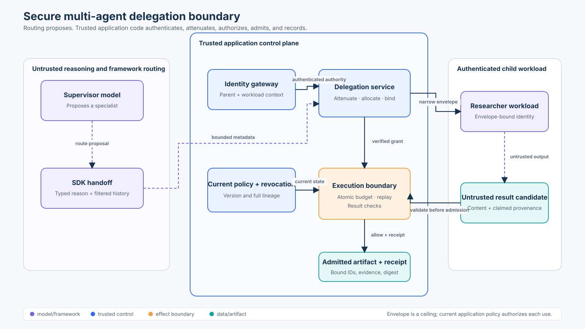

# Advanced 02 — Multi-Agent Delegation Security

## Course profile

- **Level:** Advanced
- **Estimated time:** 3–4 hours
- **Format:** Learn → Lab → Evaluate → Checkpoint
- **Prerequisite:** [Advanced 01 — Attack Evaluation](../01-attack-evaluation/README.md)
- **Primary lab:** [02_multi_agent_security.py](02_multi_agent_security.py)
- **Framework companion:** [02_multi_agent_security_sdk.py](02_multi_agent_security_sdk.py)
- **Notebook:** [02_multi_agent_security.ipynb](02_multi_agent_security.ipynb)

## Capability

Issue and consume an integrity-bound delegation envelope whose authority can
only narrow across a supervisor-worker boundary, then admit the worker’s result
only when identity, tenant, audience, resource, policy, lineage, budget, time,
and provenance still agree.

## Course thesis

> A framework handoff changes who reasons next. Only a trusted application
> boundary may decide what the child is allowed to do.

By the end, you should be able to explain when multi-agent decomposition is
worth its coordination and attack surface, implement fail-closed attenuation,
evaluate privilege-amplification and valid-task blocking with explicit
denominators, and identify what the local lab must become in production.

## Learning outcomes

You will be able to:

1. distinguish routing, delegation, impersonation, and authorization;
2. derive parent and child identities from authenticated application state;
3. prove child scopes, resources, artifacts, budget, lifetime, and depth are
   subsets of authenticated parent authority;
4. bind a delegation to one issuer, child workload, tenant, audience, policy
   version, parent lineage, and bounded task;
5. enforce revocation, expiry, termination, replay, result, and budget rules at
   the execution boundary;
6. make budget and idempotency decisions atomically under concurrency;
7. integrate a well-known agent SDK without mistaking its handoff object,
   typed input, or agent name for authority; and
8. measure safety violations and utility cost separately.

## 1. Start with the architecture decision

Multi-agent is not automatically more capable or safer. A second agent adds at
least one routing decision, context transfer, identity transition, policy
decision, result boundary, trace join, and failure domain.

Prefer one agent when one prompt/tool boundary can complete the task within its
context, policy, and latency limits. Add a specialist only when it creates a
material benefit such as:

- a genuinely different capability or model;
- isolation of a privileged tool or data domain;
- independent scaling or ownership;
- a bounded task that can run concurrently; or
- a clearer, testable policy boundary.

Do not split merely to give personas different names. A “security reviewer”
persona running with the supervisor’s credentials is not least privilege.

| Question | Single agent | Delegated specialist |
| --- | --- | --- |
| Who owns the final answer? | the one agent | supervisor or specialist, chosen explicitly |
| How many authority transitions? | none | at least one |
| Can context leak across roles? | one context | yes, at every handoff |
| Can credentials be narrowed? | one capability set | yes, if the application attenuates them |
| Operational cost | lower | extra calls, traces, state, retries, and failure handling |

## 2. Mental model: five distinct objects

Keep these objects separate:

1. **Authenticated actor context** — who the gateway verified, for which
   tenant and workload identity.
2. **Parent authority** — the maximum scopes, resources, artifact types,
   audiences, budget, lifetime, and lineage the parent may delegate.
3. **Handoff proposal** — a model or orchestration framework’s suggestion that
   a specialist should take over or be called.
4. **Delegation envelope** — a trusted issuer’s integrity-protected,
   policy-versioned attenuation of parent authority.
5. **Child result candidate** — untrusted content that must be bound to the
   exact envelope and logical operation before admission.

A typed handoff proposal is still only typed untrusted input. An agent name is
still only a label. An A2A Agent Card advertises capabilities and
authentication schemes; it does not grant the caller application authority.



The diagram source is [architecture-spec.json](architecture-spec.json). Blue
components are trusted application controls, purple components are
model/framework orchestration, orange marks the effect boundary, and teal
marks admitted evidence.

## 3. Governing invariants

### Authority attenuation

For every delegated dimension:

\[
  child\_authority \subseteq parent\_authority
\]

This applies independently to scopes, resources, artifact types, audiences,
budget, lifetime, delegation depth, and fan-out. Checking only scope leaves
other privilege-amplification paths open.

### Trusted identity

The parent and child may not supply their own trusted identity, tenant, or
workload identifier through a prompt or tool argument. The lab’s
`ActorContext` represents context established by a workload gateway.

### Current authorization

An envelope is a ceiling, not a permanent authorization. Every use rechecks
integrity, audience, current policy version, lineage revocation, expiry,
identity, operation, resource, artifact contract, and remaining budget.

### Atomic consumption

A concurrent “check then increment” can overspend a budget. The lab protects
replay lookup, attempt admission, budget validation, consumption, and receipt
creation with one lock. A production implementation needs the equivalent
transaction or compare-and-swap in durable storage.

### Result admission

The child’s output is data, not proof. The trusted boundary binds the candidate
to the envelope, logical operation, producer, tenant, artifact type, evidence
IDs, and size limit, then computes the admitted artifact digest itself.

## 4. Trust boundaries and threat model

Assume the supervisor can be influenced by retrieved content, the worker can be
compromised, messages can be duplicated or delayed, and concurrent requests
can race. Trust the identity provider, delegation service, current policy
source, revocation source, transactional budget store, and effect boundary only
within their documented operating assumptions.

| Attack or failure | Control | Observable reason |
| --- | --- | --- |
| prompt says “run as admin” | identity comes from `ActorContext` | `parent-identity-binding` |
| unknown worker requests a handoff | eligibility binds name + workload ID | `child-ineligible` |
| child asks for parent-only scope | subset check at issuance | `scope` |
| child swaps tenant or case | tenant/resource checks at issuance and use | `tenant` / `resource` |
| envelope is used at another service | audience binding | `audience` |
| envelope fields are edited | HMAC integrity check | `envelope-integrity` |
| old grant survives a policy change | current policy-version check | `policy-version` |
| ancestor is revoked | complete-lineage revocation check | `revoked-lineage` |
| siblings multiply parent budget | aggregate allocation + fan-out cap | `aggregate-budget` / `fan-out` |
| concurrent calls exceed budget | atomic session transaction | `budget` |
| retry duplicates work | stable logical operation ID | `idempotent-replay` |
| operation ID is reused with changed content | digest-bound replay check | `operation-replay-mismatch` |
| compromised worker forges a result | result binding and evidence contract | `result-binding` |
| worker continues after containment | independent termination state | `terminated` |

The local HMAC key is synthetic course material. It proves that tampering is
detectable in the exercise; it is not a deployment key-management design.

## 5. Delegation lifecycle

### Phase A — issue

The `DelegationService.issue` method:

1. authenticates and binds the parent context;
2. validates child eligibility;
3. checks every requested set is non-empty and a subset;
4. bounds time, budget, depth, lineage, and fan-out;
5. makes `request_id` idempotent and rejects changed replays;
6. reserves aggregate child budget atomically; and
7. emits an integrity-bound envelope with a policy version.

The service returns a typed `DelegationDecision` and reason rather than
silently returning `None`. Denial evidence is part of the lesson.

### Phase B — route

An orchestration framework may transfer control or call a specialist as a
tool. That routing event carries no implicit authorization. In the companion,
the model can provide only a bounded `reason`; the destination, tenant,
scope, resource, audience, budget, and lifetime come from server-owned
`FrameworkContext`.

### Phase C — consume

`WorkerSession.execute` reauthorizes current state before both first use and
idempotent replay. Revocation, expiry, termination, or a policy change therefore
blocks retrieval of a previously admitted artifact.

### Phase D — admit and observe

The boundary returns a typed `ExecutionDecision`, admitted `Artifact`, and
`DecisionReceipt`. Receipts contain identifiers, decisions, reason codes,
policy version, and budget transitions—not result content, secrets, prompts, or
private reasoning.

## 6. State of practice: protocols and SDKs

These technologies solve different layers. Select them for their actual
contracts, then add application authorization.

| Technology | Useful primitive | What it does not prove for you |
| --- | --- | --- |
| OpenAI Agents SDK | handoffs, agents-as-tools, typed handoff metadata, input filters, context | that the child is authorized for the tenant, resource, effect, or budget |
| LangGraph | explicit graphs, durable state, supervisor/tool patterns | that a routed node has least-privilege credentials |
| Microsoft Agent Framework | workflow orchestration, handoff/group patterns, middleware, telemetry | business authorization and delegated-resource policy |
| Google ADK | hierarchical agents, delegation, tools, evaluation/deployment integrations | that description-based routing grants authority |
| A2A protocol + SDKs | discovery, Agent Cards, tasks, messages, transport/authentication integration | application-specific scope, validity, revocation, or result trust |
| OAuth 2.0 Token Exchange | delegation/impersonation token exchange and actor semantics | the deployment trust model or complete application policy |
| SPIFFE/SPIRE | verifiable workload identity and rotation | what that workload may do to a particular resource |
| OpenTelemetry | trace/context correlation across services | authorization, evidence truth, or permission to propagate sensitive data |

As of this course review in September 2026, Microsoft’s official AutoGen
repository describes AutoGen as maintenance-mode and directs new projects to
Microsoft Agent Framework. Treat framework status as changing information:
verify it again before selecting a production stack.

This repository pins `openai-agents>=0.22.2,<0.23`; the companion was tested
with 0.22.3. The point is not to endorse one orchestrator. It is to prove that a
real SDK handoff can sit behind the same deterministic policy boundary.

## 7. Practical lab

From the repository root:

```bash
python3 -m pip install -e ".[learner]"
python3 curriculum/advanced/02-multi-agent-security/02_multi_agent_security.py
python3 curriculum/advanced/02-multi-agent-security/02_multi_agent_security_sdk.py
jupyter notebook curriculum/advanced/02-multi-agent-security/02_multi_agent_security.ipynb
```

Everything runs without credentials or a network call. The notebook imports
the tested modules rather than copying security logic.

### Scenario

Tenant `north` has a supervisor that can `search` and `read`
`case:42` and `kb:public`. It delegates only:

- child `researcher` at a specific SPIFFE-style workload ID;
- audience `research-runtime`;
- scope `search`;
- resource `case:42`;
- artifact type `evidence-list`;
- two operations;
- ten minutes; and
- depth one under `policy-7`.

The successful child output cites
`source:policy-17#retention`. The application—not the child—computes the
admitted artifact digest.

### Lab sequence

1. Issue the narrow envelope and inspect its bindings.
2. Execute one valid search and inspect the content-free receipt.
3. Attempt scope and resource amplification.
4. replay the same logical operation safely with a new attempt ID.
5. mutate a replay and observe fail-closed behavior.
6. race more calls than the remaining budget permits.
7. revoke or terminate the envelope and retry.
8. construct an OpenAI Agents SDK handoff without a model call.
9. widen the server-owned request and prove the SDK callback raises before
   transfer.
10. report attack and valid-task outcomes with separate denominators.

## 8. Evaluation

Use labelled cases. `expected_allowed=False` means an attack or invalid
request; `expected_allowed=True` means legitimate work.

\[
attack\ success\ rate =
\frac{allowed\ attack\ cases}{all\ attack\ cases}
\]

\[
blocked\ valid\ task\ rate =
\frac{blocked\ valid\ cases}{all\ valid\ cases}
\]

Do not call “six denials” a zero-percent violation rate unless the harness also
proves no forbidden effect occurred. Do not count a framework exception,
missing receipt, or verifier crash as a blocked attack.

Minimum release evidence should cover:

- parent and worker identity substitution;
- cross-tenant, wrong-audience, scope, resource, and artifact widening;
- excessive time, budget, depth, and fan-out;
- request and operation replay;
- concurrent budget exhaustion;
- tampered and stale-policy envelopes;
- ancestor revocation and termination;
- result substitution, missing evidence, and oversize output; and
- valid tasks that controls incorrectly block.

### Coordination tax

Track the cost of decomposition as well as security:

- model/tool calls per successful compliant task;
- handoffs and failed routes;
- wall-clock latency and total compute separately;
- tokens/cost by agent;
- context duplicated across boundaries;
- policy decisions and receipts per task;
- retry and recovery count; and
- valid-task blocking by specialist and policy reason.

Parallel specialists can reduce wall-clock time while increasing total work and
attack surface. Report both.

## 9. Failure handling and recovery

| Failure | Safe response |
| --- | --- |
| policy version changed | deny and request a new delegation |
| envelope or ancestor revoked | stop before the next operation |
| operation outcome unknown | reconcile the stable operation ID before retry |
| same operation ID, changed request/result | deny as replay mismatch |
| transient worker failure before effect | bounded retry with a new attempt ID |
| authorization denial | terminal; do not retry with wider authority |
| budget exhausted | return an explicit terminal state or seek fresh human-approved authority |
| worker compromised | terminate session, revoke lineage, rotate credentials, preserve receipts |
| result invalid | quarantine/reject; do not pass it to the next model as trusted evidence |

Cancellation must stop the next work. Calling the child and discarding its
answer afterward is not cancellation.

## 10. Production replacement

Replace the teaching simulation with:

- an authenticated workload identity plane such as SPIFFE/SPIRE or a
  cloud-native equivalent;
- an authorization/token service that performs OAuth token exchange or issues
  an equivalent audience-bound proof;
- asymmetric signing or protected key service, rotation, verification, and
  issuer trust policy;
- durable, transactional allocation for budget, fan-out, idempotency, and
  revocation;
- resource-level policy and credentials that cannot exceed the envelope;
- isolated queues, workspaces, memory, and egress per tenant and task;
- authenticated messaging with bounded, schema-validated payloads;
- policy-version and lineage-aware resume after restart;
- OpenTelemetry-compatible correlation with privacy controls;
- kill-switch drills, incident ownership, reconciliation, and retention; and
- independent effect verification for consequential actions.

The lab protects one process. It does not prove distributed consistency,
availability, key security, remote code isolation, message confidentiality, or
the truth of a worker’s content.

## 11. Exercises

1. Add a second eligible worker and prove fan-out cannot multiply the parent’s
   aggregate budget.
2. Derive a depth-two authority from an issued envelope, then test valid and
   invalid lineage.
3. Replace the in-memory counters with a transactional store and reproduce the
   concurrency test across processes.
4. Add a cancellation deadline and prove no new provider call starts after it.
5. Build an A2A adapter that maps authenticated task requests into the same
   `DelegationRequest` without trusting Agent Card claims as authorization.
6. Add a LangGraph, Google ADK, or Microsoft Agent Framework adapter that
   preserves the same policy boundary.
7. Add a labelled valid-task slice and set a maximum blocked-valid-task rate
   without weakening any absolute privilege-escalation blocker.

## Checkpoint

A supervisor has `search` access to `case:42`. An SDK produces a valid
handoff payload naming the approved researcher, but the payload requests
`delete` on `case:99`. The worker’s old envelope is integrity-valid under
`policy-7`; production now runs `policy-8`. What should happen?

- A. Transfer because the SDK schema and envelope signature are valid.
- B. Remove `delete`, keep `case:99`, and let the child decide.
- C. Deny. The request widens scope and resource, and the old policy binding is
  stale.

**Answer: C.** Schema validity, routing, and envelope integrity are necessary
but insufficient. Trusted application code must enforce every attenuation
dimension and current policy before transfer or effect.

## Authoritative references

- [NIST AI Agent Standards Initiative](https://www.nist.gov/artificial-intelligence/ai-agent-standards-initiative)
- [NIST — Software and AI Agent Identity and Authorization concept paper announcement](https://www.nist.gov/news-events/news/2026/02/new-concept-paper-identity-and-authority-software-agents)
- [RFC 8693 — OAuth 2.0 Token Exchange](https://www.rfc-editor.org/rfc/rfc8693.html)
- [SPIFFE concepts and SVIDs](https://spiffe.io/docs/latest/spiffe/concepts/)
- [A2A protocol specification](https://a2a-protocol.org/latest/specification/)
- [A2A Python SDK reference](https://a2a-protocol.org/latest/sdk/python/api/)
- [OpenAI Agents SDK — orchestration and handoffs](https://developers.openai.com/api/docs/guides/agents/orchestration)
- [LangChain — multi-agent patterns](https://docs.langchain.com/oss/python/langchain/multi-agent)
- [Microsoft Agent Framework documentation](https://learn.microsoft.com/en-us/agent-framework/)
- [Microsoft AutoGen repository status](https://github.com/microsoft/autogen)
- [Google Agent Development Kit — multi-agent systems](https://google.github.io/adk-docs/agents/multi-agents/)
- [OpenTelemetry context propagation](https://opentelemetry.io/docs/concepts/context-propagation/)
- [OWASP Multi-Agentic System Threat Modeling Guide](https://genai.owasp.org/resource/multi-agentic-system-threat-modeling-guide-v1-0/)

## Navigation

Previous: [Advanced 01 — Security Attack Evaluation](../01-attack-evaluation/README.md).

Next: [Advanced 03 — Governance and Production Readiness](../03-production-gate/README.md).

Back to the [course map](../../../COURSE_MAP.md).
