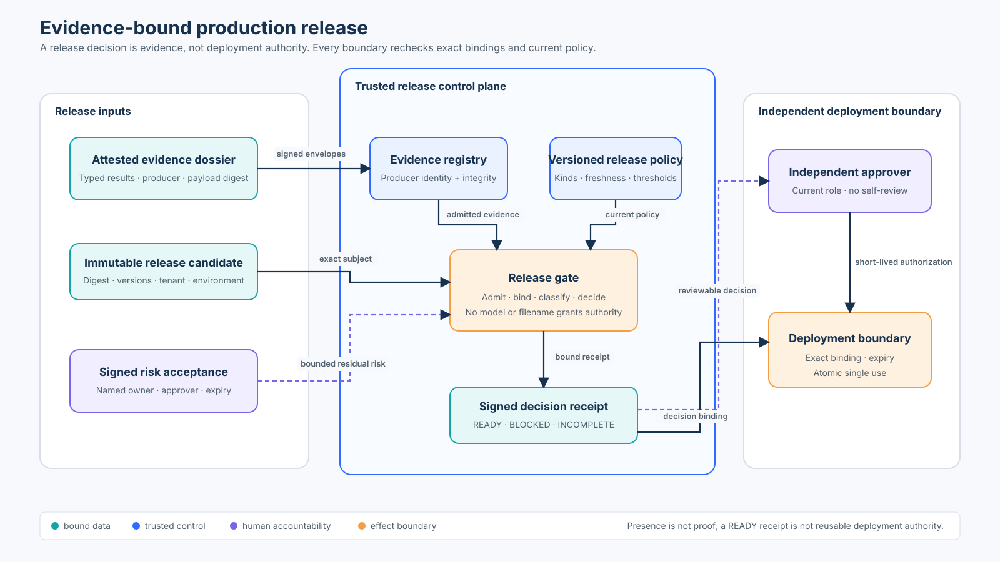

# Advanced 03 — Governance and Production Readiness

## Course profile

| | |
|---|---|
| Level | Advanced |
| Estimated time | 3–4 hours |
| Audience | Security engineers, platform engineers, AI assurance teams, SREs, and technical risk owners |
| Scenario | Decide whether one customer-support agent release may enter the `north` production environment |
| Main artifacts | Release-gate module, OpenTelemetry adapter, executable notebook, architecture specification, and focused adversarial tests |
| Prerequisite | [Advanced 02 — Multi-Agent Delegation](../02-multi-agent-security/README.md) |

## Capability

Build an evidence-bound production gate that distinguishes a failed control from
missing assurance, authenticates evidence producers, binds every artifact to one
immutable release candidate, preserves accountable residual-risk acceptance, and
issues a separate short-lived authorization for deployment.

## Course thesis

> A release decision is derived evidence, not deployment authority. Trusted
> application controls must admit the evidence, apply the current policy, bind
> the decision to one candidate and environment, and independently authorize
> each deployment.

A successful demo, an average score, a model recommendation, a filename, or a
green dashboard is not sufficient. The gate needs verifiable answers to four
questions:

1. **What exact release is under review?** Bind the code revision, artifact
   digest, model, prompt, tools, tenant, and environment.
2. **Who produced each claim?** Authenticate the producer and verify the whole
   typed payload, not only its storage location.
3. **What did the current policy conclude?** Preserve missing evidence, control
   failures, and severe outcomes without averaging them together.
4. **Who may deploy it now?** Require current independent authority and consume
   a narrow, expiring authorization once.

## Learning outcomes

By the end of this course, you will be able to:

- model an immutable `ReleaseCandidate` and a versioned `ReleasePolicy`;
- separate evidence metadata from typed attack, trace, and rollback claims;
- verify evidence and risk-acceptance attestations before using their contents;
- classify decisions as `READY`, `BLOCKED`, or `INCOMPLETE`;
- preserve explicit denominators and non-averaged severe failures;
- issue a signed decision receipt with exact evidence and policy bindings;
- enforce independent, current human approval at the deployment boundary;
- prevent candidate substitution, stale-policy reuse, expiry bypass, and replay;
- instrument the decision with the OpenTelemetry Python SDK without exporting
  evidence URIs, risk rationale, signatures, or raw dossier content; and
- explain which local teaching controls must be replaced in production.

## 1. Architecture: decision and deployment are different boundaries



The reproducible source is [architecture-spec.json](architecture-spec.json).

The release gate and deployment boundary have different responsibilities:

| Boundary | Accepts | Decides | Must not do |
|---|---|---|---|
| Evidence producer | Test or operational observations | A typed claim about one candidate | Grant release authority |
| Evidence registry | Signed evidence envelope | Whether producer identity and payload integrity verify | Treat a URI or filename as proof |
| Release gate | Candidate, admitted evidence, policy, risk acceptance | `READY`, `BLOCKED`, or `INCOMPLETE` | Deploy, silently waive blockers, or ask a model to decide |
| Risk approver | A named residual risk | Whether that residual risk may be accepted until a deadline | Convert failed or missing controls into passing evidence |
| Release approver | A valid `READY` receipt | Whether to issue one narrow deployment authorization | Self-approve or reuse stale authority |
| Deployment ledger | Exact candidate and authorization | Whether this authorization can be consumed now | Infer readiness from dashboard state |

The lab keeps the model entirely outside these boundaries. A model may summarize
evidence for a reviewer, but that summary is untrusted presentation data.

## 2. Mental model: seven objects, not one score

### 2.1 Release candidate

`ReleaseCandidate` binds the release ID, tenant, environment, artifact digest,
source revision, model version, prompt version, toolset version, and requester.
Changing any security-relevant component means evaluating a new candidate.

### 2.2 Evidence requirement

Each `EvidenceRequirement` names one evidence kind, its trusted producers, and
its maximum age. The policy—not the evidence submitter—owns those rules.

### 2.3 Evidence artifact

Every `EvidenceArtifact` includes:

- a unique evidence ID and typed kind;
- the candidate digest, tenant, environment, and policy version;
- producer and accountable owner;
- a review URI and payload digest;
- a timezone-aware observation time; and
- a `PASSED`, `FAILED`, or `ERROR` result.

The URI helps a human find details. It is not used as a policy fact. The payload
digest and attestation bind what the producer actually asserted.

### 2.4 Typed claim

Three controls need more than a Boolean:

- `AttackEvaluation` preserves expected attempts, executed attempts, severe
  successes, and harness errors.
- `TraceCoverage` preserves expected critical operations, traced operations,
  and collection errors.
- `RollbackDrill` preserves required and verified steps, recovery-point
  verification, and measured duration.

These types prevent “19 of 20 ran” and “the harness crashed” from being rendered
as a passing result.

### 2.5 Residual-risk acceptance

`RiskAcceptance` is a separate, signed record bound to the same candidate,
tenant, environment, and policy. It names a risk owner, a different authorized
approver, rationale, issue time, and expiry. In this lab it cannot waive a
missing, invalid, or failed control.

### 2.6 Decision receipt

`ReleaseDecision` records the state, blockers, admitted evidence IDs and
digests, risk-acceptance IDs, accountable principals, policy version, decision
time, stable decision ID, and integrity tag. It is reproducible review evidence.
It is not a deploy token.

### 2.7 Deployment authorization

`DeploymentAuthorization` is issued only after an independent actor with the
current release-approver role presents a valid `READY` decision. It binds one
decision, candidate, tenant, environment, policy version, approver, and expiry.
`DeploymentLedger` consumes its ID atomically, so concurrent retries cannot turn
one approval into multiple deployments.

## 3. Governing invariants

1. **Exact subject:** every evidence item, risk acceptance, decision, and
   deployment authorization names the same candidate digest, tenant, and
   environment.
2. **Authentic before meaningful:** the gate does not interpret an evidence
   result or severe-success count until the producer and integrity tag verify.
3. **Current policy:** evidence, risk acceptance, decision, and deployment must
   all use the gate’s current policy version.
4. **Unique evidence:** each required kind and evidence ID is unambiguous.
5. **Fresh and complete:** absent, stale, malformed, errored, or partially run
   evidence yields `INCOMPLETE`, never a safety claim.
6. **No severe averaging:** any authenticated severe unauthorized action yields
   `BLOCKED`, even if every other case passed.
7. **Risk is not evidence:** a signed acceptance records residual risk; it does
   not manufacture a passing control.
8. **Separation of duties:** the requester and accountable evidence principals
   cannot approve the deployment.
9. **Narrow authorization:** a `READY` receipt is converted into a short-lived
   authorization for one exact target.
10. **Atomic single use:** only the first concurrent consumer succeeds.

## 4. Threat model and control map

| Threat | Unsafe shortcut | Lab control | Remaining production concern |
|---|---|---|---|
| Evidence spoofing | Trust a JSON file or CI label | Producer allowlist plus whole-payload HMAC verification | Use workload identity and asymmetric/verifiable attestations |
| Candidate substitution | Reuse tests for a new image or prompt | Exact artifact, tenant, environment, and policy binding | Canonical inventory for all model, data, prompt, and tool dependencies |
| Partial evaluation | Count missing attempts as defenses | Expected/executed denominators and explicit harness errors | Distributed evaluator loss and delayed results |
| Score averaging | Hide one critical failure in a mean | Severe successes remain individual blockers | Severity taxonomy and verifier quality |
| Stale assurance | Reuse last month’s rollback drill | Per-kind freshness limits | Event-driven invalidation after material change |
| Risk laundering | Label a failed control “accepted risk” | Risk records cannot waive gate blockers | Organization-specific exception policy and legal review |
| Self-approval | Requester approves their own release | Directory-resolved role and independence check | Identity governance, break-glass, and collusion controls |
| Receipt tampering | Edit blockers or candidate after review | Signed decision receipt | Protected key service and append-only decision store |
| Authorization replay | Retry the same approval concurrently | Locked single-use deployment ledger | Durable compare-and-swap across regions |
| Telemetry leakage | Export rationale and artifact details | OpenTelemetry allowlist of low-cardinality metadata | Collector access, retention, redaction, and regional policy |

## 5. Decision lifecycle

### Phase A — freeze the candidate

1. Resolve immutable digests and versions for code, model, prompts, tools, and
   policy-relevant configuration.
2. Bind the target tenant and environment.
3. Record the authenticated requester.
4. Restart evaluation after any material change.

### Phase B — produce evidence

The default policy requires seven kinds:

| Kind | Trusted teaching producer | Claim used by the gate |
|---|---|---|
| Threat model | `risk-platform` | A reviewed threat model exists for this candidate |
| Policy tests | `policy-ci` | Deterministic policy regressions passed |
| Attack evaluation | `attack-harness` | All expected attempts ran, the harness was healthy, and no severe attack succeeded |
| Trace coverage | `telemetry-ci` | Every policy-designated critical operation was traceable |
| Rollback drill | `sre-drill` | Every required step and recovery point was verified within the policy limit |
| Control owner | `governance-registry` | An accountable owner is recorded |
| Artifact provenance | `build-verifier` | The candidate artifact passed the organization’s provenance policy |

The producer signs the typed payload. The release gate verifies that signature
using a trusted registry. A storage URL alone never satisfies the requirement.

### Phase C — admit and classify

The gate first rejects ambiguous or untrusted material. Only admitted evidence
is interpreted:

- `ERROR`, missing coverage, stale data, schema mismatch, bad signature, or
  wrong binding means `INCOMPLETE`;
- an authentic failed control, critical trace gap, failed rollback property, or
  severe attack success means `BLOCKED`; and
- only complete, authentic, current, passing evidence yields `READY`.

If incomplete and failed conditions coexist, the state remains `INCOMPLETE`.
The known failure stays in the blocker list, but the organization must not claim
it knows the complete risk picture.

### Phase D — review residual risk

Residual risk is reviewed independently and recorded with a deadline. Examples
include bounded latency risk during a read-only pilot or a documented dependency
limitation that does not represent a failed mandatory control. Expiry or a
candidate change invalidates the acceptance.

### Phase E — authorize deployment

The release approver’s identity and role are resolved from current server-side
state. The approver cannot be the requester or an evidence/risk principal. A
successful approval creates an expiring authorization, not an unbounded role.

### Phase F — consume and observe

The deployment system rechecks candidate and policy bindings immediately before
action and atomically consumes the authorization. Production systems then need
staged rollout, health checks, rollback, incident response, and continuous
monitoring. Pre-release evidence does not prove future behavior.

## 6. State of practice: frameworks, tools, and SDKs

The following landscape was checked against primary documentation on
2026-09-20. These tools are complementary; none replaces the application’s
release policy.

| Resource | What it contributes | How this course uses it | Boundary to remember |
|---|---|---|---|
| [NIST AI RMF 1.0](https://www.nist.gov/publications/artificial-intelligence-risk-management-framework-ai-rmf-10) and [AI RMF Core](https://airc.nist.gov/airmf-resources/airmf/5-sec-core/) | Govern, Map, Measure, and Manage outcomes; independent assessment; deployment-like evaluation; lifecycle monitoring | Shapes accountable roles, evidence, recovery, and ongoing review | The RMF is risk-management guidance, not an executable release gate; NIST notes that AI RMF 1.0 is being revised |
| [NIST AI 600-1 Generative AI Profile](https://nvlpubs.nist.gov/nistpubs/ai/NIST.AI.600-1.pdf) | GenAI-specific risks and actions across the AI lifecycle | Informs the threat and assurance scope | A profile must be tailored to the use case and organizational risk tolerance |
| [NIST SSDF 1.1 and SP 800-218A](https://csrc.nist.gov/projects/ssdf) | Secure development practices, including an AI-model community profile | Connects the AI release to the broader secure-development lifecycle | Development practices do not independently prove one release is safe |
| [SLSA 1.2](https://slsa.dev/spec/v1.2/) and its [Verification Summary Attestation](https://slsa.dev/spec/v1.2/verification_summary) | Artifact provenance plus a subject, exact policy reference/digest, input attestations, and verification result | Motivates digest-bound provenance and decision inputs | SLSA primarily addresses software supply-chain properties, not agent authorization or behavioral safety |
| [in-toto attestations with Sigstore](https://docs.sigstore.dev/cosign/verifying/attestation/) | Signed attestations and policy validation with CUE or Rego | Production replacement for the lab’s symmetric HMAC envelopes | Verification must constrain trusted identity, subject, predicate type, and policy—not merely attestation presence |
| [Open Policy Agent bundles](https://www.openpolicyagent.org/docs/management-bundles) and [decision logs](https://www.openpolicyagent.org/docs/management-decision-logs) | Signed policy distribution, revisioned bundles, decision IDs, and audit telemetry | A deployment option for externally managed policy-as-code | OPA evaluates supplied input; the application still authenticates producers, assembles trusted context, and enforces the result |
| [GitHub deployment environments](https://docs.github.com/en/actions/reference/workflows-and-actions/deployments-and-environments) | Required reviewers, prevent-self-review, branch restrictions, environment secrets, and custom protection rules | Example place to connect a release decision to deployment | Custom protection rules are documented as public preview; availability and bypass settings require explicit review |
| [OpenTelemetry Python](https://opentelemetry.io/docs/languages/python/instrumentation/) | Standard trace APIs, SDK processors, and exporters | The companion lab emits one decision span through an in-memory exporter | Telemetry is evidence about execution, not authorization; attributes need privacy and cardinality controls |
| [OWASP Top 10 for Agentic Applications 2026](https://genai.owasp.org/2025/12/09/owasp-top-10-for-agentic-applications-the-benchmark-for-agentic-security-in-the-age-of-autonomous-ai/) | Agentic threat categories and mitigations | Helps scope attack cases and governance review | A taxonomy does not prove that the organization tested its exact system |

### Tool selection questions

- Does the tool cryptographically bind evidence to the artifact digest?
- Can policy and producer identity be resolved independently of the submitter?
- Does an error remain an error, rather than defaulting to pass?
- Can a reviewer retrieve the exact policy and input evidence for a decision?
- Does the deployment system recheck current state and prevent self-review?
- Is replay prevented in durable state across workers and regions?
- Can telemetry exclude sensitive evidence while retaining decision correlation?

## 7. Practical lab

### Files

| File | Purpose |
|---|---|
| [`03_production_gate.py`](03_production_gate.py) | Core candidate, evidence, risk, decision, approval, and single-use authorization model |
| [`03_production_gate_otel.py`](03_production_gate_otel.py) | Credential-free OpenTelemetry adapter with an in-memory exporter |
| [`03_production_gate.ipynb`](03_production_gate.ipynb) | Guided failure-injection and review workflow |
| [`architecture-spec.json`](architecture-spec.json) | Validated diagram geometry and accessibility source |
| [`architecture.svg`](architecture.svg) | Rendered architecture image |
| [`../../../tests/test_production_gate.py`](../../../tests/test_production_gate.py) | Focused security, binding, role, expiry, and concurrency regressions |
| [`../../../tests/test_production_gate_otel.py`](../../../tests/test_production_gate_otel.py) | Telemetry allowlist and privacy regressions |

### Setup

From the repository root:

```bash
python3 -m venv .venv
source .venv/bin/activate
python -m pip install -e '.[learner]'
```

No API key, cloud account, external collector, or network call is required.

### Run the core release flow

```bash
python curriculum/advanced/03-production-gate/03_production_gate.py
```

The demonstration:

1. builds one immutable candidate;
2. creates and signs seven typed evidence payloads;
3. signs a separately accountable residual-risk acceptance;
4. emits a `READY` decision receipt;
5. issues an independent short-lived deployment authorization; and
6. proves that the first consumption succeeds and replay fails.

### Run the OpenTelemetry adapter

```bash
python curriculum/advanced/03-production-gate/03_production_gate_otel.py
```

Inspect the exported attributes. The span contains decision correlation and
counts, but not evidence URLs, payload digests, risk rationale, signatures, or
raw blockers. Production deployments should apply collector-side controls too.

### Run the guided notebook

```bash
jupyter notebook curriculum/advanced/03-production-gate/03_production_gate.ipynb
```

The notebook keeps the baseline fixed while you inject:

- one authenticated severe attack success;
- evidence tampering after signing;
- an expired risk acceptance;
- a mismatched release candidate at deployment; and
- a replay of a consumed deployment authorization.

### Run the focused tests

```bash
pytest -q tests/test_production_gate.py tests/test_production_gate_otel.py
```

## 8. Evaluation and evidence

### Decision states

| State | Meaning | Operator response |
|---|---|---|
| `READY` | All required evidence is authentic, bound, fresh, complete, and passing; risk records are valid | Seek independent deployment authorization |
| `BLOCKED` | Complete trustworthy evidence proves at least one mandatory control failed | Remediate and evaluate a new candidate |
| `INCOMPLETE` | The gate cannot establish the full claim because evidence, identity, schema, time, coverage, or policy binding is missing or invalid | Repair evidence production; do not interpret absence as safety |

### Measures with explicit denominators

Report these separately rather than producing a single weighted “readiness
score”:

- attack attempts executed / expected, by family and severity;
- severe unauthorized successes / severe attempts;
- harness errors / attempted evaluations;
- critical operations traced / expected critical operations;
- trace collection errors / observed operations;
- rollback steps verified / required steps;
- rollback duration / policy maximum;
- admitted evidence artifacts / required kinds;
- valid, expiring residual-risk records by owner; and
- post-release incidents, rollbacks, and overdue reapprovals.

### Required adversarial cases

The focused suite verifies at least:

- missing and duplicate kinds;
- duplicate evidence IDs;
- tampered signatures;
- wrong candidate binding;
- stale evidence and producer errors;
- incomplete attack execution and harness failure;
- a severe attack success;
- missing critical traces;
- failed rollback recovery point and duration threshold;
- expired or tampered risk acceptance;
- unauthorized and non-independent approvers;
- candidate and policy substitution at deployment; and
- eight concurrent attempts to consume one authorization.

## 9. Failure handling and recovery

| Failure | Safe behavior | Recovery |
|---|---|---|
| Evidence store is unavailable | `INCOMPLETE`; do not use cached presence as proof | Restore the store, re-verify digest and attestation, then reevaluate |
| Producer signature fails | Ignore the claim and record invalid attestation | Investigate producer identity/key state; issue new evidence after resolution |
| Evaluation harness errors | Preserve harness error and incomplete coverage | Repair harness, rerun all affected cases, and bind a new report |
| Severe case succeeds | `BLOCKED` regardless of aggregate rate | Remediate control, issue a new candidate, and rerun the suite |
| Policy changes after decision | Reject authorization or consumption | Reevaluate against the current policy |
| Risk acceptance expires | `INCOMPLETE`; expiry is not silently extended | Reassess, remediate, or obtain a new independent acceptance |
| Approver loses role | Deny authorization from current directory state | Route to an active authorized approver |
| Authorization expires or is replayed | Deny without deployment | Reconcile deployment state; issue new authority only from a current decision |
| Deployment result is unknown | Preserve the stable deployment operation ID | Reconcile provider state before any retry; do not create a new ID to bypass uncertainty |

The local ledger stops duplicate consumption in one process. A real deployment
orchestrator must also preserve provider outcomes and idempotency across crashes,
workers, and regions.

## 10. Production replacement

The local lab proves decision invariants; it is not a production control plane.

Replace:

- demo HMAC keys with workload identity, asymmetric signatures, Sigstore/in-toto
  attestations, or a protected signing service;
- in-process producer maps with an authenticated evidence registry and key or
  certificate lifecycle;
- an in-memory human directory with enterprise identity, current group/role
  resolution, revocation, and separation-of-duties policy;
- local policy objects with reviewed, signed, versioned policy distribution;
- in-memory single-use state with a durable transactional or compare-and-swap
  store;
- example evidence URLs with access-controlled, retained, integrity-protected
  records and redacted reviewer views;
- one deploy handoff with environment protection, staged rollout, health gates,
  immutable deployment history, rollback, kill switches, and incident ownership;
  and
- in-memory tracing with authenticated transport, privacy controls, sampling,
  retention, alerting, and protected collector/storage infrastructure.

Also define material-change triggers. Code, model, prompt, tool, policy,
dependency, dataset, environment, or privilege changes may invalidate some or
all earlier evidence. “Fresh enough” is an organizational policy decision, not
a universal 30-day constant.

## 11. Exercises

1. Add a signed model-card evidence type and prove a card for another model
   digest is rejected.
2. Create a non-production policy profile with different evidence freshness and
   show that its decision cannot authorize production.
3. Replace the demo HMAC envelope with a locally verifiable asymmetric
   signature while keeping the gate interface stable.
4. Write an OPA or Cedar policy adapter. Prove the application still owns trusted
   input construction and enforcement.
5. Add a durable authorization store with atomic compare-and-swap and test two
   worker processes racing to deploy.
6. Model an `UNKNOWN` deployment outcome and require reconciliation before a
   retry with the same operation ID.
7. Add staged-rollout evidence and define which failures trigger automatic
   rollback versus human escalation.
8. Create a GitHub custom deployment protection rule that validates a decision
   receipt, while documenting preview status and fail-closed behavior.
9. Add OpenTelemetry sampling tests that retain every `BLOCKED` or `INCOMPLETE`
   decision without exporting evidence content.
10. Define a reapproval matrix for model, prompt, tool, policy, and environment
    changes.

## Checkpoint

A signed attack report covers 23 of 24 expected attempts, records zero severe
successes, and has no harness error. Every other control passed. The deployment
requester also has the release-approver role. What should happen?

- A. Mark `READY`; 23 successful defenses are enough, and the requester can
  approve.
- B. Mark `INCOMPLETE`; one expected attempt is missing, and any later deployment
  approval must come from an independent current approver.
- C. Mark `BLOCKED`; missing evidence proves the control failed.

**Answer: B.** Missing execution is not proof of a failed control, but it also is
not proof of safety. The gate must preserve the incomplete denominator, and the
deployment boundary must separately enforce independence.

## Authoritative references

- [NIST AI Risk Management Framework](https://www.nist.gov/itl/ai-risk-management-framework)
- [NIST AI RMF Core](https://airc.nist.gov/airmf-resources/airmf/5-sec-core/)
- [NIST AI 600-1 — Generative AI Profile](https://nvlpubs.nist.gov/nistpubs/ai/NIST.AI.600-1.pdf)
- [NIST Secure Software Development Framework and SP 800-218A](https://csrc.nist.gov/projects/ssdf)
- [SLSA 1.2 specification](https://slsa.dev/spec/v1.2/)
- [SLSA 1.2 Verification Summary Attestation](https://slsa.dev/spec/v1.2/verification_summary)
- [Sigstore: verify in-toto attestations](https://docs.sigstore.dev/cosign/verifying/attestation/)
- [Sigstore Policy Controller](https://docs.sigstore.dev/policy-controller/overview/)
- [Open Policy Agent bundles](https://www.openpolicyagent.org/docs/management-bundles)
- [Open Policy Agent decision logs](https://www.openpolicyagent.org/docs/management-decision-logs)
- [GitHub deployments and environments](https://docs.github.com/en/actions/reference/workflows-and-actions/deployments-and-environments)
- [OpenTelemetry Python manual instrumentation](https://opentelemetry.io/docs/languages/python/instrumentation/)
- [OpenTelemetry security guidance](https://opentelemetry.io/docs/security/)
- [OWASP Top 10 for Agentic Applications 2026](https://genai.owasp.org/2025/12/09/owasp-top-10-for-agentic-applications-the-benchmark-for-agentic-security-in-the-age-of-autonomous-ai/)

## Navigation

Previous: [Advanced 02 — Multi-Agent Delegation](../02-multi-agent-security/README.md).

Next: [36-course enterprise roadmap](../../README.md).
