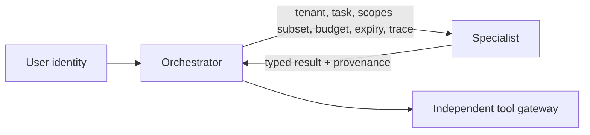

# 18 — Multi-Agent Delegation Security

## Learning objectives

Compare team topologies, construct a delegation envelope, enforce capability
attenuation, and detect over-delegation, tenant switching, expired work, and
delegation loops before a specialist can act.

## Scenario and mental model

An orchestrator delegates policy research to a specialist. The specialist may
read approved documents, but cannot inherit the orchestrator’s future write
capability, use another tenant, or delegate indefinitely. A message is not a
credential; it is an untrusted artifact plus a bounded authority request.

## Delegation envelope

Bind parent and child identities, tenant, task purpose, parent scopes, child
scopes, expiry, budget, maximum depth, approval constraints, and trace ID. The
key invariant is `child_scopes ⊆ parent_scopes`; a child must also pass its own
tool authorization, not merely present a trusted-looking handoff.

## Attack walkthrough

| Attack | Vulnerable behavior | Control | Evaluation |
| --- | --- | --- | --- |
| privilege amplification | child gets parent/admin scopes | subset check | escalation success = 0 |
| tenant swap | handoff changes tenant | tenant binding | cross-tenant action = 0 |
| stale delegation | child acts after expiry | expiry check | stale execution = 0 |
| delegation loop | agents recursively dispatch | depth/budget/stop rule | bounded calls |
| malicious specialist | result becomes instruction | typed provenance + reauth | unsafe follow-on = 0 |

## Practical lab

Run `python curriculum/shared/runtime_security_lab.py`; its `Delegation` object
denies a child whose scopes exceed the parent’s and emits a trace. Then run
`python labs/advanced/02_multi_agent_security.py` for the smaller role-contract
baseline. Extend the runtime with `max_depth` and assert a cycle cannot dispatch
more work. Inspect only structured receipts, never private model reasoning.

## Production considerations

Use distinct workload identities, short-lived audience-bound tokens, service
authorization at each hop, isolated memory/state, per-agent budgets, circuit
breakers, trace propagation, and a team-wide kill switch. Treat third-party
specialists as supply-chain dependencies and preserve an operator-owned failure
mode.

## References

- [NIST AI Agent Standards Initiative](https://www.nist.gov/artificial-intelligence/ai-agent-standards-initiative)
- [MITRE ATLAS](https://atlas.mitre.org/)
