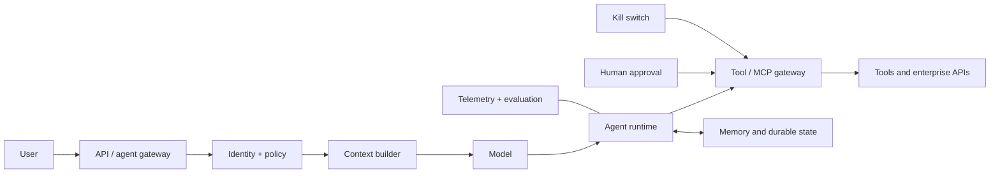

# 01 — Agent Security Architecture and Trust Boundaries

## Learning objectives

Map the complete agent system; identify the data, authority, identity,
enforcement, telemetry, and recovery mechanism at every boundary; and explain
why the LLM is not the security boundary.

## Why it matters

The research-and-support agent answers policy questions today, but will later
write tickets and issue refunds. A fluent model response is neither identity nor
permission. Security must survive a wrong or manipulated model decision.

## Prerequisites

Python 3.10+ and basic confidentiality, integrity, and availability concepts.
Continue with [02](../02-threat-modeling-agentic-systems/).

## Mental model and architecture

The user-to-gateway boundary authenticates a principal; the context builder
labels evidence rather than trusting it; the tool gateway independently checks
operation, resource, tenant, risk, budget, and approval. Memory, tool results,
and external content re-enter the system as data. A kill switch and receipts
make the external effect recoverable and attributable.

## Trust-boundary inventory

| Boundary | Data / authority | Enforcement | Telemetry / recovery |
| --- | --- | --- | --- |
| User → gateway | request, tenant claim | authentication, rate limits | request ID, deny reason |
| Evidence → context | documents, URLs | provenance and source authorization | source IDs, quarantine |
| Runtime → tool | proposed arguments | typed schema, PDP, approval | policy receipt, idempotency |
| Runtime → memory | write proposal | scope, classification, expiry | memory ID, delete/review |
| Tool → environment | side effect | egress, sandbox, credentials | action ID, revoke/replay |

## Practical exercise

Run `python curriculum/shared/foundation_lab.py`. Treat each printed object as
an observable security event. Add an unapproved cross-tenant source and verify
that the context trace says `deny`; do not solve it with a prompt rule.

## Evaluation and production considerations

Measure boundary inventory coverage, attributed action coverage, and the time
to revoke a tool. Production systems additionally need protected trace storage,
redaction, time synchronization, and a tested dependency failure mode. The
architecture is established security engineering; protocol-specific patterns
remain emerging practice.

## Review questions

1. Which component authorizes an `issue_refund` call?
2. What must be recorded to replay a side effect safely?
3. Why is a model refusal not an enforcement point?

## References

- [NIST AI Agent Standards Initiative](https://www.nist.gov/artificial-intelligence/ai-agent-standards-initiative)
- [OWASP Securing Agentic Applications](https://genai.owasp.org/resource/securing-agentic-applications-guide-1-0/)
