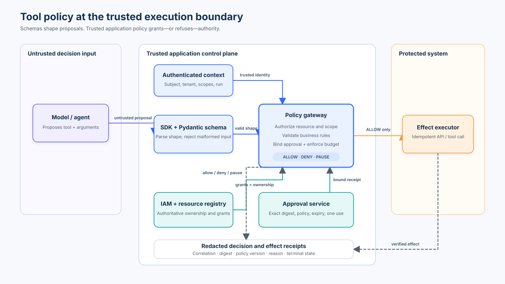

# Security Foundations and Tool Policy

| | |
|---|---|
| **Level** | Beginner |
| **Duration** | 60–90 minutes |
| **Prerequisites** | Basic Python, dictionaries, and dataclasses |
| **Notebook** | [`01_tool_policy.ipynb`](01_tool_policy.ipynb) |
| **Lab** | [`01_tool_policy.py`](01_tool_policy.py) |

## Learning Objectives

After this module you will be able to:

1. Identify assets, actors, trust boundaries, and blast radius in an agent system.
2. Distinguish trusted context (identity, tenant, scopes) from untrusted proposals (model-generated actions).
3. Implement a deterministic pre-execution policy with seven ordered controls.
4. Observe why caller-asserted identity and unverified approval fail.
5. Produce structured, redacted audit evidence for every policy decision.
6. Evaluate a labelled set of adversarial and boundary cases.

## The Core Idea

Agent security protects a system that can interpret instructions, select tools,
read untrusted information, retain state, and cause side effects.  The model is
one component; **the security boundary is the application** that authenticates the
caller, authorizes each operation, validates data, limits execution, and records
evidence.  The model may propose an action, but it must not grant itself access.

## Architecture



## A Threat-Model Vocabulary

- **Assets:** secrets, personal data, credentials, money, source code, model prompts, memory, availability, and business actions.
- **Actors:** users, agents, sub-agents, tools, MCP servers, model providers, operators, and attackers.
- **Trust boundaries:** every transition between user input, model context, tool output, memory, external systems, and human approval.
- **Blast radius:** the maximum harm if one instruction, tool, credential, or agent is compromised.

## Scenario: Expense Assistant

An expense assistant can read receipts, calculate totals, preview a claim, and submit a reimbursement.  The receipt is untrusted input, the employee identity is authenticated context, and submission is a consequential side effect.

### Control Table

| Operation | Type | Risk | Required Scope | Tenant Check | Approval | Budget Cost |
|---|---|---|---|---|---|---|
| `read_receipt` | Read-only | Low | `expense:read` | ✓ | — | 1 |
| `calculate_total` | Read-only | Low | `expense:read` | ✓ | — | 1 |
| `preview_claim` | Read-only | Low | `expense:read` | ✓ | — | 1 |
| `submit_claim` | Irreversible | **High** | `expense:submit` | ✓ | Required | 5 |

### Seven-Step Control Sequence

Before any tool executes, the policy engine checks in order:

1. **Known authenticated subject and tenant** — reject unknown principals.
2. **Operation allowlist and required scope** — reject unlisted operations or missing permissions.
3. **Resource authorization / tenant match** — resolve and authorize the primary resource and every indirectly referenced resource from trusted registry state.

> [!WARNING]
> **Nested resource bypass:** validating `proposal.resource_id` is insufficient if tool arguments contain additional document, account, file, or object IDs. Every referenced resource must receive its own authorization check.
4. **Argument schema and business rules** — reject malformed or out-of-range values.
5. **Risk classification and approval requirement** — pause high-risk writes that lack approval evidence.
6. **Approval authenticity, binding, expiry, and replay** — verify that the receipt was issued by the trusted approval service, is bound to the requesting subject/tenant/operation/resource, is unexpired, and has not been replayed.
7. **Per-run budget and stop condition** — reject when the run's cost budget is exhausted.

Only after all seven checks pass does the action reach the execution stub.

### Data Boundaries

| Structure         | Boundary                      | Authority                                          |
| ----------------- | ----------------------------- | -------------------------------------------------- |
| `ActorContext`    | Trusted application context   | Created from authenticated session / simulated IAM |
| `ActionProposal`  | Untrusted                     | Model-generated proposal                           |
| `ResourceMeta`    | Trusted lookup result         | Application resource registry                      |
| `ApprovalReceipt` | Untrusted until verified      | Issued/verified through trusted approval service   |
| `PolicyDecision`  | Trusted decision output       | Deterministic policy engine                        |
| `AuditEvent`      | Application-produced evidence | Audit pipeline                                     |

**Key Concept:** Data type ≠ trust.  A Python dataclass is not inherently trusted just because it is structured.  **Provenance and verification establish trust.**

## Watch For

- **Caller-asserted identity:** The model or request text must never set subject, tenant, scope, or approval.  These come from the authentication layer.  A flat `Request(subject="...", tenant="...", approved=True)` teaches the right slogan with the wrong mechanism.
- **Unverified approval Boolean:** `approved=True` as a request field lets any caller bypass approval.  Production approval requires a bound, time-limited receipt verified against the specific subject, tenant, operation, and resource.
- **Cross-tenant resource access via name:** Checking `request.tenant == "tenant-a"` does not prevent reading `tenant-b/payroll` if the resource's owning tenant is not looked up independently.
- **Budget as a soft limit:** Without enforcement, an agent can retry indefinitely.  A per-run cost budget with a stop condition limits blast radius.
- **Audit without structure:** Returning an unstructured string provides no machine-readable evidence.  Structured audit events with correlation IDs, reason codes, and terminal states enable accountability.

## Checkpoint

1. Where does authorization belong in an agent system?
   - At the application and tool boundary, not in a prompt.

2. An attacker sends a request with `approved=True` to submit a claim.  Why does the improved policy deny it?
   - A self-asserted Boolean is not an approval. The policy verifies that an approval receipt was actually issued by the trusted approval service, is bound to the correct subject, tenant, operation, and resource, and has not expired or been replayed.

3. An employee at Acme Corp tries to read `receipt-200`, which belongs to Globex.  What control catches this?
   - Step 3 (resource authorization / tenant match) looks up the resource's owning tenant from a trusted registry and rejects the cross-tenant access.

## Non-Goals and Production Caveats

This lesson is a **laptop teaching simulation**, not production-grade enforcement.  The following shortcuts are intentional and clearly labelled:

| Teaching Shortcut | Production Requirement |
|---|---|
| In-memory subject registry | Real IAM / identity provider |
| In-memory resource registry | Database or catalog lookup |
| In-memory approval receipt | Cryptographically signed or server-stored approval token |
| In-memory budget counter | Concurrency-safe, durable budget with distributed coordination |
| Deterministic side-effect stub | Real tool call with idempotency keys and rollback |
| Synchronous single-thread | Async execution with rate limiting |
| No persistent audit log | Tamper-resistant, append-only audit storage |

## References

- [OWASP Securing Agentic Applications Guide](https://genai.owasp.org/resource/securing-agentic-applications-guide-1-0/) — practical technical guidance for identity, authorization, and approval in agent systems (supports Steps 1–6 of the control sequence).
- [Google Secure AI Framework (SAIF)](https://cloud.google.com/use-cases/secure-ai-framework) — design objectives including confidentiality, integrity, availability, and accountability (supports security objectives and audit evidence).
- [NIST AI Agent Standards Initiative](https://www.nist.gov/artificial-intelligence/ai-agent-standards-initiative) — current standards context for secure agent identity, authorization, and evaluation (ecosystem program, not a detailed implementation specification).

## Running the Lab

```bash
# Run the scenario evaluation
python3 curriculum/beginner/01-tool-policy/01_tool_policy.py

# Run the focused test suite
python3 -m pytest tests/test_tool_policy.py -v

# Run the guided notebook (from repo root)
jupyter notebook curriculum/beginner/01-tool-policy/01_tool_policy.ipynb

# Compile all curriculum Python
python3 -m compileall -q curriculum tests
```