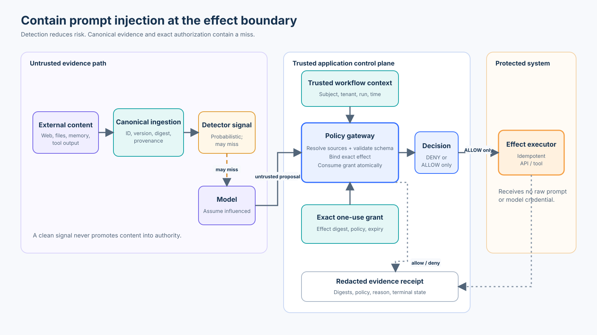

# Module 02: Prompt Injection and Data Provenance

## Learning Objectives

By the end of this module, you will understand:
1. Why applications should assume untrusted context may influence model behavior and remain safe even when injection succeeds.
2. The fundamental difference between **Provenance** (where data came from) and **Authority** (what actions the data is permitted to authorize).
3. Why heuristic filters fail against prompt injection.
4. How to implement **Content Binding** to prevent source spoofing.
5. How to implement **Context Binding** to prevent workflow forgery.

## The Core Thesis

When untrusted content is included in model context, applications should assume it may influence model behavior. Security must therefore remain correct even when prompt injection succeeds.

A secure application relies on **application-resolved provenance in this simulation** + strict boundaries + out-of-band policies.
External content can *inform* an answer, but it must never grant authority.

## A Secure Architecture

This module introduces the crucial distinction between **Provenance** and **Authority**. 
- **Provenance:** Where did this data come from? (e.g. `TRUSTED_INTERNAL`, `UNTRUSTED_EXTERNAL`).
- **Authority:** Is this source permitted to issue instructions for this operation? (e.g. `INFORMATIONAL`, `OPERATIONAL`).

Even if a document's provenance is `TRUSTED_INTERNAL` (authentic and internal), it does not automatically possess `OPERATIONAL` authority to execute a high-risk action like `issue_refund`. Documents only provide `INFORMATIONAL` authority.



> **Note:** Provenance is another policy input. It does not replace authentication, authorization, approval, validation, or execution gating established in Lesson 01.

## Teaching Simulation vs. Production

| Teaching simulation | Production |
|---|---|
| In-memory source registry | Authenticated ingestion/catalog metadata |
| Simple provenance enum | Signed metadata / authenticated connectors / trusted pipeline |
| Informational vs operational authority | Fine-grained policy/ABAC/capability model |
| Deterministic model simulator | Real LLM behind same policy boundary |
| Local execution stub | Idempotent API/tool execution |
| Local evidence | Centralized tamper-resistant audit |

## The Threat Model: Content vs Context Forgery

Even when we establish a provenance system, attackers will attempt to bypass it by forging identifiers. In this lab, we use a `SimulatedModel` that is intentionally naive. We assume the prompt injection *succeeds* in tricking the LLM into proposing the dangerous action. Our job is to ensure the **surrounding application remains safe**.

> **Note:** The goal is not to perfectly classify malicious text. The goal is to prevent text from acquiring authority it does not possess.

This lesson introduces two critical bindings to prevent attackers from acquiring this authority:

### 1. Content Binding (Preventing Source Spoofing)
**The Attack:** An attacker supplies malicious content alongside a claim that it came from a trusted source (e.g., `id="kb-article-42"`).
**The Fix:** Provenance applies to an authenticated content object, not to a string identifier supplied alongside arbitrary text. In our lab, external content must enter through an ingestion function that generates a new ID and explicitly assigns `UNTRUSTED_EXTERNAL` provenance. We never let callers pair a trusted ID with different content.

### 2. Context Binding (Preventing Workflow Forgery)
**The Attack:** An attacker knows that the system requires an operational workflow ID to issue a refund. They manually supply `"workflow-999"` to trick the system.
**The Fix:** Knowing an authorization object's identifier must not be equivalent to possessing that authorization. Operational authority must be resolved from trusted application state based on the current execution run (the `RunContext`), preventing attackers from guessing static identifiers.

### 3. Trusted-Source Content Compromise
This is distinct from source spoofing. What happens if an attacker successfully injects malicious instructions *into* the actual trusted KB article? 
**The Result:** The source is genuinely `TRUSTED_INTERNAL`, but its authority remains `INFORMATIONAL`. Because the document lacks `OPERATIONAL` authority, a refund is still securely denied. 

## Running the Lab

Run the interactive notebook:

```bash
jupyter notebook curriculum/beginner/02-prompt-injection/02_prompt_injection.ipynb
```

Or run the standalone script to see the adversarial scenarios in action:

```bash
python3 curriculum/beginner/02-prompt-injection/02_prompt_injection.py
```
