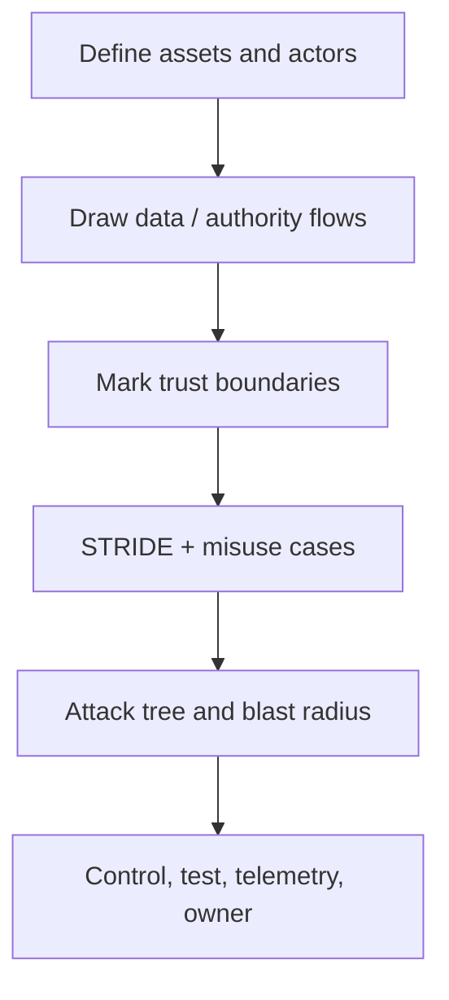

# 02 — Threat Modeling Agentic Systems

## Learning objectives

Produce a data-flow diagram, STRIDE and abuse-case analysis, an attack tree,
and a threat record with a control, test, telemetry, owner, and residual risk.

## Scenario and assets

An employee asks the agent to research a retention policy and later to resolve
a support case. Assets include documents, PII, credentials, money, source code,
memory, audit evidence, and availability. Actors include the user, attacker,
agent, specialist, tool, MCP server, model provider, operator, and external
service.

## Method

Use STRIDE to ask about spoofing identity, tampering with context/state,
repudiation without receipts, information disclosure via tools or memory,
denial of service, and elevation through delegation. Add agent-specific misuse:
retrieved instructions, tool-result poisoning, approval fabrication, and stale
resume. An attack tree for “exfiltrate a secret” can branch through an injected
document, broad fetch tool, compromised MCP server, or poisoned memory.

## Threat record

| Asset | Actor / entry point | Boundary / precondition | Impact | Control and test | Telemetry / owner | Residual risk |
| --- | --- | --- | --- | --- | --- | --- |
| Support PII | attacker / ticket body | evidence enters context | disclosure | provenance + egress test | source ID / security owner | model may summarize allowed data |
| Refund funds | compromised agent / tool call | tool gateway, broad scope | integrity | bound approval receipt | action ID / finance owner | approved fraud needs business controls |

## Workshop

Start from [course 01](../01-agent-security-architecture-and-trust-boundaries/).
For each `Action` in `foundation_lab.py`, write a threat record. Then change the
amount after approval and verify the receipt test rejects it. That is a concrete
integrity property, not an assertion about model intentions.

## Evaluation and exercises

A good model has a named owner and test for every high-impact row, explicit
preconditions, and a residual risk. Add one availability threat (slow external
resource) and one repudiation threat (missing policy receipt). Compare a
single-agent and delegated path: the latter adds a handoff boundary.

## References

- [MITRE ATLAS](https://atlas.mitre.org/)
- [NIST AI RMF Playbook](https://airc.nist.gov/AI_RMF_Knowledge_Base/Playbook)
