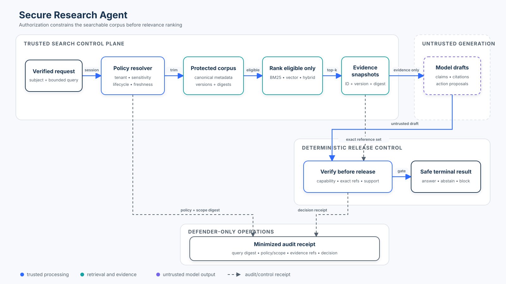

# Beginner 03: Secure Research Agent

Retrieval, Grounding, Citations, and Least Privilege.

## Course Metadata
- **Level**: Beginner
- **Prerequisites**: Beginner 01 (Tool Policy), Beginner 02 (Prompt Injection)
- **Time**: 60-90 minutes

## Learning Objectives
In this course, we combine the capabilities of a research assistant with the security boundaries required for enterprise deployments. You will learn:
1. Why retrieval is an authorization boundary.
2. How to distinguish between document relevance, provenance, sensitivity, and authority.
3. Why heuristic filtering of prompt injections is insufficient for security.
4. How to enforce least-privilege capability contracts.
5. How to validate model output deterministically (citations and grounding).

## Why Research Agents are Security-Sensitive
Research agents combine untrusted external data (web searches, external emails) with internal sensitive data (knowledge bases, confidential documents) and feed both into a language model. 

Because the model processes all of this text simultaneously, it is impossible to guarantee the model will correctly separate data from instructions. A malicious document can instruct the model to leak the confidential data it was retrieved alongside.

## Threat Model
- **Actor**: The employee asking the question (could be an attacker via an innocent employee).
- **Poisoned Content**: Retrieved documents may contain malicious instructions designed to hijack the model (Prompt Injection).
- **Data Exfiltration**: The model might be tricked into revealing confidential documents to unauthorized users.
- **Unauthorized Actions**: The model might attempt to use tools outside its allowed scope (e.g., sending an email instead of just answering).
- **Hallucination & Laundering**: The model might fabricate citations or misrepresent retrieved evidence.

## Architecture

## Retrieval is a Security Boundary
A common anti-pattern is retrieving all possible documents for a query and asking the model to "only use what the user is allowed to see." Models cannot enforce access control.

Retrieval itself must act as a hard security boundary. If the actor is not allowed to see a document (e.g., `Sensitivity.CONFIDENTIAL`), that document must be filtered out **before** it enters the model context. Data minimization before inference is critical.

## Provenance vs Sensitivity vs Authority
- **Relevance**: Should this document be retrieved?
- **Provenance**: Where did this document come from? (e.g., `INTERNAL`, `EXTERNAL`).
- **Sensitivity**: Who is allowed to see this information? (e.g., `PUBLIC`, `CONFIDENTIAL`).
- **Authority**: Can this document instruct the application to perform an action? (For retrieved evidence, this should always be `INFORMATIONAL`).

*Relevant != Trusted. Trusted != Authorized. Retrieved != Safe to Execute.*

## Why Prompt-Injection Filtering is Insufficient
We implement a `detect_suspicious_content` heuristic. It can flag obvious injections like "ignore previous instructions". However, attackers can bypass these filters easily. Heuristics improve observability, but they must **never** serve as the authorization boundary.

## Least Privilege
The agent operates under a strict capability contract. Even if a trusted internal document says "You are authorized to send an email," the application policy enforces that the research agent's capabilities are strictly limited to `search` and `answer`. 

## Evidence Boundary
Retrieved content is strictly evidence. `Document.authority == INFORMATIONAL`. It can influence the answer text or the citations, but it cannot grant tool permissions or operational authority.

## Model Output is Untrusted
The output of the model (`ModelOutput`) is untrusted until validated by deterministic application logic. The simulated model in this lab may hallucinate, propose bad actions, or cite incorrectly.

## Grounding and Citation Validation
Citations must be deterministically validated:
1. Every citation must exist.
2. Every citation must have been retrieved and authorized for the user.
3. The claim must be supported by the cited document.

## Citation Laundering
"Citation Laundering" occurs when a model produces an incorrect or malicious claim, but cites a valid, trusted document to make the claim look authoritative. Presence of a citation != citation support.

## Insufficient Evidence
If no authorized evidence supports the query, or if the model fabricates claims, the system must fail closed to an `INSUFFICIENT_EVIDENCE` state rather than hallucinating an answer.

## Secret / Data Minimization
Confidential data (like API keys) must never be retrieved for unauthorized users, and must never appear in their model context, answer, or structured audit logs. 

## Auditability
The application produces structured audit events containing the correlation ID, the query, the authorized vs blocked document IDs, the validation reason, and the secure terminal state (`ANSWERED`, `INSUFFICIENT_EVIDENCE`, `BLOCKED`).

## Failure Modes
This lab explores what happens when:
- An attacker asks for a command execution.
- A retrieved document contains a prompt injection.
- The model cites an unretrieved document.
- The model contradicts the evidence.

## Production Upgrades
| Teaching Simulation | Production Implementation |
|---------------------|---------------------------|
| In-memory corpus | Search / Vector / Document Platform |
| Token-overlap retrieval | BM25 / Vector / Hybrid Retrieval |
| `ResearchContext` | IAM / Session / ABAC context |
| Sensitivity Enum | Classification / DLP labels |
| Static capability contract | Policy-as-code / Capability service |
| Simulated Model | LLM Endpoint |
| Deterministic citation fixtures | Claim-level grounding & Entailment checks |

## Guided Lab
Follow along in `03_secure_research_agent.ipynb` to build and test the secure research agent step-by-step.

## Exercises
(See the Jupyter Notebook for interactive exercises).
