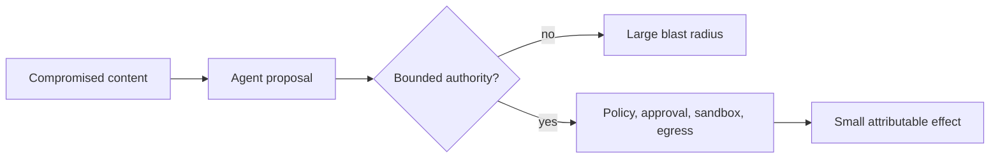

# 03 — Security Objectives, Invariants, and Blast Radius

<!-- roadmap-status -->
> **Roadmap status: Reading.** The chapter is available; course-owned lab, notebook, tests, and checkpoint are still required.

## Learning objectives

Turn requirements into measurable invariants, choose a test oracle, and reduce
the maximum impact of a compromised instruction, credential, agent, or tool.

## Mental model

An invariant is a condition that must hold over every relevant trajectory—not a
hope that the model generally behaves well. Examples: cross-tenant reads = 0;
unapproved writes = 0; child authority is a subset of parent authority; every
side effect has an attributable receipt; the kill switch stops new writes.

## Implementation pattern

`foundation_lab.authorize` encodes a small invariant: a refund approval binds
principal, tenant, action, resource, amount hash, policy version, expiry, and
single-use state. The changed-amount assertion is a bypass variant. It exposes
a policy decision and hash, not chain-of-thought.

## Blast-radius controls

Use tenant isolation, distinct credentials, narrow tools, separate memories,
egress allowlists, sandboxing, budgets, limited delegation, approval, and
kill switches. None is complete alone; each removes a different path in the
attack tree.

## Evaluation

Build a negative test for each invariant. Report both attack success and
blocked-valid-task rate. A deny-all policy has low attack success but is not a
useful system. Track time-to-revoke and number of resources reachable by a
credential as operational blast-radius measures.

## Exercises and references

Add an invariant for idempotency and explain its recovery benefit. Then add a
read-only tool and show that it does not require approval but remains tenant
scoped. See [NIST SP 800-207](https://csrc.nist.gov/pubs/sp/800/207/final) for
zero-trust principles and [MITRE ATLAS](https://atlas.mitre.org/) for attack
framing.
