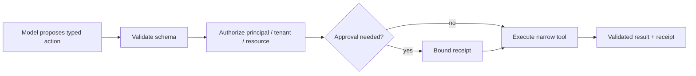

# 04 — Secure Tool and Action Interface Design

## Learning objectives

Refactor a broad agent capability into narrow typed actions; distinguish read,
propose, and execute; and specify an enforceable tool contract.

## Vulnerable design → control

`admin(command)`, `run_shell(command)`, `fetch_url(url)`, `execute_sql(query)`,
and `write_file(path, content)` make arbitrary authority available to a model.
Replace them with specific operations such as `read_policy(policy_id)`,
`propose_refund(case_id, amount)`, and `issue_approved_refund(receipt_id)`.

| Contract field | Example requirement |
| --- | --- |
| Purpose and schema | `issue_refund(case_id: str, cents: int)`; reject extras |
| Preconditions | active case, matching tenant, amount cap |
| Authority and risk | finance scope; irreversible/high risk |
| Side effect | idempotency key and receipt |
| Operations | timeout, bounded retry, approval, output schema |

## Practical lab

Run `python labs/beginner/01_tool_policy.py`, then inspect
`curriculum/shared/foundation_lab.py`. The latter demonstrates the critical
separation: a model may request `issue_refund`, while the policy point returns
`pause` until a matching approval exists. Add a contract test for a malformed
operation and for an idempotency-key collision.

## Evaluation and production

Measure unauthorized execution, schema-rejection coverage, duplicate effects,
and blocked-safe-task rate. Put validation and authorization in a service or
tool gateway, not in a tool description or prompt. Log argument hashes and
action IDs; protect raw arguments according to data classification.

## References

- [OWASP Agentic Security Initiative](https://genai.owasp.org/initiatives/agentic-security-initiative/)
- [JSON Schema](https://json-schema.org/)
