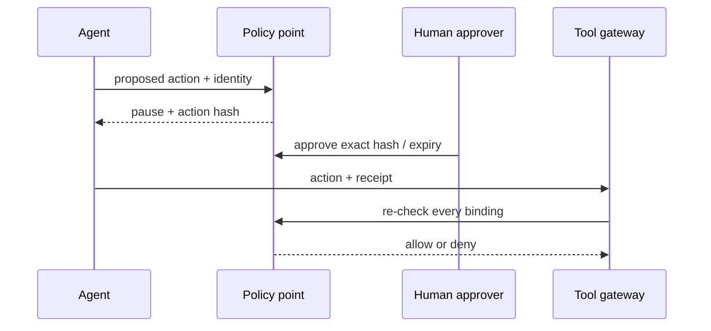

# 05 — Authorization, Approval, and Least Privilege

## Learning objectives

Implement deterministic authorization from identity, tenant, action, resource,
risk, purpose, and approval; and reject forged, stale, altered, and replayed
approvals.

## Mental model

Authorization answers whether an authenticated principal may perform a specific
operation now. Approval is additional evidence for a high-risk action. Neither
is a sentence in a prompt or a model assertion. Least privilege limits every
principal and credential to the smallest useful action set.

## Approval integrity

An approval object is bound to `principal`, `tenant`, `operation`, `resource`,
an arguments hash, `policy_version`, expiry, and single-use state. The binding
prevents the common failures: wrong tenant, excessive amount, fake approval
text, stale receipt, and replay.

## Practical lab and bypasses

Run `python curriculum/shared/foundation_lab.py`. The lab allows the exact
approved refund, then denies an altered amount with the same approval ID. Add
tests for an expired receipt, an approval from another tenant, and a second
attempt to consume the same receipt from the trusted approval store.
Also run `python labs/beginner/01_tool_policy.py` to compare an initial generic
approval gate with the bound-receipt control.

## Production considerations

Use server-side, auditable receipt storage; a reliable clock; revocation;
segregation of duties; and deterministic policy decisions. A policy engine can
centralize rules, but resource services must still enforce their decisions.

## References

- [NIST agent identity and authorization initiative](https://www.nist.gov/artificial-intelligence/ai-agent-standards-initiative)
- [OAuth 2.0 Security Best Current Practice](https://datatracker.ietf.org/doc/html/draft-ietf-oauth-security-topics)
