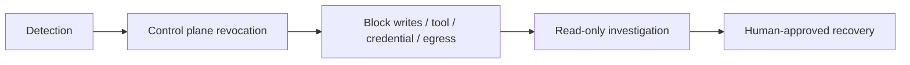

# 29 — Kill Switches, Revocation, and Safe Degradation

<!-- roadmap-status -->
> **Roadmap status: Pilot.** Some executable evidence exists; the remaining gate is listed in the Learning Hub and review plan.

## Learning objectives

Design and test controls that stop new writes, revoke a tool or credential,
disable retrieval/server access, and degrade to a secure read-only mode without
silently bypassing authorization or audit requirements.

## Scenario

Telemetry finds unexpected egress from a support agent. The operator must stop
new external effects immediately, keep enough read-only access for diagnosis,
and preserve trace evidence. A prompt instruction to “stop” cannot be the kill
switch: it fails precisely when the model or its context is compromised.

## Control matrix

| Control | Stops | Must preserve | Test |
| --- | --- | --- | --- |
| agent disable | new scheduling | incident trace | no new runs |
| tool revoke | specific side effect | other bounded work | denied call |
| credential revoke | identity use | attribution | token refresh fails |
| egress block | destination/server | local containment | destination denied |
| read-only mode | writes | authorization/audit | reads still governed |

## Practical lab

Run `python curriculum/shared/runtime_security_lab.py`. `revoke("writes")`
changes the run to `read_only`; `commit_once` then denies the next side effect
and writes a trace event. This represents the data-plane check that must happen
at execution time, not only at orchestration time. Inject an in-flight action
and define whether your actual provider can cancel it or must await a receipt.

## Evaluation and production upgrade

Measure kill-switch propagation and stop latency, writes after revocation,
affected runs, and legitimate diagnostic work retained. Production systems need
highly available revocation distribution, short credential lifetime, deny-first
failure behavior, independent egress controls, owner/on-call routing, regular
drills, and a recovery authorization workflow.

## Exercises

1. Add separate `retrieval` and `mcp-server` capabilities to the runtime.
2. Define a maximum acceptable write-stop latency and alert condition.
3. Explain why safe degradation must retain policy checks.

## References

- [NIST SP 800-61 Rev. 3](https://csrc.nist.gov/pubs/sp/800/61/r3/final)
- [OWASP Agentic Security Initiative](https://genai.owasp.org/initiatives/agentic-security-initiative/)
