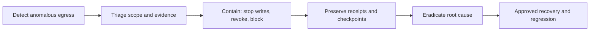

# 30 — Agent Incident Detection and Containment

## Learning objectives

Recognize an unsafe trajectory, scope affected authority and data, contain
without destroying evidence, and hand a controlled recovery to the workflow and
credential owners.

## Scenario

The support agent proposes an unusual external destination after reading a
ticket. Detection receives a trace showing principal, tenant, tool, argument
hash, source IDs, network destination, policy decision, action ID, checkpoint,
and terminal reason. Those observable records—not chain-of-thought—anchor the
investigation.

## Containment runbook

| Step | Decision | Evidence / owner |
| --- | --- | --- |
| Detect | classify policy, egress, identity, or availability event | alert + trace / security |
| Scope | affected runs, tenants, tools, credentials, destinations | correlation IDs / incident lead |
| Contain | disable agent, revoke capability/token, block egress, stop queue | revocation receipt / platform |
| Preserve | checkpoint, policy version, action/tool receipts | immutable case record / forensics |
| Recover | rotate, remediate, reauthorize, replay only uncommitted work | approved plan / service owner |

## Practical lab

Run `python labs/intermediate/03_incident_recovery.py`, then
`python curriculum/shared/runtime_security_lab.py`. The first exercises pause,
connector revocation, approval, and idempotent replay. The second makes the
write-stop data-plane decision visible. Test the bad alternative: blindly resume
after a changed policy or uncertain external action; it must remain paused.

## Evaluation and production upgrade

Measure mean time to detect and contain, writes after containment, affected-run
coverage, receipt completeness, and recovery correctness. Production response
needs access-controlled immutable evidence, synchronized clocks, predefined
revocation owners, communications procedures, credential rotation, egress
control, regular drills, and a post-incident regression suite.

## References

- [NIST SP 800-61 Rev. 3](https://csrc.nist.gov/pubs/sp/800/61/r3/final)
- [MITRE ATLAS](https://atlas.mitre.org/)
