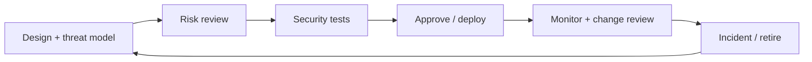

# 33 — Agent Security Governance

## Learning objectives

Maintain an actionable inventory, assign accountable control owners, classify
autonomy and risk, and require updated security evidence across design, change,
deployment, incident, and retirement.

## Governance model

Every agent record needs an ID, owner, purpose, risk, model, tools,
permissions, MCP servers, memory, data classification, autonomy, approvals,
security tests, last review, and kill-switch owner. Inventory is not paperwork:
it answers which agents can act, with what data and authority, and who can stop
them during an incident.

## Practical lab

Run `python curriculum/enterprise-agent/33-agent-security-governance/lab.py`.
It validates the minimum inventory record and rejects write autonomy without
security-test evidence or a kill-switch owner. Add an MCP server inventory field
and require a review date whenever its version changes.

## Operating controls

| Lifecycle point | Required evidence |
| --- | --- |
| Design | architecture, trust boundaries, risk owner |
| Approval | threat model, invariants, attack suite, rollback plan |
| Change | version diff, regression result, approver |
| Runtime | inventory accuracy, trace coverage, alert owner |
| Incident/retirement | containment record, recovery, credential/data disposal |

## Evaluation

Measure inventory completeness, review freshness, unowned high-risk agents,
release-gate coverage, kill-switch ownership, and post-incident regression
closure. Governance should make unsafe autonomy visible and constrainable—not
merely document a policy.

## References

- [NIST AI Risk Management Framework](https://www.nist.gov/itl/ai-risk-management-framework)
- [NIST AI Agent Standards Initiative](https://www.nist.gov/artificial-intelligence/ai-agent-standards-initiative)
