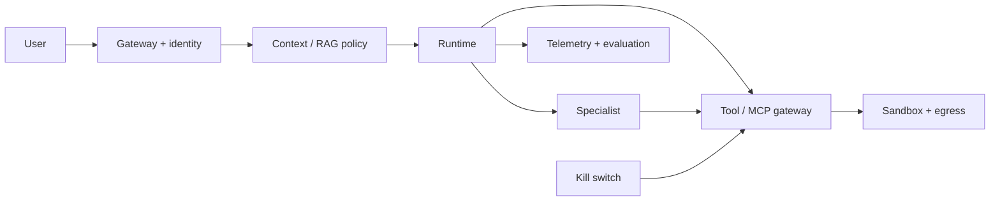

# 36 — Production Secure-Agent Capstone

<!-- roadmap-status -->
> **Roadmap status: Pilot.** Some executable evidence exists; the remaining gate is listed in the Learning Hub.

## Mission

Defend an enterprise research/support agent using RAG, scoped memory, tools,
MCP, a specialist, approval, and durable state. One input or dependency is
malicious; the deliverable is an evidence-based production decision, not a demo.

## Required architecture and attacks

Implement authorization, context and memory policy, egress/sandbox policy, MCP
and delegation policy, bound approval, telemetry, adversarial suite, release
gate, kill switch, containment, and safe recovery. Attack indirect injection,
poisoned tool output/memory, cross-tenant access, credential misuse, delegation
escalation, and a compromised MCP server; retest at least one bypass variant.

## Security dossier and gate

Record architecture, threat model, invariants, attack matrix/evaluation,
controls, telemetry, incident timeline, residual risks, and production decision.
Run `python curriculum/enterprise-agent/36-production-secure-agent-capstone/lab.py`.
It denies approval for a missing control or any severe attack success—average
quality cannot override a high-impact failure.

## Acceptance criteria

Unauthorized writes, cross-tenant access, approval bypass, and delegation
escalation are zero in the suite. Actions are attributable; revocation stops
new writes; replay avoids duplicate effects; an operator can contain and safely
recover the workflow. Every residual risk has a named owner and decision.

## References

- [NIST AI Agent Standards Initiative](https://www.nist.gov/artificial-intelligence/ai-agent-standards-initiative)
- [OWASP Agentic Security Initiative](https://genai.owasp.org/initiatives/agentic-security-initiative/)
- [MITRE ATLAS](https://atlas.mitre.org/)
