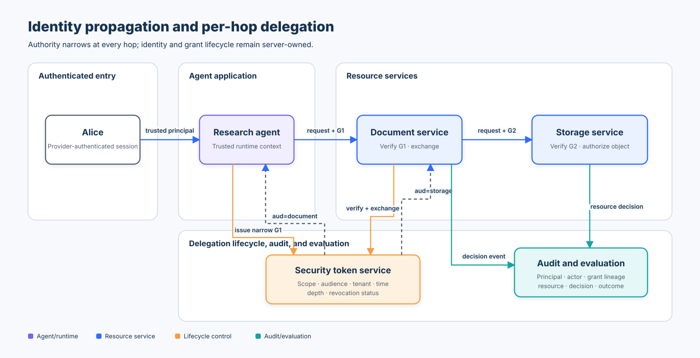

# Intermediate 01 — Identity Propagation and Delegated Authority

## Course metadata

- **Level:** Intermediate
- **Prerequisites:** Beginner 01 (tool authorization), Beginner 03 (secure research boundaries), OAuth 2.0 vocabulary, and basic Python
- **Time:** 3–4 hours
- **Format:** standards review, deterministic Python lab, credential-free Agents SDK lab, adversarial tests, and measurable evaluation
- **Central thesis:** propagate bounded identity context—not ambient authority.

## Learning objectives

By the end of this course, you can:

1. Distinguish the end-user **principal**, authenticated **workload**, current **actor**, token **audience**, and target **resource**.
2. Explain why an identifier or copied claim set is not authentication evidence.
3. Issue authority only from provider-verified identity state and authoritative entitlement data.
4. Exchange a grant at each service hop while monotonically narrowing operation, resource, audience, lifetime, tenant, and delegation depth.
5. Prevent confused-deputy attacks, bearer-token replay, identity substitution, and ambient-authority fallback.
6. Validate issuer, lifecycle, audience, tenant, actor, operation, resource, and lineage at the resource server.
7. Contain an incident by revoking a grant lineage and verify that descendants stop working.
8. Keep identity and grants out of model-controlled tool arguments when using the OpenAI Agents SDK.
9. Evaluate both security and utility: correct blocks, unsafe disclosures, valid-work blocks, compliant success, and trace completeness.

## Scenario and security outcome

Alice asks a research agent to read a document. The request crosses the research agent, document service, and storage service. Each workload has its own identity, but none of those workload identities proves that Alice may read the document.

The secure outcome is:

- the front door authenticates Alice;
- the runtime authenticates each workload independently;
- an issuer grants the research agent only Alice’s permitted operation and resource, for the document-service audience;
- the document service validates that grant and exchanges it for a narrower storage-service grant;
- storage authorizes the exact object and never falls back to its service privileges; and
- every hop records the principal, actor, grant lineage, audience, resource, and decision without logging token material.



The editable geometry and accessibility description live in [`architecture-spec.json`](architecture-spec.json).

## Threat model

| Asset or boundary | Attacker capability | Failure mode | Required control | Lab evidence |
|---|---|---|---|---|
| Front-door principal | Copy visible IDs or submit another tenant | Principal/context substitution | Accept provider-issued context and derive claims from it | copied and substituted contexts are denied |
| Workload-to-workload call | Claim an internal service name | Workload impersonation | Verify infrastructure identity before application authorization | copied workload objects are denied |
| Delegation issuer | Request authority the user lacks | Privilege expansion | Resolve authoritative entitlements and enforce subset checks | operation/resource expansion tests |
| Downstream resource server | Replay a valid token at another service | Audience confusion | Per-hop token exchange and exact audience validation | document grant is rejected by storage |
| Intermediate service | Ask for broader or longer authority | Scope/time expansion | Monotonic operation, resource, tenant, and expiry attenuation | exchange tests and expiry clamp |
| Long service chain | Re-delegate indefinitely | Authority-chain sprawl | Maximum delegation depth | third-hop exchange is denied |
| Incident response | Continue using descendants after parent compromise | Incomplete containment | Stateful lineage revocation or equivalent introspection policy | parent and child become unusable |
| Agent tool call | Put identity, tenant, audience, or grant in model arguments | Model-selected authority | Server-owned typed runtime context; minimal strict schema | SDK schema exposes only `document_id` |
| Observability | Log access tokens or omit actors | Credential exposure or unattributable action | Log identifiers and decisions, never token material | trace-completeness evaluation |

The lab uses canonical Python objects as a deterministic seam for already-authenticated middleware. That is deliberately not a production authentication mechanism.

## Identity model: keep the nouns separate

| Term | Question answered | Lab example | Must come from |
|---|---|---|---|
| Principal / subject | On whose behalf? | `alice` | authenticated application session |
| Workload identity | Which software instance is calling? | `document-service` | mTLS, SPIFFE/SPIRE, or cloud workload identity |
| Delegate / actor | Which workload is exercising delegated authority? | `research-agent` then `document-service` | issuer-bound grant plus authenticated caller |
| Audience / resource server | Which service may accept this credential? | `document-service`, then `storage-service` | issuer policy and exact resource indicator |
| Tenant | Which isolation domain applies? | `acme` | verified identity and authoritative resource metadata |
| Operation and resource | What precise effect is permitted? | `read` on `doc-101` | authoritative policy, narrowed at issuance and exchange |

An identifier such as `caller_id="document-service"` is just data. A reconstructed `AuthenticatedWorkload` with identical fields is still caller-created data. Authentication evidence must be established outside the model and before the authorization decision.

## Protocol anatomy and state of practice

RFC 8693 defines OAuth token exchange, including a subject token and an optional actor token. Its `act` claim represents the current actor and may retain prior actors as a nested history. RFC 8707 lets a client identify the protected resource and supports audience-restricted access tokens. RFC 9700 recommends audience-restricted and sender-constrained access tokens to reduce replay; RFC 8725 defines secure JWT validation practices.

This lab is an instructional control model, not a complete implementation of those protocols. In particular, RFC 8693 does **not** automatically establish revocation linkage between exchanged tokens. The lab deliberately uses a stateful issuer and descendant lookup to teach one deployable containment strategy. A production design may instead use short lifetimes, token introspection, continuous access evaluation, sender constraints, or provider-specific revocation controls.

| Standard, tool, or SDK | Relevant capability | Secure use here | Boundary or caveat |
|---|---|---|---|
| OAuth 2.0 Token Exchange (RFC 8693) | Exchange subject/actor credentials for a new token | Mint a separate grant for every resource-server hop | Protocol support and actor semantics vary by authorization server |
| OAuth Resource Indicators (RFC 8707) | Name the intended protected resource | Use one exact audience per downstream grant | Multi-audience tokens increase the trust and replay surface |
| OAuth 2.0 Security BCP (RFC 9700) | Current OAuth threat mitigations | Combine audience restriction with sender-constrained credentials | Bearer tokens remain replayable if stolen |
| JWT BCP (RFC 8725) | Algorithm, issuer, audience, and claim validation | Use mutually exclusive validation rules for each token class | Parsing a signed JWT is not sufficient authorization |
| Microsoft Entra OBO | Exchange a user token for a downstream API token | Map explicit downstream APIs and scopes | Never pass a middle-tier token to an unintended API |
| Google Workload Identity Federation / STS | Exchange external workload credentials | Give workloads short-lived provider credentials | Workload federation does not convey end-user authorization by itself |
| AWS STS `SourceIdentity` | Persist original identity attribution across role sessions | Improve CloudTrail attribution | Attribution is not a replacement for resource authorization |
| SPIFFE Workload API | Deliver X.509/JWT workload identities after local attestation | Authenticate the calling workload independently of the user | A workload SVID proves workload identity, not user entitlement |
| OpenAI Agents SDK | Typed runtime context and strict function tools | Keep principal and application services in `RunContextWrapper`; expose only `document_id` | The SDK owns the tool loop; application code still owns authentication and authorization |

## Secure issuance and exchange invariants

### 1. Issuance trust boundary

The issuer accepts provider-verified principal and workload contexts, derives their IDs, resolves current authority from registries, and then checks:

```text
requested operations ⊆ principal operations
requested resources  ⊆ principal resources
principal tenant = delegate tenant = audience tenant
TTL > 0
```

The client never submits a trusted principal ID, tenant, actor, issuer, or grant ID as independent authorization evidence.

### 2. Per-hop exchange

The document service cannot replay a grant intended for itself at storage. It authenticates as the current workload, presents the parent grant to the issuer, and requests a child grant whose:

```text
principal(child) = principal(parent)
tenant(child) = tenant(parent)
operations(child) ⊆ operations(parent)
resources(child)  ⊆ resources(parent)
expires(child) ≤ expires(parent)
depth(child) = depth(parent) + 1 ≤ configured maximum
audience(child) = next resource server
```

### 3. Resource-server validation

Before reading the object, the resource server validates:

- issuer-owned authenticity or introspection result;
- active lineage and revocation status;
- `issued_at ≤ now < expires_at`;
- authenticated caller equals the grant’s delegate;
- exact expected audience;
- resource metadata tenant equals grant tenant;
- requested operation and resource are within scope; and
- the request uses the delegated endpoint, with no service-mode switch or ambient fallback.

For signed JWT deployments, also pin allowed algorithms, verify the correct key source, reject token-type confusion, validate issuer and audience, and apply different validation rules to token classes that are not interchangeable.

### 4. Sender constraint and token handling

Audience restriction limits where a credential should be accepted. Sender constraint limits who can present it. Production systems should evaluate mTLS- or DPoP-bound access tokens where supported, keep tokens out of logs and model context, use secure transport, and store only the minimum credential material for the minimum time.

## Confused deputy and “no fallback”

The deliberately unsafe baseline accepts a trusted service caller and reads through ambient authority. It demonstrates the leak, but is marked `DEMO-ONLY` and is not the secure application path.

The secure delegated endpoint and the internal service-job endpoint are separate methods. Request data cannot select a `mode="service"`. If issuance, verification, exchange, or storage authorization fails, the delegated path ends with a denial; it never retries using service authority.

## Lifecycle, revocation, and recovery

The lab’s stateful token service records immutable grants plus mutable lifecycle state. `revoke_lineage(grant_id, reason)` revokes the selected grant and every issued descendant. Verification and further exchange fail after revocation.

A production runbook should:

1. identify the principal, current actor, root grant/session, descendants, affected resources, and time window;
2. revoke or disable the smallest effective lineage and associated workload/session credentials;
3. terminate in-flight work and deny retries under the old context;
4. preserve audit evidence without preserving reusable secrets;
5. re-authenticate the principal and workloads;
6. re-authorize against current policy and resource state; and
7. issue a new lineage with new identifiers—never silently resume the revoked chain.

Fail closed if revocation or introspection state is unavailable. Document the resulting availability trade-off and alert on it.

## Labs

### Lab A — deterministic delegation controls

Run the core simulation:

```bash
python3 curriculum/intermediate/01-identity-propagation/01_identity_propagation.py
```

Trace the legitimate Alice request, then inspect the denial reasons for forged contexts, audience mismatch, tenant mismatch, operation/resource expansion, expiry, missing delegation, and caller-selected service mode.

### Lab B — lineage containment

In the notebook, issue a parent grant, exchange it for a child, revoke the parent lineage, and assert that:

- the revocation count includes both grants;
- parent verification fails;
- child verification fails; and
- a revoked parent cannot be exchanged again.

Then configure a depth of two and prove that a third delegation hop is rejected.

### Lab C — credential-free OpenAI Agents SDK boundary

```bash
python3 curriculum/intermediate/01-identity-propagation/01_identity_propagation_sdk.py
```

The companion constructs `Agent[SDKRuntime]` and one `@function_tool(strict_mode=True)`. The generated schema exposes only a bounded `document_id`. Principal, tenant, workload, audience, grants, scopes, and correlation IDs remain in server-created runtime state. Direct dispatch exercises the real application boundary without a model call or API key.

### Lab D — evaluation

`evaluate_security_controls()` executes labelled allow and deny cases and returns:

- `compliant_success_rate` — valid authorized work that succeeds;
- `correct_block_rate` — labelled attacks or policy violations that are blocked;
- `unsafe_disclosure_count` — denied cases that returned protected content;
- `valid_work_block_count` — authorized cases incorrectly blocked; and
- `trace_completeness_rate` — cases with attributable decision telemetry.

Security and utility are both release criteria. A system that blocks everything has zero unsafe disclosures but is not production-ready.

## Notebook

Launch the guided lab from the repository root or from the course directory:

```bash
jupyter notebook curriculum/intermediate/01-identity-propagation/01_identity_propagation.ipynb
```

The setup cell discovers the repository root instead of assuming a notebook working directory. Cells include assertions so a failed security expectation stops execution.

## Validation

```bash
pytest -q tests/test_identity_propagation.py tests/test_identity_propagation_sdk.py
```

The focused suite covers authentication substitution, grant forgery, confused-deputy behavior, no-fallback routing, service-job isolation, monotonic exchange, exact expiry, maximum depth, lineage revocation, audit attribution, SDK schema minimization, safe dispatch, and evaluation metrics.

## Review checkpoint

A model proposes a tool call containing `document_id`, `principal_id`, `tenant`, `audience`, and `scope`. Which fields may the tool schema accept?

Only `document_id`. The trusted application must derive the principal, tenant, workload, audience, scope, delegation, and correlation ID from authenticated server-owned context and current policy.

## References

- [RFC 8693 — OAuth 2.0 Token Exchange](https://www.rfc-editor.org/rfc/rfc8693.html)
- [RFC 8707 — Resource Indicators for OAuth 2.0](https://www.rfc-editor.org/rfc/rfc8707.html)
- [RFC 9700 — Best Current Practice for OAuth 2.0 Security](https://www.rfc-editor.org/rfc/rfc9700.html)
- [RFC 8725 — JSON Web Token Best Current Practices](https://www.rfc-editor.org/rfc/rfc8725.html)
- [Microsoft identity platform authentication flows and OBO](https://learn.microsoft.com/en-us/entra/identity-platform/msal-authentication-flows)
- [Google Cloud Workload Identity Federation](https://cloud.google.com/iam/docs/workload-identity-federation)
- [AWS IAM — Monitor and control actions with source identity](https://docs.aws.amazon.com/IAM/latest/UserGuide/id_credentials_temp_control-access_monitor.html)
- [SPIFFE Workload API](https://spiffe.io/docs/latest/spiffe-specs/spiffe_workload_api/)
- [OpenAI Agents SDK guide](https://developers.openai.com/api/docs/guides/agents/sdk)

Previous: [Beginner 03 — Secure Research Agent](../../beginner/03-secure-research-agent/README.md).

Next: [Intermediate 02 — MCP Gateway](../02-mcp-gateway/README.md).

Focused continuation: [Roadmap I03 — Identity and Delegated Authority](../../roadmap/intermediate/03-agent-identity-and-delegated-authority/README.md).
