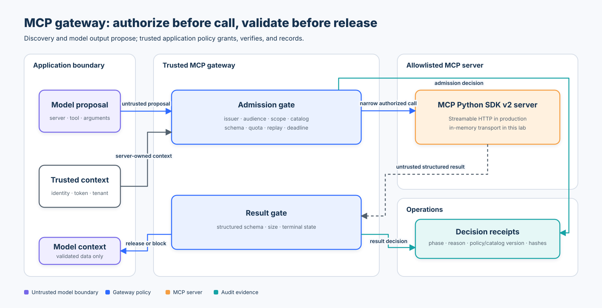

# Intermediate 02 — MCP Gateway Security

## Course metadata

- **Level:** Intermediate
- **Prerequisite:** [Intermediate 01 — Identity Propagation](../01-identity-propagation/README.md)
- **Time:** 3–4 hours
- **Format:** protocol review, deterministic policy lab, credential-free MCP Python SDK v2 lab, adversarial tests, and evaluation
- **Central thesis:** discovery and model output may propose an MCP call; only trusted application policy may authorize it, and tool results must be validated again before model exposure.

## Learning objectives

By the end of this course, you can:

1. distinguish MCP discovery, server self-description, authentication, authorization, and application policy;
2. bind every invocation to trusted subject, workload, tenant, issuer, audience, scope, catalog version, deadline, and quota state;
3. explain why tool names, descriptions, annotations, schemas, server names, and state handles are not authority;
4. prevent token audience confusion, token passthrough, identity substitution, stale-catalog use, replay, and confused-deputy behavior;
5. reserve quotas and operation IDs atomically before execution;
6. validate structured tool results, size, error state, and release policy before adding data to model context;
7. use the current MCP Python SDK v2 with an in-memory transport and the `2026-07-28` protocol revision;
8. separate protocol errors, tool execution errors, policy denials, timeouts, and result blocks; and
9. measure valid-call success, attack blocking, forbidden outcomes, false blocks, reason distribution, and trace completeness.

## Architecture and trust boundaries



The editable geometry and accessibility description live in [`architecture-spec.json`](architecture-spec.json).

The gateway surrounds—not replaces—the MCP client. It owns two enforcement points:

1. **Admission gate:** before any protocol call, validate application identity, access-token claims, server registration, catalog freshness, exact tool contract, argument values, quotas, operation replay, and deadline.
2. **Result gate:** after the server responds, treat the result as untrusted data; validate error state, structured schema, allowed fields, and size before release.

The inbound access token is verified by the gateway and is never handed to the synthetic downstream tool. Production gateways acquire or inject only the credential intended for the selected resource server or upstream API.

## Threat model

| Boundary | Attacker capability | Failure mode | Required control | Executable evidence |
|---|---|---|---|---|
| Tool discovery | Advertise a familiar or high-risk tool | Discovery becomes authority | Application-owned server/tool registry | unknown and disabled servers are denied |
| Server identity | Self-report a trusted-looking `serverInfo.name` | Server-name spoofing | Authenticate endpoint/workload; key policy by trusted registration | SDK identity is observed but not used as authority |
| Access token | Replay a stolen, revoked, wrong-issuer, or wrong-audience token | Cross-resource access | Validate issuer, lifetime, revocation, subject, tenant, and exact audience | negative token tests |
| Model arguments | Add `admin`, identity, token, or oversized data | Schema or privilege injection | Exact allowlist plus business limits | schema and length denials |
| Catalog cache | Use an older tool contract after policy changed | Time-of-check/time-of-use mismatch | Bind calls to current catalog version and TTL | stale/expired catalog tests |
| Consequential call | Retry or reuse a request identifier | Duplicate side effect | Require operation ID; atomically reserve and reject replay/collision | replay and collision tests |
| Quota | Race concurrent requests | Limit bypass | Lock or transactional counter around decision and reservation | eight-way concurrency test admits one |
| Tool output | Return extra instruction-like fields or oversized content | Result poisoning or resource exhaustion | Structured output contract and size limit before model exposure | result-schema and result-size blocks |
| Dependency | Fail or time out after admission | Fabricated success or unsafe retry | Explicit terminal error; reconcile before retry | execution failure returns no output |
| Audit | Leak token or omit policy state | Credential exposure or weak attribution | Fingerprint token ID; hash proposal; record phase/reason/versions | privacy and trace tests |

The lab uses synthetic dataclasses and an in-memory server. It proves control behavior, not network, OAuth, or infrastructure security.

## Current MCP protocol and tooling

The current final MCP revision is `2026-07-28`. It introduces a stateless protocol core: modern clients use `server/discover` rather than the earlier initialization session, and every request carries its protocol context. For Streamable HTTP, standardized method/name headers improve routing and policy enforcement. List results now carry cache guidance, which makes explicit catalog freshness and cache scope important.

| Standard or tool | Relevant capability | Secure use in this course | Boundary or caveat |
|---|---|---|---|
| MCP specification `2026-07-28` | Stateless core, discovery, cache hints, JSON Schema 2020-12, structured results | Bind cached discovery to trusted policy version and validate both request and result | Protocol capability does not grant application authority |
| MCP authorization specification | OAuth resource server model, protected-resource metadata, issuer checks, step-up scopes, RFC 8707 resource indicators | Require a token intended for the exact MCP resource; bound step-up retries | HTTP authorization is optional; stdio uses environment-delivered credentials instead |
| MCP Python SDK v2 | `MCPServer`, first-class `Client`, in-memory/stdio/Streamable HTTP transports | Exercise the real protocol layer without a network or credential | SDK validation does not replace tenant, business, quota, approval, or release policy |
| MCP Inspector | Interactive server/tool inspection | Development-time visibility into schemas and results | Inspection is not trust verification or production approval |
| MCP Registry | Discover server metadata | Candidate inventory and dependency governance input | Registry presence and descriptions are not endpoint authentication or authorization |
| OAuth RFC 8707 / RFC 9728 / RFC 9207 | Resource indicators, protected-resource metadata, issuer identification | Prevent audience and authorization-server mix-up | Requires correct identity-provider and client implementation |
| OpenTelemetry / W3C Trace Context | Distributed trace correlation | Link gateway and MCP-server spans with privacy-aware IDs | Traces must not contain bearer tokens, sensitive arguments, or hidden reasoning |

The project pins `mcp>=2.2,<3` because v2 is the current stable Python SDK line. Older `FastMCP`/`ClientSession` tutorials target v1 APIs; the lab intentionally uses `MCPServer` and `Client`.

## Discovery is metadata, not authority

`tools/list` helps a client understand names, descriptions, annotations, and schemas. Those values can improve UX and protocol validation, but they do not establish:

- that the endpoint is the organization-approved server;
- that the caller may use a tool;
- that a descriptive “read-only” annotation is true;
- that a schema-valid request is safe under current business policy; or
- that the returned content is safe to place in model context.

The `2026-07-28` tool specification explicitly says annotations are untrusted unless they come from trusted servers. Tool names are unique only within a server, and self-reported server names are not guaranteed unique. Aggregate clients should disambiguate by a trusted server identifier, not by display names.

## Admission policy

The lab evaluates these controls in order:

```text
authenticated application identity
→ trusted issuer and active token
→ subject/tenant binding
→ exact gateway audience
→ issued-at, expiry, and request deadline
→ active trusted server registration
→ exact catalog version and unexpired catalog
→ registered tool and required application scope
→ exact argument keys, non-empty values, and length bounds
→ operation ID for side effects
→ atomic replay and quota reservation
→ execute with a narrow gateway-created capability
```

This order avoids using discovery as authentication and prevents a denied call from reaching the server. The gateway does not log the token; it stores only a short fingerprint of the synthetic token ID.

### Catalog freshness

Modern MCP list results can advertise cache lifetime and scope. A production gateway should combine those hints with stricter local policy, dependency review, and incident disablement. A cached tool definition cannot override an application-owned deny or revive a disabled server.

### Replay and uncertain outcomes

Consequential tools require a stable logical operation ID. This lab rejects reused IDs and detects when the same ID is attached to changed arguments. In production, rejecting a retry is only part of the solution: if the first outcome is unknown, reconcile with the provider before reissuing the effect. Do not convert a network error into a fresh operation ID and hope for the best.

### Atomic quota reservation

The course gateway holds a lock across policy evaluation, operation reservation, and quota increment. A distributed deployment needs a transactional store or equivalent atomic primitive; per-process dictionaries do not enforce a fleet-wide limit.

## Result validation and error semantics

MCP `structuredContent` is server-produced data. When an `outputSchema` exists, the specification requires conforming server output and recommends client validation. The course adds an application-owned result contract because the application may need stricter fields and size limits than discovery advertises.

The gateway distinguishes:

- `deny` — policy rejected the proposal before execution;
- `allow` — admission and result release both succeeded;
- `block` — execution returned data, but the result failed release policy; and
- `error` — dependency failure or timeout, with no fabricated result.

Instruction-like strings inside an allowed result remain untrusted content. Schema validation contains structure; it does not make the content authoritative or safe to obey.

## Labs

### Lab A — deterministic gateway policy

```bash
python3 curriculum/intermediate/02-mcp-gateway/02_mcp_gateway.py
```

The demo preserves the original safe call and boundary attacks, then adds replay and result-poisoning cases. Inspect the paired admission/result receipts and confirm that raw tokens and tool output are not recorded.

### Lab B — MCP Python SDK v2

Install the repository's learner dependencies once with `pip install -e ".[learner]"`, then run:

```bash
python3 curriculum/intermediate/02-mcp-gateway/02_mcp_gateway_sdk.py
```

The companion creates a real `MCPServer`, connects with the v2 `Client` over the official in-memory transport, negotiates protocol `2026-07-28`, lists the tool, calls it, and validates `structured_content`. The sequence is:

```text
gateway.authorize → Client.call_tool → gateway.finalize
```

It requires no network service, model, API key, or live OAuth credential.

### Lab C — concurrency and lifecycle failures

Use the notebook to inject:

- wrong issuer, audience, tenant, or lifetime;
- stale and expired catalog state;
- missing, replayed, and colliding operation IDs;
- concurrent quota attempts;
- dependency errors and timeouts; and
- extra or oversized result fields.

### Lab D — evaluation

`evaluate_gateway_controls()` executes labelled valid and adversarial cases. Its metrics have explicit populations:

- `valid_success_rate = successful valid cases / all valid cases`;
- `attack_block_rate = non-allowed attack cases / all attack cases`;
- `forbidden_outcome_count` counts attack cases that released output;
- `valid_call_block_count` counts valid cases that failed; and
- `trace_completeness_rate` measures labelled cases with complete policy receipts.

A gateway that denies every call may have no forbidden outcomes but fails the valid-success requirement.

## Notebook and validation

```bash
jupyter notebook curriculum/intermediate/02-mcp-gateway/02_mcp_gateway.ipynb
pytest -q tests/test_mcp_gateway.py
```

The notebook imports the same reusable modules as the tests, uses assertions instead of printed expectations, and executes without credentials.

## Production checklist

- Authenticate and authorize at the MCP resource server and again at each upstream API.
- Use Streamable HTTP for new remote deployments; do not start new deployments on legacy SSE.
- Validate protected-resource and authorization-server metadata, issuer, redirect URI, PKCE/state, audience/resource, scope, time, and revocation.
- Keep credentials issuer-bound and resource-bound; never reuse a client token as an upstream token.
- Authenticate endpoints/workloads independently of discovery and `serverInfo`.
- Validate `MCP-Protocol-Version`, `Mcp-Method`, and `Mcp-Name` consistency at supported HTTP gateways.
- Bound JSON Schema depth and validation time; do not auto-fetch arbitrary external `$ref` URIs.
- Treat `x-mcp-header` as an explicit data-exposure decision; never mirror secrets or sensitive PII.
- Add user confirmation or single-use approval receipts for consequential operations.
- Enforce deadlines, cancellation, response/body limits, concurrency, egress, and durable fleet-wide quotas.
- Treat state handles as names, not capabilities; reauthorize them on every call and expire them.
- Preserve minimal decision telemetry and distributed trace correlation without tokens or sensitive content.
- Inventory versions and dependencies, test protocol migrations, and maintain server disable/incident runbooks.

## Checkpoint

A trusted MCP server advertises a schema-valid `delete_customer` tool and marks it “safe.” The caller has a token for the server but lacks the application’s delete permission. What should happen?

The gateway denies before execution and records an admission receipt. Trusted discovery can describe a tool, but only current application policy can authorize the exact subject, tenant, operation, target, arguments, approval state, and lifecycle.

## References

- [MCP specification `2026-07-28`](https://modelcontextprotocol.io/specification/2026-07-28)
- [MCP authorization](https://modelcontextprotocol.io/specification/2026-07-28/basic/authorization)
- [MCP tools and structured results](https://modelcontextprotocol.io/specification/2026-07-28/server/tools)
- [MCP Python SDK v2](https://py.sdk.modelcontextprotocol.io/)
- [MCP Python SDK source and version guidance](https://github.com/modelcontextprotocol/python-sdk)
- [MCP Tasks extension](https://tasks.extensions.modelcontextprotocol.io/specification/draft/tasks)
- [RFC 8707 — Resource Indicators for OAuth 2.0](https://www.rfc-editor.org/rfc/rfc8707)
- [RFC 9728 — OAuth 2.0 Protected Resource Metadata](https://www.rfc-editor.org/rfc/rfc9728)
- [RFC 9207 — OAuth 2.0 Authorization Server Issuer Identification](https://www.rfc-editor.org/rfc/rfc9207)
- [OWASP MCP Security Cheat Sheet](https://cheatsheetseries.owasp.org/cheatsheets/MCP_Security_Cheat_Sheet.html)

Previous: [Intermediate 01 — Identity Propagation](../01-identity-propagation/README.md).

Next: [Intermediate 03 — Incident Response and Recovery](../03-incident-recovery/README.md).

Focused continuation: [Roadmap I09 — MCP Security](../../roadmap/intermediate/09-mcp-security/README.md).
