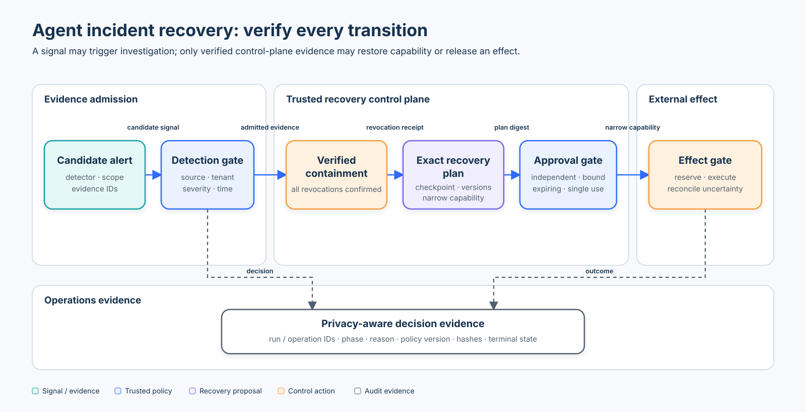

# Intermediate 03 — Agent Incident Response and Recovery

## Course metadata

- **Level:** Intermediate
- **Prerequisite:** [Intermediate 02 — MCP Gateway Security](../02-mcp-gateway/README.md)
- **Time:** 3–4 hours
- **Format:** current-practice review, deterministic lifecycle lab, OpenTelemetry SDK lab, adversarial notebook, evaluation, and exercises
- **Central thesis:** a signal may trigger investigation, but only trusted application and control-plane evidence may contain a run, restore a narrowly scoped capability, or release an external effect.

## Learning objectives

By the end of this course, you can:

1. map agent incidents to the NIST CSF 2.0 Detect, Respond, Recover, and Improve lifecycle;
2. distinguish a candidate alert from admitted incident evidence;
3. require authenticated, tenant-bound responders and verified revocation receipts before declaring containment;
4. bind a recovery proposal to the exact run, tenant, checkpoint digest, policy and credential versions, operation, target, and capability;
5. consume an independent, expiring, single-use approval receipt atomically;
6. explain why local deduplication does not guarantee exactly-once external effects;
7. preserve unknown outcomes and reconcile them before retrying;
8. create privacy-aware OpenTelemetry spans for observable lifecycle decisions; and
9. evaluate valid recovery, attack blocking, incomplete containment, forbidden effects, duplicate effects, and trace completeness with explicit populations.

## Architecture and trust boundaries



The editable layout and accessibility description live in [`architecture-spec.json`](architecture-spec.json).

The model may classify an observation, summarize evidence, or propose a recovery plan. It does not authenticate a detector, assign responder roles, prove revocation, approve its own plan, restore credentials, decide that an external effect committed, or close the incident. Those are deterministic control-plane decisions.

## Current incident-response model

[NIST SP 800-61 Rev. 3](https://csrc.nist.gov/pubs/sp/800/61/r3/final), finalized in April 2025, supersedes the withdrawn Rev. 2 guide and treats incident response as part of organization-wide cybersecurity risk management. Its operational lifecycle is **Detect → Respond → Recover**, supported by Govern, Identify, Protect, and continuous Improvement.

For AI systems, [NIST AI RMF Manage 4](https://airc.nist.gov/airmf-resources/airmf/5-sec-core/) adds post-deployment monitoring, incident response, recovery, communication, change management, and documented improvement. Agent incidents therefore require ordinary security response plus agent-specific scoping:

- run, conversation, principal, workload, tenant, model, tool, and policy versions;
- delegated credentials and capabilities;
- retrieved evidence, memory, checkpoints, queues, and pending effects;
- tool arguments, result provenance, egress destinations, and approval state; and
- people, providers, and affected parties that own response and recovery decisions.

## Scenario and threat model

A support agent proposes an unexpected external destination after reading a ticket. A trusted egress monitor emits a high-severity signal with references to an application trace and policy decision. The run also has a pending ticket update and a durable checkpoint.

| Boundary | Attacker or failure capability | Unsafe outcome | Required control | Executable evidence |
|---|---|---|---|---|
| Detection | Put “critical incident” in model or tool text | Untrusted text changes lifecycle state | Trusted detector registry, run/tenant scope, severity, time, evidence IDs | untrusted and cross-tenant signals are denied |
| Containment | One of several revocations fails | Run is labelled contained while authority remains | Verify exact requested/confirmed/failed sets | partial revocation keeps phase `detected` |
| Responder identity | Use an `operator:`-looking string | Persona becomes authority | Authenticated `ActorContext` with trusted tenant and role | wrong role/tenant is denied |
| Checkpoint | Swap tenant, state, or version | Stale or foreign state resumes | Bind run, tenant, digest, policy, credential, and creation time | tampered checkpoint is denied |
| Recovery proposal | Change action, target, or capability after review | Approval is reused for a different effect | Canonical plan digest and exact capability subset | altered-plan approval is denied |
| Approval | Self-approve, replay, or use an expired receipt | Unauthorized capability restoration | Independent role, issuer, binding, expiry, atomic consumption | self, stale, altered, and replayed approvals fail |
| External effect | Timeout after provider commit | Retry duplicates a change | Stable operation ID, per-attempt ID, atomic reservation, provider reconciliation | unknown outcome blocks retry |
| Concurrency | Multiple workers race the same effect | Duplicate provider calls | Atomic operation reservation | eight concurrent attempts call provider once |
| Evidence | Edit chronology or leak payloads | Unreliable audit or privacy breach | Hash-linked minimal events plus protected production storage | mutation breaks verification; sensitive bodies are absent |

The lab’s dataclasses represent already verified control-plane records. They are not signatures, tokens, an identity provider, a durable database, or proof that an external service performed a change.

## Lifecycle mechanics

### 1. Admit evidence, not prose

`DetectionSignal` carries a stable signal ID, run and tenant scope, configured detector ID, severity, evidence IDs, and observation time. The detector ID comes from trusted integration state. A model-generated label or a tool result cannot add itself to `trusted_detectors`.

The lab records references such as `trace-7`; it does not copy prompts, retrieved documents, credentials, or chain-of-thought into the incident chronology.

### 2. Verify containment

Containment is an outcome, not a command. `RevocationReceipt` distinguishes:

- requested capabilities;
- confirmed revocations; and
- failed revocations.

The phase becomes `contained` only when the issuer is trusted, scope and responder match, the responder has the application-owned `incident-responder` role, and every requested revocation is confirmed. A partial result remains `detected` so operations can escalate or retry the control-plane action without claiming success.

### 3. Bind the recovery plan

The plan binds all security-relevant fields:

```text
run + tenant + checkpoint ID/digest
+ policy version + credential version
+ stable operation ID + action + target
+ exact capability subset + requester + creation time
```

Changing any bound field changes `recovery_plan_digest(plan)`. The lab restores `ticket:write` while deliberately leaving `network:external` revoked.

### 4. Require independent, single-use approval

`ApprovalReceipt` contains an approval ID, plan digest, run, tenant, approver, verified roles, policy version, issuer, issuance, and expiry. Recovery checks these fields against current trusted state and atomically records consumption.

`issue_approval()` is a synthetic adapter fixture. In production, an approval service must authenticate the approver, enforce role and separation-of-duty policy, protect receipt integrity, and expose durable single-use state. Constructing a Python dataclass is not authorization.

### 5. Preserve uncertain effects

A local committed-ID set is sometimes described as “exactly once.” That is too strong for a distributed external effect. A worker can call a provider successfully and lose the response before recording completion.

The improved lab separates:

- **operation ID:** stable across every attempt at the same logical effect;
- **attempt ID:** unique for one execution attempt;
- **reserved:** another worker may not start the same operation;
- **confirmed:** the provider supplied a durable reference;
- **unknown:** the effect may have committed, so retry is blocked; and
- **failed:** a known terminal failure.

After an unknown outcome, query the provider by operation/idempotency identity. `reconcile_effect()` accepts only a confirmed or failed result from an authorized responder path. Inventing a new operation ID is not recovery; it creates a second logical effect.

Durable workflow engines may report an activity completion once while executing the activity more than once. Provider-side idempotency and reconciliation still matter.

## State of the art and tool choices

| Standard, tool, or SDK | Useful role | Correct use here | Important caveat |
|---|---|---|---|
| NIST SP 800-61 Rev. 3 + CSF 2.0 | Organization-wide Detect/Respond/Recover/Improve outcomes | Frame the lifecycle, owners, communications, exercises, and improvement | It is a risk-management profile, not an agent runtime implementation |
| NIST AI RMF / GenAI Profile | AI lifecycle monitoring, risk treatment, incident communication and recovery | Connect security response to model, data, human, and affected-party risks | AI RMF 1.0 is being revised; pin the version used by policy |
| OpenTelemetry Python SDK 1.44 | Traces, metrics, logs, context, exporters | Emit bounded spans for decisions, reasons, phases, IDs, and terminal outcomes | GenAI semantic conventions are evolving; content attributes can contain sensitive data |
| OPA/Rego or Cedar | Externalized deterministic authorization | Evaluate responder, tenant, capability, action, target, and context policy | A policy engine still needs authenticated inputs, lifecycle state, and protected decision logs |
| CloudEvents 1.0 | Portable event envelope and SDKs | Normalize signal/event metadata across producers and queues | A valid envelope does not prove source trust, evidence integrity, or authorization |
| Temporal and similar durable workflow engines | Durable state, timers, retries, visibility, and replay | Orchestrate containment and recovery with bounded retry policies | Activities may execute more than once; business effects must be idempotent |
| SIEM/SOAR platforms | Correlation, investigation, case management, automation | Aggregate alerts, evidence references, ownership, and playbook steps | Automation must not turn an alert into unrestricted response authority |
| Provider idempotency APIs | Deduplicate non-idempotent external calls | Reuse one stable operation key and reconcile unknown results | Semantics, retention, payload binding, and lookup support differ by provider |

This course implements lifecycle invariants in plain Python and uses OpenTelemetry as the practical SDK. It intentionally does not require a SIEM, SOAR, workflow cluster, policy server, identity provider, or external API.

## Labs

Install the learner dependencies once:

```bash
pip install -e ".[learner]"
```

### Lab A — deterministic incident lifecycle

```bash
python3 curriculum/intermediate/03-incident-recovery/03_incident_recovery.py
```

Trace the valid scenario from admitted signal through confirmed provider effect. Then inspect the blocked duplicate and the still-revoked egress capability.

### Lab B — OpenTelemetry SDK

```bash
python3 curriculum/intermediate/03-incident-recovery/03_incident_recovery_otel.py
```

The companion imports the same reusable lifecycle module, emits six spans to the official in-memory exporter, and prints bounded attributes. Its `incident.*` attributes are course-specific rather than claimed OpenTelemetry semantic conventions. It uses no collector, network service, API key, model, or live incident data.

### Lab C — adversarial notebook

```bash
jupyter notebook curriculum/intermediate/03-incident-recovery/03_incident_recovery.ipynb
```

The notebook exercises:

- untrusted detection and incomplete containment;
- checkpoint and plan binding;
- self, altered, expired, and replayed approvals;
- unknown effect outcomes and reconciliation;
- concurrent operation reservation;
- event-chain tampering; and
- OpenTelemetry content minimization.

### Lab D — exact evaluation

`evaluate_incident_controls()` uses labelled valid and adversarial scenarios. Its metrics mean:

- `valid_recovery_rate = valid scenarios that reach a confirmed effect / all valid scenarios`;
- `attack_block_rate = adversarial scenarios that remain non-authoritative / all adversarial scenarios`;
- `containment_failure_count` counts incomplete revocation outcomes;
- `forbidden_effect_count` counts effects executed when policy required a block;
- `duplicate_effect_count` counts duplicate provider effects, not blocked duplicate attempts; and
- `trace_completeness_rate` measures scenarios whose event chain contains the expected structured fields and verifies cryptographically.

A system that blocks every recovery has no forbidden effects but fails valid recovery. A system that blocks a duplicate attempt has prevented a violation; it has not experienced a duplicate effect.

## Production replacement map

| Teaching component | Production replacement |
|---|---|
| Frozen `ActorContext` | authenticated workforce/workload identity and policy-derived roles |
| Trusted detector set | authenticated telemetry pipeline, signed integration identity, and detector governance |
| In-memory revocation receipt | connector/credential/egress control APIs with durable confirmation and propagation checks |
| Local checkpoint digest | encrypted versioned state, integrity metadata, retention, ownership, and restore authorization |
| Python approval receipt | protected approval service with authenticated approver, policy evaluation, expiry, signature, and atomic consumption |
| Local lock and effect dictionary | transactional operation store or durable workflow state with concurrency control |
| Synthetic provider result | provider idempotency key, operation-status lookup, durable reference, and reconciliation runbook |
| Python hash chain | append-only access-controlled evidence service, clock assurance, retention, export, and independent integrity protection |
| In-memory OpenTelemetry exporter | authenticated OTLP pipeline, redaction processors, sampling policy, access control, and retention |

## Incident runbook and ownership

| Step | Decision | Minimum evidence | Accountable owner |
|---|---|---|---|
| Detect | Is this event admitted as an incident? | detector identity, scope, severity, evidence IDs, time | security monitoring |
| Analyze | Which runs, tenants, identities, tools, data, and effects are affected? | correlated traces, decisions, checkpoints, provider records | incident lead |
| Contain | Which capabilities, credentials, queues, and routes must stop? | verified revocation results and propagation | platform/control owners |
| Preserve | What evidence is needed and who may access it? | integrity, provenance, retention, legal/privacy handling | forensics/privacy/legal |
| Eradicate | What caused the incident and what changed? | root-cause evidence, patches, policy/data/model versions | service and security owners |
| Recover | Which exact state and capability may return? | current checkpoint, policy, credentials, approval, operation status | service owner + independent approver |
| Improve | Which tests, controls, training, and communications change? | post-incident actions, owners, due dates, exercise results | risk and engineering leadership |

## Production checklist

- Predefine severity, escalation, evidence, communications, and affected-party procedures.
- Authenticate detector, responder, approver, workflow, and provider identities independently.
- Stop future work and verify revocation propagation across workers, caches, queues, connectors, credentials, and egress.
- Preserve the original signal and evidence lineage; distinguish observation, inference, and decision.
- Reauthorize every restored capability against current policy, credentials, state, target, and purpose.
- Bind approval to a digest of the exact plan and consume it atomically.
- Keep one stable logical operation ID across uncertain retries and a unique ID per attempt.
- Reconcile unknown provider outcomes before retrying; never map a timeout to success.
- Use durable optimistic/transactional concurrency controls and handle queue redelivery.
- Record phase, reason, correlation IDs, versions, latency, errors, and terminal states without secrets or unnecessary content.
- Test partial containment, stale checkpoints, approval replay, restart, concurrency, provider outage, and kill-switch behavior.
- Exercise rollback, communications, evidence export, and post-incident improvement with named owners.

## Exercises

1. Add a `quarantined` degraded mode that permits evidence reads but blocks every write and external network capability.
2. Persist the incident state to a transactional store and detect a stale concurrent phase transition.
3. Add approval revocation before consumption and prove that a revoked receipt cannot recover the run.
4. Add provider lookup by operation ID and reconcile both confirmed and failed unknown outcomes.
5. Export OpenTelemetry spans through a redaction processor and demonstrate that a sensitive attribute is removed before export.
6. Run a tabletop where credential revocation succeeds but one queue consumer continues using an old lease; define escalation and evidence.

## Checkpoint

An effect call timed out after reaching the provider. The local workflow has no completion record. May the recovery worker create a new operation ID and try again?

- A. Yes; a new ID avoids a duplicate-key error.
- B. Yes; the approval already authorized the action.
- C. No; preserve the original operation ID, query or reconcile provider state, and retry only when the prior outcome is known safe.

**Answer: C.** Approval authorizes one exact operation; it does not prove the provider outcome. A new operation ID describes a second logical effect and defeats deduplication.

## References

- [NIST SP 800-61 Rev. 3 — Incident Response Recommendations](https://csrc.nist.gov/pubs/sp/800/61/r3/final)
- [NIST Incident Response project and lifecycle](https://csrc.nist.gov/projects/incident-response)
- [NIST Cybersecurity Framework 2.0](https://www.nist.gov/cyberframework)
- [NIST AI RMF Core — Manage 4](https://airc.nist.gov/airmf-resources/airmf/5-sec-core/)
- [NIST AI 600-1 — Generative AI Profile](https://nvlpubs.nist.gov/nistpubs/ai/NIST.AI.600-1.pdf)
- [OpenTelemetry Python manual instrumentation](https://opentelemetry.io/docs/languages/python/instrumentation/)
- [OpenTelemetry security guidance](https://opentelemetry.io/docs/security/)
- [Open Policy Agent decision logs](https://www.openpolicyagent.org/docs/management-decision-logs)
- [Cedar authorization model](https://docs.cedarpolicy.com/auth/authorization.html)
- [CloudEvents specification and SDKs](https://cloudevents.io/)
- [Temporal activity idempotency and retries](https://docs.temporal.io/activity-definition#idempotency)

Previous: [Intermediate 02 — MCP Gateway Security](../02-mcp-gateway/README.md).

Next: [Advanced 01 — Security Attack Evaluation](../../advanced/01-attack-evaluation/README.md).

Focused continuations: [E03 — Agent Incident Detection and Containment](../../roadmap/enterprise/03-agent-incident-detection-and-containment/README.md) and [E04 — Agent Forensics, Recovery, and Safe Replay](../../roadmap/enterprise/04-agent-forensics-recovery-and-safe-replay/README.md).
