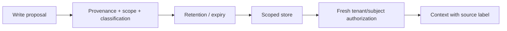

# 08 — Agent Memory Security

<!-- roadmap-status -->
> **Roadmap status: Pilot.** Some executable evidence exists; the remaining gate is listed in the Learning Hub and review plan.

## Learning objectives

Classify working, episodic, semantic, procedural, and long-term memory; scope
each write/read to a tenant and subject; and test poisoning, stale state, and
cross-user leakage with observable provenance and expiry.

## Mental model

Memory persists influence beyond one prompt. A value that was safe for a user
today can become stale, unauthorized, or malicious tomorrow. Treat each record
as untrusted until its provenance, scope, classification, retention, and current
authorization can be demonstrated.

## Write policy → retrieval policy

## Practical lab

Run `python curriculum/intermediate/08-agent-memory-security/lab.py`. A
user-confirmed, low-sensitivity preference is admitted; a cross-tenant read and
an unapproved agent-summary write are denied. Add expiry and poisoned-memory
variants. The decision returns a memory ID and scope, not raw sensitive data.

## Evaluation and production upgrade

Measure memory-poisoning acceptance, cross-tenant leakage, stale retrieval,
unexplained-record rate, and useful-memory recall. Production systems need
per-tenant storage boundaries, deletion/retention workflows, encryption/access
control, write review for sensitive classes, provenance integrity, and privacy
aware traces. A memory record never grants tool authority.

## References

- [OWASP Agentic Security Initiative](https://genai.owasp.org/initiatives/agentic-security-initiative/)
- [NIST Privacy Framework](https://www.nist.gov/privacy-framework)
