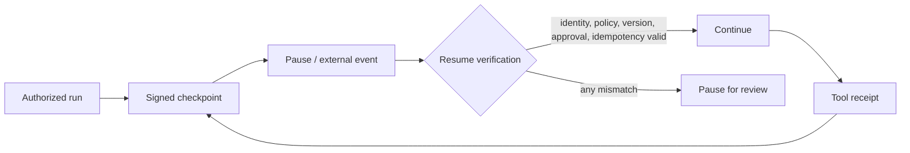

# 09 — State, Checkpoint, and Durable-Execution Security

<!-- roadmap-status -->
> **Roadmap status: Pilot.** Some executable evidence exists; the remaining gate is listed in the Learning Hub.

## Learning objectives

Model the security boundary introduced by a pause; identify what must be bound
to a checkpoint; require reauthorization before resume; and replay incomplete
work without duplicating a committed side effect.

## Why it matters

The support agent pauses while waiting for a high-risk approval. During the
pause, its credential can be revoked, policy can change, a tool can be updated,
or an event can be delivered twice. Persisted state is therefore evidence with
an expiry and integrity requirement—not permission to continue indefinitely.

## Mental model and trust boundaries

At creation, a checkpoint records run/tenant identity, state version, policy
and tool configuration versions, approval status, idempotency keys, and the
last external receipt. At resume, the runtime authenticates the caller and
rechecks authorization. The model’s previous decision is never sufficient.

## Vulnerable design → attack → control

| Vulnerable assumption | Attack / failure | Control | Observable test |
| --- | --- | --- | --- |
| “Paused means approved forever” | stale approval | expiry and reapproval | resume denied |
| “State is current” | policy/model/tool change | version comparison | mismatch pauses |
| “Retry is safe” | duplicate external event | idempotency + receipt | second commit denied |
| “Credential was valid once” | revoked scope | fresh authorization | resume denied |

## Guided lab

Run the notebook or `python curriculum/shared/runtime_security_lab.py`. The lab
prints a bounded trace: delegation, egress, action, revocation, and resume
events. Change `policy_version` or `checkpoint_version`; a resume must pause.
Try `commit_once` twice with the same action ID; only the first can succeed.
Then read `labs/intermediate/03_incident_recovery.py` for the incident-handling
variant with a rotated connector.

## Evaluation

Measure unsafe-resume success, duplicated side effects, stale-approval use,
and recovery time. Also measure a legitimate resumed task after valid
reauthorization, so a secure system is not merely unavailable. Preserve only
redacted arguments and stable identifiers in traces.

## Production upgrade

Use durable storage with integrity protection, a transaction/outbox pattern or
tool receipts for external effects, clock discipline, retention rules, event
deduplication, migration/version policy, and operational ownership. Exercise
recovery during a real dependency outage before granting unattended write
authority.

## Exercises

1. Add an approval-expiry field to the runtime and make expired approval pause.
2. Add a tool version and define which changes require a fresh review.
3. Explain why an idempotency key does not authorize an action.

## References

- [NIST SP 800-207: Zero Trust Architecture](https://csrc.nist.gov/pubs/sp/800/207/final)
- [OWASP Agentic Security Initiative](https://genai.owasp.org/initiatives/agentic-security-initiative/)
