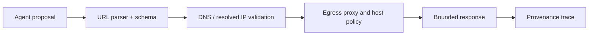

# 13 — Network, Egress, SSRF, and External Resource Security

<!-- roadmap-status -->
> **Roadmap status: Pilot.** Some executable evidence exists; the remaining gate is listed in the Learning Hub and review plan.

## Learning objectives

Threat-model agent-controlled outbound requests; stop SSRF before a connection;
and implement a bounded, observable egress policy without relying on a prompt
or a model URL classification.

## Scenario

The research agent has a `fetch_url` capability. A poisoned result proposes
`http://localhost/admin`, cloud metadata, a redirect to an internal service, or
a large slow response. The asset is not only data: internal control planes,
availability, and outbound credentials can also be reached through a confused
fetcher.

## Architecture and trust boundaries

The URL string, DNS answer, redirect destination, and response body are all
untrusted. Validate before and after redirect/DNS resolution; a hostname
allowlist alone does not protect against a rebinding or a permitted host that
resolves to an unsafe address.

## Vulnerable design → controls

| Attack | Failure | Control | Evidence |
| --- | --- | --- | --- |
| `localhost` / private address | internal data access | resolved-IP denial | destination + deny reason |
| redirect chain | policy bypass | per-hop validation and cap | redirect count |
| slow/large response | resource exhaustion | timeout and byte cap | elapsed/bytes |
| arbitrary domain | exfiltration | proxy/host allowlist | policy receipt |

## Practical lab

Run `python curriculum/intermediate/13-network-egress-ssrf-and-external-resource-security/lab.py`.
It never sends requests; it checks the decision boundary only. Modify a trusted
host to resolve to `127.0.0.1` and verify denial. Then test an HTTPS allowed host
with a public documentation-range IP. The result carries limits suitable for a
fetch executor to enforce independently.

## Evaluation and production upgrade

Report forbidden-destination success, redirect-policy bypass, p95 request time,
max body admitted, and blocked-valid-resource rate. Production enforcement
belongs at an egress proxy/firewall with DNS controls, network identity, TLS
verification, telemetry, and incident revocation; application validation is a
second layer, not the only one.

## Exercises

1. Add a deny list for cloud metadata endpoints.
2. Define how DNS answers are pinned across redirect and connection.
3. Add a receipt field for a request’s final resolved address.

## References

- [OWASP SSRF Prevention Cheat Sheet](https://cheatsheetseries.owasp.org/cheatsheets/Server_Side_Request_Forgery_Prevention_Cheat_Sheet.html)
- [OWASP Agentic Security Initiative](https://genai.owasp.org/initiatives/agentic-security-initiative/)
