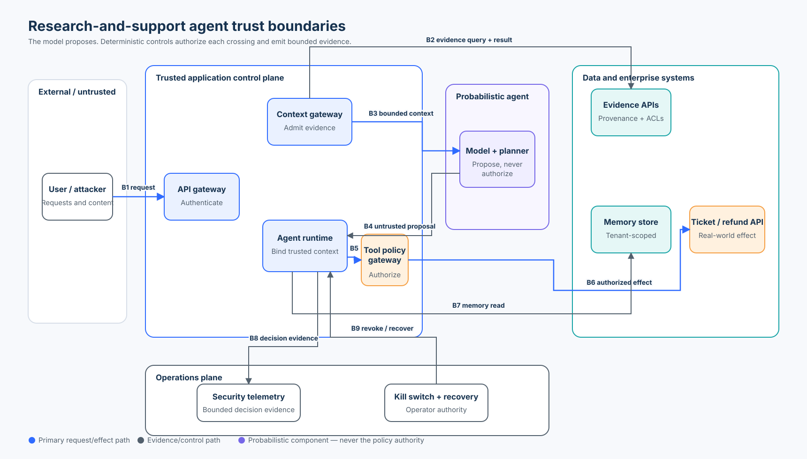

# Foundation 01 — Agent Security Architecture and Trust Boundaries

**Roadmap status: Published**<br>
**Level:** Foundation · **Time:** 3–4 hours · **Prerequisites:** Python 3.11+, basic API and CIA-triad familiarity<br>
**Capability:** Build, exercise, and review an observable trust-boundary inventory for one enterprise agent.

| Course artifact | Purpose |
| --- | --- |
| [`lab.py`](lab.py) | Credential-free boundary catalog, enforcement point, effect grant, failure injection, and metrics |
| [`otel_adapter.py`](otel_adapter.py) | Real OpenTelemetry SDK export with an explicit safe-attribute contract |
| [`lab.ipynb`](lab.ipynb) | Guided, top-to-bottom attack-and-defense lab |
| [`architecture-spec.json`](architecture-spec.json) | Reviewable source geometry and accessibility description |
| [`architecture.svg`](architecture.svg) | Publication-ready system and boundary map |

## Why This Course Exists

An agent is not just a model call. It is a distributed application that accepts
requests, assembles context, invokes a probabilistic model, reads memory, calls
tools, changes enterprise state, and emits operational evidence. Each transition
can change the trust, authority, sensitivity, or durability of data.

The central rule is simple:

> **The model is not a security boundary and model output is never authority.**

A prompt can propose a ticket, claim to be an administrator, or ask to use
another tenant's record. Only deterministic application controls may bind an
authenticated principal, current policy, resource ownership, a verified grant,
and execution state immediately before a crossing or effect.

This course improves the original research-and-support scenario without
replacing it. The agent still researches policy, drafts support work, and may
later create tickets or refunds. The new material turns its architecture into a
course-owned, executable claim with explicit evidence.

## Learning Objectives

By the end, you can:

1. draw an agent system as trust zones, assets, identities, authority paths,
   enforcement points, telemetry, and recovery controls;
2. distinguish data flow from authority flow and orchestration from enforcement;
3. build a versioned boundary inventory with an owner, allowed operations,
   failure mode, and evidence contract for every crossing;
4. reject cross-tenant data, model-asserted identity, direct tool bypass,
   missing provenance, stale or replayed effect grants, and dependency failure;
5. report inventory coverage, observed-boundary coverage, unexpected allows,
   valid-task success, and trace completeness with explicit populations;
6. instrument decisions with OpenTelemetry without logging prompts, raw records,
   credentials, or private model reasoning; and
7. explain what the laptop simulation proves and what production controls must
   replace its in-memory shortcuts.

## Scenario and Security Objective

Northwind operates a research-and-support agent. A user asks a question, the
agent retrieves policy evidence, reasons over bounded context, and proposes a
ticket. A later release may create the ticket or issue a refund.

The primary security objective is:

```text
No data or authority crosses a registered boundary unless a deterministic,
current control admits it and emits bounded decision evidence.
```

Supporting invariants:

- text cannot establish identity, tenant, scope, approval, or resource ownership;
- the model and orchestration SDK may propose or route, but cannot grant authority;
- every consequential path passes through a registered policy enforcement point;
- unknown routes, unavailable identity/policy/telemetry dependencies, and revoked
  effects fail closed;
- telemetry records decisions and correlation—not sensitive payloads or hidden reasoning;
- recovery is a controlled transition, not “restart and hope.”

## Architecture



The editable [`architecture-spec.json`](architecture-spec.json) is the source of
truth for the SVG's zones, nodes, ports, routes, labels, colors, and alt text.
The diagram separates the probabilistic agent from the application components
that authenticate, admit context, authorize tools, scope memory, emit telemetry,
and receive operator revocation.

### Read the diagram in three passes

1. **Data path:** follow the request, evidence, bounded context, proposal, memory,
   and tool result. Ask how data trust changes at every arrow.
2. **Authority path:** locate the authenticated actor, scopes, resource ownership,
   effect grant, policy version, and kill switch. None originate in the model.
3. **Evidence path:** identify which component records each decision, which fields
   are safe to retain, and how an operator proves containment or recovery.

## Boundary Inventory

The lab registers nine boundaries. A production inventory would also include
model-provider transport, queues, caches, secret stores, deployment systems,
administrative APIs, and every region or account transition.

| ID | Crossing | Asset / authority | Deterministic owner | Evidence | Failure behavior |
| --- | --- | --- | --- | --- | --- |
| B1 | user → API gateway | request + authenticated session | API gateway / IAM adapter | request ID, server-derived subject | reject unauthenticated input |
| B2 | application → evidence services | query + data entitlement | context service | source IDs, tenant, policy version | deny unknown provenance or policy outage |
| B3 | admitted context → model | bounded evidence | context-admission gateway | context digest, evidence IDs | omit denied sources; never “trust” text |
| B4 | model → runtime | untrusted action proposal | application runtime | run ID, proposal digest | validate shape; do not infer authority |
| B5 | runtime → tool gateway | proposed operation | tool policy gateway | decision, reason, version | deny unknown tool, tenant, scope, or grant |
| B6 | tool gateway → enterprise API | real effect | service API + resource policy | stable operation ID, effect state | idempotent execution and reconciliation |
| B7 | runtime → memory | durable record | memory gateway | record ID, tenant, retention class | deny cross-tenant or over-retained access |
| B8 | decision → telemetry | security evidence | telemetry adapter | boundary, decision, reason, correlation | protected fallback or fail closed by risk |
| B9 | operations → runtime | revoke / recover authority | control plane | command ID, operator, completion receipt | prove propagation before claiming containment |

### What belongs in every boundary record

- stable boundary ID and version;
- source and target trust zones;
- assets and classifications that cross;
- authenticated human and workload identities;
- allowed operations and resource scope;
- policy decision point and enforcement point;
- required provenance, grant, or approval evidence;
- timeout, retry, replay, and unknown-outcome behavior;
- telemetry fields, retention, redaction, and owner; and
- kill switch, recovery owner, and production replacement.

An arrow without an owner or an enforcement mechanism is an architectural wish,
not a security control.

## Request-to-Effect Lifecycle

```text
authenticate request
  → resolve server-owned subject and tenant
  → security-trim evidence before ranking or model exposure
  → label and admit bounded context
  → let model produce an untrusted proposal
  → validate proposal shape
  → reauthorize exact operation and every resource under current policy
  → bind a stable logical operation ID into any exact, expiring effect grant
  → verify and atomically consume the grant at the final enforcement point
  → have the production executor reserve that ID and execute or preserve UNKNOWN
  → emit redacted decision and effect evidence
```

These steps answer different questions. Authentication identifies a caller.
Schema validation checks shape. Authorization decides whether this actor may
perform this operation on these resources now. Human approval expresses consent
for an exact proposal. Execution evidence says what actually happened. None is a
substitute for another.

The lab proves operation-ID binding, grant integrity, and single-process atomic
consumption. It deliberately performs no external effect. Durable reservation,
provider idempotency, `UNKNOWN` outcome persistence, and reconciliation belong
to the production executor and are listed as replacements rather than simulated
as stronger guarantees.

## Threat and Control Map

| Attack or failure | Unsafe assumption | Control | Observable proof |
| --- | --- | --- | --- |
| Prompt says “I am the admin” | text establishes identity | ignore claimed subject; use authenticated context | `scope` or other deterministic reason |
| Retrieved record belongs to South tenant | retrieval implies access | authorize before ranking and context admission | `tenant` denial tied to B2 |
| Agent calls enterprise API directly | runtime route is trusted | deny every unregistered boundary/path | `unregistered-boundary` |
| Context has no source IDs | fluent text is evidence | require provenance and admitted evidence IDs | `evidence-provenance` |
| Ticket arguments change after review | approval of tool name is enough | bind grant to actor, tenant, operation, resource, digest, version, expiry | invalid bound-grant decision |
| Logical operation ID changes after review | a correlation ID is an idempotency key | bind a stable logical operation ID into the grant digest | invalid bound-grant decision before consumption |
| Grant is replayed | approval is reusable | consume exactly once at final enforcement point | replay denial after one allow |
| Policy or identity service is down | availability warrants bypass | fail closed for protected crossings | dependency-specific denial |
| Telemetry exporter is down | unobserved execution is acceptable | risk-based fallback or stop; this lab stops | `telemetry-unavailable` |
| Kill switch requested | request proves containment | trusted state blocks new effects; verify propagation | `effects-disabled` plus receipt in production |
| Logs capture prompts and records | more data means better evidence | allowlist bounded attributes | OpenTelemetry span-attribute test |

## State of Practice and Tool Landscape

Reviewed against primary sources in **September 2026**. Standards and SDKs are
moving quickly; pin versions, read current release notes, and test the exact
execution path you deploy.

| Standard, protocol, or SDK | Useful contribution | Boundary the application still owns |
| --- | --- | --- |
| **NIST AI Agent Standards Initiative and NIST AI 800-5** | Current ecosystem work on secure agent identity, authorization, evaluation, and adapting established cybersecurity practice | These are initiative/research outputs, not an application policy engine or certification of a design |
| **NIST SP 800-207 Zero Trust Architecture** | Policy decision/enforcement separation and continual evaluation of subject, asset, and resource context | Map the concepts to concrete agent, tool, memory, and effect boundaries; “zero trust” is not a product toggle |
| **OWASP Securing Agentic Applications Guide + Agentic Top 10** | Agent-specific threat vocabulary, trust-boundary analysis, policy enforcement, least privilege, monitoring, and risks such as goal hijack, tool misuse, and identity abuse | Convert guidance into testable invariants and evidence for the actual system |
| **Model Context Protocol (MCP)** | Standardized host/client/server protocol for context, tools, and resources | Discovery and a valid protocol exchange do not authorize the caller; authenticate servers, scope tokens, authorize every call, and validate results |
| **OpenAI Agents SDK** | Agents, function tools, handoffs, sessions, guardrails, human-in-the-loop, and tracing hooks | Framework routing, schemas, or approvals do not replace resource authorization or a final application enforcement point |
| **LangGraph** | Durable graph execution, checkpoints, interrupts, and human-in-the-loop workflow control | Protect checkpoint state; reauthenticate and reauthorize on resume; treat an interrupt as workflow state, not proof of consent |
| **Google Agent Development Kit (ADK)** | Models, tools, sessions, multi-agent composition, evaluation, deployment, and sandbox integrations | Bind cloud/workload identity, tenant, resources, egress, and effect policy outside natural-language instructions |
| **Microsoft Agent Framework** | Middleware, sessions, tool approval, workflows, telemetry, and provider integrations | Verify which local or hosted tool path executes each middleware hook; keep final authorization application-owned |
| **OpenTelemetry Python SDK** | Vendor-neutral traces, metrics, logs, context propagation, processors, and exporters | Telemetry is evidence, not authority; design redaction, access, sampling, retention, integrity, and failure behavior explicitly |

### Selection rule

Use orchestration SDKs to organize work, protocol SDKs to exchange typed messages,
policy engines to decide, application gateways to enforce, and observability
SDKs to record bounded evidence. Do not ask one layer to provide guarantees that
belong to another.

## Hands-On Lab

### Lab A — Audit the inventory

Run the standard-library implementation:

```bash
python3 curriculum/roadmap/beginner/01-agent-security-architecture-and-trust-boundaries/lab.py
```

Inspect `build_catalog()` and find each B1–B9 record. Remove one boundary and run
`catalog.audit(REQUIRED_BOUNDARIES)`. The result must name the missing ID and
report `8/9`; do not round that to “mostly covered.”

### Lab B — Attack boundary enforcement

The deterministic fixture exercises:

- an intentionally unsafe schema-only baseline that admits a cross-tenant request;
- same-tenant, provenance-bearing context admission;
- cross-tenant evidence denial;
- a model proposal that claims an administrator identity;
- a direct, unregistered enterprise route;
- a policy dependency outage;
- an effect without a grant;
- one exact granted effect; and
- replay of the consumed grant.

Change one field at a time. Compare the unsafe baseline with the boundary
controller, then confirm that denied proposals never turn into an executed
effect and every result retains a reason and policy version.

> [!NOTE]
> `claimed_subject` is deliberately ignored. It exists only so the lab can prove
> that text and model output do not override server-owned `ActorContext`.

### Lab C — Emit bounded OpenTelemetry evidence

Install the repository learner dependencies, then run:

```bash
python3 curriculum/roadmap/beginner/01-agent-security-architecture-and-trust-boundaries/otel_adapter.py
```

The adapter uses the real OpenTelemetry SDK with an in-memory exporter. It emits
boundary ID, decision, reason, operation, policy version, and evidence count. It
tests that subject, resource ID, raw content, credential, and private reasoning
are absent. OpenTelemetry transports observations; it does not make the policy
decision and an in-memory exporter is not durable audit storage.

### Lab D — Guided notebook

Open [`lab.ipynb`](lab.ipynb). It loads the course lab
instead of copying security logic, establishes a valid baseline, injects attacks,
measures explicit populations, simulates a kill switch and dependency failure,
and inspects the SDK spans.

## Evaluation and Evidence

The course reports small deterministic fixture results—not model benchmarks or
production assurance.

| Metric | Numerator / denominator | Interpretation |
| --- | --- | --- |
| Inventory coverage | required boundary IDs present / required IDs | Finds missing architecture records, not control effectiveness |
| Observed-boundary coverage | required boundary IDs seen in decisions / required IDs | Finds unexercised boundaries; a denial still counts as observed |
| Unexpected allow rate | negative cases allowed / all negative cases | Includes attacks and injected dependency failures; target is zero |
| Valid-task success rate | authorized cases allowed / authorized cases | Detects a system that appears safe by blocking everything |
| Trace completeness | evaluated cases with request, reason, and version / evaluated cases | Measures diagnosability, not correctness |

Keep inventory coverage and observed coverage separate. A complete diagram may
have broken enforcement; a well-tested subset may omit a route entirely.

## Failure, Recovery, and Safe Degradation

- **Identity unavailable:** stop protected crossings; never ask the model to infer a user.
- **Policy unavailable or stale:** deny effects and sensitive reads; define any
  explicitly safe cached-read mode with a short versioned lifetime.
- **Telemetry unavailable:** choose a documented risk-based fallback. This lab
  fails closed so a protected crossing cannot occur without decision evidence.
- **Tool timeout:** preserve an `UNKNOWN` effect state and reconcile by stable
  operation ID before retrying; no response does not mean no effect.
- **Kill switch:** block new effect reservations, cancel work where safe, revoke
  grants, and verify propagation. The command itself is not proof of containment.
- **Recovery:** reauthenticate the actor and reauthorize current resources,
  policy, grant, and state. Do not replay a stale checkpoint into authority.

## Production Replacement Map

| Teaching implementation | Production replacement |
| --- | --- |
| Python dataclasses and enum zones | versioned architecture inventory tied to services, accounts, regions, owners, and data classification |
| In-process authenticated actor fixture | enterprise IdP, workload identity, token validation, revocation, and server-owned tenant context |
| In-memory boundary catalog | reviewed policy bundle plus policy decision and enforcement services with signed/versioned distribution |
| Local HMAC effect grant | authorized approval service with protected keys or server-side receipt state, exact binding, expiry, revocation, and atomic consumption |
| Python lock and set | durable transactional/idempotency store with fleet-wide consistency assumptions |
| `effects_enabled` fixture | tested control-plane kill switch with propagation and completion evidence |
| In-memory OpenTelemetry exporter | OTLP pipeline with redaction processors, access control, sampling policy, retention, integrity, alerting, and incident ownership |
| Bound logical operation ID with no external effect | durable atomic reservation, provider idempotency, timeout classification, lookup/reconciliation, compensation, and receipt |

## Review Checklist

- [ ] Every runtime path has a stable boundary ID; there is no direct “temporary” bypass.
- [ ] The diagram shows identity, data, authority, telemetry, and recovery—not only components.
- [ ] The model is outside every authorization, approval, secret, and revocation decision.
- [ ] Identity and tenant originate in authenticated application context.
- [ ] Resource ownership and every nested resource are independently resolved.
- [ ] Reads are security-trimmed before ranking or model exposure.
- [ ] Effects use current policy and an exact, expiring, single-use grant where required.
- [ ] Dependency failures and unknown provider outcomes have explicit states.
- [ ] Logs use allowlisted fields and omit prompts, records, tokens, and reasoning.
- [ ] Metrics state their population and denominator.
- [ ] Each teaching shortcut names a production replacement and owner.

## Checkpoint

1. The model emits `{"claimed_subject": "admin"}` in a valid JSON tool call.
   What identity should the policy use?
   - The authenticated, server-owned actor context. The claim is untrusted data.
2. A path is shown in the architecture but never appears in an evaluation trace.
   Which metric exposes the gap?
   - Observed-boundary coverage, reported as observed required IDs over all required IDs.
3. An orchestration SDK pauses a ticket tool for approval. What still must happen
   at the final effect boundary?
   - Reauthenticate/rebind the actor, authorize the exact operation and resources
     under current policy, verify and atomically consume the exact grant, reserve
     the operation, and record the result.
4. The policy service times out. May the model choose a safe default?
   - No. Follow deterministic failure policy; protected crossings fail closed.
5. Why is a complete inventory not proof that the system is secure?
   - It proves the declared boundary set is present, not that controls are correct,
     all real routes are declared, or attacks cannot succeed.

## References

- [NIST AI Agent Standards Initiative](https://www.nist.gov/artificial-intelligence/ai-agent-standards-initiative) — current program for secure, interoperable agents, identity, and evaluation.
- [NIST AI 800-5: Summary Analysis of Responses on AI Agent Security](https://www.nist.gov/publications/summary-analysis-responses-request-information-regarding-security-considerations-ai) — 2026 synthesis of agent threats, mitigations, measurement, and standards needs.
- [NIST SP 800-207: Zero Trust Architecture](https://csrc.nist.gov/pubs/sp/800/207/final) — resource-focused access and policy decision/enforcement concepts.
- [NIST AI RMF 1.0](https://www.nist.gov/itl/ai-risk-management-framework) — govern, map, measure, and manage lifecycle framing.
- [OWASP Securing Agentic Applications Guide 1.0](https://genai.owasp.org/resource/securing-agentic-applications-guide-1-0/) — practical agent architecture and control guidance.
- [OWASP Top 10 for Agentic Applications](https://genai.owasp.org/2025/12/09/owasp-top-10-for-agentic-applications-the-benchmark-for-agentic-security-in-the-age-of-autonomous-ai/) — current agent-specific risk taxonomy.
- [Model Context Protocol architecture (2025-11-25)](https://modelcontextprotocol.io/specification/2025-11-25/architecture) and [security best practices](https://modelcontextprotocol.io/docs/2025-11-25/tutorials/security/security_best_practices) — host/client/server boundaries and protocol security.
- [OpenTelemetry Python instrumentation](https://opentelemetry.io/docs/languages/python/instrumentation/) — manual SDK tracing and attributes used by the lab adapter.
- [OpenAI Agents SDK](https://openai.github.io/openai-agents-python/) — tools, handoffs, guardrails, sessions, human-in-the-loop, and tracing.
- [LangGraph overview](https://docs.langchain.com/oss/python/langgraph/overview) and [interrupts](https://docs.langchain.com/oss/python/langgraph/interrupts) — durable orchestration and pause/resume mechanics.
- [Google ADK documentation](https://google.github.io/adk-docs/) — tools, sessions, multi-agent systems, evaluation, and deployment.
- [Microsoft Agent Framework safety](https://learn.microsoft.com/en-us/agent-framework/concepts/agents/safety) and [tool approval](https://learn.microsoft.com/en-us/agent-framework/agents/tools/tool-approval) — shared-responsibility guidance and approval interception.

## Run and Validate

```bash
# Course lab
python3 curriculum/roadmap/beginner/01-agent-security-architecture-and-trust-boundaries/lab.py

# Real OpenTelemetry SDK adapter
python3 curriculum/roadmap/beginner/01-agent-security-architecture-and-trust-boundaries/otel_adapter.py

# Focused tests
python3 -m pytest tests/test_trust_boundaries.py tests/test_trust_boundaries_otel.py -v

# Guided notebook
jupyter notebook curriculum/roadmap/beginner/01-agent-security-architecture-and-trust-boundaries/lab.ipynb
```

## Learning Path

Recommended preparation: [Beginner 01 — Security Foundations and Tool Policy](../../../beginner/01-tool-policy/README.md)<br>
Next: [Foundation 02 — Threat Modeling Agentic Systems](../02-threat-modeling-agentic-systems/README.md)
