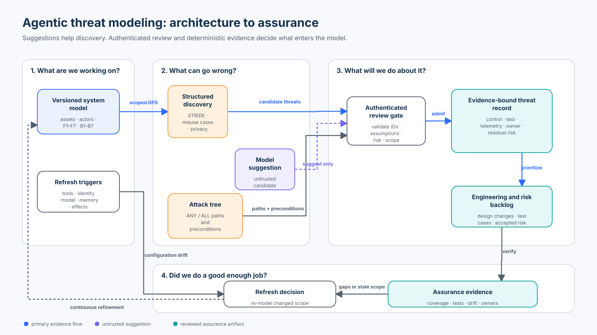

# Foundation 02 — Threat Modeling Agentic Systems

**Roadmap status: Published**<br>
**Level:** Foundation · **Time:** 3–4 hours · **Prerequisites:** Python 3.11+ and [Foundation 01 trust boundaries](../01-agent-security-architecture-and-trust-boundaries/README.md)<br>
**Capability:** Turn a versioned agent architecture into a reviewed, testable, continuously refreshed threat model.

| Course artifact | Purpose |
| --- | --- |
| [`lab.py`](lab.py) | Typed architecture, reviewed threat records, attack-tree mechanics, assurance gates, failure fixtures, and metrics |
| [`pytm_adapter.py`](pytm_adapter.py) | Real OWASP `pytm` 1.4 code-first DFD using agent and LLM primitives |
| [`lab.ipynb`](lab.ipynb) | Guided baseline-to-mitigation workshop with executable checks |
| [`architecture-spec.json`](architecture-spec.json) | Validated coordinates, ports, routes, semantics, and accessibility text |
| [`render_architecture.py`](render_architecture.py) | Deterministic SVG validator and renderer |
| [`architecture.svg`](architecture.svg) | Publication-ready architecture-to-assurance workflow |

## Why This Course Exists

A threat list is not a threat model. A useful model connects a specific version
of a real system to assets, actors, entry points, trust boundaries, abuse paths,
controls, tests, telemetry, accountable owners, and residual-risk decisions.
The connections matter more than the number of rows.

Agentic systems make those connections unusually easy to lose. A model may plan,
tools may appear dynamically, memory survives across runs, permissions may be
delegated, retrieved text can act like instructions, and a configuration change
can turn an advisory answer into an external effect without changing the visible
data-flow diagram.

This course preserves the original research-and-support scenario, STRIDE prompts,
abuse cases, attack trees, and threat-record workshop. It deepens them into one
credential-free system that proves this rule:

> **Models and tools may suggest threats. Authenticated people and deterministic
> application checks decide what enters the reviewed threat model.**

## Learning Objectives

By the end, you can:

1. scope an agent system by version, assets, actors, data flows, authority flows,
   trust boundaries, assumptions, and consequences;
2. distinguish a threat, vulnerability, attack path, control, test, risk score,
   and residual-risk decision;
3. apply STRIDE per element, misuse cases, and ANY/ALL attack trees without
   mistaking any one taxonomy for completeness;
4. extend conventional analysis for goal hijack, tool misuse, identity abuse,
   poisoned context or memory, supply-chain change, cascading failure, and
   deceptive human-agent interaction;
5. bind every admitted threat to valid architecture, asset, control, test,
   telemetry, owner, reference, reviewer, and residual risk;
6. compare visual, code-first, and model-as-code threat-modeling tools;
7. measure architecture-flow coverage and high-risk assurance coverage with
   explicit denominators; and
8. identify refresh triggers and explain what the laptop lab cannot prove about
   a production system.

### Success criteria

The course model is acceptable only when every required flow is represented,
every high-risk record has a deterministic boundary control and a real
verification fixture, telemetry is sufficient to diagnose the result, reviewers
and owners are trusted, references resolve, and residual risk does not improve
by assertion.

### Non-goals

- predicting the probability of a novel attack from an ordinal score;
- proving that no undiscovered threat exists;
- replacing privacy, safety, fraud, compliance, or operational risk analysis;
- authorizing a deployment because a diagram or threat-modeling tool is green; or
- asking a model to accept its own threats, mitigations, or residual risk.

## Scenario and Scope

Northwind's research-and-support agent answers policy questions and may propose
or create support tickets and refunds. The scenario evolves directly from
Foundation 01.

Assets include user requests, policy evidence, support PII, model proposals,
ticket/refund effects, credentials, memory, audit evidence, and availability.
Actors include the user, attacker, application services, probabilistic model,
tool gateway, data owner, operator, provider, and external service.

The executable system model carries seven required flows:

| Flow | Crossing | Asset or authority | Primary concern |
| --- | --- | --- | --- |
| F1 | user → API gateway | request and server-owned identity | spoofing and repudiation |
| F2 | context gateway → evidence API | support PII and evidence entitlement | disclosure before ranking |
| F3 | admitted context → model | provenance-bearing evidence | indirect injection and tampering |
| F4 | model → runtime | untrusted action proposal | proposal mistaken for authority |
| F5 | runtime → tool gateway | proposed operation and resources | direct bypass or scope widening |
| F6 | tool gateway → ticket/refund API | real business effect | alteration, replay, duplicate effect |
| F7 | runtime → memory | durable cross-run state | poisoning and cross-subject disclosure |

These flows deliberately omit some production components. A real review also
models provider transport, caches, queues, identity systems, secret stores,
MCP/A2A endpoints, deployment systems, observability pipelines, administrative
interfaces, regions, accounts, and manual operating procedures.

## Mental Model: Four Questions and One Feedback Loop



The diagram is generated from [`architecture-spec.json`](architecture-spec.json)
by [`render_architecture.py`](render_architecture.py). Its dashed purple path is
intentional: a model suggestion is an untrusted candidate that cannot bypass the
authenticated review gate.

Use the four-question framework:

1. **What are we working on?** Scope one architecture version, business goal,
   assets, identities, dependencies, boundaries, flows, assumptions, and impact.
2. **What can go wrong?** Apply structured prompts, misuse cases, attack trees,
   known adversary knowledge, and interdisciplinary review.
3. **What will we do about it?** Change the design or bind a control, test,
   telemetry contract, owner, and explicit residual-risk decision.
4. **Did we do a good enough job?** Measure coverage and evidence, inspect gaps,
   challenge assumptions, and re-run after any material change.

The loop is continuous. A model, provider, policy, prompt, tool registry,
credential, memory source, approval step, or effect capability can change the
threat model even when the boxes in a high-level diagram look identical.

## Foundations: Use the Methods Together

### Core terms

| Term | Meaning in this course |
| --- | --- |
| Asset | Something whose confidentiality, integrity, availability, safety, privacy, or business value can be harmed |
| Threat | A plausible circumstance or event that can harm an asset in this scoped system |
| Vulnerability | A weakness or missing condition that makes an attack path feasible |
| Attack path | Preconditions and ordered steps connecting an actor to an impact |
| Control | A deterministic or operational measure intended to break, detect, or recover from a path |
| Verification test | Executable evidence that a named control behaves as expected for a fixture |
| Risk | A prioritization judgment combining impact, feasibility/likelihood, exposure, uncertainty, and context |
| Residual risk | The risk and uncertainty remaining after verified controls—not the original score with smaller numbers |

### STRIDE per element

STRIDE is a structured prompt, not a completeness proof:

| Category | Agentic questions |
| --- | --- |
| Spoofing | Can prompt text, a tool argument, an agent name, or a server description replace authenticated identity? |
| Tampering | Can retrieved content, memory, a checkpoint, tool result, policy bundle, or reviewed proposal change undetected? |
| Repudiation | Can an actor deny a decision because subject, resource, operation, version, or effect state is missing? |
| Information disclosure | Can unauthorized records influence ranking, context, logs, memory, model providers, or outbound tools? |
| Denial of service | Can loops, oversized context, tool fan-out, retries, cost harvesting, or slow resources exhaust a budget? |
| Elevation of privilege | Can routing, delegation, discovery, approval, or a model-generated field widen authority? |

Apply the categories to actors, processes, data stores, data flows, and trust
boundaries. Then add methods that STRIDE does not cover well enough.

### Misuse and abuse cases

Write an adversarial goal in business language and trace the system response:

```text
As an attacker controlling a ticket attachment,
I want the agent to disclose a retention secret through an allowed outbound tool,
so that protected data leaves Northwind under a legitimate workload identity.
```

This exposes the distinction between attacker-controlled content and the
application identity that eventually executes a tool.

### Attack trees

Attack trees decompose one impact into **ANY** and **ALL** conditions. The lab's
root goal is “exfiltrate an enterprise secret.” It has three alternative paths:

- hostile context **AND** proposal-as-authority **AND** broad egress;
- compromised connector **AND** upstream token reuse; or
- unchecked memory write **AND** unscoped memory read.

`minimal_cut_sets()` computes the smallest leaf combinations that satisfy the
tree. These sets help identify controls that break multiple paths. They are
logical combinations, not probabilities and not evidence that an attack ran.

### Privacy, safety, and business abuse

STRIDE focuses on security properties. Add LINDDUN or another privacy method for
linkability, identifiability, unawareness, non-compliance, and related privacy
harms. Add domain specialists for fraud, safety, fairness, legal, and operational
harms. A single security workshop cannot infer stakeholder impact by itself.

## Mechanics: From Candidate to Reviewed Record

The lab treats a `ThreatProposal` as untrusted regardless of whether it came
from a developer, workshop, scanner, catalog, or model. `admit_proposal()`
requires an authenticated `security-reviewer` and an explicit residual-risk
statement before producing a `ThreatRecord`.

`review_threat_model()` then checks:

1. the threat model is bound to the current architecture version;
2. every required flow has at least one reviewed threat record;
3. flow, asset, control, test, reviewer, and reference IDs exist;
4. threat assets actually travel on the claimed flow;
5. the control is deterministic, belongs at that flow's boundary, and is not
   “enforced” by a model or agent persona;
6. a named test has passing execution evidence for at least one applicable control;
7. high-risk records have decision, reason, and architecture-version telemetry;
8. scores use the declared 1–5 rubric and residual score does not exceed the
   inherent score; and
9. owners, preconditions, steps, sources, and residual-risk text are present.

This validator checks internal integrity and evidence coverage. It cannot decide
whether the workshop found every meaningful threat or whether a production
control is correctly deployed.

## Threat Record Contract

Every material record should answer:

| Field | Review question |
| --- | --- |
| Stable threat ID and architecture version | Which exact system and change history does this record describe? |
| Flow, boundary, assets, category | Where can harm occur and what security/privacy objective is affected? |
| Actor, preconditions, attack steps | What must be true, and how does the path progress? |
| Inherent likelihood and impact | Why is the untreated path prioritized here? |
| Control IDs and enforcement owners | Which design change breaks or detects the path, and outside which probabilistic component? |
| Test IDs and expected outcomes | What executable fixture verifies the control? |
| Telemetry fields | What bounded evidence would diagnose attempted or successful traversal? |
| Owner and reviewer | Who must act, and who independently admitted the record? |
| Residual likelihood, impact, rationale | What remains after evidence-backed controls, and who accepts it? |
| References and review date | Which current external knowledge informed the record? |
| Refresh triggers | Which design or configuration changes invalidate the analysis? |

## Risk Prioritization Without False Precision

The lab multiplies ordinal 1–5 likelihood and impact values only to create a
transparent workshop priority. It does **not** estimate frequency, loss, or
probability. Teams must define each scale, document uncertainty, retain severe
low-likelihood scenarios, and avoid averaging away unacceptable impact.

Risk acceptance is a governance decision, not a subtraction performed by the
model. A residual score may decrease only when the record names implemented and
verified controls and explains what still remains.

## Technology and Method Landscape

Reviewed against primary and official sources in **September 2026**.

| Method or tool | Best contribution | Limitation / selection guidance |
| --- | --- | --- |
| OWASP four-question guidance and Threat Modeling Manifesto | Method-neutral collaborative workflow and continuous refinement | Does not supply an application-specific architecture or assure completeness |
| STRIDE per element | Fast systematic security prompts over a DFD | Categories can become a checklist; add abuse paths, business impact, privacy, and agent-specific threats |
| LINDDUN | Systematic privacy analysis over data interactions and threat trees | Requires privacy expertise and does not replace security or safety modeling |
| MITRE ATLAS | Living knowledge base of observed and demonstrated AI adversary tactics, techniques, mitigations, and cases | Technique mapping supports discovery; it does not establish applicability, priority, or control effectiveness in this system |
| OWASP Agentic guidance and Top 10 | Current vocabulary for goal hijack, tool misuse, identity abuse, memory/context poisoning, insecure communication, cascading failures, and related agent risks | A Top 10 is a starting set, not the system threat model |
| NIST AI RMF and GenAI Profile | Lifecycle governance, mapping, measurement, management, and broader socio-technical risk | Voluntary risk guidance, not a STRIDE engine, policy decision point, or release certificate |
| Microsoft Threat Modeling Tool | Visual DFD analysis, STRIDE per element, mitigations, and reporting | Strong Microsoft SDL workflow; validate platform fit and keep model files reviewable |
| OWASP Threat Dragon 2.x | Accessible visual DFDs, multiple methods, rule-generated threats, desktop/web use | Generated rows still require human review, system-specific evidence, tests, and lifecycle ownership |
| Threagile | YAML model-as-code, rule execution, CI integration, diagrams, and risk exports | Rich schema and automation add maintenance cost; custom rules need testing and governance |
| OWASP `pytm` 1.4 | Python code-first DFD and threat-model primitives, including `Agent` and `LLM` | Python/global model mechanics and catalog output do not replace cross-functional review or risk acceptance |

### Selection rule

Choose a collaboration method first, then select a tool that fits the team's
review workflow and artifact lifecycle. Visual tools help workshops; model-as-code
supports pull-request drift review; Python libraries connect architecture to tests.
Export format, diff quality, ownership, access control, schema migration, CI cost,
and interoperability matter as much as the threat catalog.

## State of Practice

### Established practice

- scope the real system and ask the four questions early and repeatedly;
- use DFDs, assets, entry points, boundaries, STRIDE, misuse cases, and attack trees;
- turn threats into design changes, owners, verification, and retained decisions;
- keep threat models in the delivery lifecycle rather than as presentation snapshots.

### Current agentic extension

- model tools, memory, retrieval, identity, delegation, provider, orchestration,
  approval, telemetry, and effect boundaries separately;
- refresh on configuration and capability changes, not only code or topology;
- combine conventional application threats with MITRE ATLAS and OWASP agentic
  knowledge; and
- treat model-assisted enumeration as untrusted analyst support.

### Emerging practice and open problems

Threat-model-as-code, machine-readable threat-model schemas, TM-BOM work, and
AI-assisted enumeration can improve reuse and drift detection. Open problems
include interoperable schemas, measuring threat-model quality, keeping dynamic
tool ecosystems current, mapping runtime evidence back to design threats, and
calibrating automated suggestions without overwhelming reviewers with plausible
but irrelevant threats.

## Worked Attack Path: Secret Exfiltration

Start with a support ticket containing an instruction-like attachment.

1. The attacker controls content but not Northwind identity.
2. The evidence pipeline admits the attachment without provenance or instruction
   isolation.
3. The model proposes sending a “summary” through a broad outbound tool.
4. The runtime mistakes a schema-valid proposal for authority.
5. A gateway accepts an arbitrary destination and forwards a broad credential.
6. The external service receives protected policy or support data.

The path crosses F3, F4, F5, and F6. Useful controls include evidence admission,
proposal/action separation, exact resource authorization, destination policy,
credential exchange, output validation, and bounded telemetry. The model cannot
enforce these controls because its proposal is part of the path being evaluated.

## Hands-On Lab

### Lab A — Inspect and validate the architecture

```bash
python3 curriculum/roadmap/beginner/02-threat-modeling-agentic-systems/lab.py
```

Inspect `build_architecture()`. Change one endpoint without changing its boundary
and observe construction fail. Then change `architecture_version` in the threat
model and observe `stale-architecture-version`.

### Lab B — Compare the unsafe baseline

`unsafe_row_count_baseline()` declares success when the worksheet has enough
rows. Replace `T1`'s control with `C404` and reviewer with `model:planner`.
The baseline still passes; `review_threat_model()` rejects both broken bindings.

### Lab C — Explore attack-tree mechanics

Call `minimal_cut_sets(build_exfiltration_tree())`. Remove one leaf from the
three-condition injection path and confirm the `ALL` branch no longer succeeds.
Then inspect which control breaks more than one minimal path.

### Lab D — Use the real OWASP pytm SDK

```bash
python3 curriculum/roadmap/beginner/02-threat-modeling-agentic-systems/pytm_adapter.py
```

The adapter builds the same scenario with real `Actor`, `Agent`, `LLM`, `Server`,
`Datastore`, `Boundary`, and `Dataflow` primitives and exports Graphviz DOT text.
It needs no API key, model, live service, or Graphviz binary for this exercise.
The course validator remains independent: SDK-generated findings are candidates,
not automatically reviewed threats or accepted residual risk.

### Lab E — Guided notebook

Open [`lab.ipynb`](lab.ipynb). It imports the course module rather than copying
its controls, walks from scope to candidate admission, compares the row-count
baseline, computes attack paths, injects architecture and evidence failures,
evaluates explicit populations, and inspects the `pytm` DFD.

## Evaluation and Evidence

The deterministic fixtures measure model integrity, not real-world attack
frequency or model quality.

| Metric | Numerator / denominator | Meaning |
| --- | --- | --- |
| Required-flow coverage | required F1–F7 flows with ≥1 valid record / required flows | Finds architecture paths omitted from the threat model |
| Owner coverage | records with a non-empty owner / reviewed records | Finds unowned work; does not prove action |
| High-risk control coverage | high-risk records with a valid deterministic boundary control / high-risk records | Measures control traceability, not deployed effectiveness |
| High-risk test coverage | high-risk records whose applicable control has passing test evidence / high-risk records | Measures verification linkage in the fixture, not production effectiveness |
| High-risk telemetry coverage | high-risk records with decision, reason, and architecture version fields / high-risk records | Measures minimum diagnosability |
| Unexpected acceptance rate | invalid fixture models accepted / invalid fixture models | Must be zero for the six negative cases |
| Valid-model acceptance rate | valid fixture models accepted / valid fixture models | Detects a validator that rejects everything |

A blocked invalid fixture is not a blocked production attack. A passing threat
model is not a release authorization. Those claims require deployed-control and
attack-evaluation evidence in later courses.

## Failure Modes and Anti-Patterns

| Failure | Why it fails | Course response |
| --- | --- | --- |
| “We have 100 threats” | Row count ignores duplicates, stale scope, broken references, and missing evidence | Validate binding and coverage over required flows |
| Model generates and approves the record | The proposer controls its own acceptance and may invent IDs or mitigations | Require authenticated reviewer context and reference resolution |
| STRIDE-only checklist | Categories do not express business abuse, multi-step paths, privacy, or stakeholder harm | Add abuse cases, attack trees, LINDDUN/domain review, and known adversary knowledge |
| Risk score drops after naming a control | A control label is not implementation or verification evidence | Require boundary owner, control ID, test ID, telemetry, and residual rationale |
| Diagram is current but tool permissions changed | Agent authority can drift outside topology | Treat tools, identity, policy, models, memory, oversight, and consequences as refresh triggers |
| One high score dominates all work | Ordinal scores hide uncertainty and low-likelihood catastrophic paths | Retain severity, rationale, uncertainty, and explicit acceptance policy |
| Generated catalog is treated as complete | Catalogs lag local design and emerging attacks | Combine methods and challenge assumptions with cross-functional reviewers |
| Threat model logs sensitive examples | The assurance artifact becomes a disclosure surface | Use synthetic fixtures, IDs/digests, minimal evidence, access control, and retention |

## Refresh and Recovery

Refresh the affected scope when any of these change:

- tools, plugins, MCP/A2A servers, action schemas, or write capabilities;
- identity, credential, scope, tenant, delegation, impersonation, or audience;
- system instructions, policy, routing, guardrails, approval, or budgets;
- model/provider/version/fallback, retrieval source, memory, checkpoint, or cache;
- single-agent versus multi-agent orchestration and dynamic capability assignment;
- consequences such as code execution, communication, infrastructure change, or
  transfer of value; or
- logging, detection, evaluation thresholds, rollback, revocation, or kill switch.

On stale scope, preserve the prior model as historical evidence, block any gate
that requires current review, re-scope the change, re-run verification, record
the new version, and retain the decision trail. Never silently relabel stale
evidence as current.

## Production Replacement Map

| Teaching implementation | Production replacement |
| --- | --- |
| Python tuple architecture | Reviewed service and data inventory linked to deployment, identity, tool, policy, and provider configuration |
| In-process reviewer fixture | Enterprise identity, review role, separation of duties, signed decision, and exception workflow |
| Ordinal 1–5 score | Documented risk method with impact criteria, uncertainty, risk appetite, severe-case policy, and accountable acceptance |
| Static control/test IDs | Bidirectional links to policy-as-code, test runs, deployment evidence, incidents, and control owners |
| Local reference catalog | Versioned external knowledge ingestion with provenance, freshness, applicability review, and change alerts |
| In-memory evaluation variants | CI design-review gate plus periodic workshops, red-team results, runtime signals, and architecture-drift detection |
| Logical attack tree | Reviewed attack graph tied to real reachability, identity, data, capability, and environment evidence |
| `pytm` DOT string | Access-controlled model repository, review workflow, schema migration, generated artifacts, and protected CI |

## Exercises

1. Add a denial-of-service threat for recursive tool calls. Define a budget and
   test without pretending a fixed sleep is latency evidence.
2. Add a privacy threat for linking one employee's cases across sessions. Explain
   why STRIDE information disclosure alone is insufficient.
3. Add an MCP server between F5 and F6. Update the architecture version,
   boundaries, attack tree, threat records, and refresh evidence.
4. Add a threat whose inherent score is below 12 but whose impact is catastrophic.
   Design a policy that prevents the threshold from hiding it.
5. Export the architecture to Threat Dragon or Threagile and document which
   fields are lost, transformed, or require custom schema.
6. Propose a model-assisted threat and route it through `admit_proposal()`.
   Demonstrate that changing the origin never changes review authority.

## Checkpoint

1. A model proposes a plausible threat with valid STRIDE terminology and a
   control name. May the system admit it automatically?
   - No. Resolve its architecture/assets/references and require authenticated,
     accountable review plus verification and residual-risk evidence.
2. All seven flows have a threat row. Is the model complete?
   - No. Flow coverage detects omissions but not weak discovery, duplicate rows,
     missing business abuse, privacy harms, or undiscovered attack paths.
3. A tool registry adds a write-capable MCP server without changing the diagram.
   What happens?
   - A refresh trigger fires because capability, identity, supply chain, and
     consequences changed. Re-scope and re-review the affected paths.
4. Why does the lab keep unexpected acceptance and valid-model acceptance separate?
   - A validator must reject invalid evidence without appearing safe by rejecting
     all useful models.
5. What does an attack-tree minimal cut set prove?
   - Only the smallest logical leaf combination satisfying the encoded tree. It
     does not prove probability, reachability, execution, or tree completeness.

## References

- [OWASP Threat Modeling Project](https://owasp.github.io/www-project-threat-modeling/) and [Threat Modeling Cheat Sheet](https://cheatsheetseries.owasp.org/cheatsheets/Threat_Modeling_Cheat_Sheet.html) — maintained process guidance and the four-question framework.
- [Threat Modeling Manifesto](https://www.threatmodelingmanifesto.org/) — collaboration, continuous refinement, and design-improvement values.
- [OWASP AI and Agentic Threat Modeling refresh triggers](https://owasp.github.io/www-project-threat-modeling/resources/ai-tm) — changes in tools, authority, models, memory, orchestration, effects, and operations.
- [OWASP Top 10 for Agentic Applications 2026](https://genai.owasp.org/2025/12/09/owasp-top-10-for-agentic-applications-the-benchmark-for-agentic-security-in-the-age-of-autonomous-ai/) — current agentic risk vocabulary.
- [OWASP Multi-Agentic System Threat Modeling Guide v1.0](https://genai.owasp.org/resource/multi-agentic-system-threat-modeling-guide-v1-0/) — agentic taxonomy applied to multi-agent systems.
- [MITRE ATLAS](https://atlas.mitre.org/) — living adversary tactics, techniques, mitigations, and cases for AI-enabled systems.
- [NIST AI RMF](https://www.nist.gov/itl/ai-risk-management-framework), [GenAI Profile NIST AI 600-1](https://doi.org/10.6028/NIST.AI.600-1), and [NIST AI 100-2e2025](https://doi.org/10.6028/NIST.AI.100-2e2025) — lifecycle risk management and adversarial-ML terminology.
- [LINDDUN](https://linddun.org/) — privacy threat-modeling methods and knowledge base.
- [Microsoft Threat Modeling Tool](https://learn.microsoft.com/en-us/azure/security/develop/threat-modeling-tool) — visual STRIDE-per-element design analysis.
- [OWASP Threat Dragon](https://owasp.org/projects/threat-dragon) — open-source visual threat modeling.
- [OWASP pytm](https://github.com/OWASP/pytm) — Pythonic model-as-code used by the course adapter.
- [Threagile](https://github.com/Threagile/threagile) — YAML threat-model-as-code and automated risk rules.

## Run and Validate

```bash
# Course lab
python3 curriculum/roadmap/beginner/02-threat-modeling-agentic-systems/lab.py

# Real OWASP pytm adapter
python3 curriculum/roadmap/beginner/02-threat-modeling-agentic-systems/pytm_adapter.py

# Reproduce the validated diagram
python3 curriculum/roadmap/beginner/02-threat-modeling-agentic-systems/render_architecture.py

# Focused tests
python3 -m pytest tests/test_agentic_threat_modeling.py tests/test_agentic_threat_modeling_pytm.py -v

# Guided notebook
jupyter notebook curriculum/roadmap/beginner/02-threat-modeling-agentic-systems/lab.ipynb
```

## Learning Path

Previous: [Foundation 01 — Agent Security Architecture and Trust Boundaries](../01-agent-security-architecture-and-trust-boundaries/README.md)<br>
Next: [Foundation 03 — Security Objectives, Invariants, and Blast Radius](../03-security-invariants-and-blast-radius/README.md)
