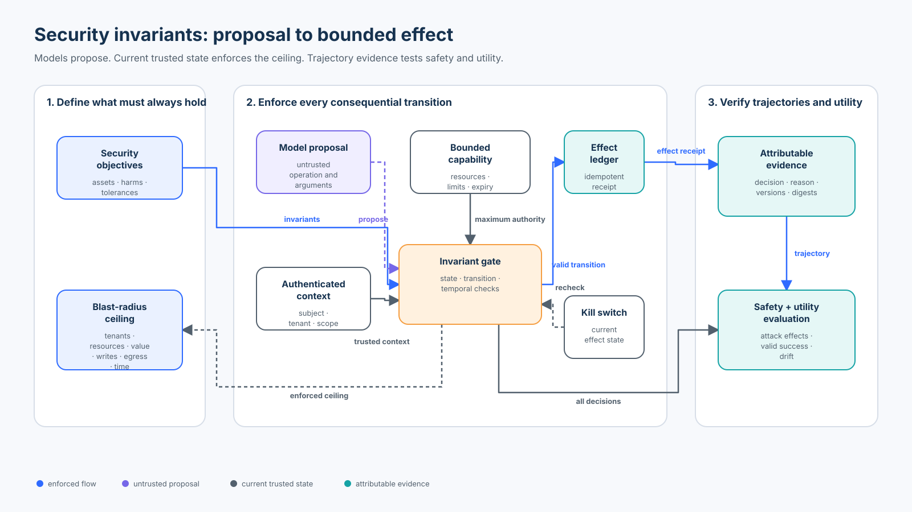

# Foundation 03 — Security Invariants and Blast Radius

**Roadmap status: Published**<br>
**Level:** Foundation · **Time:** 3–4 hours · **Prerequisites:** Python 3.11+, [Foundation 01 trust boundaries](../01-agent-security-architecture-and-trust-boundaries/README.md), and [Foundation 02 threat modeling](../02-threat-modeling-agentic-systems/README.md)<br>
**Capability:** Turn security objectives into enforced, observable properties and explicit ceilings on the harm one compromised instruction, identity, credential, agent, or tool can cause.

| Course artifact | Purpose |
| --- | --- |
| [`lab.py`](lab.py) | Typed identity, capability, approval, budget, idempotency, kill-switch, trajectory audit, blast-radius profiles, and evaluation |
| [`hypothesis_adapter.py`](hypothesis_adapter.py) | Real Hypothesis 6 property-based tests over generated identities, inputs, and action sequences |
| [`lab.ipynb`](lab.ipynb) | Guided baseline-to-invariant workshop with failures, metrics, and interpretation |
| [`architecture-spec.json`](architecture-spec.json) | Validated geometry, ports, routes, semantics, and accessibility text |
| [`render_architecture.py`](render_architecture.py) | Deterministic SVG validator and renderer |
| [`architecture.svg`](architecture.svg) | Architecture from security objective to bounded effect and evidence |

## Why This Course Exists

Threat modeling identifies what can go wrong. Engineering still needs a precise
answer to a harder question: **what must remain true when something does go
wrong?** A prompt such as “never cross tenants” is an intention. An invariant
ties that intention to trusted state, every relevant transition, observable
evidence, and a failing test.

Northwind's research-and-support agent can read policy, propose refunds, and—
after independent approval—issue a bounded refund. Assume that retrieved
content, a model proposal, or one runtime component becomes adversarial. The
system should not rely on the model recovering good judgment. It should limit
the maximum authority, value, resources, destinations, duration, and repeated
effects available to the compromised path.

This course preserves the original chapter's strongest ideas:

- invariants must hold over relevant trajectories, not merely the happy path;
- exact approval binds principal, tenant, action, resource, arguments, policy,
  time, and single-use state;
- tenant isolation, credentials, tools, memory, egress, sandboxing, budgets,
  delegation limits, approvals, and kill switches constrain different paths;
- attack success and blocked-valid-task rate must be reported separately; and
- time-to-revoke and credential reach are operational blast-radius dimensions.

It deepens those ideas into one credential-free, regression-tested system.

## Learning Objectives

By the end, you can:

1. distinguish security objectives, state invariants, transition guards,
   temporal properties, controls, assertions, SLOs, and release gates;
2. write an invariant with scope, trusted inputs, enforcement point, evidence,
   failure behavior, owner, and refresh trigger;
3. keep identity, capability, approval, budgets, and completion state outside
   model-controlled text;
4. enforce tenant isolation, capability attenuation, exact approval, atomic
   budget reservation, idempotency, kill-switch, and attribution properties;
5. represent blast radius as a vector of tenants, resources, operations, value,
   write count, egress, credential lifetime, and revocation delay;
6. compare example-based tests, property-based tests, policy engines, runtime
   monitors, isolation, and formal models without overstating their guarantees;
7. evaluate safety and utility with explicit populations and denominators; and
8. explain what must replace the laptop fixtures in a distributed production system.

### Success criteria

The course system is acceptable when all valid fixtures succeed, every attack
and authority-dependency failure produces no forbidden effect, exact retries do
not duplicate effects, changed retries are rejected, concurrent attempts cannot
exceed the write or amount budget, no write commits after kill-switch
activation, every committed effect is attributable, and the full trajectory
audit reports no encoded invariant violation.

### Non-goals

- proving that the chosen invariant set is complete;
- claiming a property-based test or bounded model check proves production safety;
- reducing heterogeneous harm to one “blast-radius score”;
- replacing threat modeling, authorization design, incident response, or risk acceptance; or
- making a deny-all system appear successful because no attack produced an effect.

## Mental Model



The model or user supplies an **untrusted proposal**. The application supplies
authenticated identity and current server-side state. A trusted gate intersects
actor scope, capability, policy, approval, budgets, idempotency, and kill-switch
state. Only then may it commit an attributable effect.

The lifecycle is:

1. **Objective:** name the asset, harm, and tolerance.
2. **Invariant:** state what must hold and over which states or transitions.
3. **Enforcement:** reject an invalid transition before the effect boundary.
4. **Evidence:** retain the decision, reason, versions, IDs, and outcome.
5. **Evaluation:** run valid, adversarial, boundary, and dependency-failure cases.
6. **Refresh:** re-evaluate after policy, identity, capability, topology, tool,
   model, memory, approval, or recovery behavior changes.

## Foundations: From Objectives to Properties

### Core terms

| Term | Meaning | Example |
| --- | --- | --- |
| Security objective | Desired protection outcome | A Northwind user cannot affect Southwind resources |
| State invariant | Predicate true in every reachable state in scope | committed refund total ≤ 10,000 cents |
| Transition guard | Condition checked before a state-changing step | current grant and exact approval must validate before commit |
| Temporal safety property | Something bad never occurs along a trajectory | no new write after kill-switch activation |
| Liveness property | Something good eventually occurs under stated assumptions | a valid bounded request eventually reaches a terminal decision |
| Control | Mechanism intended to maintain a property | transactional budget reservation |
| Assertion/test oracle | Executable observation that detects a violation | committed writes never exceed the limit under concurrency |
| SLO/metric | Quantified operating target over a population and window | p99 revocation propagation under 30 seconds |
| Release gate | Decision rule consuming evidence | block when any forbidden effect occurs or coverage is incomplete |

An invariant is not the same as a Python `assert`. The invariant is the system
property. An assertion is one way to test an observation of that property. A
control can be present but misconfigured. A passing test can cover only the
states it explored.

### State, transition, and temporal form

Let `s` be current trusted state, `a` a proposed action, and `s'` the next state.

- **State invariant:** `I(s)` must be true for every reachable in-scope state.
- **Transition guard:** `G(s, a, s')` permits only state changes that preserve `I`.
- **Safety over a trajectory:** `I` remains true after every relevant step.
- **Liveness:** under explicit fairness and dependency assumptions, desired work
  eventually reaches a terminal outcome.

The lab teaches safety invariants directly. It also measures valid-task success
so that “never do anything” is exposed as useless rather than celebrated as safe.

### Write a reviewable invariant

Use this contract:

| Field | Review question |
| --- | --- |
| ID and statement | Is the property precise and stable enough to test? |
| Scope and assumptions | Which tenants, runs, operations, dependencies, and failure model apply? |
| Trusted state | Which identity, ownership, policy, time, and lifecycle sources are authoritative? |
| Transition and enforcement point | Where can the violation first become irreversible? |
| Evidence and oracle | Which observations determine pass, fail, or incomplete? |
| Failure behavior | Deny, pause, degrade, retry, reconcile, or stop? |
| Owner and response | Who repairs the control and handles a violation? |
| Refresh trigger | Which change invalidates the property or its proof? |

## Blast Radius Is a Vector

Blast radius is the maximum scope of impact reachable under stated compromise
and failure assumptions. Report its dimensions separately:

- tenants and subjects reachable;
- resources and data classes reachable;
- read, write, execution, delegation, and administration operations;
- maximum value per effect and cumulative value per run/window;
- maximum number of writes, retries, handoffs, or parallel workers;
- allowed egress destinations and protocols;
- credential and approval lifetime;
- revocation propagation time and stale-cache window; and
- recovery scope: affected queues, memories, checkpoints, accounts, or regions.

`blast_radius_profiles()` compares a broad capability, the bounded course
capability, and deny-all. It deliberately returns a `BlastRadius` record rather
than a score. One number would hide whether a design reduced dollars while
expanding tenants, or reduced egress while lengthening credential lifetime.

The ceiling is a design limit, not an incident measurement. Runtime evidence
must still show what was actually reached.

## Mechanics: Eight Enforced Invariants

The lab applies these properties to every consequential transition:

| Invariant | Trusted enforcement | Negative evidence |
| --- | --- | --- |
| `INV-IDENTITY-SERVER-OWNED` | `ActorContext` from authentication, never proposal claims | claimed admin/tenant does not change the decision |
| `INV-TENANT-ISOLATION` | resource ownership lookup before capability use | cross-tenant resource is denied |
| `INV-AUTHORITY-ATTENUATION` | current server-side `CapabilityRegistry` | unknown, revoked, expired, stale-policy, wrong-operation, and wrong-resource grants fail |
| `INV-EXACT-APPROVAL` | trusted `ApprovalRegistry` with exact digest and atomic consume | missing, altered, expired, self, forged, or replayed approval fails |
| `INV-BLAST-BUDGET` | amount and write reservation inside the effect lock | concurrency cannot exceed count or value ceilings |
| `INV-IDEMPOTENT-EFFECT` | stable logical operation ID plus exact proposal digest | exact replay is a no-op; changed payload is a collision |
| `INV-KILL-SWITCH` | current effect state checked at commit | no new write at or after activation |
| `INV-ATTRIBUTABLE-EFFECT` | effect ledger | each effect binds subject, tenant, resource, capability, approval, policy, digest, and time |

The check happens at the effect boundary. Schema validation, a typed SDK object,
a role name, an approval Boolean, or the model saying “safe” cannot establish
these properties.

### Why atomicity matters

If two threads both check `writes_used < 1` and increment later, both can pass.
The lab performs idempotency, current kill-switch, budgets, approval consumption,
and effect commit under one process lock. The concurrency test launches eight
approved writes against a one-write budget and observes exactly one effect.

This proves the in-process implementation under the fixture. Production needs
a durable transaction, compare-and-swap, serialized workflow, or equivalent
consistency boundary shared by all workers.

### Safety and liveness are different

“No unauthorized refund occurs” is a safety property. “Every valid bounded
refund eventually completes” is closer to liveness. A deny-all policy satisfies
the first while failing the second. Dependency outages further require explicit
terminal states: an unavailable authority service is `ERROR`, not “safe allow”
and not evidence that an attack was blocked by policy.

## Architecture Patterns

| Pattern | Strengths | Limits and best fit |
| --- | --- | --- |
| In-process guards | low latency, easy unit tests, close to effect | policy duplication and process-local state; small services or final effect checks |
| External policy decision point | centralized policy language, versioning, decision evidence | application must supply correct identity/data and enforce the result; fleet policy such as OPA or Cedar-based services |
| Capability and approval service | narrow, time-bound authority with explicit lifecycle | issuance, revocation, replay, and distributed consistency become critical |
| Hard isolation and quotas | constrains filesystem, network, compute, tenant, account, or region reach even after code compromise | operational cost and incomplete coverage of business effects |
| Runtime monitor / reference monitor | evaluates every relevant transition against current state | bypass paths and monitor availability must be designed and tested |
| Formal state-machine model | explores concurrency and temporal design before deployment | abstraction and model-to-code drift remain; use for high-consequence protocols |

Defense in depth works when independent layers constrain different dimensions.
Repeating the same allow decision in three wrappers is not three independent controls.

## Technology Landscape

Reviewed against primary and official sources in **September 2026**.

| Technology | What it contributes | What it does not prove |
| --- | --- | --- |
| Hypothesis 6.168 | generated examples, shrinking, and rule-based stateful sequences; `derandomize=True` supports deterministic CI | completeness of strategies, distributed correctness, or production equivalence |
| Open Policy Agent / Rego | decoupled policy evaluation, signed/versioned bundles, status, decision logs, REST/Go/Wasm integration, and OpenTelemetry correlation | correct application identity/data, effect enforcement, business transactions, or zero stale-policy window |
| Cedar 4.5 | principal-action-resource-context policy, schema/request validation, analyzable semantics, formal Lean model and differential testing of the engine | correctness or completeness of the application's policies, schema, entity data, or enforcement integration |
| TLA+ / PlusCal with TLC or TLAPS | explicit state machines, invariance and liveness properties, model checking, and proof decomposition | fidelity of abstraction or automatically verified application code |
| OpenTelemetry | traces, metrics, logs, baggage, correlation, and policy-decision observability | authorization, immutable audit storage, or proof that missing telemetry means no event occurred |
| Cloud IAM guardrails and permission boundaries | maximum grantable authority, account/environment segmentation, short-lived access | application-level amounts, idempotency, business approval, or model/tool semantics |
| Sandboxes, egress gateways, quotas, and separate accounts | hard resource, network, compute, and administrative ceilings | correct tenant/resource decision inside the permitted boundary |

### Selection rule

Use ordinary unit tests for named cases, Hypothesis when input spaces or action
sequences are larger than hand-written examples, a policy engine when many
services need consistent inspectable decisions, hard isolation for compromise
containment, and formal modeling where concurrency or recovery errors have high
consequence. These techniques compose; none makes the application integration
or invariant set correct by itself.

## State of Practice

### Established practice

- least privilege and per-resource/per-session authorization;
- tenant and environment isolation;
- policy as code with versioned tests;
- quotas, timeouts, short-lived credentials, permission boundaries, and egress policy;
- stable idempotency keys and effect reconciliation; and
- decision/effect telemetry with accountable owners and incident response.

### Current agentic extension

Agent systems add dynamic tools, model-selected actions, memory, delegated
workers, retrieved instructions, long-running state, and provider-hosted tools.
The invariant must bind the **effective** authority at execution, not the tool
description or the authority the model believes it has. OWASP's 2026 agentic
risk work makes excessive agency and cascading effects first-class concerns.

### Emerging direction and open problems

- generated invariant candidates tied back to architecture and threat records;
- policy analysis and formal models for dynamic capability graphs;
- continuous authorization under fast tool/model/configuration change;
- evidence that a deployed route cannot bypass the reference monitor;
- measuring revocation propagation and stale-policy windows across a fleet;
- composing cloud, identity, sandbox, agent-framework, and business-policy ceilings; and
- discovering missing invariants without treating model suggestions as reviewed requirements.

## Worked Scenario: Bound One Refund

For a Northwind request to issue 2,500 cents on `case:north:7`:

1. The model proposes `issue_refund`; claimed identity fields remain untrusted.
2. The application supplies authenticated `user:7`, tenant `north`, and current scopes.
3. The resource registry resolves the case owner before any write.
4. The capability registry resolves a ten-minute grant for the exact subject,
   tenant, operations, resources, per-effect amount, cumulative amount, and writes.
5. An independent finance reviewer approves the exact canonical proposal digest.
6. Inside one critical section, the engine checks idempotency, kill-switch state,
   budgets, and approval consumption, then records the effect.
7. An exact retry returns the prior logical outcome without another effect.
8. A changed amount using the same logical operation ID is rejected as collision.
9. `audit_trajectory()` verifies count, value, tenant, attribution, and temporal state.

The model never supplies subject, tenant, capability, approval, policy version,
budget, or terminal success.

## Hands-On Lab

### Lab A — Run the deterministic trajectory

```bash
python3 curriculum/roadmap/beginner/03-security-invariants-and-blast-radius/lab.py
```

Inspect the first effect, exact duplicate, kill-switch denial, trajectory audit,
and twelve-case report.

### Lab B — Compare unsafe, bounded, and deny-all baselines

`unsafe_text_only_baseline()` accepts typed proposals without current authority.
`deny_all_baseline()` accepts nothing. Compare both with `InvariantEngine`:

- the unsafe baseline accepts all seven attack proposals;
- the bounded engine produces zero forbidden attack effects and completes all
  three valid tasks; and
- deny-all produces zero attack effects but completes zero valid tasks.

### Lab C — Inspect blast-radius dimensions

Call `blast_radius_profiles()`. Explain why the broad, bounded, and deny-all
profiles cannot be responsibly ranked with one scalar. Identify which control
changes each dimension.

### Lab D — Generate cases with Hypothesis

```bash
python3 curriculum/roadmap/beginner/03-security-invariants-and-blast-radius/hypothesis_adapter.py
```

The real Hypothesis library explores 75 deterministic examples for each of
three properties: cross-tenant claims never create effects, generated action
sequences never exceed count or amount budgets, and proposal identity claims
never widen authority. Change a guard and observe a minimized counterexample.

### Lab E — Guided notebook

Open [`lab.ipynb`](lab.ipynb). It imports the same reusable implementation,
compares baselines, inspects decisions and state, injects replay, budget,
dependency, and kill-switch failures, runs Hypothesis, evaluates explicit
populations, and ends with production replacements.

## Evaluation and Evidence

| Metric | Numerator / denominator | Direction and meaning |
| --- | --- | --- |
| Attack effect rate | attack cases that committed a forbidden effect / 7 attack cases | lower; actual effects, not mere allow text |
| Attack block rate | attack cases with non-success terminal decision / 7 | higher; keep separate from effect rate |
| Valid-task success rate | valid cases with allowed terminal outcome / 3 valid cases | higher; exposes deny-all |
| Valid-task block rate | blocked valid cases / 3 | lower; utility cost |
| Trace completeness | cases with decision ID, reason, policy version, and proposal digest / 12 | higher; minimum diagnosability, not security |
| Invariant violations | violations from committed trajectory audit | zero for the fixture |
| Unsafe-baseline acceptance | attack proposals accepted by text-only baseline / 7 | demonstrates baseline weakness |
| Blast-radius vector | explicit ceiling per dimension | lower is often safer, but business utility and recovery requirements still apply |
| Time-to-revoke | confirmation time minus revocation request time | lower; requires distributed production measurement |

The two failure cases are not counted as policy-blocked attacks. An unavailable
capability or approval service produces an error and no effect. Missing execution
evidence must never be counted as a successful defense.

## Failure Modes and Anti-Patterns

| Failure | Why it fails | Course response |
| --- | --- | --- |
| “The prompt says never cross tenants” | compromised content shares the enforcement mechanism | resolve authenticated tenant and resource owner outside the model |
| Typed proposal equals authority | schemas validate shape, not permission or current state | intersect server-owned identity, capability, policy, approval, and lifecycle |
| Approval Boolean | caller can assert it and change arguments later | server-side exact digest, reviewer, policy, time, and atomic consumption |
| Check then update budget | concurrent requests pass against the same old value | reserve and commit inside one consistency boundary |
| Retry with a new operation ID | unknown/duplicate effects become possible | stable logical ID; exact replay is no-op; mutation is collision |
| Kill switch checked at planning | queued work writes after revocation | recheck current state immediately before commit |
| One blast-radius score | hides expansion in another harm dimension | publish the vector and assumptions |
| Deny-all declared safe | no useful task can complete | report valid-task success and block rate |
| Property testing declared proof | generators omit states and integration differs | state strategy, example count, boundaries, and residual uncertainty |
| Policy engine treated as complete control | wrong input or ignored decision bypasses policy | authenticate inputs, test integration, and enforce at the effect boundary |
| Telemetry treated as enforcement | a log can record a violation after harm | enforce first; use protected evidence to diagnose and respond |

## Recovery and Refresh

When an invariant fails:

1. stop or narrow new effects at the smallest reliable boundary;
2. preserve decision and effect evidence without sensitive payload overcollection;
3. reconcile external outcomes before retrying;
4. identify which property, guard, bypass path, state source, or assumption failed;
5. repair the control and add the observed trajectory as a regression/property case;
6. rotate or revoke affected capabilities and verify propagation; and
7. re-evaluate both safety and valid-task behavior before restoring authority.

Refresh the suite when tools, operations, resource topology, tenants, credentials,
policy, approval, budgets, model/provider, memory, orchestration, persistence,
egress, effects, or recovery behavior changes.

## Production Replacement Map

| Teaching implementation | Production replacement |
| --- | --- |
| Python `ActorContext` | enterprise user/workload identity with tenant, device, session, and revocation state |
| In-memory capability registry | signed or server-resolved short-lived capabilities with durable lifecycle and audience |
| In-memory approval registry | authenticated approval workflow with separation of duties, expiry, integrity, and atomic one-use state |
| Process lock and dictionaries | transactional database, compare-and-swap, serialized workflow, or durable ledger across workers |
| Local kill-switch Boolean | independently operated control plane with tested propagation, safe degradation, and confirmation telemetry |
| Fixed policy version | signed policy distribution, activation status, freshness SLO, rollback, and fail-safe startup |
| Local effect receipt | provider idempotency, outcome reconciliation, protected audit evidence, and incident linkage |
| Hypothesis fixture strategies | risk-derived generators, state-machine models, replay corpus, fuzzing, and production-derived sanitized cases |
| Static blast-radius profile | continuous inventory and reachability analysis over identity, tools, data, network, accounts, regions, and effects |
| In-process decisions | OPA, Cedar, or equivalent PDP plus application-owned enforcement and versioned decision evidence |

## Exercises

1. Add a per-destination email quota and show how it changes the blast-radius vector.
2. Introduce a stale cached allow decision, activate the kill switch, and repair
   the design by rechecking current state at commit.
3. Add capability revocation and prove a revoked grant cannot start a new effect.
4. Extend the Hypothesis adapter with a rule-based state machine for issue,
   duplicate, collision, revoke, and kill-switch actions.
5. Model a safe read-only degradation mode when the approval service is down.
   State which policy age and resources are permitted.
6. Write the budget/idempotency transition as a small TLA+ or PlusCal model and
   explain the abstraction gap to the Python implementation.
7. Design an OPA or Cedar integration contract. Identify authenticated inputs,
   policy version, undefined/error behavior, decision evidence, and final enforcement.
8. Define a production time-to-revoke SLO with event timestamps, population,
   exclusions, percentile, and alert threshold.

## Checkpoint

1. A model emits a schema-valid refund with `approved=true`. Can it execute?
   - No. Shape and text are not authority. Resolve current server-owned identity,
     resource, capability, policy, exact approval, budgets, idempotency, and kill state.
2. All attack cases were denied. Is the system useful?
   - Unknown until valid-task success and blocked-valid-task rate are measured.
3. One credential reaches one tenant but 500 resources for 24 hours. Is its blast radius small?
   - Not necessarily. Tenant count is only one dimension; report resource count,
     operations, value, egress, lifetime, revocation, and recovery scope separately.
4. Hypothesis finds no counterexample in 75 examples. Is the invariant proved?
   - No. It raises confidence in the encoded property over generated cases; the
     strategies, invariant set, implementation, and production equivalence may be incomplete.
5. Why does an exact retry after kill-switch activation return the prior outcome?
   - It does not start a new effect. The stable operation ID retrieves an already
     committed logical result; changed or new work remains blocked.
6. An OPA or Cedar decision says allow. What must the application still do?
   - Enforce the decision at the exact effect boundary using authenticated input,
     current policy/state, transaction/idempotency controls, and outcome evidence.

## References

- [NIST SP 800-207 Zero Trust Architecture](https://csrc.nist.gov/pubs/sp/800/207/final) and [SP 800-207A](https://csrc.nist.gov/pubs/sp/800/207/a/final) — per-resource, least-privilege decisions and identity-tier application enforcement.
- [NIST AI Risk Management Framework](https://www.nist.gov/itl/ai-risk-management-framework) and [Generative AI Profile NIST AI 600-1](https://doi.org/10.6028/NIST.AI.600-1) — lifecycle risk framing and measurable governance outcomes.
- [OWASP Top 10 for Agentic Applications 2026](https://genai.owasp.org/2025/12/09/owasp-top-10-for-agentic-applications-the-benchmark-for-agentic-security-in-the-age-of-autonomous-ai/) — agentic risk vocabulary including excessive agency and cascading effects.
- [Open Policy Agent integration](https://www.openpolicyagent.org/docs/integration), [bundles](https://www.openpolicyagent.org/docs/management-bundles), and [decision logs](https://www.openpolicyagent.org/docs/management-decision-logs) — policy evaluation, lifecycle, integrity, and evidence.
- [Cedar Policy Language](https://docs.cedarpolicy.com/), [validation](https://docs.cedarpolicy.com/policies/validation.html), and [security model](https://docs.cedarpolicy.com/other/security.html) — analyzable authorization policy and shared-responsibility limits.
- [Hypothesis stateful testing](https://hypothesis.readthedocs.io/en/latest/stateful.html) and [settings](https://hypothesis.readthedocs.io/en/latest/settings.html) — generated action sequences, invariants, shrinking, and deterministic CI.
- [TLA+ high-level view](https://lamport.azurewebsites.net/tla/high-level-view.html) and [Proving Safety Properties](https://lamport.azurewebsites.net/tla/proving-safety.pdf) — state machines, invariance, safety, liveness, and proof structure.
- [OpenTelemetry signals](https://opentelemetry.io/docs/concepts/signals/) — traces, metrics, logs, and correlation for observable decisions.
- [AWS permission guardrails](https://docs.aws.amazon.com/wellarchitected/latest/security-pillar/sec_permissions_define_guardrails.html), [Google Cloud security by design](https://docs.cloud.google.com/architecture/framework/security/implement-security-by-design), and [Microsoft least privilege](https://learn.microsoft.com/en-us/entra/identity-platform/secure-least-privileged-access) — maximum permissions, layered isolation, and blast-radius guidance.

## Run and Validate

```bash
# Reusable course lab
python3 curriculum/roadmap/beginner/03-security-invariants-and-blast-radius/lab.py

# Real Hypothesis property checks
python3 curriculum/roadmap/beginner/03-security-invariants-and-blast-radius/hypothesis_adapter.py

# Reproduce the validated diagram
python3 curriculum/roadmap/beginner/03-security-invariants-and-blast-radius/render_architecture.py

# Focused tests
python3 -m pytest tests/test_security_invariants_blast_radius.py tests/test_security_invariants_hypothesis.py -v

# Guided notebook
jupyter notebook curriculum/roadmap/beginner/03-security-invariants-and-blast-radius/lab.ipynb
```

## Learning Path

Previous: [Foundation 02 — Threat Modeling Agentic Systems](../02-threat-modeling-agentic-systems/README.md)<br>
Next: [Foundation 04 — Secure Tool and Action Interface Design](../04-secure-tool-and-action-interface-design/README.md)
