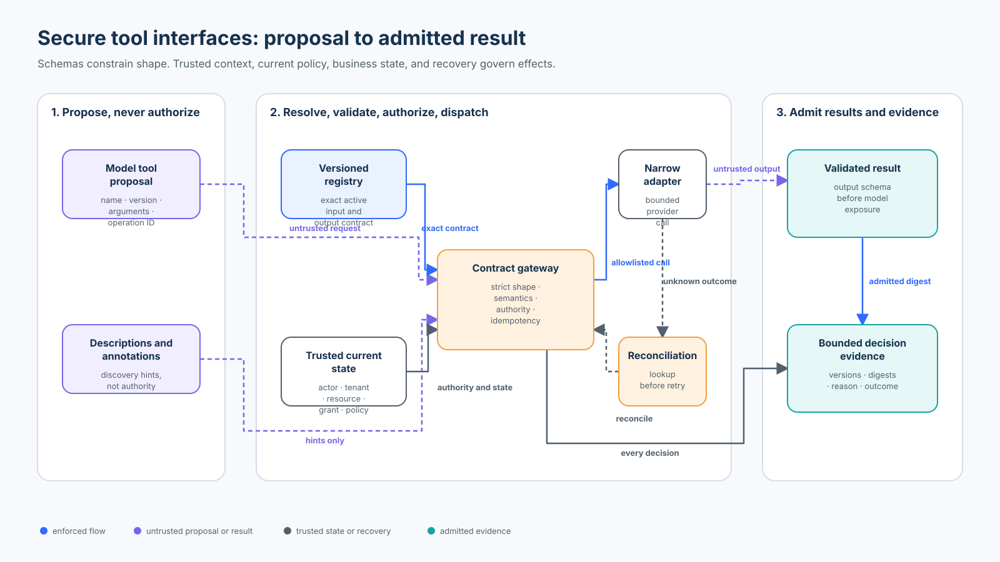

# Foundation 04 — Secure Tool and Action Interface Design

<!-- roadmap-status -->
> **Roadmap status: Published.** The chapter, course-owned lab, real SDK adapter, notebook, focused tests, evaluation, diagram, and checkpoint are delivered together.

**Level:** Foundation · **Time:** 3–4 hours · **Prerequisites:** Python 3.11+, [Foundation 01 trust boundaries](../01-agent-security-architecture-and-trust-boundaries/README.md), [Foundation 02 threat modeling](../02-threat-modeling-agentic-systems/README.md), and [Foundation 03 security invariants](../03-security-invariants-and-blast-radius/README.md)<br>
**Scenario:** a Northwind support agent reads refund policy, proposes a refund, and may request one already-authorized refund effect<br>
**Artifacts:** [lab.py](lab.py) · [sdk_adapter.py](sdk_adapter.py) · [lab.ipynb](lab.ipynb) · [architecture spec](architecture-spec.json) · [diagram](architecture.svg) · [focused tests](../../../../tests/test_secure_tool_interfaces.py)

## Capability statement

By the end of this course, you can design, validate, dispatch, observe, and
productionize a narrow, versioned tool contract without mistaking schema
validity, tool discovery, descriptions, annotations, or SDK approval hooks for
authority. You will prove that:

1. broad administrative tools are absent from the runtime registry;
2. an exact active contract version resolves before dispatch;
3. strict structural validation rejects unknown fields and type coercion;
4. semantic and business checks run after syntax checks;
5. authenticated identity and authorization come from trusted application state;
6. only an allowlisted implementation can create an external effect;
7. tool output is validated before it returns to a model;
8. retries preserve a stable logical operation and reconcile unknown outcomes;
9. traces contain bounded identifiers, versions, reasons, and digests rather
   than raw sensitive arguments; and
10. safety, utility, failure handling, and execution coverage are measured as
    separate claims.

This course improves the original reading sequence rather than changing its
thesis: replace `admin(command)`, `run_shell(command)`, `fetch_url(url)`,
`execute_sql(query)`, and `write_file(path, content)` with specific actions such
as `read_refund_policy`, `propose_refund`, and `issue_approved_refund`.



## 1. The central distinction: interface is not authority

A tool interface answers questions such as:

- What operation is being proposed?
- Which input fields and types are valid?
- Which output shape is promised?
- Which contract version is active?
- Is the operation a read, proposal, or effect?
- What timeout and retry behavior is supported?

It does **not** answer:

- Who is the authenticated caller?
- Which tenant and resource does the caller currently control?
- Is this effect authorized under current policy and business state?
- Is a human approval valid for these exact arguments now?
- Did a timed-out provider request commit?

The model proposes a typed action. The trusted application supplies identity,
resolves current resource state, evaluates authorization, and owns dispatch.
A schema-valid call can still be cross-tenant, above the refundable balance,
bound to an expired grant, or unsafe to retry.

### Trust-boundary inventory

| Value | Source | Trust treatment |
| --- | --- | --- |
| Tool name, version, arguments, operation ID | model/orchestrator | untrusted proposal |
| Tool description and annotations | registry/server metadata | discovery hints; never caller authority |
| Subject, tenant, scopes | authenticated application context | trusted input to policy, not model-visible arguments |
| Case owner, active state, refundable balance | system of record | resolve at decision time |
| Execution grant | trusted authorization service | exact, current, identity-bound evidence; developed in Foundation 05 |
| Provider result | external dependency | untrusted until output and business invariants pass |
| Trace | gateway | bounded decision evidence, protected according to data classification |

## 2. From broad capabilities to narrow actions

An interface such as `admin(command: str)` combines discovery, interpretation,
authorization, and arbitrary execution behind one text field. Even a perfect
JSON parser cannot make its authority narrow.

Decompose by intent and consequence:

| Broad tool | Narrow replacement | Effect class | Model-visible fields |
| --- | --- | --- | --- |
| `execute_sql(query)` | `read_refund_policy(policy_id)` | read | policy identifier |
| `write_file(path, content)` | `propose_refund(case_id, amount_cents, reason_code)` | propose | business fields only |
| `admin(command)` | `issue_approved_refund(case_id, amount_cents, currency)` | execute | effect fields only |

The execute action intentionally excludes `subject`, `tenant`, `scope`,
`is_admin`, credentials, approval state, and provider routing. Those are
server-owned. Adding them to the model schema creates a confused-deputy
boundary: untrusted text would be supplying its own authority.

### Read, propose, execute

- **Read** returns information and should still enforce tenant, sensitivity,
  purpose, and rate policy where relevant.
- **Propose** creates a reviewable candidate but no external effect. It should
  be safe to regenerate and compare.
- **Execute** changes external state. It needs current authorization,
  idempotency, outcome evidence, and a recovery contract.

Do not hide an execute operation behind a name such as `prepare_refund`.
Classification follows consequence, not wording.

## 3. A complete tool contract

The lab's immutable `ToolContract` records:

| Contract field | Refund example | Why it matters |
| --- | --- | --- |
| Name and semantic version | `issue_approved_refund@1.0.0` | discovery is bound to the contract actually dispatched |
| Purpose | one authorized refund for one active case | constrains review and ownership |
| Effect class | `execute` | selects stronger policy and recovery |
| Input rules | exact keys, types, patterns, enums, range | prevents coercion and parameter smuggling |
| Output rules | receipt, case, amount, currency, state | prevents malformed output entering context |
| Required scope | `refund:execute` | documents a policy input; it is not self-enforcing |
| Timeout | 2,000 ms | defines operational behavior |
| Retry safety | true only with a stable operation ID | prevents accidental duplicate effects |
| Active state | registry-owned | enables explicit retirement and fail-closed lookup |

### Structural validation

Structural validation proves that data conforms to a declared shape. The lab
rejects missing and unknown fields, uses exact Python types so `True` does not
silently become integer `1`, constrains identifiers, caps amounts, and allows
only `CAD`.

JSON Schema Draft 2020-12 is the current published JSON Schema dialect. OpenAPI
can describe API operations using JSON Schema-compatible schemas. These are
strong interoperability primitives, but neither grants business authority. See
[JSON Schema Draft 2020-12](https://json-schema.org/draft/2020-12), its
[validation vocabulary](https://json-schema.org/draft/2020-12/json-schema-validation),
and the [OpenAPI Specification](https://spec.openapis.org/oas/latest.html).

### Semantic and business validation

Schema-valid inputs can still be invalid requests. The gateway resolves the
case in a trusted registry and verifies that it exists, belongs to the
authenticated tenant, is active, and has enough refundable balance. These
checks require live application state. A schema maximum of 50,000 does not
prove that a particular case has 50,000 remaining.

### Authorization

The lab accepts an `ExecutionGrant` created by a trusted fixture and bound to
the proposal digest, actor, tenant, policy version, and expiry. It exists to
keep the interface boundary realistic. Foundation 05 owns the deeper treatment
of least privilege, independent approval, revocation, issuance, and atomic
consumption. Here the essential rule is that the model cannot mint or modify
the grant.

## 4. Versioning and lifecycle

Tool discovery is a snapshot, not a permanent promise. A client may hold a
schema after the implementation or policy has changed. Resolve the exact name
and version at dispatch time and reject unknown, inactive, or stale contracts.

A practical lifecycle is:

1. author the input, output, consequence, timeout, retry, and ownership contract;
2. add consumer and provider contract tests;
3. publish an immutable version;
4. allowlist it for specific agents and environments;
5. observe usage, failure, and policy outcomes;
6. deprecate with an explicit window;
7. deactivate and reject it; and
8. remove it only after callers and retained workflows no longer reference it.

Treat a meaning change as breaking even when the JSON shape is unchanged. If
`amount_cents` changes from gross refund to net refund, publish a new version.
A schema diff alone cannot detect semantic drift.

## 5. Dispatch and result admission

The lab gateway performs this order:

```text
exact registry lookup
  → authenticated actor and required scope
  → strict input validation
  → current business-state validation
  → exact execution-grant validation for effects
  → idempotency lookup
  → allowlisted adapter
  → strict output validation
  → bounded trace and admitted result
```

The registry and dispatcher are closed sets. A proposed `run_shell` call has no
implementation to reach. Avoid dynamic imports, reflection over arbitrary
names, string-to-shell bridges, and fallback routes that convert an unknown
tool into a general executor.

Output is another trust boundary. Provider output may be malformed, oversized,
injected, stale, or bound to the wrong operation. The lab rejects missing and
extra output fields before the result can return to a model. Later courses
deepen content-level output poisoning; this course establishes the contract
boundary.

## 6. Idempotency, timeout, and unknown outcomes

An idempotency key is not merely a request ID. It must identify one logical
effect and bind to the exact proposal. The lab stores the proposal digest with
the operation ID:

- same operation ID + same digest → return the prior result;
- same operation ID + different digest → reject `operation-id-collision`;
- timeout before dispatch → record an error; no provider effect is known;
- timeout after commit → record `UNKNOWN`; do not invent success or failure;
- retry after `UNKNOWN` → query the provider using the original operation ID
  and admit the recovered receipt without a second effect.

The in-process lock proves a local transition only. Production requires a
durable uniqueness constraint or transaction shared by all workers and a
provider that supports idempotency and lookup.

## 7. State of practice and SDK review — September 2026

| Technology | Useful interface mechanism | What it does not prove |
| --- | --- | --- |
| JSON Schema Draft 2020-12 | portable structural constraints and vocabularies | identity, live state, authorization, outcome |
| OpenAPI | discoverable HTTP operations, schemas, lifecycle documentation | that an agent may invoke an operation now |
| MCP 2026-07-28 | named tools, input schema, optional output schema, structured content | that a name or annotation is a capability |
| Pydantic 2 | strict parsing, constraints, generated schema, `extra="forbid"` | application authorization or provider truth |
| OpenAI function calling | strict function schema and application-controlled execution loop | that a suggested call is authorized |
| OpenAI Agents SDK 0.22.x | typed tools, strict schema, output schema, approval hooks, guardrails, timeout | that a workflow hook replaces current resource authorization |

The current MCP tool specification requires servers to validate inputs and
recommends that clients validate results; it also warns clients to treat tool
annotations as untrusted unless they come from a trusted server. Apply access
control and rate limiting at the application boundary. See the
[MCP 2026-07-28 tools specification](https://modelcontextprotocol.io/specification/2026-07-28/server/tools).

Pydantic normally supports coercion. For security-relevant boundaries, use
[strict mode](https://docs.pydantic.dev/latest/concepts/strict_mode/), forbid
extra fields with [`ConfigDict`](https://docs.pydantic.dev/latest/api/config/),
and inspect the generated [JSON Schema](https://docs.pydantic.dev/latest/concepts/json_schema/).

OpenAI function calling describes tool calls as suggestions that the application
must execute. Strict schemas improve argument conformance; the application still
controls which functions are available and what happens at execution. See the
official [function calling guide](https://developers.openai.com/api/docs/guides/function-calling)
and [tools guide](https://developers.openai.com/api/docs/guides/tools).

OWASP's excessive-agency guidance highlights excessive functionality,
permissions, and autonomy as distinct causes of unsafe effects. Narrow
interfaces reduce exposed functionality, while application policy must still
reduce permissions and autonomy. See
[OWASP LLM06:2025 Excessive Agency](https://genai.owasp.org/llmrisk/llm062025-excessive-agency/).

## 8. Practical lab

From the repository root:

```bash
python3 curriculum/roadmap/beginner/04-secure-tool-and-action-interface-design/lab.py
python3 -m pytest -q tests/test_secure_tool_interfaces.py tests/test_secure_tool_interfaces_sdk.py
jupyter notebook curriculum/roadmap/beginner/04-secure-tool-and-action-interface-design/lab.ipynb
```

No key, model call, network access, or cloud account is required.

### Walkthrough A — unsafe baseline versus registry

`unsafe_broad_dispatch` accepts any non-empty tool name and arguments. Compare
that baseline with the gateway's exact `(name, version)` registry. Try
`run_shell`, an unknown version, and a retired contract.

Expected property: the baseline accepts the attack request; the gateway rejects
it before any implementation runs.

### Walkthrough B — syntax versus meaning

Exercise unknown fields, a string amount, a Boolean amount, an invalid enum,
a cross-tenant case, an inactive case, and an amount above the refundable
balance. Record whether each failure is structural or semantic.

Expected property: schema-valid input can still fail business and authority
checks; the trace reason preserves that distinction.

### Walkthrough C — exact authorization

Create an execution grant for a 2,500-cent refund, then change the amount or
contract version. Observe that the digest binding fails. Identity, tenant,
policy version, and expiry are also checked from trusted state.

Expected property: authorization for one proposal cannot be reused for a
different effect.

### Walkthrough D — output validation and recovery

Inject `MALFORMED_OUTPUT`; the result must not be admitted. Then inject
`TIMEOUT_AFTER_COMMIT`: the first decision is `UNKNOWN`, and the second call
reconciles provider state without a second provider dispatch.

Expected property: no malformed output reaches the model and exactly one
external refund exists.

### Walkthrough E — real SDK mapping

`sdk_adapter.py` uses the installed OpenAI Agents SDK and Pydantic. Inspect:

- `strict_json_schema is True`;
- input and output schemas set `additionalProperties: false`;
- every input field is required and bounded;
- identity, tenant, scope, grant, and credentials are absent;
- `needs_approval` is enabled as an orchestration hook; and
- the validated payload still enters the same trusted gateway.

The decorated SDK function is deliberately not a second execution path. A
production runner callback must call the application gateway; invoking a
framework wrapper directly must not bypass current policy.

## 9. Evaluation contract

`evaluate_controls()` runs 12 labelled cases:

| Population | Count | Included cases |
| --- | ---: | --- |
| Valid | 3 | read policy, propose refund, execute authorized refund |
| Attack | 7 | broad tool, stale version, authority field, Boolean confusion, cross-tenant case, amount limit, missing grant |
| Failure | 2 | malformed provider output, post-commit timeout |

The report keeps denominators explicit:

- **attack block rate** = blocked attack cases / 7;
- **attack effect rate** = attack cases that created an admitted effect / 7;
- **valid-task success rate** = successful valid cases / 3;
- **unsafe-baseline attack acceptance rate** = baseline-accepted attacks / 7;
- **trace completeness rate** = cases with required evidence / 12.

Expected deterministic result: attack block rate 1.0, attack effect rate 0.0,
valid-task success rate 1.0, baseline attack acceptance 1.0, and trace
completeness 1.0. The two dependency failures are not counted as successful
defenses; they are a separate operational population.

These fixtures prove only the implemented cases in one process. They do not
estimate real-world attack probability or production effectiveness.

## 10. Evidence and privacy

Each trace records call ID, exact contract, logical operation ID, authenticated
subject and tenant, decision, reason, argument digest, and admitted-result
digest. It does not store raw arguments.

Hashing is data minimization, not anonymization. Low-entropy fields can be
guessed, and stable digests permit correlation. Production telemetry needs
access control, tenant separation, retention limits, keyed or salted digests
where appropriate, encryption, and an incident-use policy. Never log secrets,
tokens, raw prompts, or provider credentials merely because they appeared in a
tool call.

## 11. Production replacement checklist

Replace the teaching implementation with:

- authenticated user and workload identity propagated outside model arguments;
- an immutable schema registry with ownership, provenance, environment,
  compatibility policy, deprecation, and rollback;
- a policy decision point resolving current tenant, resource, and business state;
- exact, expiring, revocable authorization with separation of duties;
- an allowlisted adapter registry with no shell/SQL/filesystem fallback;
- durable idempotency and concurrency control shared by all workers;
- provider idempotency keys, status lookup, reconciliation queues, and operator
  workflows for persistent unknown outcomes;
- deadlines, circuit breakers, rate limits, quotas, backpressure, and safe
  degradation by effect class;
- input/output size limits, classification, redaction, and invalid-result quarantine;
- protected traces linking discovery, proposal, policy, dispatch, receipt, and admission;
- contract, property, integration, concurrency, chaos, and adversarial tests;
- owners and service objectives for registry, policy, provider, reconciliation,
  and evidence pipelines; and
- kill switches that remove execution capability without erasing prior evidence.

The local dictionaries, lock, synthetic grant, and provider simulator prove the
control sequence only. They do not provide distributed consistency, durable
recovery, production key protection, or enterprise authorization.

## 12. Checkpoint

A model emits a schema-valid `issue_approved_refund` call. The SDK has strict
mode enabled and its workflow reports that approval was requested. The case is
owned by another tenant. Should the provider adapter run?

- A. Yes; strict mode plus an approval hook proves safety.
- B. Yes; the tool description says it issues only approved refunds.
- C. No; resolve authenticated context and current resource state, then deny the
  cross-tenant request before dispatch.

**Answer: C.** Schema conformance, descriptions, and framework workflow hooks
do not grant authority. The application boundary must authorize the exact
caller, tenant, resource, arguments, contract, policy, and time.

## 13. Exercises

1. Add `read_case_summary(case_id)` with an output size limit and prove a
   cross-tenant case never reaches the adapter.
2. Retire `propose_refund@1.0.0`, publish `1.1.0`, and write compatibility and
   stale-discovery tests.
3. Inject a timeout before dispatch and contrast its recovery with a timeout
   after commit.
4. Add a provider result with the right JSON types but the wrong case ID; define
   and enforce the missing semantic output invariant.
5. Replace the in-memory operation table with a durable uniqueness constraint
   and explain its transaction boundary.
6. Map the same contract to MCP or another agent SDK while preserving the
   application-owned authorization and result-admission boundary.

## References

- [JSON Schema Draft 2020-12](https://json-schema.org/draft/2020-12)
- [OpenAPI Specification](https://spec.openapis.org/oas/latest.html)
- [MCP 2026-07-28 tool specification](https://modelcontextprotocol.io/specification/2026-07-28/server/tools)
- [Pydantic strict mode](https://docs.pydantic.dev/latest/concepts/strict_mode/)
- [OpenAI function calling](https://developers.openai.com/api/docs/guides/function-calling)
- [OWASP LLM06:2025 Excessive Agency](https://genai.owasp.org/llmrisk/llm062025-excessive-agency/)

Previous: [Foundation 03 — Security Invariants and Blast Radius](../03-security-invariants-and-blast-radius/README.md)<br>
Next: [Foundation 05 — Authorization, Approval, and Least Privilege](../05-authorization-approval-and-least-privilege/README.md)
