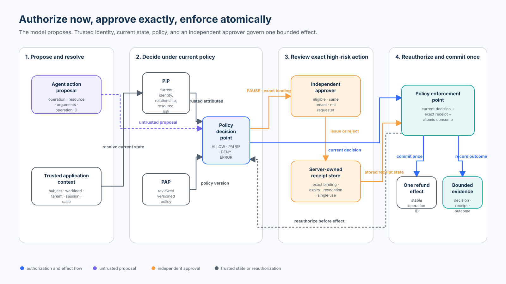

# Foundation 05 — Authorization, Approval, and Least Privilege

<!-- roadmap-status -->
> **Roadmap status: Published.** The chapter, course-owned lab, real SDK adapter, notebook, focused tests, evaluation, diagram, and checkpoint are delivered together.

**Level:** Foundation · **Time:** 3–4 hours · **Prerequisites:** Python 3.11+, [Foundation 01 trust boundaries](../01-agent-security-architecture-and-trust-boundaries/README.md), [Foundation 03 security invariants](../03-security-invariants-and-blast-radius/README.md), and [Foundation 04 tool interfaces](../04-secure-tool-and-action-interface-design/README.md)<br>
**Scenario:** a Northwind support agent can read policy, propose refunds, execute a small refund, and request an independent approval for a larger exact refund<br>
**Artifacts:** [lab.py](lab.py) · [sdk_adapter.py](sdk_adapter.py) · [lab.ipynb](lab.ipynb) · [architecture spec](architecture-spec.json) · [diagram](architecture.svg) · [focused tests](../../../../tests/test_authorization_approval_least_privilege.py)

## Capability statement

By the end of this course, you can derive least-privilege authority from
authenticated identity and current application state, obtain a deterministic
policy decision, issue an independent exact approval for a high-risk action,
and atomically reauthorize and consume that approval at the effect boundary.

You will prove that:

1. authentication, authorization, approval, credentials, and capabilities are
   related controls with different meanings;
2. model text, personas, tool descriptions, and model-supplied roles never
   create authority;
3. token scopes are an upper bound, not a complete resource decision;
4. tool exposure is reduced from trusted subject, workload, tenant, resource,
   action, time, purpose, session, and risk context;
5. a policy decision point returns `ALLOW`, `PAUSE`, `DENY`, or `ERROR`, while
   a policy enforcement point owns effects;
6. approval is independent evidence for one exact action, not a substitute for
   authorization;
7. expiry, revocation, changed policy, changed resource state, changed
   arguments, and replay all fail before the effect;
8. current authorization, receipt validation, single-use consumption, and the
   effect share one atomic boundary in the teaching implementation;
9. dependency errors remain errors rather than being counted as blocked
   attacks; and
10. safety, utility, least-privilege exposure, and evidence coverage use
    explicit populations and denominators.

This course deepens the original reading rather than replacing its thesis:
authorization answers whether an authenticated principal may perform a
specific operation now; approval adds evidence for a high-risk action; neither
is a sentence in a prompt or an assertion made by a model.



## 1. Five concepts that must not collapse into one

| Concept | Question answered | Northwind example | It does not prove |
| --- | --- | --- | --- |
| Authentication | Who or what presented a valid identity? | `employee:7` and `workload:support-agent` | permission for this case or amount |
| Authorization | May this subject and workload perform this action on this resource now? | may refund `case:north:42` under current policy | that a high-risk action was independently reviewed |
| Approval | Did an eligible independent person approve this exact proposed effect? | finance approved 2,500 CAD for one operation | that policy and resource state are still current |
| Credential | What evidence lets a principal authenticate or call a service? | session, access token, workload certificate | application-level resource authorization |
| Capability or grant | What bounded authority may be exercised? | one action, resource, amount, audience, and expiry | successful execution or an unchanged environment |

The application, not the model, owns the authenticated actor. A tool argument
such as `is_admin=true`, a system prompt saying “you are an administrator,” or
a model response saying “approved” is untrusted input. The lab includes
`model_claimed_role` only to prove that it is ignored.

### Scopes are ceilings, not decisions

An OAuth scope such as `refund:execute` can restrict what a token may ever do.
It cannot by itself answer whether:

- the case belongs to the active tenant;
- the employee is related to this customer or queue;
- the case is still active and refundable;
- 2,500 CAD is within the current business limit;
- the session has required assurance;
- the stated purpose is allowed; or
- an independent approval is current and unused.

Treat token claims as authenticated inputs to authorization. Do not convert a
broad scope into a blanket application permission.

## 2. Least privilege is a runtime derivation

NIST defines least privilege as restricting users, or processes acting for
users, to the minimum privileges needed for assigned tasks. For an agent, the
minimum spans several dimensions:

| Dimension | Example restriction |
| --- | --- |
| Human subject | authenticated employee, not a name in model output |
| Workload | the support-agent service, not any bearer of the user session |
| Tenant | `north` only |
| Relationship | support agent assigned to the relevant queue or customer |
| Resource | one active refund case |
| Action | read, propose, or one narrow execute operation |
| Arguments | exact amount, currency, purpose, and logical operation ID |
| Time | current session and short approval lifetime |
| Environment | production audience and required session assurance |
| Budget | direct limit, approved amount, and remaining refundable balance |

The lab's `minimum_tool_set` removes tools that cannot be useful in the current
trusted context. An unauthenticated or unprivileged actor sees no tools; a
Northwind support agent sees only applicable read, propose, and refund tools;
`admin_refunds` is never exposed.

Tool hiding improves usability and reduces accidental invocation, but it is
not enforcement. A stale client can retain an old schema, a compromised model
can invent a tool name, and a direct caller can bypass discovery. The PEP must
authorize every request even when discovery was perfectly filtered.

### Derive, do not accumulate

Avoid a long-lived agent session that accumulates every permission it has ever
needed. Derive the action set for the current subject, workload, tenant,
resource, task, and time. Remove authority when the task, relationship,
resource state, or session assurance changes. A refresh should recompute
authority; it should not blindly recreate the previous union.

## 3. Choose an authorization model deliberately

No single model solves every enterprise relationship.

| Model | Strength | Typical failure | Agent use |
| --- | --- | --- | --- |
| ACL | direct subject-to-resource grants are simple | lists become difficult to govern at scale | exceptional access to one case |
| RBAC | roles are understandable and auditable | role explosion and overly broad permissions | coarse job-function ceiling |
| ABAC | combines subject, resource, action, and environment attributes | untrusted or stale attributes undermine the decision | tenant, purpose, amount, session, time |
| ReBAC | expresses ownership, membership, parent, and sharing relationships | relationship data needs lifecycle and consistency controls | “assigned agent may act on this customer case” |
| Policy-based | centralizes rules, versions, testing, and decision evidence | a remote PDP adds availability and consistency questions | combine role, relationship, attributes, and risk |

The Northwind lab combines models:

- RBAC requires the trusted `support-agent` role;
- scope checks constrain the credential ceiling;
- ABAC checks tenant, purpose, amount, currency, session assurance, and state;
- resource data represents the case relationship; and
- versioned policy decides whether an independent approval is required.

A production design might use OpenFGA for relationship checks and Cedar or OPA
for contextual policy. Composition needs an explicit algorithm, version
binding, latency budget, failure semantics, and a single enforcement owner.
“Both systems usually allow” is not a policy.

## 4. PDP, PEP, PIP, and PAP

The lab separates four responsibilities:

- **Policy Decision Point (PDP):** evaluates trusted subject, action, resource,
  and context under a versioned policy.
- **Policy Enforcement Point (PEP):** intercepts the operation, obtains the
  decision, validates approval, owns dispatch, and records the outcome.
- **Policy Information Point (PIP):** supplies current identity, case,
  relationship, session, tenant, risk, and business data.
- **Policy Administration Point (PAP):** manages reviewed, tested, versioned
  policy and its deployment lifecycle.

The model is outside all four roles. It may propose an action, but it cannot
select the trusted actor, edit resource ownership, publish policy, approve its
own request, interpret a policy error as allow, or invoke the provider directly.

### Decision request

The lab creates a digest over trusted and proposed fields:

```text
subject + workload + tenant + trusted roles/scopes + session assurance
  + operation + resource ID/version + exact proposal digest + policy version
```

This resembles Cedar's principal/action/resource/context (PARC) model and the
OpenID AuthZEN subject/action/resource/context information model. The digest is
evidence of exact binding, not a secret or a signature.

### Decision states

| State | Meaning | PEP behavior |
| --- | --- | --- |
| `ALLOW` | current policy permits execution without additional approval | continue inside the effect boundary |
| `PAUSE` | policy permits review but requires additional evidence | issue no effect; request eligible approval |
| `DENY` | current trusted evidence says the action is forbidden | issue no effect; return a bounded reason |
| `ERROR` | the decision or required evidence could not be obtained reliably | issue no effect; retry, degrade, or escalate according to operation class |

Do not flatten `ERROR` into `DENY` in evaluation. Both prevent an immediate
effect, but only `DENY` is trustworthy negative authorization evidence. An
unavailable PDP is missing assurance, not proof that the policy blocked an
attack.

Likewise, never treat a missing response, absent OPA `result`, HTTP timeout, or
malformed decision as allow. Optional degradation must be defined by action
class in advance—for example, serving a bounded public read from an approved
cache. A refund effect has no safe “best effort” bypass.

## 5. Exact approval is evidence, not authority

The original chapter required an approval bound to principal, tenant,
operation, resource, arguments hash, policy version, expiry, and single-use
state. The lab preserves and expands that invariant.

An `ApprovalReceipt` binds:

- approval ID and original decision ID;
- decision-request and proposal digests;
- authenticated subject and workload;
- tenant, operation, and resource;
- resource version and policy version;
- independent approver identity;
- issue time and expiry; and
- server-owned lifecycle state.

The approval store, not the caller, owns whether a receipt is `ISSUED`,
`CONSUMED`, or `REVOKED`. Presenting a plausible JSON object or inventing an
approval ID cannot create a stored receipt.

### Separation of duties

The lab requires an authenticated `finance-approver` in the same tenant and
rejects self-approval. Production policy may also require organizational
independence, no reporting relationship, amount-specific authority, current
training, conflict checks, and a quorum.

Approval UX should show the exact consequence, resource, amount, tenant,
requester, reason, policy result, expiry, and meaningful diff. Intermediate
Course 10 owns deeper human-factors design, delayed resumptions, escalation,
fatigue, and multi-channel workflow. This foundation course owns the security
binding and final enforcement.

### Reauthorize after approval

Approval can take seconds or days. During that time:

- policy may change;
- the case may close or transfer tenants;
- refundable balance may fall;
- the actor's role or session may be revoked;
- the requested amount may change; or
- the approval itself may be revoked.

The PEP therefore reruns current authorization immediately before the effect
and compares the new decision binding to the receipt. Approval never freezes
the world and never overrides a current deny.

## 6. Atomicity, replay, and TOCTOU

A correct sequence is:

```text
agent proposes an exact action
  → PEP resolves authenticated context and current state
  → PDP returns PAUSE plus decision evidence
  → independent approver reviews the exact binding
  → trusted store issues a short-lived receipt
  → PEP reauthorizes under current policy and state
  → PEP validates receipt and revocation state
  → PEP atomically consumes receipt and commits one effect
  → bounded trace links proposal, decision, approval, and outcome
```

A check followed by an unlocked update is vulnerable to time-of-check/time-of-
use races. Two workers can both observe `ISSUED` and both create an effect. The
lab places reauthorization, receipt validation, provider-effect simulation,
and the `CONSUMED` transition inside one lock. `concurrency_probe()` sends eight
workers through one receipt and proves exactly one effect.

The lock is not a production distributed transaction. Replace it with one of:

- a database transaction and unique effect/approval constraints;
- compare-and-swap on a durable state machine;
- a single-writer queue or actor with durable delivery semantics; or
- a provider idempotency key plus durable receipt consumption and outcome
  reconciliation.

Define crash points. If a provider can commit before local receipt state is
durable, the outcome may be unknown. Preserve the original logical operation
ID, reconcile provider state, and never create a fresh approval to conceal an
ambiguous first attempt. Foundation 04 covers that provider recovery contract
in depth.

## 7. State of practice and standards — September 2026

| Technology | Useful mechanism | Boundary to preserve |
| --- | --- | --- |
| OpenID AuthZEN Authorization API 1.0 | interoperable subject/action/resource/context evaluation and Boolean decision | transport failure and application `PAUSE`/obligations still need explicit semantics |
| Cedar | PARC requests, default deny, permit/forbid policies, schema and policy validation, diagnostics | validate requests separately and decide how the application handles diagnostics/errors |
| Open Policy Agent (OPA) | general context-aware policy, bundles, REST and embedded evaluation | authenticate and protect PDP traffic; absent/invalid result is not allow |
| OpenFGA | relationship tuples, authorization models, checks, conditional relationships | combine fast-changing request attributes and lifecycle deliberately |
| OAuth 2.0 / RFC 9700 | protected authorization flows, sender constraints, audience and privilege restriction | tokens and scopes do not replace resource authorization |
| OAuth Rich Authorization Requests / RFC 9396 | structured `authorization_details` for requested authorization | authorization-server consent is not a current application PDP decision |
| OpenAI Agents SDK 0.22.x | typed function tools and static or dynamic `needs_approval` interruptions | a workflow pause does not replace final application authorization |

AuthZEN 1.0 defines an interoperable access-evaluation information model and a
Boolean `decision`. Its optional response context can carry implementation-
defined reasons, advice, obligations, or step-up hints. If your application
requires portable obligation semantics, define and version them explicitly;
do not assume every PDP interprets free-form context identically.

Cedar evaluates principal, action, resource, and context against policy. It is
default-deny and a satisfied `forbid` overrides permits. Cedar also documents
skip-on-error at the individual policy level and returns diagnostics. An
integration must understand those semantics, validate policy and request
shapes, inspect diagnostics where required, and separately handle engine or
transport failure. “We use Cedar” is not a complete failure policy.

OPA accepts structured input and returns policy data. Secure the channel,
authenticate callers, constrain who can publish bundles, validate the expected
decision shape, and fail closed for effects when the decision is undefined or
unavailable.

OpenFGA answers relationship checks from an authorization model and tuples;
conditions add time, IP, entitlement, and other attribute constraints. Decide
which source owns relationships, how deletion and revocation propagate, and
how stale tuple or contextual data affects a high-risk decision.

OpenAI's official approval flow pauses a run, returns interruptions and
resumable state, lets the application approve or reject, and resumes the same
run. The lab's `sdk_adapter.py` uses the installed SDK's dynamic
`needs_approval` callback with the course PDP. It then routes approved
arguments through the same PEP. The decorated function deliberately raises if
called as an alternate execution path.

## 8. Practical lab

From the repository root:

```bash
python3 curriculum/roadmap/beginner/05-authorization-approval-and-least-privilege/lab.py
python3 -m pytest -q tests/test_authorization_approval_least_privilege.py tests/test_authorization_approval_sdk.py
jupyter notebook curriculum/roadmap/beginner/05-authorization-approval-and-least-privilege/lab.ipynb
```

No API key, model call, network access, cloud account, or external PDP is
required.

### Walkthrough A — derive the minimum tool set

Call `minimum_tool_set` for the normal actor, an unauthenticated actor, an actor
without support role or scopes, and a resource in another tenant. Compare the
result with the five-entry catalog.

Expected property: discovery shrinks with trusted context and never includes
the broad admin tool, but every selected tool still requires PEP enforcement.

### Walkthrough B — role-only baseline versus current policy

The deliberately unsafe `unsafe_role_only_authorization` accepts a support role
or model-claimed administrator. Exercise missing scopes, cross-tenant state,
wrong purpose, insufficient session assurance, and an amount above the current
limit.

Expected property: the baseline accepts every attack fixture while the PDP
uses trusted identity, relationship, resource, action, purpose, and risk.

### Walkthrough C — direct limit and approval threshold

Run a 500-cent refund and a 2,500-cent refund. Current policy allows the first
and pauses the second. The pause creates no effect. Issue an independent
receipt for the exact second action, then enforce it.

Expected property: low-risk authority is bounded by current policy; high-risk
execution occurs only after exact approval and final reauthorization.

### Walkthrough D — alter, revoke, expire, and change state

After approval, change the amount, invent an approval ID, revoke the real
receipt, advance beyond expiry, increment the resource version, and change the
policy version.

Expected property: each mutation is rejected before an effect. The receipt is
evidence for one frozen proposal, not a transferable permission.

### Walkthrough E — race the receipt

Run `concurrency_probe(workers=8)`. All workers present the same valid receipt
and proposal at the same time.

Expected property: one worker applies one effect; seven are denied. The effect
ledger contains exactly one logical operation.

### Walkthrough F — inject dependency failures

Set `pdp.available = False`, then separately set
`approvals.available = False` for a high-risk request.

Expected property: both outcomes are `ERROR`, no effect exists, and evaluation
does not count either as a policy block.

### Walkthrough G — real SDK approval mapping

Run `sdk_adapter.credential_free_demo()`. Inspect the real function-tool schema
and dynamic approval callback:

- only resource, amount, currency, purpose, and logical operation ID are
  model-visible;
- subject, tenant, roles, scopes, session, and approval ID stay server-side;
- Pydantic rejects extra authority fields, Boolean-as-integer confusion, and
  invalid enum values;
- the callback pauses the high-risk action; and
- final execution still enters the course PEP with current trusted state.

Expected property: the SDK orchestrates a pause; the application grants and
enforces authority.

## 9. Evaluation contract

`evaluate_controls()` runs 14 labelled cases:

| Population | Count | Included cases |
| --- | ---: | --- |
| Valid | 4 | policy read, refund proposal, direct-limit refund, independently approved refund |
| Attack | 8 | model-claimed role, cross-tenant resource, missing approval, altered amount, forged approval ID, revoked approval, replay, changed resource state |
| Failure | 2 | unavailable PDP, unavailable approval store |

The report keeps claims and denominators separate:

- **attack block rate** = non-successful attack cases / 8;
- **attack effect rate** = attack cases that applied an effect / 8;
- **valid-task success rate** = successful valid cases / 4;
- **blocked-valid-task rate** = unsuccessful valid cases / 4;
- **role-only baseline attack acceptance** = baseline-accepted attacks / 8;
- **trace completeness** = cases with required decision evidence / 14; and
- **least-privilege exposure reduction** = catalog tools not exposed / 5 for
  the normal scenario.

Expected deterministic result: attack block rate 1.0, attack effect rate 0.0,
valid-task success rate 1.0, blocked-valid-task rate 0.0, role-only baseline
acceptance 1.0, trace completeness 1.0, and one effect from eight concurrent
attempts.

These fixtures prove the implemented cases in one process. They do not measure
production attack probability, human review quality, policy correctness, or
distributed consistency.

## 10. Decision evidence and privacy

Each trace records a trace and decision ID, authenticated subject and workload,
tenant, operation, resource ID, proposal digest, policy version, approval ID,
status, reason, and whether an effect occurred. Raw business arguments are not
stored in the trace.

A digest is not anonymization. Low-entropy amounts and identifiers can be
guessed; stable digests enable correlation. Production evidence needs:

- tenant-separated access control and encryption;
- field-level data classification and minimization;
- keyed or salted digests where correlation is not required;
- retention and deletion rules aligned with audit and privacy obligations;
- tamper evidence and authenticated producer identity;
- clock quality and event ordering;
- links to policy, identity, resource, approval, provider, and outcome versions;
- restricted break-glass access with review; and
- monitoring for missing traces, not only recorded denies.

Never log access tokens, credentials, raw prompts, hidden reasoning, or full
customer data merely because they were present near an authorization request.

## 11. Production replacement checklist

Replace the teaching implementation with:

- enterprise user and workload identity with revocation and audience binding;
- trusted PIPs for tenant, relationship, resource, session, risk, and business
  state, each with ownership and freshness expectations;
- versioned policy review, tests, provenance, staged rollout, rollback, and
  emergency deny controls;
- authenticated and encrypted PDP communication or a reviewed embedded engine;
- explicit handling for allow, deny, obligations, diagnostics, timeout,
  malformed result, and unavailable dependencies;
- dynamic capability discovery plus unconditional enforcement at each effect;
- durable, auditable approval workflow with separation of duties, delegation
  rules, expiry, revocation, and exact consequence display;
- transactionally enforced single-use approval and logical-operation identity;
- provider idempotency, outcome lookup, and reconciliation for ambiguous
  commits;
- rate, amount, tenant, resource, action, time, and cumulative-budget limits;
- protected decision receipts and privacy-aware observability;
- policy unit, mutation, property, integration, concurrency, chaos,
  adversarial, and valid-task tests;
- service objectives and accountable owners for identity, PIP, PDP, approval,
  PEP, provider, and evidence systems; and
- rehearsed revocation, kill switch, incident, and recovery procedures.

The local dictionaries, mutable policy, process lock, synthetic identities, and
effect ledger teach invariants. They do not provide durable state, distributed
atomicity, cryptographic receipt authenticity, production identity, or legal
non-repudiation.

## 12. Checkpoint

A support agent receives finance approval for a 2,500 CAD refund. Before the
run resumes, the case moves to another tenant and the resource version changes.
The SDK still holds the approval interruption and exact original arguments.
Should the provider execute?

- A. Yes; the human approved the exact original amount.
- B. Yes; resuming the same SDK run preserves authority.
- C. No; the PEP must reauthorize current subject, tenant, resource, arguments,
  policy, and approval state, then reject the stale binding.

**Answer: C.** Approval records a review decision; it does not freeze policy or
resource state. Workflow continuity is not authorization. Final enforcement
must use current trusted state and consume only a current exact receipt.

## 13. Exercises

1. Add queue membership as a relationship and prove that role alone cannot
   authorize a case outside the employee's assigned queue.
2. Add a cumulative daily refund budget with atomic consumption and test two
   approvals racing for the final remaining amount.
3. Map the lab request into the AuthZEN 1.0 subject/action/resource/context
   shape and preserve local `PAUSE` and `ERROR` semantics around its Boolean
   decision.
4. Implement equivalent Cedar or OPA policy tests and document how undefined
   results, diagnostics, bundle failure, and transport timeout map to the
   course states.
5. Model the case hierarchy in OpenFGA and test direct, inherited, contextual,
   revoked, and cross-tenant relationships.
6. Replace the process lock with a durable uniqueness constraint and inject a
   crash before and after the provider commits.
7. Add two independent approvers above 50,000 cents and prove neither can
   approve twice or approve its own request.
8. Define a safe read-only degradation rule, inject PDP failure, and prove no
   propose or execute action enters that path.

## References

- [NIST glossary — least privilege](https://csrc.nist.gov/glossary/term/least_privilege)
- [NIST SP 800-53 Rev. 5 — AC-5 Separation of Duties](https://csrc.nist.gov/projects/cprt/catalog#/cprt/framework/version/SP_800_53_5_1_1/home)
- [OpenID AuthZEN Authorization API 1.0](https://openid.net/specs/authorization-api-1_0.html)
- [Cedar authorization model](https://docs.cedarpolicy.com/auth/authorization.html)
- [Cedar policy and request validation](https://docs.cedarpolicy.com/policies/validation.html)
- [OPA HTTP API authorization](https://www.openpolicyagent.org/docs/http-api-authorization)
- [OPA integration and undefined-result behavior](https://www.openpolicyagent.org/docs/integration)
- [OpenFGA concepts](https://openfga.dev/docs/concepts)
- [OpenFGA conditions](https://openfga.dev/docs/modeling/conditions)
- [OAuth 2.0 Security Best Current Practice — RFC 9700](https://datatracker.ietf.org/doc/html/rfc9700)
- [OAuth 2.0 Rich Authorization Requests — RFC 9396](https://datatracker.ietf.org/doc/html/rfc9396)
- [OpenAI guardrails and human review](https://developers.openai.com/api/docs/guides/agents/guardrails-approvals)
- [OpenAI function calling](https://developers.openai.com/api/docs/guides/function-calling)

Previous: [Foundation 04 — Secure Tool and Action Interface Design](../04-secure-tool-and-action-interface-design/README.md)<br>
Next: [Foundation 06 — Prompt Injection and Untrusted Content](../06-prompt-injection-and-untrusted-content/README.md)
