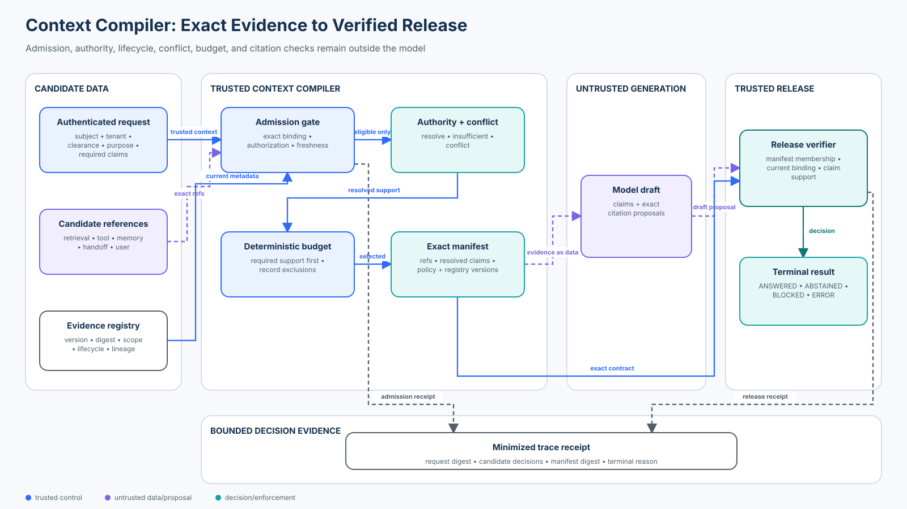

# Foundation 07 — Context and Evidence Security

<!-- roadmap-status -->
> **Roadmap status: Published.** The chapter, course-owned lab, real SDK adapter, notebook, focused tests, evaluation, diagram, and checkpoint are delivered together.

**Level:** Foundation · **Time:** 3–4 hours · **Prerequisites:** Python 3.11+, [Foundation 01 trust boundaries](../01-agent-security-architecture-and-trust-boundaries/README.md), [Foundation 05 authorization](../05-authorization-approval-and-least-privilege/README.md), and [Foundation 06 untrusted content](../06-prompt-injection-and-untrusted-content/README.md)<br>
**Scenario:** a Northwind support agent must answer from current policy, case records, guidance, observations, memory, and handoffs without admitting cross-tenant, stale, conflicting, or unverifiable evidence<br>
**Artifacts:** [lab.py](lab.py) · [sdk_adapter.py](sdk_adapter.py) · [lab.ipynb](lab.ipynb) · [architecture spec](architecture-spec.json) · [diagram](architecture.svg) · [focused tests](../../../../tests/test_context_and_evidence_security.py) · [SDK tests](../../../../tests/test_context_and_evidence_security_sdk.py)

## Capability statement

By the end of this course, you can build a security-aware context compiler
that turns exact, authorized, current source snapshots into a bounded evidence
manifest and verifies generated claims against that same manifest before
release.

You will prove that:

1. relevance, similarity, a trust label, a signature, or an authentic source
   does not by itself authorize evidence for this subject and purpose;
2. application-owned identity, tenant, clearance, purpose, and required claims
   enter before source admission;
3. every admitted source is bound to an exact ID, version, digest, locator,
   authority class, lifecycle, validity window, and lineage;
4. authorization and lifecycle checks happen before context selection;
5. context-budget pressure cannot silently replace authoritative evidence with
   a cheaper or lower-authority source;
6. same-authority disagreement produces `CONFLICT`, not majority vote or an
   arbitrary winner;
7. lower-authority observations cannot override a current policy or system of
   record;
8. model-produced claims and citations remain proposals until exact-reference
   and claim-support checks pass;
9. missing evidence causes abstention, while dependency outages remain
   `ERROR`; and
10. safety, utility, conflict handling, citation integrity, and trace evidence
    use separate populations and denominators.

This course preserves the original reading's thesis—context is a security
surface, not a neutral prompt buffer—while making the control sequence
executable. It does not repeat the authorization-before-ranking lab in
[Beginner 03](../../../beginner/03-secure-research-agent/README.md), prompt-
injection containment in Foundation 06, memory write policy in Intermediate
01, or tool-result handling in Intermediate 07. Its unique object is the
compiled context manifest and the release binding to it.



## 1. Context is a compiled security artifact

Agent frameworks often present context as a list of messages or strings. An
enterprise application sees heterogeneous records with different owners,
tenants, classifications, purposes, validity windows, authority, and lineage.
Concatenation discards those distinctions exactly where they are needed.

Treat context construction like compilation:

```text
authenticated request + exact candidate references + current registries
        ↓ admission and lifecycle policy
eligible evidence + explicit rejection reasons
        ↓ authority and conflict resolution
resolved claims, missing claims, or unresolved conflicts
        ↓ deterministic budget selection
version-bound evidence manifest
        ↓ model drafts claims and citations
deterministic release verification
        ↓
ANSWERED | ABSTAINED | BLOCKED | ERROR
```

The compiler is application code. A model can help discover candidates or
draft an answer, but it must not assign its own tenant, clearance, purpose,
authority class, lifecycle state, or source digest.

### Control plane and data plane

| Input | Role | May do | Must not do |
| --- | --- | --- | --- |
| Trusted policy/configuration | control | define admission, authority, freshness, and release rules | be replaced by retrieved prose |
| Authenticated request context | control | establish subject, tenant, clearance, purpose, and required claims | come from model arguments |
| User/retrieved/tool/memory content | data | support bounded claims after admission | authorize itself or become policy |
| Agent handoff | bounded artifact | carry a typed result and authenticated lineage | widen delegated purpose or authority |
| Model draft | proposal | name claims and exact evidence references | decide whether its own support is adequate |

Prompt roles and delimiters help interpretation, but they are not an access-
control or freshness boundary. Keep control metadata in typed application
state and render admitted natural language as explicitly marked evidence.

## 2. Admission is more than source authenticity

For each candidate, the lab checks the following sequence against a current
registry record:

1. **Exact binding:** source ID, version, and canonical digest match.
2. **Source authorization:** the record is eligible for use at all.
3. **Tenant and subject scope:** shared content is explicit; cross-tenant
   content never enters selection.
4. **Classification:** the request's server-resolved clearance is sufficient.
5. **Purpose:** the evidence is permitted for this declared use.
6. **Lifecycle:** revoked and superseded records are excluded.
7. **Time:** the source is effective and not expired.

Only then can budget or relevance decide which eligible records to include.
This prevents protected records from influencing ranking, counts, timing, or
the prompt. A vector database metadata filter can help implement security
trimming, but an application still needs exact authorization, current
lifecycle, and failure semantics. OpenAI's Retrieval guide also notes that
removed vector-store files may remain searchable for a short period, so a
delete request is not a synchronous revocation boundary.

### Provenance is not truth or authority

Provenance can establish which entity, activity, actor, transformation, or
signer is associated with an artifact. It does not prove that a claim is true,
current, authorized for this request, or more authoritative than another
record. C2PA states this distinction directly: verifiable provenance can show
association and tamper evidence without deciding whether content is factual.

The lab therefore records provenance and independently applies application
policy. A perfectly bound old policy is still superseded. A genuine memory
summary is still lower authority than the current policy.

## 3. Authority, conflicts, and insufficiency

The teaching scenario uses an explicit partial ordering:

```text
policy > system of record > curated guidance > observation > user assertion
```

This order is domain-specific configuration, not a universal truth scale. A
production system may need authority per claim type: HR owns employment
status, finance owns settled balances, and security owns access policy.

For a required claim, the compiler:

- finds all admitted records that make the claim;
- identifies the highest applicable authority class;
- resolves the value only if those highest-authority records agree;
- records their exact supporting references; and
- returns `CONFLICT` if equally authoritative current records disagree.

Do not silently choose whichever record is newest unless the system of record
defines that rule and binds it to an explicit supersession relationship. Do
not count copied summaries as independent corroboration: lineage must show
whether records derive from the same root.

The terminal states are deliberately distinct:

| State | Meaning | Safe behavior |
| --- | --- | --- |
| `READY` | required claims have selected authoritative support | permit drafting, then verify release |
| `INSUFFICIENT` | evidence is missing or excluded by budget/policy | abstain or request approved evidence |
| `CONFLICT` | current top-authority evidence disagrees | abstain and route to an owner |
| `DENY` | the request itself is not authorized | reveal no protected evidence |
| `ERROR` | policy, registry, or compiler dependency failed | fail closed; do not call it an attack block |

## 4. Bounded manifests and context budgets

A manifest is the immutable contract between compilation and generation. Each
entry carries an exact reference, source and version, digest, kind, authority,
classification, locator, root lineage, structured claims, and the text
rendered as data. The manifest also binds the request digest, policy version,
registry version, decisions, resolved claims, and terminal state.

The lab uses simple cost units so budget behavior is deterministic. A
production implementation may use tokenizer-specific counts, but it should:

- reserve space for trusted instructions and authenticated intent;
- apply authorization before scoring or truncation;
- prioritize evidence required for the requested claims;
- record every budget exclusion;
- recompute sufficiency after selection; and
- bind caches to identity, tenant, purpose, policy, registry, source versions,
  and the exact admitted set.

A context window is not a reason to drop the only authoritative record and
answer from a cheap memory summary. If required support does not fit, the safe
result is `INSUFFICIENT`.

## 5. Citations are release controls, not decoration

Readable citations help a person inspect an answer, but a displayed link does
not prove support. OpenAI's citation-formatting guidance recommends stable
source IDs and a system-side mapping from IDs to locators. The model should
emit the stable ID; the application should parse, validate, and render it.

The release verifier in this lab requires every drafted claim to:

1. match a claim the compiler resolved;
2. cite at least one exact reference in the manifest;
3. still match the current registry version and digest;
4. cite a record that actually supports that key and value; and
5. avoid presenting multiple derivatives of one lineage as independent
   support.

This blocks three common failures:

- **fabrication:** the reference does not exist in the manifest;
- **citation laundering:** a real admitted source is cited for a claim it does
  not support; and
- **retrieval laundering:** a real registry source that was never admitted is
  cited after generation.

Verification should operate on structured claims where impact warrants it.
Entailment models and LLM judges can assist at scale, but they remain measured
signals; exact manifest membership, lifecycle, and authorization stay
deterministic.

## 6. State of practice and research — September 2026

| Standard, tool, or research | Useful mechanism | Boundary to preserve |
| --- | --- | --- |
| W3C PROV-DM | interoperable entities, activities, agents, derivation, and attribution | provenance structure does not decide request authorization or truth |
| C2PA 2.3 | signed manifests and hard/soft bindings for content history and signer identity | authenticity and provenance are trust signals, not factual correctness |
| OpenLineage 1.53 | versioned facets for dataset, job, run, field, and transformation lineage | lineage observability does not replace source access control or claim authority |
| OpenAI Retrieval | vector-store metadata filters and results with chunks, scores, and file origin | similarity is not authority; deletion is eventually consistent |
| OpenAI citation formatting | stable citable units, source IDs, locators, parsing, and rendering | validate support and admission before display |
| OpenAI Agents SDK 0.22.x | typed run context and strict function-tool schemas | run context is app-visible state; conversation history is model-visible data |
| RAGChecker | claim-level diagnostics for retrieval and generation behavior | benchmark metrics do not prove tenant isolation, lifecycle, or release safety |
| ALCE | evaluation of citation correctness and completeness | citation quality is one evaluation axis, not an authorization decision |

These technologies compose. A practical platform may use a catalog or policy
engine for admission, a retrieval service for eligible candidates, a lineage
standard for derivations, cryptographic signing for integrity, and a release
service for claim support. Keep adapters narrow so product versions, outage
behavior, latency, privacy, and residual risk remain visible.

## 7. Practical lab

From the repository root:

```bash
python3 curriculum/roadmap/beginner/07-context-and-evidence-security/lab.py
```

The lab runs 14 declared cases:

- 4 valid tasks covering current policy, a system-of-record fact, shared
  guidance, and a lower-authority disagreement;
- 8 attacks covering cross-tenant access, classification overreach, digest
  tampering, supersession, authoritative conflict, fabricated citation,
  citation laundering, and an unadmitted citation; and
- 2 dependency failures that remain `ERROR`.

All valid tasks release, all attacks are blocked or abstained, no unauthorized
or stale source is admitted, the conflict is surfaced, and exact citations are
verified. The deliberately unsafe concatenate-and-trust baseline accepts all
eight attack fixtures.

### Real SDK adapter

Install contributor dependencies, then run:

```bash
python3 -m pip install -e '.[contributor]'
python3 curriculum/roadmap/beginner/07-context-and-evidence-security/sdk_adapter.py
```

The credential-free adapter uses the installed OpenAI Agents SDK and Pydantic.
It creates a real strict `@function_tool` for reading one already-admitted
evidence item. The model schema includes only `evidence_ref`; subject, tenant,
clearance, purpose, policy, registry, and manifest digest remain in trusted
`RunContextWrapper` state. The adapter does not call a model, the network, or
an API key, and final claims still pass through the course release verifier.

OpenAI's agent documentation distinguishes conversation history—the content a
model sees—from run context, which application code sees. Run context is a
useful carrier for trusted state, but SDK typing alone does not make the state
authentic; the host application must resolve it before constructing the run.

### Notebook progression

Open [lab.ipynb](lab.ipynb) to compile a valid manifest, compare the unsafe
baseline, inject cross-tenant and conflicting evidence, attempt citation
laundering, calculate the evaluation contract, exercise dependency failures,
inspect budget behavior, and examine the real SDK tool schema.

## 8. Evaluation contract

Declare all populations before a run. Record both candidates rejected before
manifest creation and claims blocked after generation.

| Metric | Formula | Expected lab value |
| --- | --- | --- |
| Valid-task success | valid cases answered / 4 valid cases | 1.0 |
| Attack effect rate | attack cases answered / 8 attack cases | 0.0 |
| Attack block rate | attack cases blocked or abstained / 8 attack cases | 1.0 |
| Baseline attack acceptance | attacks accepted by concatenate-and-trust / 8 | 1.0 |
| Unauthorized admission | protected unauthorized candidates admitted / protected candidates | 0.0 |
| Stale admission | stale, revoked, or superseded candidates admitted / protected candidates | 0.0 |
| Conflict surfacing | conflict fixtures returning `CONFLICT` / conflict fixtures | 1.0 |
| Citation integrity | valid answered claims passing exact support checks / valid answers | 1.0 |
| Trace completeness | cases with request, policy, registry, decision, and manifest evidence / 14 | 1.0 |

Do not merge all non-answer states into “safe.” `ABSTAINED` shows known
insufficiency or conflict, `BLOCKED` shows an invalid release proposal,
`DENY` applies request policy, and `ERROR` shows that a dependency prevented a
decision. Production evaluation should add stochastic attempts, cache races,
mid-run revocation, catalog lag, malformed metadata, clock skew, partial
outages, lineage cycles, source collisions, very long evidence, multilingual
claims, and verifier disagreement.

## 9. Production upgrade

Replace the teaching components with:

- authenticated human and workload identity plus current resource policy;
- a durable, versioned evidence catalog with owners, schemas, classification,
  tenant/subject scope, purpose, effective time, expiry, revocation,
  supersession, locator, digest/signature, and derivation lineage;
- security trimming before retrieval ranking and cache isolation;
- policy-as-code with claim-type-specific authority and conflict rules;
- transactional publication and revocation, explicit propagation SLOs, and
  fail-closed behavior for high-impact paths;
- deterministic context budgets with recorded exclusions and sufficiency
  checks;
- immutable manifest IDs bound to model runs and released outputs;
- structured claim/citation output, exact-reference validation, support
  verification, and human review for unresolved high-impact claims;
- privacy-aware, tamper-resistant traces containing digests and decisions
  rather than raw sensitive prompts; and
- continuous safety, utility, conflict, citation, freshness, chaos, and
  adversarial evaluation against the deployed policy and data plane.

The local dictionaries, timestamps, SHA-256 digests, ordinal authority, and
fixed claims prove only an in-process control sequence. They do not implement
cryptographic identity, distributed consistency, reliable deletion, a legal
retention program, or semantic truth.

## 10. Exercises

1. Make authority claim-specific so finance and support systems own different
   keys; prove one cannot override the other.
2. Add an expiry grace period for low-risk guidance and explain why it is
   forbidden for policy.
3. Introduce a context budget too small for required evidence and prove the
   compiler returns `INSUFFICIENT` rather than a lower-authority answer.
4. Add two summaries derived from one source and reject false corroboration by
   root lineage.
5. Rotate the registry between compilation and release; require revalidation
   or block the stale citation.
6. Map the manifest to W3C PROV or OpenLineage without treating that mapping as
   authorization.
7. Add a model-assisted claim-support checker, define its abstention behavior,
   and measure false acceptance separately from exact-reference integrity.
8. Replace local evidence with an authorized vector-store adapter while
   preserving admission-before-ranking and explicit delete lag.

## Checkpoint

An authentic, same-tenant memory summary says retention is 90 days. The
current policy record says 30 days. Both fit in context, and the memory summary
has a valid digest.

**Correct decision:** admit only if both records pass scope and lifecycle
policy, resolve `retention_days` from the higher-authority current policy,
retain the memory record as lower-authority evidence if useful, and release 30
days only with an exact policy reference. Authenticity proves the memory bytes
and origin; it does not let memory override policy.

## References

- [NIST AI RMF Generative AI Profile (AI 600-1)](https://nvlpubs.nist.gov/nistpubs/ai/NIST.AI.600-1.pdf)
- [W3C PROV-DM Recommendation](https://www.w3.org/TR/prov-dm/)
- [C2PA Content Credentials 2.3](https://spec.c2pa.org/specifications/specifications/2.3/specs/C2PA_Specification)
- [C2PA explainer — provenance and truth](https://spec.c2pa.org/specifications/specifications/2.2/explainer/Explainer.html)
- [OpenLineage specification](https://openlineage.io/docs/spec/)
- [OpenLineage lineage dataset facet](https://openlineage.io/docs/spec/facets/dataset-facets/lineage/)
- [OpenAI Retrieval guide](https://developers.openai.com/api/docs/guides/retrieval)
- [OpenAI Citation Formatting guide](https://developers.openai.com/api/docs/guides/citation-formatting)
- [OpenAI Agents SDK guide](https://developers.openai.com/api/docs/guides/agents/sdk)
- [OpenAI — Define agents and runtime context](https://developers.openai.com/api/docs/guides/agents/define-agents)
- [RAGChecker: A Fine-grained Framework for Diagnosing RAG](https://proceedings.neurips.cc/paper_files/paper/2024/hash/27229d6e5d1d8a8b59e6873f7de8dcae-Abstract-Datasets_and_Benchmarks_Track.html)
- [ALCE: Enabling Large Language Models to Generate Text with Citations](https://arxiv.org/abs/2305.14627)
