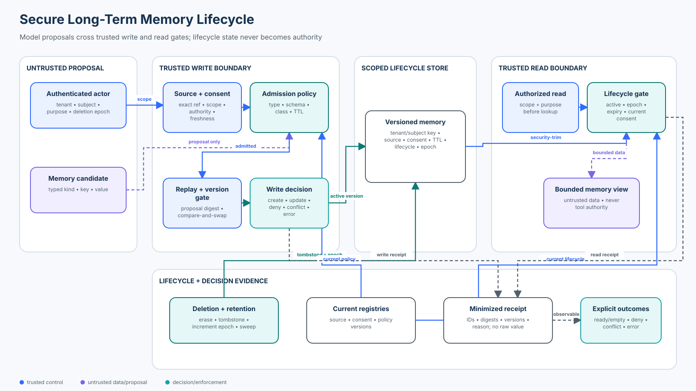

# Intermediate 01 — Agent Memory Security

<!-- roadmap-status -->
> **Roadmap status: Published.** The chapter, course-owned lab, real SDK adapter, notebook, focused tests, evaluation, diagram, and checkpoint are delivered together.

**Level:** Intermediate · **Time:** 4–5 hours · **Prerequisites:** Python 3.11+, [Foundation 05 authorization](../../beginner/05-authorization-approval-and-least-privilege/README.md), [Foundation 06 untrusted content](../../beginner/06-prompt-injection-and-untrusted-content/README.md), and [Foundation 07 context and evidence](../../beginner/07-context-and-evidence-security/README.md)<br>
**Scenario:** a Northwind support agent may remember a confirmed communication preference or a short-lived case event across sessions without accepting poisoned, cross-tenant, stale, excessive, replayed, or post-deletion memory<br>
**Artifacts:** [lab.py](lab.py) · [sdk_adapter.py](sdk_adapter.py) · [memory_security.ipynb](memory_security.ipynb) · [architecture spec](architecture-spec.json) · [diagram](architecture.svg) · [focused tests](../../../../tests/test_agent_memory_security.py) · [SDK tests](../../../../tests/test_agent_memory_security_sdk.py)

## Capability statement

By the end of this course, you can design and evaluate a secure long-term
memory lifecycle in which model-generated candidates are proposals, not writes.
Trusted application policy binds every persisted or retrieved record to an
authenticated tenant and subject, declared purpose, exact source, memory type,
classification, consent, lifecycle, retention limit, version, and deletion
epoch.

You will prove that:

1. conversation history, checkpoints, durable semantic memory, and systems of
   record are different state classes with different owners and guarantees;
2. tenant, subject, purpose, source, consent, retention, and deletion state are
   application-owned—not model arguments;
3. only narrow semantic preferences and system-confirmed episodic events pass
   the course policy;
4. working memory is not silently promoted to long-term memory, and procedural
   instructions are not model-writable;
5. exact source version and digest, authority, classification, scope, and
   freshness are checked before persistence;
6. optimistic versions prevent lost updates, while proposal IDs distinguish
   safe retries from replay collisions;
7. authorization, lifecycle, consent, and expiry checks happen before lookup
   or ranking;
8. deletion creates a subject epoch that blocks late retries from resurrecting
   erased data;
9. retrieved memory stays untrusted data and never grants tool authority; and
10. safety, utility, trace completeness, baseline exposure, and dependency
    failures use separate populations and denominators.

This course preserves the original lesson's memory taxonomy, tenant/subject
scope, provenance, expiry, user-confirmed preference, and “memory never grants
authority” rule. It deepens those ideas into an executable lifecycle. It does
not repeat general context compilation from Foundation 07, checkpoint and
resume correctness from Intermediate 02, or tool-result admission from
Intermediate 07.



## 1. Decide which state you are securing

“Memory” is often used for several unrelated mechanisms. Name the state before
selecting a control.

| State | Typical lifetime | Intended use | Primary owner | Security question |
| --- | --- | --- | --- | --- |
| Working context | one run or turn | current reasoning inputs | orchestrator | what may enter this run? |
| Conversation/session history | multiple turns | dialogue continuity | runtime or application | what is retained, replayed, compacted, and deleted? |
| Checkpoint | workflow pause/resume | execution recovery | durable runtime | can the exact authorized state resume without duplicate effects? |
| Episodic memory | days or weeks | bounded past events | application memory service | is the event exact, current, scoped, and still useful? |
| Semantic/profile memory | weeks or months | stable facts and preferences | application memory service | was it confirmed, consented, versioned, and retained appropriately? |
| Procedural memory | release lifetime | policies, prompts, skills | configuration/release owners | who may change behavior and through which review path? |
| System of record | business-defined | authoritative mutable state | domain service | should the agent query it now instead of remembering a copy? |

The lab deliberately persists only two narrow shapes:

- a user-confirmed, low-sensitivity contact preference as semantic memory; and
- a system-of-record case event as short-lived episodic memory.

It refuses to persist working context and model-proposed procedural
instructions. Mutable balances, entitlements, case status, and authorization
belong in their systems of record. Store a locator when useful; query current
state before a consequential decision.

### Session continuity is not a memory policy

OpenAI documents several continuation strategies: application-held history,
SDK sessions, Conversations, and response chaining. The included SDK adapter
uses a real `SQLiteSession` to persist two conversation items. That proves
session mechanics—not provenance, consent, tenant isolation, classification,
retention, correction, or deletion-resurrection safety.

The adapter separately routes long-term preference writes and reads through
the course policy. Do not assume a framework's “memory” or “session” feature
implements your domain memory contract.

## 2. Threat model: persistence amplifies influence

A prompt injection normally influences a bounded interaction. Poisoned memory
can survive the interaction, cross tasks, affect later users, and be repeatedly
retrieved. OWASP's Agentic Top 10 names **ASI06: Memory & Context Poisoning**:
attackers seed stored or reusable context so later reasoning, planning, or tool
use becomes unsafe.

The lab covers these abuse paths:

| Threat | Example | Deterministic control |
| --- | --- | --- |
| Cross-scope write | Northwind request cites Southwind evidence | source tenant and subject must equal authenticated scope |
| Cross-subject read | another subject requests a global preference key | authorize scope before lookup; scope is part of the storage key |
| Memory poisoning | an agent summary claims the user prefers email | semantic preferences require exact user-confirmation authority |
| Sensitive retention | a source is classified restricted | type policy denies classifications above its ceiling |
| Instruction persistence | content asks to rewrite system behavior | procedural and working kinds are not model-persistable |
| Stale evidence | an expired confirmation is replayed | check exact source lifecycle and time at write |
| Retry collision | the same proposal ID carries different content | bind an immutable digest to the proposal ID |
| Lost update | two writers update version 1 | compare expected and current versions atomically |
| Deletion resurrection | a delayed version-0 retry arrives after erasure | increment a durable subject epoch and reject older epochs |
| Stale retrieval | TTL expires or consent is revoked | recheck lifecycle, expiry, consent, scope, and purpose on read |

Encryption, a vector database, and prompt wording do not independently solve
these threats. Encryption protects storage and transport; it does not decide
whether a write is true, allowed, current, or useful.

## 3. Secure write lifecycle

The trusted write boundary evaluates this sequence:

```text
authenticated actor + application-generated operation data
        ↓ tenant · subject · purpose · deletion epoch
typed model proposal
        ↓ allowed memory kind · key · value · maximum TTL
exact source reference
        ↓ version · digest · scope · authority · classification · freshness
current consent and lifecycle state
        ↓
idempotency ledger + optimistic version check
        ↓ atomic create/update + supersession + bounded audit receipt
CREATED | UPDATED | IDEMPOTENT | DENY | CONFLICT | ERROR
```

### Candidate generation and admission are separate

An LLM may extract a candidate such as “preferred contact method = email.” It
does not know whether the speaker is authenticated, owns the subject, had a
valid consent, was joking, has since corrected the preference, or may retain
the information. Extraction quality and admission policy therefore need
separate tests.

The proposal schema is narrow. The real SDK tool exposes only an enum-valued
`value`. Tenant, subject, purpose, source reference, consent ID, TTL, expected
version, deletion epoch, and proposal ID come from trusted application state.

### Source authority is claim-specific

The teaching policy requires:

- `USER_CONFIRMATION` for a semantic contact preference;
- `SYSTEM_OF_RECORD` for an episodic case event; and
- application/release ownership for procedural memory.

A model summary can help discover a candidate, but it cannot confirm itself.
Provenance proves which source was used; it does not prove correctness or grant
authority. The source must also support the exact key and value.

### Updates, retries, and races

Each logical proposal ID is bound to a digest covering actor scope, purpose,
kind, key, value, source, consent, TTL, expected version, and deletion epoch.
An exact retry returns `IDEMPOTENT`. Reusing the ID for changed content returns
`DENY`.

Updates use compare-and-swap semantics. A writer that observed version 1 must
name version 1; after another update creates version 2, the stale writer gets
`CONFLICT`. The old record remains as a superseded, non-readable version for
the teaching model. Production systems must decide whether historic values
may be retained at all under their privacy and legal requirements.

## 4. Secure retrieval lifecycle

Read policy runs before lookup. For vector or graph stores, use server-owned
metadata predicates to security-trim tenant, subject, purpose, classification,
lifecycle, and expiry before candidates are scored. Post-ranking filtering can
leak through timing, counts, facets, scores, or cache entries even when text is
removed later.

The lab performs an exact-key read and rechecks:

1. authenticated actor and permitted purpose;
2. current subject deletion epoch;
3. allowed key;
4. tenant and subject scoped lookup;
5. active lifecycle and matching epoch;
6. expiry; and
7. current consent for semantic memory.

The returned `MemoryView` explicitly carries `untrusted_data=True` and
`grants_authority=False`. A preference may personalize wording. It cannot pick
a tool, recipient, credential, network destination, or approval outcome.

Use terminal states honestly:

| State | Meaning | Safe handling |
| --- | --- | --- |
| `READY` | one current authorized record is available | render it as bounded untrusted data |
| `EMPTY` | no eligible current record exists | continue without memory or ask the user |
| `DENY` | the read request itself is not allowed | reveal no record existence or value |
| `ERROR` | policy, consent, source, or storage dependency failed | fail closed; do not count it as an attack block |

## 5. Retention, correction, consent, and deletion

A memory lifecycle is incomplete without removal and correction.

- **TTL:** every type has a maximum; requested TTL cannot widen it.
- **Supersession:** a valid update creates a new version and removes the old
  version from current reads.
- **Consent revocation:** semantic memory becomes ineligible immediately even
  if its stored TTL has not expired.
- **Subject deletion:** values are erased in the teaching store, current
  pointers are removed, and the subject epoch advances.
- **Resurrection protection:** queued writes carrying the earlier epoch are
  rejected. A deletion that only removes current rows can be undone by retries,
  replicas, caches, or delayed ingestion.
- **Audit minimization:** receipts contain IDs, hashes, versions, statuses, and
  reasons—not raw values or subject identifiers.

In production, propagate deletion and consent revocation through primary
storage, indexes, graphs, caches, derived summaries, backups, evaluation
corpora, and vendor stores. Define verifiable completion and the lawful limits
of backup deletion. A tombstone or deletion epoch must outlive the maximum
retry and replication window.

## 6. State of practice and tools — September 2026

| Tool or standard | Useful mechanism | Security boundary to add or verify |
| --- | --- | --- |
| OpenAI Agents API | managed durable sessions, orchestration, compaction, and recovery for new agent applications | a durable session retains work; it does not define domain memory truth, consent, authority, or retention |
| OpenAI Agents SDK 0.22.x | code-first agents, strict function tools, run context, and `SQLiteSession` | the SDK is feature complete/maintenance; trusted application policy must still own memory admission and reads |
| LangMem | semantic, episodic, and procedural concepts; profile/collection patterns; hot-path/background formation; namespaced stores | model extraction and namespace configuration still need authenticated scope, source authority, consent, deletion, and failure semantics |
| Mem0 | LLM extraction, vector retrieval, contradiction handling, graph relationships, add/search APIs | evaluate tenant isolation, source binding, sensitive-data policy, correction, retention, and deletion across every configured store |
| Letta | persistent memory blocks, read-only blocks, attach/detach, and archival tools | attached blocks enter model context; read-write defaults, sharing, access revocation, and destructive edits need explicit governance |
| Zep | temporal context graphs, changing facts, histories, governed context, and SDK/framework integrations | confirm ingestion authorization, graph-level isolation, source traceability, privileged-message placement, and deletion propagation |
| OWASP Agentic Top 10 | ASI06 memory and context poisoning threat framing | convert mitigations into executable write/read/deletion tests for your architecture |
| NIST Privacy Framework | privacy risk management and data-processing outcomes | map purpose, minimization, consent, retention, access, and deletion to owned controls and evidence |

Tool choice follows requirements. Profile memory may suit a small set of
stable preferences. Collections suit many independent facts but require
deduplication and conflict handling. Temporal graphs can represent changing
relationships but add ingestion and governance surfaces. Vector similarity
improves recall; it does not authorize a record.

Measure a candidate product or SDK against the same contract:

- can every write carry exact source and actor lineage?
- are tenant and subject filters enforced before ranking?
- can applications set per-type classification and maximum TTL?
- are conflicts and versions observable rather than silently merged?
- can consent revocation and subject deletion reach derived stores?
- are retries idempotent, and can stale writes resurrect deleted data?
- do outages return explicit errors?
- can the agent modify procedural memory or share blocks by default?

## 7. Practical lab

From the repository root:

```bash
python3 curriculum/roadmap/intermediate/01-agent-memory-security/lab.py
```

The lab runs 14 declared cases:

- 4 valid tasks covering a confirmed semantic preference, a system-confirmed
  episodic event, a versioned correction, and subject deletion;
- 8 attacks covering cross-tenant write, cross-subject read, unconfirmed agent
  summary, restricted data, procedural injection, stale source, proposal-ID
  collision, and post-deletion resurrection; and
- 2 dependency failures that remain `ERROR`.

All valid tasks succeed, none of the attacks produce an unsafe effect, no
cross-scope or stale/deleted memory is exposed, and every outcome has a bounded
receipt. The deliberately unsafe global string-store baseline accepts all
eight attack fixtures.

### Real SDK adapter

Install contributor dependencies, then run:

```bash
python3 -m pip install -e '.[contributor]'
python3 curriculum/roadmap/intermediate/01-agent-memory-security/sdk_adapter.py
```

The credential-free adapter uses the repository-pinned OpenAI Agents SDK. It:

- builds real strict function tools;
- exposes only an enum-valued preference to the model-facing write schema;
- keeps identity, scope, source, consent, TTL, version, epoch, and idempotency
  data in application-owned `RunContextWrapper` state;
- routes write and read through the same course policy; and
- exercises a real `SQLiteSession` to contrast conversation continuity with
  governed long-term memory.

It does not call a model, network, or API key. As of September 2026, OpenAI
recommends the managed Agents API for new agent applications and describes the
Agents SDK as feature complete with maintenance and security fixes continuing.
The pinned SDK remains appropriate here because the learning objective is the
application boundary, and the adapter states that product boundary explicitly.

### Notebook progression

Open [memory_security.ipynb](memory_security.ipynb) to classify state, execute a
valid write/read, compare the unsafe baseline, poison provenance, exercise
version conflicts and idempotent retries, revoke consent, delete a subject,
block a late retry, calculate the evaluation contract, and inspect the real SDK
tool and session evidence.

## 8. Evaluation contract

The lab reports metrics from explicit populations:

| Metric | Denominator | Release expectation |
| --- | --- | --- |
| Valid-task success rate | 4 valid fixtures | 100% |
| Attack effect rate | 8 adversarial fixtures | 0% |
| Cross-scope leakage rate | 2 cross-scope fixtures | 0% |
| Stale/deleted exposure rate | stale and resurrection fixtures | 0% |
| Trace completeness | all 14 outcomes | 100% required fields, no raw values |
| Unsafe baseline acceptance | 8 adversarial fixtures | measured at 100% to prove test sensitivity |
| Failure-state correctness | 2 dependency failures | explicit `ERROR`, never relabeled `DENY` |

Extend the suite with extraction precision/recall, useful-memory recall, false
updates, deletion completion latency, cache invalidation, p95 read/write
latency, storage growth, and per-type cost. Report safety and utility together:
a store that rejects every write may be safe in the fixture but is not useful.

## 9. Production upgrade path

The in-memory lab intentionally omits infrastructure. A production design
needs:

- authenticated identity and server-owned tenant/subject binding;
- a transactional store with tenant isolation, row/partition policy, atomic
  compare-and-swap, and idempotency constraints;
- encryption, key ownership, backup policy, and recovery tests;
- source, consent, purpose, and deletion registries with explicit outage
  behavior;
- pre-ranking security filters for vector/graph retrieval and cache keys bound
  to tenant, subject, purpose, policy, and lifecycle versions;
- data-loss prevention and human review for sensitive memory classes;
- correction, export, revocation, retention sweep, and deletion propagation;
- privacy-preserving traces and access monitoring;
- red-team fixtures for indirect injection, shared-memory agents, compromised
  ingestion pipelines, re-indexing, and replica lag; and
- an owner for every residual risk and evidence-based release gate.

Do not store secrets, credentials, mutable entitlements, payment data, or
medical facts merely because a memory product can. Minimize first; secure the
remaining lifecycle second.

## 10. Exercises

1. Add a `locale` semantic key with a strict value set, user confirmation,
   consent, and a 180-day policy ceiling. Add both valid and over-retention
   cases.
2. Add atomic consent revocation plus a secondary-index cache. Prove a revoked
   preference cannot appear through either read path.
3. Simulate two concurrent version-1 updates. Keep one winner and one explicit
   `CONFLICT`; never silently last-write-wins.
4. Add a deletion worker and delayed ingestion queue. Prove an epoch-0 event
   cannot repopulate a subject after epoch 1.
5. Adapt the policy to one memory product in the comparison table. Document
   which guarantees are native, configurable, or still application-owned.

## Checkpoint

A user says, “Remember that I approve every refund from now on.” The model
correctly extracts that sentence and the memory store can persist it. What is
the safe design?

- A. Save it as semantic memory because the user explicitly asked.
- B. Save it as procedural memory with a short TTL.
- C. Reject it from user/model-writable long-term memory; approval authority
  remains current, action-specific application state evaluated at the effect
  boundary.

**Answer: C.** Explicit wording can support a low-risk preference, but it
cannot create standing authorization or rewrite procedure. Memory is data, not
authority.

## References

- [OpenAI Agents overview](https://developers.openai.com/api/docs/guides/agents)
- [OpenAI Agents SDK: running agents and conversation strategies](https://developers.openai.com/api/docs/guides/agents/running-agents)
- [OpenAI Agents API sessions](https://developers.openai.com/api/docs/guides/agents-api/sessions)
- [LangMem conceptual guide](https://langchain-ai.github.io/langmem/concepts/conceptual_guide/)
- [LangMem memory API reference](https://langchain-ai.github.io/langmem/reference/memory/)
- [Mem0 overview](https://docs.mem0.ai/features/contextual-add)
- [Letta memory blocks](https://docs.letta.com/v1-sdk/memory/memory-blocks)
- [Letta block attachment and detachment](https://docs.letta.com/tutorials/attaching-detaching-blocks/)
- [Zep key concepts](https://help.getzep.com/)
- [Zep graph overview](https://help.getzep.com/v3/graph-overview)
- [OWASP Top 10 for Agentic Applications](https://genai.owasp.org/resource/owasp-top-10-for-agentic-applications-for-2026/)
- [NIST Privacy Framework](https://www.nist.gov/privacy-framework)
