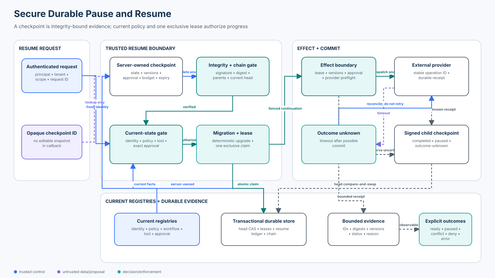

# Intermediate 02 — State, Checkpoint, and Durable-Execution Security

<!-- roadmap-status -->
> **Roadmap status: Published.** The chapter, course-owned durable-workflow lab, real OpenAI Agents SDK adapter, notebook, focused tests, evaluation, architecture diagram, and checkpoint are delivered together.

**Level:** Intermediate · **Time:** 4–5 hours · **Prerequisites:** Python 3.11+, [Foundation 04 secure tools](../../beginner/04-secure-tool-and-action-interface-design/README.md), [Foundation 05 authorization](../../beginner/05-authorization-approval-and-least-privilege/README.md), and [Intermediate 01 memory security](../01-agent-memory-security/README.md)<br>
**Scenario:** a Northwind support workflow pauses before closing a case, survives a deployment and callback, and must resume exactly one current, authorized execution without duplicating the provider effect<br>
**Artifacts:** [lab.py](lab.py) · [sdk_adapter.py](sdk_adapter.py) · [durable_execution_security.ipynb](durable_execution_security.ipynb) · [architecture spec](architecture-spec.json) · [diagram](architecture.svg) · [focused tests](../../../../tests/test_durable_execution_security.py) · [SDK tests](../../../../tests/test_durable_execution_security_sdk.py)

## Capability statement

By the end of this course, you can design and evaluate a secure pause/resume
boundary for an agent workflow. A checkpoint is integrity-bound evidence of a
past execution state; it is not permission to continue. Trusted application
code loads an opaque server-owned snapshot, verifies its complete chain and
lifecycle, reauthorizes current identity and policy, validates the exact
approval and tool contract, applies only registered deterministic migrations,
acquires one exclusive resume lease, and reconciles uncertain external
outcomes before any retry.

You will prove that:

1. conversation history, semantic memory, workflow state, event history, and
   provider receipts are different state classes;
2. a client receives an opaque checkpoint identifier rather than editable
   serialized execution state;
3. every checkpoint binds run, tenant, owner, sequence, workflow and schema
   versions, policy and tool versions, pending step and effect, exact approval,
   budget, expiry, parent digest, and signing key;
4. integrity verification covers the entire parent chain, not only the newest
   blob;
5. resume uses freshly authenticated application context and current policy;
6. one logical resume request is idempotent while competing requests conflict;
7. workflow upgrades require explicit deterministic state migrations;
8. the effect boundary rechecks the lease, policy, tool contract, provider
   availability, and exact approval before dispatch;
9. a timeout after dispatch becomes `OUTCOME_UNKNOWN` and is reconciled with
   the stable operation ID instead of blindly retried; and
10. valid work, attacks, dependency failures, trace completeness, and duplicate
    effects use separate evaluation populations.

The original lesson's pause-boundary, version binding, fresh authorization,
approval expiry, event deduplication, and provider-receipt ideas remain. This
version turns them into an executable course. It does not repeat the approval
issuance model from Foundation 05, semantic-memory governance from Intermediate
01, long-running operational leases from Enterprise 01, or incident forensics
from Enterprise 04.



## 1. Classify state before securing it

“Persistent agent state” is not one thing. Applying one store and one trust
model to every state class creates hidden authority and retention bugs.

| State | Purpose | Typical owner | Security property |
| --- | --- | --- | --- |
| Conversation history | dialogue continuity | agent runtime/application | scoped retention and safe context reconstruction |
| Semantic or episodic memory | cross-session facts and preferences | application memory service | provenance, consent, purpose, correction, deletion |
| Workflow checkpoint | resume one paused execution | durable runtime | integrity, current authorization, version compatibility, exclusive claim |
| Event history | reconstruct decisions deterministically | workflow engine | append-only ordering and replay compatibility |
| Outbox record | bridge a local commit to dispatch | application/database | atomic intent, retry, and dispatch ownership |
| Provider receipt | prove an external operation's observed outcome | external system/application | stable operation identity and reconciliation |
| System of record | authoritative business state | domain service | current domain truth and transaction semantics |

A checkpoint may contain a reference to conversation state, but it must not
turn old text into authority. Semantic memory can inform the next run, but it
does not prove which step already committed. An event history can reconstruct a
workflow, but it cannot prove that a third-party API did not commit after the
client timed out. Those distinctions drive the lab design.

## 2. Threat model: pause creates a new trust boundary

Between pause and resume, any of these facts may change:

- the caller may be logged out, reassigned, or revoked;
- tenant or resource ownership may change;
- policy, workflow code, schema, tool contract, or model configuration may be
  deployed;
- an approval may expire, be revoked, or refer to different arguments;
- the checkpoint may be altered, rolled back, forked, or submitted twice;
- two workers may race to resume the same run;
- a callback may be spoofed or delivered more than once;
- an external provider may commit while the caller observes a timeout; or
- the policy, checkpoint, approval, or provider service may be unavailable.

The durable boundary therefore treats a resume request as a new request. Past
authorization explains why the checkpoint exists; it does not authorize the
next transition.

| Vulnerable assumption | Attack or failure | Deterministic control | Expected outcome |
| --- | --- | --- | --- |
| “The blob came from our UI” | tenant or state is edited | server-owned snapshot plus signature and digest | `DENY` integrity failure |
| “The latest record is signed” | an ancestor is altered | verify every parent digest to the root | `DENY` chain failure |
| “The same user returned” | session or scope was revoked | fresh trusted identity and current authorization | `DENY` |
| “Paused means approved” | approval expires or arguments change | bind exact effect and current policy; revalidate | `PAUSED` |
| “One callback means one worker” | concurrent resume race | atomic exclusive lease | one `READY`, one `CONFLICT` |
| “New code can read old state” | incompatible deployment | explicit registered deterministic migration | `PAUSED` or `ERROR` |
| “Idempotency means exactly once” | timeout after provider commit | stable operation ID and provider reconciliation | no redispatch |
| “An outage blocked an attack” | control dependency fails | explicit fail-closed `ERROR` | missing assurance evidence |

## 3. Checkpoint contract

The course checkpoint is a signed envelope over the complete resume contract:

```text
identity       run_id · tenant · owner_principal · sequence
execution      workflow_version · schema_version · status · pending_step · state
authority      policy_version · tool_version · pending_effect_digest · approval_id
limits         remaining_steps · created_at · expires_at
lineage        parent_id · parent_digest
integrity      key_id · payload_digest · signature
```

The HMAC signer in `lab.py` is a teaching analogue. Production deployments
need keys owned by a KMS or equivalent security boundary, key rotation, audit,
access separation, canonical serialization, and a plan for verifying old
checkpoints after rotation. Encryption protects confidentiality; authenticated
integrity protects against alteration. Most applications require both.

### Server-owned state, opaque client handles

Do not let a browser or callback carry the authoritative serialized snapshot.
Keep the complete state in encrypted, access-controlled server storage and
return an opaque, high-entropy identifier. Authenticate the caller, authorize
access to that identifier, then load and verify the server copy.

This design does not make serialization harmless. A restored state can include
tool calls, arguments, approvals, prior items, and application context. Treat
deserialization as a privileged operation, keep credentials out of serialized
context, impose size and age limits, and reject unknown types or versions.

### Integrity is not authorization

A valid signature answers “was this exact payload sealed by a trusted key?” It
does not answer whether the principal is still active, whether the tenant still
owns the case, whether policy still permits the action, or whether an approval
is current. Those checks use current registries after integrity verification.

## 4. Secure resume sequence

The lab enforces this order:

1. load the server-owned checkpoint by opaque ID;
2. verify the checkpoint and every ancestor, including sequence and parent
   digest links;
3. authenticate the request and authorize the current principal, tenant, scope,
   and owner;
4. require the requested checkpoint to be the current head for its run;
5. reject terminal, expired, or exhausted work;
6. compare current policy and tool contract versions;
7. run a registered deterministic migration when workflow state is older;
8. validate the exact unconsumed approval for the pending effect;
9. return the prior lease for an exact resume-request replay; otherwise acquire
   one exclusive lease or return `CONFLICT`; and
10. emit a bounded receipt containing IDs, digests, versions, status, and reason
    without copying business state.

The order matters. Deserializing arbitrary state before access and integrity
checks expands the attack surface. Acquiring a lease before slow checks can
create denial-of-service pressure. Consuming an approval before confirming
that the provider path is available can strand valid work.

### Terminal states are part of the API

| State | Meaning | Safe handling |
| --- | --- | --- |
| `READY` | one lease may continue | preserve lease identity through the next commit |
| `IDEMPOTENT` | the same logical resume request already owns that lease | return the same decision; do not acquire another |
| `PAUSED` | recoverable current requirement is missing or stale | seek new approval, migration, or operator action |
| `CONFLICT` | another checkpoint or worker owns progress | stop; reload the current head |
| `DENY` | identity, scope, integrity, or binding is invalid | do not reveal snapshot contents |
| `ERROR` | a required dependency or migration failed | fail closed and preserve missing evidence |

Do not collapse `PAUSED`, `CONFLICT`, `DENY`, and `ERROR` into a generic retry.
They have different ownership and safe recovery paths.

## 5. Versioning and deterministic migration

Durable state outlives deployments. The checkpoint therefore binds both a
workflow version and a state schema version. The lab only migrates an exact
registered tuple: `(old workflow, new workflow, old schema) → new schema`.

A migration must be deterministic and free of network, model, clock, random,
or mutable-database reads. The teaching registry executes the function twice
against identical input and rejects different results. Production systems
also need immutable migration artifacts, offline fixtures, forward/backward
compatibility policy, rollout ownership, and rollback tests.

Workflow determinism is narrower than model determinism. Put model calls,
external I/O, current-time reads, and nondeterministic computations in
activities whose inputs and results are recorded. The orchestrator should make
replay-stable decisions from recorded events.

## 6. External effects and the exactly-once illusion

An idempotency key does not authorize an action and does not prove its outcome.
It identifies one logical operation so the provider or application can
recognize retries. The secure effect boundary still checks:

- the active lease and current checkpoint head;
- current identity, policy, workflow, and tool contract;
- the same effect digest and resource binding;
- provider availability before irreversible approval consumption; and
- atomic, single-use approval consumption immediately before dispatch.

If the provider commits and the client times out, the lab writes a signed
`OUTCOME_UNKNOWN` checkpoint. Resume of that checkpoint does not require the
already-consumed approval merely to inspect the outcome. It obtains an
exclusive lease and reconciles the stable operation ID with the provider:

- matching provider receipt → commit `COMPLETED` without redispatch;
- no provider receipt → pause and require fresh approval before a new attempt;
- same operation ID with a different effect digest → `DENY` collision; or
- provider unavailable → explicit `ERROR`.

This is effect-once behavior built from operation identity, provider support,
durable receipts, reconciliation, and current authorization—not a claim that a
distributed network offers magical exactly-once delivery.

## 7. State of practice and tools — September 2026

| Runtime or SDK | Durable mechanism | Security boundary to add or verify |
| --- | --- | --- |
| OpenAI Agents SDK 0.22.x | `RunState.to_json()` / `from_json()`, interruptions, approve/reject, and resume | serialization reconstructs execution state; the application must authenticate the opaque snapshot, caller, approval decision, current policy, and atomic consumption |
| OpenAI Agents API | managed agent runs, durable sessions, tool calls, approvals, and recovery | preserve application authorization, data governance, exact effect binding, and provider outcome semantics around the managed runtime |
| LangGraph | checkpoints by thread, interrupts, retries, and configurable durability modes | pre-interrupt node code can rerun; isolate effects, protect `thread_id`, define checkpointer isolation, and test sync/async durability loss windows |
| Temporal | event history, deterministic workflow replay, activities, retries, signals/updates, and workflow versioning | keep LLM and external I/O in activities, authorize signals/updates, protect namespaces and payloads, and design activity idempotency/reconciliation |
| Azure Durable Task | event-sourced orchestrators, activity functions, durable timers, external events, and replay-safe logging | enforce deterministic orchestrators, authenticate event senders, minimize persisted inputs/outputs, and secure task hubs and storage |
| AWS Step Functions | Standard and Express workflows, execution names, retries, callbacks, and Standard redrive | Standard and Express have different idempotency/durability; bind callback tokens, understand retry/redrive behavior, and make downstream effects idempotent |

Ask the same questions of any orchestrator:

- Is state a complete snapshot, an event history, or both?
- Which identities may create, inspect, signal, cancel, or resume a run?
- Is tenant isolation enforced in storage and lookup—not only in metadata?
- What survives a crash under each durability mode?
- Which code may rerun during replay or retry?
- How are workflow and schema migrations registered and tested?
- Are callbacks, approval tokens, and thread identifiers bearer capabilities?
- Can one atomic primitive claim a resume and advance the current head?
- How are external outcomes reconciled after timeouts?
- Which fields enter logs, traces, backups, and administrative consoles?

## 8. Practical lab

From the repository root:

```bash
python3 curriculum/roadmap/intermediate/02-state-checkpoint-and-durable-execution-security/lab.py
```

The lab runs 16 declared cases:

- 4 valid paths: unchanged resume, registered migration, idempotent resume
  request, and uncertain provider outcome reconciled with one dispatch;
- 10 attacks or stale-state cases: payload tampering, cross-tenant access,
  wrong owner, expiry, policy change, tool change, altered approval binding,
  stale checkpoint, concurrent resume, and unregistered migration; and
- 2 dependency failures: unavailable policy and checkpoint stores, preserved as
  `ERROR` rather than credited as attack blocks.

All valid paths succeed, none of the attacks resumes unsafely, no effect is
duplicated, and every case emits a bounded complete receipt. A deliberately
unsafe “resume any paused state” baseline accepts all ten attacks.

### Real OpenAI Agents SDK adapter

Install contributor dependencies, then run:

```bash
python3 -m pip install -e '.[contributor]'
python3 curriculum/roadmap/intermediate/02-state-checkpoint-and-durable-execution-security/sdk_adapter.py
```

The credential-free adapter constructs a real `RunState`, serializes it with
strict context handling, stores the complete payload in a server-side vault,
and binds only its opaque ID and digest into the course checkpoint. It invokes
`RunState.from_json()` only after the application resume gate returns `READY`
or `IDEMPOTENT`. A changed `max_turns` field proves the digest covers the whole
SDK payload. The adapter does not call a model, network, or API key.

### Notebook progression

Open [durable_execution_security.ipynb](durable_execution_security.ipynb) to
classify durable state, inspect one signed checkpoint, compare the unsafe
baseline, tamper with a snapshot, migrate old state, race two resume requests,
change a tool contract between resume and effect, reconcile a timeout after
commit, separate dependency failures, calculate the evaluation contract, and
round-trip a real SDK `RunState` behind the application gate.

## 9. Evaluation contract

| Metric | Denominator | Release expectation |
| --- | --- | --- |
| Valid resume success | 4 valid fixtures | 100% |
| Unsafe resume rate | 10 attack/stale fixtures | 0% |
| Duplicate effect count | uncertain-outcome fixture | 0 |
| Integrity detection | tampered-checkpoint fixtures | 100% |
| Concurrency conflict handling | declared resume-race fixtures | 100% |
| Trace completeness | all 16 outcomes | 100% required fields, no business payload |
| Unsafe baseline acceptance | 10 attack fixtures | measured at 100% to prove suite sensitivity |
| Failure-state correctness | 2 dependency failures | explicit `ERROR`, never relabeled `DENY` |

Extend production evaluation with crash-injection at every persistence boundary,
lease contention and expiration, recovery time objective, event-history growth,
migration corpus coverage, callback forgery, provider reconciliation latency,
approval abandonment, p95 resume latency, and storage cost. Report utility and
safety together; a runtime that never resumes valid work has not passed.

## 10. Production upgrade path

The in-memory lab intentionally omits infrastructure. A production design
needs:

- encrypted, authenticated, tenant-isolated checkpoint and event-history
  storage with current-head compare-and-swap;
- KMS-backed integrity, rotation, canonical serialization, retention, and
  restore tests;
- transactional exclusive resume leases with fencing tokens and expiry rules;
- authenticated callbacks with nonce, audience, run, event type, expiry, and
  replay protection;
- immutable versioned workflow releases and a reviewed migration registry;
- outbox/inbox, provider idempotency, or query-by-operation-ID support plus an
  explicit uncertain-outcome state;
- current identity, resource, policy, tool, and approval registries with
  defined outage behavior;
- secret-free state schemas, payload encryption, size limits, and deserializer
  allowlists;
- bounded audit receipts, replay-safe logs, metrics, alerting, and redacted
  administrative views;
- disaster recovery that proves checkpoint heads, leases, event ordering, and
  provider receipts remain consistent; and
- owners for pause queues, stranded approvals, migration failures, unknown
  outcomes, retention, and residual risk.

## 11. Exercises

1. Add a signed callback envelope bound to run, checkpoint, event type,
   audience, nonce, and expiry. Test forged, replayed, and cross-tenant events.
2. Replace the in-memory lease with a database compare-and-swap plus fencing
   token. Simulate an expired worker trying to commit after a new worker wins.
3. Add a two-step schema migration and a fixture corpus. Prove each historic
   version reaches one canonical current state or pauses explicitly.
4. Simulate a crash immediately before dispatch, after provider commit, and
   after local checkpoint commit. Specify the recovery path for each window.
5. Adapt the resume contract to one runtime in the comparison table. Mark each
   guarantee as native, configurable, or application-owned.

## Checkpoint

A signed checkpoint contains an unexpired approval and a stable operation ID.
While paused, the effect reaches the provider but the worker times out before
recording the result. What should resume do?

- A. Dispatch again because the checkpoint and approval are valid.
- B. Mark the run complete because an approval implies success.
- C. Reauthorize the resume, acquire one exclusive lease, reconcile the same
  operation ID with the provider, and dispatch nothing until its outcome is
  known.

**Answer: C.** Integrity and approval do not prove an external outcome. The
stable operation identity and provider receipt determine whether the original
effect committed; a retry is unsafe until reconciliation finishes.

## References

- [OpenAI Agents SDK: human-in-the-loop](https://openai.github.io/openai-agents-python/human_in_the_loop/)
- [OpenAI Agents SDK: RunState reference](https://openai.github.io/openai-agents-python/ref/run_state/)
- [OpenAI agent approvals and guardrails](https://developers.openai.com/api/docs/guides/agents/guardrails-approvals)
- [OpenAI: running agents](https://developers.openai.com/api/docs/guides/agents/running-agents)
- [LangGraph: durable execution](https://docs.langchain.com/oss/python/langgraph/durable-execution)
- [LangGraph: interrupts](https://docs.langchain.com/oss/python/langgraph/interrupts)
- [Temporal workflow definition and determinism](https://docs.temporal.io/workflow-definition)
- [Temporal tasks and event history](https://docs.temporal.io/tasks)
- [Azure Durable Task orchestrations](https://learn.microsoft.com/en-us/azure/durable-task/common/durable-task-orchestrations?tabs=python)
- [AWS Step Functions StartExecution](https://docs.aws.amazon.com/step-functions/latest/apireference/API_StartExecution.html)
- [AWS Step Functions redrive](https://docs.aws.amazon.com/step-functions/latest/dg/redrive-executions.html)
- [NIST SP 800-207: Zero Trust Architecture](https://csrc.nist.gov/pubs/sp/800/207/final)
