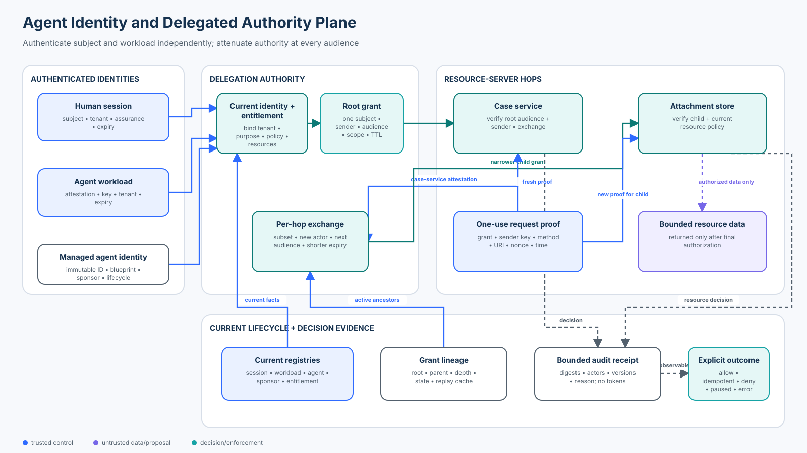

# Intermediate 03 — Agent Identity and Delegated Authority

<!-- roadmap-status -->
> **Roadmap status: Published.** The chapter, course-owned delegation lab, real OpenAI Agents SDK adapter, notebook, focused tests, evaluation, architecture diagram, and checkpoint are delivered together.

**Level:** Intermediate · **Time:** 4–5 hours · **Prerequisites:** Python 3.11+, OAuth vocabulary, [Foundation 05 authorization](../../beginner/05-authorization-approval-and-least-privilege/README.md), [Intermediate 02 durable execution](../02-state-checkpoint-and-durable-execution-security/README.md), and the focused [identity-propagation course](../../../intermediate/01-identity-propagation/README.md)<br>
**Scenario:** an authenticated Northwind analyst uses a support agent that calls a case service and attachment store; every hop must preserve who is represented, authenticate which workload is acting, and reduce—not inherit or invent—authority<br>
**Artifacts:** [lab.py](lab.py) · [sdk_adapter.py](sdk_adapter.py) · [agent_identity_delegation.ipynb](agent_identity_delegation.ipynb) · [architecture spec](architecture-spec.json) · [diagram](architecture.svg) · [focused tests](../../../../tests/test_agent_identity_delegated_authority.py) · [SDK tests](../../../../tests/test_agent_identity_delegated_authority_sdk.py)

## Capability statement

By the end of this course, you can design and evaluate an agent identity plane
that authenticates the human and each workload independently, resolves current
entitlements, issues a short-lived grant for one subject, tenant, purpose,
audience, sender, operation, and resource set, then monotonically attenuates
that grant at every service hop. Resource servers validate current lifecycle,
lineage, sender proof, replay state, audience, tenant, operation, and resource
without falling back to ambient service authority.

You will prove that:

1. a human principal, agent identity, workload identity, current actor,
   audience, and resource are different security nouns;
2. an agent name, prompt persona, copied identifier, or schema-valid claim is
   not authentication evidence;
3. the issuer derives subject and workload from trusted sessions and
   attestations, then resolves current entitlements;
4. a grant binds tenant, sponsor-backed agent identity, purpose, operations,
   resources, audience, sender key, policy and entitlement versions, lifetime,
   parent, root, actor chain, and delegation depth;
5. exchange can only shrink operation, resource, lifetime, and purpose while
   changing to one explicitly allowed downstream audience;
6. audience restriction prevents cross-service replay, while sender constraint
   prevents a stolen grant from acting as a bearer credential;
7. each request proof binds the grant, sender, method, URI, nonce, and time and
   can be used once;
8. disabling the agent, changing the entitlement version, or revoking the root
   invalidates the lineage;
9. model-facing SDK arguments contain only resource selection—not identity,
   tenant, scope, audience, token, grant, or proof; and
10. security, valid-task utility, cross-tenant disclosure, replay, trace
    completeness, and dependency failures use explicit populations.

This lesson preserves the original planned course's authenticated chain,
confused-deputy threat, short-lived audience-bound grants, and monotonic
authority invariant. The earlier identity-propagation course introduces the
same foundation. This continuation deepens the identity plane with managed
agent lifecycle, sponsor accountability, sender-constrained request proofs,
current entitlement versions, lineage-wide revocation, no-fallback behavior,
and an explicit comparison with emerging agent-identity platforms.



## 1. Why identity becomes harder for agents

A traditional service often answers two questions: which user made the
request, and may that user perform the operation? An agentic request adds more
actors and longer lifetimes:

- a human or service principal initiates work;
- an agent identity represents the governed agent instance;
- one workload instance runs the agent;
- downstream services act as new workloads;
- a model proposes which operation or resource might be useful;
- a token service exchanges authority for each audience; and
- resource servers make the final decision from current state.

Collapsing those identities produces two dangerous shortcuts. First, a workload
credential is mistaken for the user's resource authority. Second, an agent
persona or model-provided role is mistaken for an enterprise identity. The
result is a confused deputy: a privileged service uses its own ambient access
for a request the represented principal could not perform.

### Success criteria

The lab succeeds only when a valid two-hop read remains useful, all declared
escalation and replay attacks fail without disclosure, current lifecycle
changes invalidate old grants, dependency outages remain explicit `ERROR`
states, and every decision produces bounded attributable evidence.

### Non-goals

The lab does not implement OAuth, JWT, DPoP, mTLS, SPIFFE, cloud federation, or
a production policy engine. Its HMAC-sealed objects are deterministic teaching
analogues. The production mechanisms in the technology section replace these
seams; they do not remove the application authorization invariants.

## 2. Keep the identity nouns separate

| Term | Question | Northwind example | Authoritative source |
| --- | --- | --- | --- |
| Human/service principal | On whose behalf is work requested? | `alice` | authenticated session or workload subject |
| Agent identity | Which governed agent instance is accountable? | `agent:support-7` | enterprise identity directory and lifecycle |
| Agent blueprint/type | Which shared configuration governs this class? | `blueprint:support-v3` | reviewed platform configuration |
| Sponsor/owner | Which human or group is accountable? | `support-security` | identity governance system |
| Workload identity | Which running software instance is calling? | `support-orchestrator` | workload attestation, mTLS, cloud identity, or SVID |
| Current actor | Which workload is exercising delegated authority at this hop? | orchestrator, then case service | authenticated caller plus grant lineage |
| Audience | Which resource server may accept the grant? | case service, then attachment store | issuer policy and protected-resource configuration |
| Purpose | Why was authority issued? | case support | trusted application workflow and policy |
| Operations/resources | What exact authority may be exercised? | `read` one attachment | current entitlement and resource policy |

An agent identity improves inventory, lifecycle, policy targeting, sponsorship,
and attribution. It does not automatically authorize business data. A workload
identity proves which software is calling; it does not prove which user's data
that software may read. A grant carries bounded authority; it does not replace
fresh resource-state checks.

## 3. Mental model: authenticate twice, authorize at every hop

```text
authenticated human session + authenticated agent workload
                         ↓ resolve current entitlement and agent lifecycle
                    delegation authority
                         ↓ issue one sender- and audience-bound grant
         support orchestrator ───────────────► case service
                                                    ↓ verify then exchange
                                   case-service workload attestation
                                                    ↓ narrower child grant
                                           attachment store
                                                    ↓ final current decision
                                             bounded attachment
```

The model may choose an `attachment_id`. It never supplies the trusted
principal, tenant, agent identity, workload, sponsor, audience, purpose, scope,
grant, proof, entitlement version, or policy version. Those values come from
authenticated server-owned state.

## 4. Threat model

| Threat | Example | Control | Lab evidence |
| --- | --- | --- | --- |
| Identity substitution | a Southwind session is paired with Northwind's agent workload | bind human, workload, agent, entitlement, and resource tenant | `cross-tenant-identity-mix` denied |
| Model-asserted authority | prompt says `tenant=south, scope=read` | keep identity and authority out of tool schema | SDK schema exposes only `attachment_id` |
| Scope escalation | child requests `delete` | require child operations/resources to be subsets | exchange denied |
| Purpose drift | support read becomes bulk export | purpose equality or explicit transition policy | exchange denied |
| Audience confusion | case-service grant is sent to attachment store | exact one-audience validation | access denied |
| Stolen bearer | compromised worker copies the grant | sender/key binding plus per-request proof | access denied |
| Request replay | a valid proof is reused | nonce, request binding, short time window, replay cache | second use denied |
| Stale authority | entitlement changes after issue | bind and recheck entitlement/policy version | old grant denied |
| Orphaned agent | sponsor removed or identity disabled | current managed lifecycle check | old grant denied |
| Incomplete containment | parent revoked but child survives | stateful root/descendant revocation | both invalidated |
| Ambient fallback | token service fails, so service credentials read anyway | separate delegated path; fail closed | fallback counter stays zero |
| Control outage | directory or entitlement service unavailable | explicit `ERROR`, alert, and no disclosure | failure fixtures remain errors |

## 5. Root issuance mechanics

The issuer accepts opaque references to a server-authenticated session and
workload attestation. It resolves the actual objects and enforces:

```text
session active with required assurance
workload attestation active
workload → managed agent identity binding active
agent sponsor present
session.tenant = workload.tenant = agent.tenant = entitlement.tenant
requested audience ∈ agent allowed audiences
requested purpose ∈ agent allowed purposes
requested operations ⊆ current entitlement operations
requested resources ⊆ current entitlement resources
0 < requested lifetime ≤ configured/session/workload ceilings
```

The resulting grant contains immutable subject, tenant, agent ID, actor chain,
delegate workload, audience, purpose, operations, resources, sender-key
thumbprint, issue/not-before/expiry times, policy version, entitlement version,
delegation depth, root and parent identifiers, digest, and signature.

### Idempotent issuance is not request mutation

The issuance request ID is bound to a digest of the trusted session, workload,
requested authority, current policy, and entitlement version. An exact retry
returns the prior grant as `IDEMPOTENT`. Reusing the same request ID for changed
resources returns `DENY request-id-collision`.

This prevents duplicate grant creation and ambiguous audit trails. It does not
authorize a resource operation; the resource server still verifies the grant
and current state.

## 6. Token exchange and monotonic authority

When the case service needs the attachment store, it cannot forward the grant
issued for the case-service audience. It authenticates as its own workload and
asks the authority for a child grant.

The child invariant is:

```text
subject(child)             = subject(parent)
tenant(child)              = tenant(parent)
agent(child)               = agent(parent)
purpose(child)             = purpose(parent)
operations(child)          ⊆ operations(parent)
resources(child)           ⊆ resources(parent)
expires(child)             ≤ expires(parent)
actor_chain(child)         = actor_chain(parent) + current workload
depth(child)               = depth(parent) + 1 ≤ maximum
audience(child)            ∈ allowed next hops for current workload
confirmation_key(child)    = current workload key
```

RFC 8693 defines token exchange and the `act` actor claim, but exchange alone
does not invalidate the input token or create automatic revocation linkage
between input and output tokens. The lab adds a stateful lineage registry to
teach one containment strategy. Production alternatives include short
lifetimes, introspection, continuous access evaluation, provider revocation,
or combinations of these.

## 7. Audience restriction and sender constraint solve different problems

An exact audience limits where a credential should be accepted. It blocks a
case-service grant at the attachment store. It does not prevent another caller
from presenting the grant to the correct case service if the grant is stolen.

Sender constraint binds the grant to a key held by the authorized workload.
The lab's proof is a deterministic DPoP-like analogue binding:

- grant ID and complete grant digest;
- sender-key thumbprint;
- HTTP method and exact URI;
- resource-server nonce;
- proof ID and issuance time; and
- a server-owned integrity signature.

The resource server verifies those bindings and consumes the proof ID once.
In production, RFC 9449 DPoP uses a signed proof JWT and public-key thumbprint,
while mTLS-bound access tokens use the authenticated client certificate. DPoP
is not client authentication and a valid proof is not authorization by itself;
the resource server must still validate the access token and business policy.

## 8. Current lifecycle, revocation, and recovery

A grant is not frozen authority until expiry. The lab rechecks:

- grant integrity and authoritative registry membership;
- active grant and root lineage state;
- time window and current policy version;
- active agent identity and accountable sponsor; and
- current entitlement version and policy binding.

Changing entitlements invalidates earlier grants rather than silently applying
new permissions to old objects. Disabling the agent identity stops the lineage.
`revoke_lineage()` marks the root and every known descendant revoked.

A production incident runbook should disable the smallest affected agent or
workload, revoke or expire grants, rotate compromised workload credentials,
terminate in-flight work, preserve identifiers and decisions without storing
reusable secrets, reauthenticate subject and workloads, resolve current
entitlements, and issue a new root. Never resume the revoked lineage.

## 9. Architecture patterns and selection

| Pattern | Best fit | Strength | Main risk or cost |
| --- | --- | --- | --- |
| User-delegated per-hop exchange | an agent acts for a signed-in person | preserves subject and actor while narrowing audience | token-service dependency and provider-specific exchange semantics |
| App-only agent identity | scheduled or autonomous work with no user | clear non-human principal and lifecycle | easy to overprivilege; must not masquerade as a user |
| Brokered tool gateway | heterogeneous tools without native identity support | centralizes identity translation and policy | high-value enforcement point; translation can drop bindings |
| Workload federation | cross-cloud, Kubernetes, CI, or partner workloads | replaces static service-account keys with short-lived credentials | attribute mapping, subject collision, issuer/audience configuration |
| SPIFFE workload mesh | many dynamic services across trust domains | automated workload attestation and mTLS/JWT SVID delivery | trust-domain/federation design and application authorization still required |
| Capability/attenuation token | offline-verifiable constrained delegation | explicit narrow authority and delegation | revocation and ecosystem/tool support vary |

Keep user-delegated and app-only flows distinct. If user delegation fails, do
not retry through app-only authority. If a scheduled service job is legitimate,
give it its own authenticated principal, operation contract, resources,
purpose, budget, and audit path.

## 10. Technology landscape — September 2026

| Standard or platform | Useful mechanism | Security boundary to add or verify |
| --- | --- | --- |
| OAuth 2.0 Token Exchange (RFC 8693) | subject/actor tokens, downstream audience and scope exchange, `act` claim | exchange policy and revocation linkage are deployment-specific; validate both input token types and narrow output |
| OAuth Resource Indicators (RFC 8707) | identifies target protected resource | avoid multi-audience Cartesian scope expansion; resource-server policy remains required |
| OAuth Security BCP (RFC 9700) | current OAuth threat mitigations, audience and sender constraint guidance | token possession and scope are not complete business authorization |
| DPoP (RFC 9449) | sender-constrains tokens with per-request public-key proofs | proof validation, nonce/replay cache, token binding, TLS, and ordinary access-token checks all matter |
| SPIFFE/SPIRE | attested workload identities and X.509/JWT SVID delivery | an SVID authenticates a workload, not the represented human or data entitlement |
| Microsoft Entra OBO | middle tier obtains a downstream token for a user | use delegated permissions and exact downstream audiences; no ambient app-only fallback |
| Microsoft Entra Agent ID | managed agent identities, blueprints, sponsors, lifecycle, conditional access, agent/user token patterns | an agent service principal remains subject to tenant, consent, permission, resource, and workload controls; platform behavior is evolving |
| Google Workload Identity Federation | exchanges external OIDC/SAML/AWS credentials for short-lived Google credentials | use immutable claims, tenant conditions, exact audiences, and collision-resistant mappings |
| AWS STS role chaining and source identity | temporary role sessions and original-identity attribution | source identity improves audit attribution; it does not grant resource permission |
| OPA/Rego or Cedar | deterministic application authorization from typed facts | policy input must be authenticated, current, tenant-bound, and evaluated at the resource boundary |
| OpenAI Agents SDK 0.22.x | typed `RunContextWrapper` and strict tools | runtime context can carry trusted services; the application still owns identity, grants, and resource authorization |

### Established, emerging, and open

- **Established:** separate workforce/workload authentication, short-lived
  audience-restricted credentials, per-hop exchange, resource-server
  authorization, managed service identities, mTLS, and centralized policy.
- **Increasing adoption:** workload federation instead of static keys,
  sender-constrained access tokens, continuous access signals, and governance
  that treats agent instances as inventory with owners and lifecycle.
- **Emerging:** agent-specific identity blueprints, sponsor relationships,
  inheritable permissions, and enterprise controls targeted at agent classes.
- **Open problems:** portable agent identity semantics across providers,
  continuous revocation across exchanged-token lineages, trustworthy identity
  translation across agent protocols, and usable least privilege for dynamic
  tool discovery.

Evaluate products against the invariants rather than product labels. Ask which
identity is authenticated, which subject is represented, who sponsors the
agent, how the workload proves possession, which audience accepts the token,
where current resource authorization runs, what invalidates descendants, and
what happens when the identity plane is unavailable.

## 11. Worked lab

Run the credential-free control model from the repository root:

```bash
python3 curriculum/roadmap/intermediate/03-agent-identity-and-delegated-authority/lab.py
```

The lab runs 18 declared cases:

- 4 valid paths: a two-hop delegated read, idempotent issuance, monotonic
  operation/resource downscoping, and child-expiry attenuation;
- 12 attacks or stale-state cases: cross-tenant identity mixing, resource and
  operation escalation, audience confusion, stolen-grant sender mismatch,
  exchange escalation, purpose drift, proof replay, request rebinding, disabled
  agent identity, stale entitlement, and lineage revocation; and
- 2 dependency failures: unavailable identity and entitlement services,
  preserved as `ERROR` rather than counted as successful defenses.

The unsafe baseline trusts model-controlled tenant and scope strings. It
accepts every attack fixture, proving that the suite distinguishes the
application boundary from claims-only authorization.

### Real OpenAI Agents SDK adapter

```bash
python3 -m pip install -e '.[contributor]'
python3 curriculum/roadmap/intermediate/03-agent-identity-and-delegated-authority/sdk_adapter.py
```

The adapter creates a real strict `function_tool` and `Agent`. Its JSON schema
contains only `attachment_id`. Trusted `SDKRuntime` carries the session and
workload attestation and invokes the same two-hop course boundary. The adapter
executes the real SDK tool wrapper without a model call, denies a cross-tenant
resource without content, and scans its evidence for credential markers.

### Notebook progression

Open [agent_identity_delegation.ipynb](agent_identity_delegation.ipynb) to map
the identity tuple, observe the claims-only baseline, issue one root grant,
inspect a narrowed child, replay an audience-mismatched and stolen grant, bind
and replay request proofs, change current entitlement and lifecycle state,
revoke a lineage, inject an identity-plane outage, calculate the evaluation
contract, and exercise the real SDK boundary.

## 12. Evaluation contract

| Metric | Population | Release expectation |
| --- | --- | --- |
| Valid-task success rate | 4 valid fixtures | 100% |
| Authority-escalation success rate | 12 attack/stale fixtures | 0% |
| Cross-tenant disclosure rate | declared cross-tenant fixtures | 0% |
| Proof-replay acceptance rate | proof-replay fixtures | 0% |
| Sender-constraint detection rate | stolen-grant fixtures | 100% |
| Trace completeness | all 18 outcomes | 100% required fields, no resource content or credentials |
| Claims-only baseline acceptance | 12 attack fixtures | measured at 100% to prove test sensitivity |
| Failure-state correctness | 2 dependency failures | explicit `ERROR`, never relabeled as a block |

Extend a production evaluation with valid-work block rate, issuance and
authorization p95 latency, token-service availability, revocation propagation
time, replay-cache loss on restart, key rotation, policy rollout skew, lineage
fan-out, privilege exposure over time, orphaned-agent count, owner/sponsor SLA,
and cost per successful compliant task.

## 13. Failure modes and anti-patterns

- **One shared agent service account:** actions cannot be attributed to an
  instance or sponsor and compromise has broad blast radius.
- **Prompt roles as identity:** text is attacker-controlled data, not an
  authenticator.
- **Scopes without resource checks:** `read` may cover another tenant or an
  object never intended for the principal.
- **Multi-audience tokens:** one leak can be replayed across more services and
  the scope × audience authority product grows.
- **Bearer tokens in model context:** retrieved content, tools, or traces may
  exfiltrate reusable credentials.
- **Forwarding the same token:** actor and audience boundaries disappear.
- **Local JWT parsing only:** signature parsing can omit issuer, algorithm,
  audience, token type, lifecycle, sender, or current resource checks.
- **Revoking only the parent:** independently valid descendants may continue.
- **Automatic app-only fallback:** a user denial becomes service authority.
- **Logging token material:** observability creates a credential store.

## 14. Production upgrade path

Replace each teaching seam deliberately:

- enterprise workforce authentication with phishing-resistant assurance and
  session revocation;
- managed agent identities with immutable IDs, blueprints, sponsors, owners,
  lifecycle, access review, and offboarding;
- SPIFFE/SPIRE, cloud managed identity, Kubernetes projected tokens, or another
  attested workload identity system;
- a standards-conformant authorization server/STS with exact token-type,
  issuer, audience/resource, actor, scope, and lifetime policy;
- DPoP or mTLS sender constraint where supported, with nonce and replay-cache
  design sized for availability and clock skew;
- current resource authorization using authoritative tenant ownership and
  policy, not token claims alone;
- durable lineage/introspection or documented short-lifetime and continuous
  access strategy;
- KMS/HSM-backed keys, rotation, JWKS protection, algorithm and token-type
  allowlists, and incident recovery;
- independent app-only service-job flows with no delegated fallback;
- privacy-preserving logs for subject, agent, workload, actor chain, grant root,
  audience, policy, reason, latency, and terminal state—never raw tokens; and
- fault injection for issuer, directory, policy, replay cache, clock, network,
  and resource-store failures.

## 15. Exercises

1. Add an app-only scheduled job with its own principal, purpose, resources,
   maximum runtime, and budget. Prove delegated failure cannot enter that path.
2. Add key rotation with overlapping old/new verification windows. Test a
   rotated workload, a stolen old key, and delayed in-flight requests.
3. Persist the proof replay cache, restart the server, and prove a pre-restart
   proof still cannot be reused.
4. Add a cross-trust-domain workload and explicit federation policy. Test
   issuer confusion, subject collision, and a valid partner workload.
5. Map the lab to one platform in the technology table. Mark each guarantee as
   native, configurable, application-owned, or unsupported.

## Checkpoint

A grant is correctly signed, unexpired, intended for the attachment store, and
allows `read` on one attachment. A different workload has copied it and sends a
validly structured request. What must the store require before access?

- A. Accept it because signature, audience, scope, and resource all match.
- B. Ask the model whether the new workload is acting for the same user.
- C. Verify current grant and agent lifecycle, the authenticated workload, and
  a fresh one-use request proof whose key matches the grant's sender binding;
  then evaluate current resource authorization.

**Answer: C.** Audience restriction says where the grant may be used. Sender
constraint says who may present it. Neither replaces current resource policy.

## References

- [RFC 8693 — OAuth 2.0 Token Exchange](https://www.rfc-editor.org/rfc/rfc8693.html)
- [RFC 8707 — Resource Indicators for OAuth 2.0](https://www.rfc-editor.org/rfc/rfc8707.html)
- [RFC 9700 — Best Current Practice for OAuth 2.0 Security](https://www.rfc-editor.org/rfc/rfc9700.html)
- [RFC 9449 — OAuth 2.0 Demonstrating Proof of Possession](https://www.rfc-editor.org/rfc/rfc9449.html)
- [RFC 8725 — JSON Web Token Best Current Practices](https://www.rfc-editor.org/rfc/rfc8725.html)
- [SPIFFE Workload API](https://spiffe.io/docs/latest/spiffe-specs/spiffe_workload_api/)
- [SPIFFE trust-domain and federation specification](https://spiffe.io/docs/latest/spiffe-specs/spiffe-trust-domain-and-bundle/)
- [Microsoft identity platform on-behalf-of flow](https://learn.microsoft.com/en-us/entra/identity-platform/v2-oauth2-on-behalf-of-flow)
- [Microsoft Entra Agent ID: agent identities](https://learn.microsoft.com/en-us/entra/agent-id/agent-identities)
- [Google Cloud Workload Identity Federation best practices](https://cloud.google.com/iam/docs/best-practices-for-using-workload-identity-federation)
- [AWS IAM source identity](https://docs.aws.amazon.com/IAM/latest/UserGuide/id_credentials_temp_control-access_monitor.html)
- [Open Policy Agent documentation](https://www.openpolicyagent.org/docs/latest/)
- [Cedar policy language documentation](https://docs.cedarpolicy.com/)
- [OpenAI Agents SDK context management](https://openai.github.io/openai-agents-python/context/)
- [OpenAI Agents SDK tools](https://openai.github.io/openai-agents-python/tools/)
