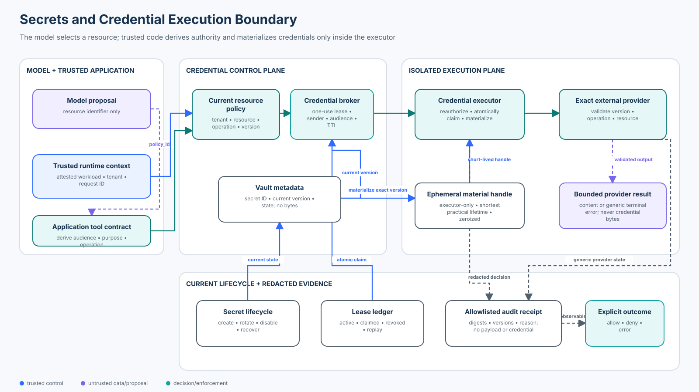

# Intermediate 04 — Secrets and Credential Security

<!-- roadmap-status -->
> **Roadmap status: Published.** The chapter, credential-broker lab, real OpenAI Agents SDK adapter, notebook, focused tests, evaluation, architecture diagram, and checkpoint are delivered together.

**Level:** Intermediate · **Time:** 4–5 hours · **Prerequisites:** Python 3.11+, basic OAuth and secret-manager vocabulary, [Foundation 05 authorization](../../beginner/05-authorization-approval-and-least-privilege/README.md), and [Intermediate 03 agent identity](../03-agent-identity-and-delegated-authority/README.md)<br>
**Scenario:** an attested Northwind support agent reads policy data and creates tickets through external providers that still require credentials; no credential value may enter model context, memory, tool arguments, output, errors, or telemetry<br>
**Artifacts:** [lab.py](lab.py) · [sdk_adapter.py](sdk_adapter.py) · [secrets_credential_security.ipynb](secrets_credential_security.ipynb) · [architecture spec](architecture-spec.json) · [diagram](architecture.svg) · [focused tests](../../../../tests/test_secrets_credential_security.py) · [SDK tests](../../../../tests/test_secrets_credential_security_sdk.py)

## Capability statement

By the end of this course, you can design and evaluate a credential boundary
that derives authority from authenticated workload and current resource state,
issues a short-lived one-use lease, materializes the exact current credential
version only inside an isolated executor, and releases only a bounded provider
result. You will prove that raw material never reaches agent-visible surfaces
and that a lease cannot be widened, replayed, forwarded to another provider,
used by another workload, or retained after expiry, revocation, or rotation.

You will be able to:

1. distinguish a secret value, secret reference, credential, lease, token,
   workload identity, and business authorization;
2. explain why a vault reference is safer than a value but is not itself an
   authorization decision;
3. eliminate the bootstrap “secret zero” where workload identity or federation
   can authenticate the application;
4. derive tenant, audience, purpose, operation, resource, lifetime, and sender
   from trusted application state—not a prompt or tool argument;
5. keep secret bytes out of model input/output, session state, durable memory,
   traces, logs, exceptions, URLs, and approval artifacts;
6. issue an integrity-bound, one-use credential lease without reading the raw
   secret at the broker;
7. reauthorize current state and atomically claim the lease immediately before
   the provider call;
8. bind leases to a current secret version and invalidate them after rotation,
   disablement, expiry, revocation, sender change, or policy change;
9. evaluate safety and utility with declared populations and denominators; and
10. map the teaching seams to cloud secret managers, Vault, workload identity,
    OAuth sender constraints, KMS/HSM systems, and production telemetry controls.

This improves—rather than discards—the original Pilot course. It preserves the
core requirements to keep material outside context, memory, and traces; use
short-lived tenant-scoped audience-bound credentials; and deny cross-service or
broader-action reuse. The lab now makes those promises executable and adds
rotation, revocation, atomic consumption, sender binding, redacted dependency
failures, and a real agent SDK boundary.



## 1. Why agents magnify credential risk

Traditional services can leak secrets through source code, configuration,
environment variables, crash dumps, command histories, logs, and overly broad
runtime permissions. Agents add more surfaces:

- system and user prompts;
- retrieved documents and tool results;
- conversation/session history and compaction summaries;
- durable memory and checkpoints;
- tool arguments and tool output;
- traces, evaluation fixtures, screenshots, and support bundles;
- inter-agent messages and MCP payloads; and
- model-generated URLs, shell commands, code, or error reports.

Once material enters the model-visible data plane, the application cannot
reliably prove where it will be reproduced. Prompt instructions such as “never
reveal this token” are not a secret-isolation boundary. Redaction after a model
call is also too late: the value has already crossed the boundary.

### Success criteria

The course succeeds only if valid policy reads and ticket calls remain useful,
all declared credential misuse attempts fail before provider action, stale and
replayed leases are rejected, provider errors cannot reflect raw material, and
vault/provider outages remain explicit `ERROR` states with no cached or ambient
credential fallback.

### Non-goals

The lab does not implement a real vault, OAuth authorization server, KMS/HSM,
DPoP, mTLS, secure enclave, or guaranteed memory erasure. Its HMAC-sealed lease,
in-memory vault, provider, and byte-buffer zeroization are deterministic teaching
analogues. Python may copy immutable values internally; production systems must
choose languages, runtimes, process boundaries, and hardware protections based
on their actual memory-threat model.

## 2. Use precise security nouns

| Term | Meaning | May the model receive it? |
| --- | --- | --- |
| Secret value | Raw password, API key, token, private key, or symmetric key bytes | No |
| Secret reference | Stable identifier used by trusted code to locate managed material | Normally no; references reveal architecture and can aid enumeration |
| Secret metadata | Version, state, audience, owner, rotation policy, timestamps, digest | Only a minimal non-sensitive subset when needed |
| Workload identity | Attested identity of the executing software | No model assertion may establish it |
| Credential | Evidence presented to authenticate or authorize a caller | Never place raw credentials in model context |
| Credential lease | Opaque, stateful right for one workload to request one credential use | Keep application-owned; do not serialize into tool arguments |
| Audience | Exact provider/resource server permitted to accept the credential | Derived by the application contract |
| Business authorization | Decision that the current tenant/workload may perform the exact operation on the exact resource | Deterministic policy, never inferred from credential possession |
| Provider result | Bounded data returned after provider authentication and authorization | Yes, after output validation and data policy |

Encryption at rest protects stored bytes; it does not decide who may retrieve
them, prevent a privileged process from logging them, or constrain what they can
authorize. A masking wrapper such as `SecretStr` reduces accidental display but
does not stop code from reading or transmitting the value. A secret manager
centralizes lifecycle and access; the application must still authenticate,
authorize, select the correct version, handle rotation, and control exposure.

## 3. Mental model: references travel, values do not

```text
model proposal: policy_id
        ↓
trusted runtime: workload + tenant + request ID
        ↓ application derives purpose, operation, audience, TTL
current resource authorization
        ↓
credential broker ─── reads metadata only ───► secret manager
        ↓ opaque one-use lease
credential executor
        ├─ reauthorize current state
        ├─ atomically claim lease
        ├─ materialize exact secret version
        ├─ call exact provider
        └─ zeroize handle / emit allowlisted receipt
        ↓
bounded content or generic terminal error
```

The model can select `policy:north:7`. It cannot select identity, tenant,
audience, purpose, operation, scope, secret ID, version, credential value,
lease, provider endpoint, lifetime, or fallback. The broker does not need raw
material to decide whether a request may receive a lease. The executor is the
only component that materializes it, and the provider sees it only for the
single bounded call.

## 4. Threat model

| Threat | Example | Independent control | Executable evidence |
| --- | --- | --- | --- |
| Prompt/context exposure | API key is placed in system instructions | never admit raw material to model-visible state | unsafe baseline leaks; controlled response/audit scan is clean |
| Memory persistence | credential is saved for “future use” | tool schema and runtime state carry no secret value | SDK schema exposes only `policy_id` |
| Cross-tenant acquisition | South workload requests North policy credential | authenticate workload, then authorize resource tenant | issuance denied before materialization |
| Audience confusion | policy credential is sent to ticket API | exact audience route and provider check | execution denied |
| Scope widening | read lease is used for `write_ticket` | exact operation binding plus current policy | execution denied |
| Resource widening | lease for policy 7 is used for policy 8 | exact resource binding | execution denied |
| Stolen bearer | compromised worker copies a lease | workload and key confirmation binding | execution denied |
| Replay | a consumed lease is presented again | atomic active→claimed transition | one dispatch across concurrent attempts |
| Stale credential | provider rotates while a lease is active | bind lease to current secret version | old lease denied |
| Tampering | operation is edited inside a lease | integrity plus registered-state equality | lease denied |
| Exception reflection | provider embeds credential in its error | generic error mapping and allowlisted telemetry | no material in response or audit |
| Dependency outage | vault or provider is unavailable | explicit error; no cached/ambient fallback | no content and no fallback count |

## 5. Secret lifecycle and the “secret zero”

A useful lifecycle is:

```text
generate/provision → store → authorize access → distribute/use → rotate
        → revoke/disable → recover/replace → retire/destroy → verify absence
```

Every stage needs an owner, policy version, timestamps, audit evidence, failure
strategy, and recovery procedure. Rotation is not merely writing a new value:
the provider and consumers must move to a compatible version, stale instances
must fail predictably, and rollback must not silently reactivate compromised
material.

The **secret-zero problem** asks how an application authenticates to the secret
manager. Storing a long-lived vault token next to the application only moves the
original problem. Prefer platform workload identity, federation, instance or
pod identity, short-lived projected tokens, mTLS certificates, or hardware
identity. GitHub Actions OIDC is a clear CI example: a workflow exchanges its
verifiable identity for a job-scoped cloud token rather than storing a long-lived
cloud key in the repository.

When passwordless or federated access is not available, bootstrap material still
requires a protected provisioning channel, tight scope, short lifetime,
rotation, and break-glass recovery. “Secretless” usually means the application
does not manage a static reusable secret—not that cryptographic credentials
cease to exist.

## 6. Lease mechanics

The lab's `CredentialLease` binds:

```text
lease_id
workload_id + confirmation_thumbprint
tenant
audience + purpose
operations + resources
secret_id + exact secret_version
issued_at + not_before + expires_at
policy_version
integrity key ID + payload digest + signature
```

Issuance follows this order:

1. Authenticate the workload attestation and expiry.
2. Resolve the target resource from authoritative application state.
3. Check tenant, audience, purpose, operation, and resource policy.
4. Resolve current secret metadata for the application-owned audience route.
5. Bind the lease to the workload key, current policy, and exact secret version.
6. Apply the smaller of requested TTL, broker maximum, and workload lifetime.
7. Store an idempotency digest for the issuance request.
8. Return only the sealed lease and a redacted receipt—never secret bytes.

The HMAC demonstrates integrity locally; it is not a recommendation to invent a
token format. Production deployments should use a standards-conformant token
service, vault lease, cloud credential service, or an application-owned opaque
handle whose state is protected by the platform.

## 7. Execution mechanics

Possessing a lease is insufficient. Immediately before materialization, the
executor checks:

- the lease is registered, intact, active, unexpired, and current;
- broker and policy dependencies are available;
- the authenticated workload and tenant match;
- the current workload key matches the sender binding;
- the executor/provider matches the one audience;
- the operation and resource are exact members of the lease;
- current resource policy still authorizes the request; and
- the secret version remains active and current.

The executor then atomically moves the lease from `active` to `claimed`. Only
one concurrent caller can succeed. It materializes a copy of the managed bytes,
presents it to the provider, maps arbitrary dependency errors to a safe reason,
and zeroes that teaching buffer on exit. The receipt carries IDs, digests,
versions, reason codes, and terminal state—but not headers, query strings,
provider payloads, or credential values.

Claim-before-call favors confidentiality and replay safety. If the provider is
unavailable after claim, this lab returns an error and does not reuse the lease.
A production side-effecting integration must also use stable operation IDs and
outcome reconciliation, as taught in [Intermediate 02](../02-state-checkpoint-and-durable-execution-security/README.md).

## 8. Exposure surfaces and controls

| Surface | Risk | Control |
| --- | --- | --- |
| Prompt/model input | direct disclosure or instruction-following exfiltration | never include the value; expose a narrow resource tool |
| Tool schema/arguments | model selects token, audience, scope, or endpoint | resource identifier only; derive security fields in trusted code |
| Session/memory/checkpoint | durable replication and later retrieval | store opaque business state, not credentials or leases |
| Tracing/logging | headers, URLs, payloads, exceptions, or SDK capture | allowlist fields; drop authorization headers and sensitive URL data at source |
| Environment variables | inherited by child processes and visible to diagnostics | workload identity or file/socket delivery with minimum process scope |
| Files/volumes | backup, permission, lifetime, and stale-version risk | memory-backed mount where justified, strict permissions, refresh and cleanup |
| Source/CI artifacts | permanent history and fork/cache exposure | scanning plus OIDC/federation; treat detection as a backstop |
| Crash/core dumps | process memory capture | disable/restrict dumps, isolate executor, minimize plaintext lifetime |
| Browser/client | user/device inspection | never ship server/provider credentials to untrusted clients |
| Agent/MCP ecosystem | remote server or plugin may observe arguments and traces | keep credentials server-side; authorize each protected tool independently |

Redaction is defense in depth, not primary isolation. Pattern matching misses
unknown formats, encoded values, fragments, and derived credentials. Prefer not
collecting sensitive fields, then apply allowlists, schema-aware filtering,
provider-specific sanitization, and automated scans.

## 9. Architecture patterns

### Static secret injected at startup

Simple and broadly compatible, but rotation often requires restart, the process
holds a reusable value for a long time, and environment/file leakage expands the
blast radius. Use only when the provider cannot support a stronger pattern and
isolate the consumer tightly.

### Secret-manager reference plus executor

The application stores a stable identifier; a narrow executor retrieves the
current version just in time. This course implements that pattern. It improves
central lifecycle and keeps values out of the agent layer, but the executor
still handles plaintext briefly and the secret manager becomes an availability
dependency.

### Dynamic credential with lease

Vault-style dynamic secrets or cloud-issued session credentials create a unique,
short-lived credential per workload/session. Revocation and attribution are
stronger than shared static keys when the provider supports lifecycle APIs.
Operational cost includes issuance load, lease renewal, revocation backlogs,
clock behavior, and provider cleanup.

### Workload identity / federated token exchange

An attested workload exchanges identity for an audience-scoped short-lived token.
This removes replicated bootstrap secrets and can bind policy to workload facts.
Trust configuration, issuer/subject/audience validation, attribute collisions,
and provider support become the critical risks.

### Sidecar, proxy, or credential broker

A local agent or egress proxy owns provider authentication so application code
never reads the value. This narrows the exposed process but adds a privileged
component, local channel security, availability concerns, and policy-routing
complexity. It is valuable when many workloads need a consistent interface.

### KMS/HSM signing instead of key export

The application asks a managed cryptographic boundary to sign or decrypt without
exporting the private key. This is preferable for signing keys and high-value
material, but it does not automatically authorize the business action or protect
arbitrary provider API keys.

## 10. Technology landscape

| Option | Strongest fit | Strengths | Important limits |
| --- | --- | --- | --- |
| HashiCorp Vault | multi-platform dynamic credentials and PKI | auth methods, policy, leases, renewal, revocation, dynamic engines | operational control plane, unseal/recovery, plugin and revocation health |
| AWS Secrets Manager | AWS-integrated stored secrets and managed rotation | IAM/KMS, versions, rotation, audit integration | many values remain static provider credentials; rotation workflow and caching need design |
| Google Secret Manager | GCP-managed versioned secrets | IAM, immutable versions, audit, replication/data residency options | rotation schedules notify; the consumer workflow performs rotation and rollout |
| Azure Key Vault + managed identity | Azure secret/key/certificate lifecycle | RBAC, managed identity, versioned objects, logging | throttling, network policy, rotation/consumer rollout, tenant configuration |
| Kubernetes Secret | cluster delivery of sensitive configuration | native API and pod integration | base64 is not encryption; RBAC/list/create-Pod privileges and etcd protection matter |
| External Secrets / CSI / sidecar | synchronize or mount external-managed material | central manager integration and refresh | copied/mounted material still has lifetime and node/pod exposure |
| Kubernetes TokenRequest | short-lived Kubernetes workload tokens | audience and expiry, automatic projection/rotation | trust and audience must be configured; avoid legacy non-expiring token Secrets |
| SPIFFE/SPIRE or cloud workload identity | secret-zero and service authentication | attested short-lived workload identity | federation/trust-domain policy and protected-resource authorization remain |
| OAuth access token with mTLS/DPoP | sender-constrained API access | audience, scope, expiry, proof of possession | provider and client support; token validation is not resource authorization |
| Pydantic `SecretStr` / masking wrappers | safer display in application objects | reduces accidental `repr`/serialization exposure | code can reveal value; no vault, authorization, rotation, or exfiltration boundary |

Selection questions: Can the provider issue dynamic credentials? Can it validate
one audience and sender? What is the revocation delay? Can the workload avoid a
bootstrap secret? What happens during vault/provider outage? How are rotation
and rollback tested? Which component sees plaintext? What evidence is retained,
and can that evidence itself become sensitive?

## 11. State of practice — September 2026

### Established

- Centralized secret managers with IAM, versioning, audit, encryption at rest,
  rotation workflows, and regional/replication controls.
- Short-lived workload credentials and federation in cloud and Kubernetes
  environments instead of non-expiring service-account or CI keys.
- Minimum privilege, one audience, explicit resource authorization, and
  sender-constrained access tokens where supported.
- Dynamic database/cloud credentials with leases, expiry, renewal, and
  revocation in systems such as Vault.
- Source/CI scanning as a detection and response layer, paired with actual
  revocation and history cleanup.

### Emerging adoption

- Identity-first “secretless” application patterns where brokers, sidecars, or
  proxies obtain credentials for exact outbound calls.
- Finer workload attributes and conditional federation for CI, multi-cloud, and
  agent runtimes.
- Policy-aware egress layers that combine destination, identity, data policy,
  and just-in-time provider credentials.
- Confidential-computing and enclave-backed credential use for selected
  high-value threat models.

### Open problems

- Many SaaS providers still expose long-lived bearer API keys with weak
  audience, sender, resource, and revocation semantics.
- Rotation can cause outages when provider and consumer versions change at
  different times; “latest” can create fleet-wide failure.
- Agent observability and evaluation pipelines can capture prompt, tool, header,
  URL, or error material unless collection is minimized by design.
- Remote tools and MCP servers create additional administrative domains; local
  secret isolation does not prove a remote server handles credentials safely.
- Garbage-collected runtimes cannot promise comprehensive erasure of every copy,
  so process isolation and credential lifetime often matter more than a wrapper.

## 12. Worked Northwind path

For `policy:north:7`:

1. The SDK tool receives only the policy ID.
2. Trusted context supplies `attest:support`; the registry authenticates
   `support-agent`, tenant `north`, and its current key.
3. The application derives `policy-api`, `case-support`, `read_policy`, and a
   45-second requested lifetime.
4. Current policy verifies that the resource belongs to Northwind and permits
   that operation at that audience.
5. The broker reads metadata for the policy provider secret and issues a one-use
   lease bound to version 1 and the workload key. It never retrieves bytes.
6. The policy executor repeats current checks and atomically claims the lease.
7. The vault returns an executor-only ephemeral handle for version 1.
8. The provider validates credential digest/version, operation, and resource.
9. The handle is zeroed on exit; the application returns only the synthetic
   policy summary and structured receipts.

If version 2 becomes current between steps 5 and 6, the old lease is rejected.
If the provider embeds the credential in an exception, the executor emits only
`provider-error-redacted`. If the vault is unavailable, issuance is `ERROR`; the
application never switches to a shared service credential.

## 13. Run the practical lab

From the repository root:

```bash
python curriculum/roadmap/intermediate/04-secrets-and-credential-security/lab.py
python curriculum/roadmap/intermediate/04-secrets-and-credential-security/sdk_adapter.py
pytest -q tests/test_secrets_credential_security.py \
  tests/test_secrets_credential_security_sdk.py
```

Or open [secrets_credential_security.ipynb](secrets_credential_security.ipynb)
and run it top to bottom. The notebook begins with the leaking baseline, then
walks through issuance, one-use execution, cross-audience and sender attacks,
rotation, concurrent replay, redacted exceptions, outages, evaluation, and the
real SDK adapter.

### Lab-to-production map

| Teaching component | What it proves | Production replacement |
| --- | --- | --- |
| `WorkloadRegistry` | identity and key are trusted inputs | SPIFFE/cloud managed identity/Kubernetes projected token with issuer validation |
| `ResourcePolicy` | credential access follows current business authorization | application PDP/PEP using authoritative ownership and policy |
| `CredentialBroker` | sealed, short-lived, one-use, sender/audience/resource binding | STS, dynamic secret engine, or durable opaque broker |
| `InMemorySecretVault` | metadata separated from materialization | Vault or cloud secret manager/KMS/HSM |
| `CredentialExecutor` | one narrow component sees plaintext briefly | isolated provider adapter, egress proxy, sidecar, or enclave |
| `SyntheticProvider` | external credential/version verification | exact SaaS/cloud/database API with TLS and output validation |
| `AuditSink` | allowlisted decision evidence | protected telemetry pipeline with field filtering and retention policy |

## 14. Evaluation semantics

The deterministic corpus has 18 cases:

- **4 valid:** policy read, separately credentialed ticket call, idempotent
  issuance, and ephemeral-handle zeroization;
- **11 credential misuse:** cross-tenant issuance, audience replay, operation
  widening, resource widening, wrong workload, wrong key, expiry, revocation,
  stale version, lease tampering, and consumed-lease replay;
- **1 exposure attack:** a dependency error containing the raw credential; and
- **2 failures:** vault unavailable and provider unavailable.

| Metric | Numerator / denominator | Desired |
| --- | --- | ---: |
| Valid-task success rate | useful valid cases / 4 valid cases | 1.0 |
| Credential-misuse success rate | unauthorized provider allows / 11 misuse cases | 0.0 |
| Secret-exposure rate | controlled outputs containing raw material / 1 exposure probe | 0.0 |
| Replay acceptance rate | accepted replays / 1 replay probe | 0.0 |
| Stale-credential acceptance rate | accepted stale-version attempts / 1 stale probe | 0.0 |
| Failure error-preservation rate | explicit errors / 2 dependency failures | 1.0 |
| Trace completeness | observations with stage/status/reason/policy evidence / 18 | 1.0 |
| Unsafe-baseline exposure rate | leaking baseline surfaces / 1 baseline fixture | 1.0 |

The baseline metric is not a benchmark of a product or model. It demonstrates a
known anti-pattern. The controlled metrics measure this implementation on these
labelled fixtures; they do not estimate real-world compromise probability.

Production evaluation should also measure issuance and materialization latency,
lease conflicts, vault/provider availability, stale-version denials, rotation
completion and rollback time, revocation propagation, credential age at use,
secret access anomalies, redaction coverage, false-positive scan handling,
valid work blocked, and cost per successful compliant task.

## 15. OpenAI Agents SDK boundary

The repository pins `openai-agents>=0.22.2,<0.23`; the adapter is exercised with
0.22.3 in the contributor environment. The real strict `function_tool` exposes:

```json
{"policy_id": "policy:north:7"}
```

`SDKRuntime` contains the application and attestation ID as local context. The
SDK documentation distinguishes local context from model-visible context, but
also warns that serialized run state can persist application context and runtime
metadata. This course therefore keeps raw credential material out of both—not
merely out of the generated tool schema.

The credential-free demo invokes the real SDK tool adapter directly with
`ToolContext`; it does not call a model, network, vault, or identity provider and
requires no API key. Framework schema validation constrains input shape; it does
not issue credentials or authorize the selected resource. Those controls remain
inside the application path.

## 16. Failure modes and anti-patterns

- **API key in the system prompt:** every downstream model and trace becomes a
  credential processor.
- **Credential as tool argument:** the model can copy, widen, or forward it.
- **Vault reference accepted from the model:** the reference becomes an object
  enumeration and confused-deputy input.
- **Environment-variable inheritance:** subprocesses, diagnostics, or shell
  tools gain material they do not need.
- **One shared provider key:** attribution, revocation, and blast-radius control
  collapse.
- **Scope string without resource authorization:** `read` can still target the
  wrong tenant or record.
- **Multi-audience token:** one leak can authorize several resource servers.
- **Refresh token in agent memory:** durable high-value authority survives the
  current task.
- **Masking as a control:** hidden `repr` output does not prevent `.get_secret_value()`
  or network transmission.
- **Rotation to `latest` everywhere:** a bad value or provider mismatch can
  create immediate fleet-wide outage.
- **Cache-through outage:** an expired or revoked cached value becomes ambient
  fallback authority.
- **Log everything, redact later:** collection already expanded exposure and
  regexes cannot identify every secret.
- **Secret scan equals remediation:** detected credentials remain usable until
  revoked/rotated and history, caches, images, artifacts, and forks are handled.
- **Successful provider authentication equals business authorization:** a valid
  API key can still act on an unauthorized resource.

## 17. Operations, incident response, and ownership

| Concern | Evidence | Accountable owner |
| --- | --- | --- |
| Workload trust and federation | issuer/subject/audience policy, attestation failures | identity/platform team |
| Secret inventory and ownership | owner, system, environment, classification, rotation SLA | security platform + service owner |
| Issuance/lease policy | workload, purpose, resource, TTL, decision reason | application security owner |
| Provider integration | accepted versions, least privilege, TLS, output validation | integration/service owner |
| Rotation | new version, provider update, canary, rollback, completion | service owner + SRE |
| Telemetry privacy | allowlist, redaction tests, retention, access | observability + privacy/security |
| Incident response | detection, revoke, rotate, history cleanup, consumer restart, verification | security incident commander |

On suspected exposure:

1. identify the credential, versions, provider, privileges, consumers, and
   evidence without copying the value into the incident record;
2. contain by revoking/disablement and blocking suspicious workload identity;
3. rotate or replace provider-side material and update the manager;
4. invalidate outstanding leases and restart/refresh consumers as required;
5. search source history, artifacts, logs, traces, memory stores, tickets, and
   external destinations using approved detection methods;
6. validate the new credential through a canary and verify the old one fails;
7. restore service without re-enabling a compromised version; and
8. retain bounded audit evidence and improve the exposure path.

## 18. Production upgrade path

- Replace fixture attestation with workload identity whose issuer, subject,
  audience, tenant attributes, expiry, and key possession are verified.
- Prefer federation or platform identity over stored bootstrap keys.
- Replace the in-memory vault with a managed HA secret service; test IAM,
  private connectivity, rate limits, quotas, regional behavior, backup, recovery,
  audit integrity, and break-glass access.
- Use dynamic provider credentials where possible; otherwise implement versioned
  rotation with canary, overlap only when justified, rollback, and stale-client
  detection.
- Keep credential brokerage outside the model process and isolate the executor
  by process, workload, network route, and least privilege.
- Use an opaque durable lease ledger with atomic claim, revocation, expiry, and
  bounded cleanup; do not rely on a self-contained token alone when one-use is
  required.
- Enforce exact destination and resolved network route before presenting a
  credential; Intermediate 06 adds egress/SSRF controls.
- Configure SDK and OpenTelemetry capture to exclude authorization headers,
  sensitive query parameters, tool payload fields, exception bodies, and
  provider responses by default.
- Add concurrency, restart, clock-skew, lease-store partition, provider timeout,
  rate-limit, partial rotation, and rollback tests.
- Run source, history, image, artifact, and runtime secret detection as a
  backstop with a rehearsed revoke/rotate workflow.
- Document residual risks: executor compromise, provider-side leakage, memory
  copies, revocation delay, administrator access, dependency compromise, and
  audit-store exposure.

## 19. Exercises

1. Add an issuance budget per workload and prove a prompt loop cannot create an
   unbounded number of credentials.
2. Implement a two-version canary rotation: 10% of synthetic calls use the new
   version; promote only after declared success and exposure gates pass.
3. Persist the lease ledger, restart the executor, and prove a pre-restart
   claimed lease cannot be replayed.
4. Add a provider timeout after a ticket may have committed. Reuse a stable
   logical operation ID and reconcile before issuing any replacement lease.
5. Add an allowlisted OpenTelemetry event exporter and test that headers, URLs,
   exceptions, resource content, and synthetic material never appear.
6. Map this course to Vault, AWS, Azure, or GCP. Label each guarantee as native,
   configurable, application-owned, or unsupported.
7. Threat-model a remote MCP server that needs a SaaS API key. Decide which
   administrative domain should own the credential and what evidence the caller
   can verify.

## Checkpoint

An agent framework masks a provider API key in object representations and stores
it in local run context rather than in the prompt. Is that sufficient?

- A. Yes. Local context is never visible to any SDK component or persisted.
- B. Yes. Masking means the value cannot be read or transmitted by code.
- C. No. Keep raw material out of the agent runtime; derive a one-use lease from
  authenticated context and current resource policy, materialize the exact
  version only inside a narrow executor, and emit only bounded results and
  allowlisted evidence.

**Answer: C.** Local context is not automatically model-visible, but application
code can still read it and serialized run state may persist runtime data. Masking
reduces accidental display, not access. Credential isolation, current
authorization, audience/resource/sender binding, lifecycle, and telemetry
minimization remain application and platform responsibilities.

## References

- [RFC 9700 — Best Current Practice for OAuth 2.0 Security](https://www.rfc-editor.org/rfc/rfc9700.html)
- [RFC 8707 — Resource Indicators for OAuth 2.0](https://www.rfc-editor.org/rfc/rfc8707.html)
- [RFC 9449 — OAuth 2.0 Demonstrating Proof of Possession](https://www.rfc-editor.org/rfc/rfc9449.html)
- [NIST SP 800-207 — Zero Trust Architecture](https://csrc.nist.gov/pubs/sp/800/207/final)
- [OWASP Secrets Management Cheat Sheet](https://cheatsheetseries.owasp.org/cheatsheets/Secrets_Management_Cheat_Sheet.html)
- [HashiCorp Vault — lease, renew, and revoke](https://developer.hashicorp.com/vault/docs/concepts/lease)
- [HashiCorp Vault — secrets engines](https://developer.hashicorp.com/vault/docs/secrets)
- [AWS Secrets Manager best practices](https://docs.aws.amazon.com/secretsmanager/latest/userguide/best-practices.html)
- [Google Secret Manager best practices](https://cloud.google.com/secret-manager/docs/best-practices)
- [Google Secret Manager rotation guidance](https://cloud.google.com/secret-manager/docs/secret-rotation)
- [Azure Key Vault best practices](https://learn.microsoft.com/en-us/azure/key-vault/general/best-practices)
- [Kubernetes Secrets](https://kubernetes.io/docs/concepts/configuration/secret/)
- [Kubernetes good practices for Secrets](https://kubernetes.io/docs/concepts/security/secrets-good-practices/)
- [GitHub Actions OpenID Connect](https://docs.github.com/en/actions/concepts/security/openid-connect)
- [OpenTelemetry — handling sensitive data](https://opentelemetry.io/docs/security/handling-sensitive-data/)
- [Pydantic secret types](https://docs.pydantic.dev/latest/api/types/#pydantic.types.SecretStr)
- [OpenAI Agents SDK context management](https://openai.github.io/openai-agents-python/context/)
- [OpenAI Agents SDK function tools](https://openai.github.io/openai-agents-python/tools/)
