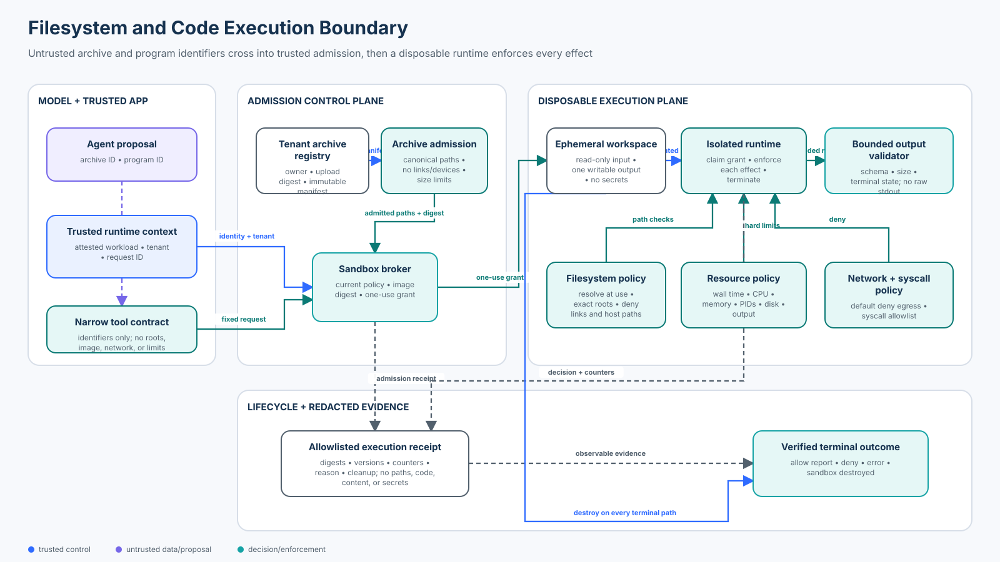

# 05 — Filesystem, Code Execution, and Sandbox Security

<!-- roadmap-status -->
> **Roadmap status: Published.** Includes a deterministic sandbox-boundary lab, an OpenAI Agents SDK adapter, an executable notebook, a validated architecture diagram, tests, and a scored checkpoint.

**Level:** Intermediate<br>
**Time:** 4–5 hours<br>
**Prerequisites:** Python, capability-based authorization, archive formats, basic container concepts, and Course 04’s treatment of secrets and credentials

## Why this course exists

A coding agent receives an uploaded archive and proposes a program that summarizes its contents. Archive member names can traverse directories, links can escape after a seemingly safe check, generated code can read ambient files or credentials, and a process can exhaust CPU, memory, process IDs, disk, or output capacity. A timeout alone may disconnect the caller while leaving work running.

The governing invariant is:

> Model output is a proposal. Trusted application and infrastructure code must authenticate the workload, authorize the tenant-owned input, admit the archive, issue a one-use execution grant, enforce runtime capabilities and resource limits, validate bounded output, record evidence, and destroy the environment.

The local lab never executes arbitrary generated code on the learner’s host. It uses a typed effect interpreter: hostile programs declare the filesystem, network, syscall, and resource effects they would attempt, while an independent runtime evaluates those effects. That is a safe teaching simulation, not a production sandbox.

## Learning outcomes

By the end, you will be able to:

1. distinguish archive admission, authorization, runtime isolation, and output validation;
2. reject traversal, encoded traversal, absolute paths, links, special files, collisions, and decompression bombs;
3. bind a one-use grant to authenticated workload, tenant, input, program, policy, runtime image, and expiry;
4. enforce filesystem, network, syscall, CPU, memory, PID, disk, output, and step constraints independently of the model;
5. explain why a temporary directory, container, prompt, timeout, or local hash is not by itself a sandbox;
6. compare hardened containers, gVisor, microVMs, WebAssembly/WASI, and hosted sandbox services;
7. keep secrets and ambient credentials outside the execution environment;
8. distinguish cancellation, connection timeout, process kill, environment destruction, and verified cleanup;
9. measure security and utility with explicit denominators; and
10. map teaching controls to production ownership, observability, incident response, and residual risk.

## Course artifacts

| Artifact | Purpose |
|---|---|
| `lab.py` | Archive admission, one-use grants, capability enforcement, receipts, and 24-case evaluation |
| `sdk_adapter.py` | Strict OpenAI Agents SDK tool that keeps trusted identity and policy outside model arguments |
| `filesystem_sandbox_security.ipynb` | Guided attack, defense, bypass, concurrency, failure, and evaluation exercises |
| `architecture.svg` | Validated trust-boundary and data-flow diagram |
| `tests/test_filesystem_sandbox_security.py` | Security invariant and edge-case coverage |
| `tests/test_filesystem_sandbox_security_sdk.py` | SDK schema, context, denial, and result-boundary coverage |

## Architecture and trust boundaries



The proposal plane may name an archive and a registered program. It cannot supply a tenant, workload identity, host path, mount, network policy, resource limit, runtime image, grant, or sandbox identifier. Those values come from authenticated state and trusted configuration.

The admission plane canonicalizes archive names, rejects unsafe types and collisions, enforces size and expansion limits, and creates an immutable manifest digest. It never treats archive metadata as authorization.

The execution plane consumes an integrity-protected, one-use grant and creates a disposable workspace. Filesystem, network, syscall, and resource controls are enforced at runtime. Output is constrained to one exact destination and validated before release.

The evidence plane records bounded metadata and the outcome, then destroys the environment. Receipts exclude file contents, generated code, credentials, and host paths.

## Precise terminology

**Archive admission** decides whether a supplied archive is safe enough to stage. It is not execution isolation.

**Sandbox** means an independently enforced boundary that limits what untrusted computation can observe and affect. A directory naming convention or prompt is not such a boundary.

**Capability** is narrowly scoped authority, such as read access to one admitted file or write access to one output path. It should be unforgeable, least-privileged, short-lived, and revocable where practical.

**Cancellation** asks work to stop. **Kill** terminates a process. **Destruction** removes the whole execution environment. **Verified cleanup** establishes, with observable evidence, that no workload remains. These are different guarantees.

**Containment receipt** is bounded decision evidence: opaque identities and digests, timestamps, reason codes, resource counters, cleanup state, and trace correlation.

## Threat model

### Protected assets

- host files, sockets, processes, kernel interfaces, and metadata services;
- other tenants’ inputs, outputs, execution state, and quotas;
- application credentials, cloud identity, tokens, and signing keys;
- policy, runtime images, logs, and audit evidence;
- service availability and cost budgets; and
- released reports and downstream systems.

### Adversary capabilities

Assume an attacker controls archive bytes and member names, prompt content, the generated-program proposal, file contents, compression ratios, operation order, and retry timing. They can attempt path ambiguity, link traversal, reads and writes, outbound network calls, forbidden syscalls, resource exhaustion, replay, cross-tenant references, stale-state use, and concurrent redemption.

### Trust assumptions and non-goals

The authenticated application context, ownership registry, policy service, image allowlist, grant key, audit sink, and sandbox control plane are trusted in this lesson. Production designs must reduce, monitor, and independently protect each assumption.

The lab does not emulate kernel isolation, namespaces, a microVM, a syscall filter, a network proxy, or a cloud sandbox. It does not claim resistance to kernel or hypervisor escape. It models the control contract those components must enforce.

## 1. Admit archives before staging them

Treat every member name and type as attacker-controlled. A safe admission sequence is:

1. bound the uploaded object size before parsing;
2. enumerate metadata without extracting;
3. canonicalize separators and reject NUL/control characters;
4. reject absolute paths, drive-prefixed paths, traversal, empty names, and excessive length;
5. reject symbolic links, hard links, devices, FIFOs, sockets, and unsupported types;
6. reject duplicate or case-folding-colliding destinations;
7. enforce member count, per-file size, total expanded size, and expansion-ratio limits;
8. produce an immutable admitted manifest; and
9. stage only admitted regular files into a new workspace without following links.

Python’s `tarfile` extraction filters are an important baseline. In Python 3.14, the default `data` filter rejects or normalizes several dangerous properties. The documentation is explicit that filters do not prevent every unsafe behavior or denial-of-service condition. Keep independent quotas and never extract directly into a shared or trusted directory.

### Canonicalization and time-of-check/time-of-use

Naive checks such as `".." not in name` fail on alternate separators and encoded forms. Define one canonical representation, reject ambiguous encodings, and use the same representation for authorization and access. Re-resolving another string later recreates the bug.

Checking a path and opening it later can race with a rename or link change. Production code should prefer descriptor-relative APIs, no-follow semantics, immutable staging, and a filesystem policy below the application. Linux Landlock can restrict a process hierarchy’s filesystem access, but it is only one defense layer and support varies by kernel and operation.

## 2. Issue an execution grant, not a bag of parameters

The lab’s grant binds:

- authenticated workload and key identity;
- tenant;
- archive and immutable upload digest;
- admitted manifest digest;
- registered program digest;
- policy version;
- runtime image digest;
- issuance and expiry; and
- a unique grant identifier and integrity tag.

The broker derives these values from trusted registries; the model cannot set them. Redemption verifies current ownership and digests, then atomically changes the grant from `ISSUED` to `CLAIMED`. Two simultaneous redemptions produce exactly one execution and one replay denial.

Production systems should replace the in-memory registry and local integrity tag with a transactional grant store, workload identity, managed signing or MAC, protected key rotation, durable idempotency, and policy-controlled revocation.

## 3. Build a capability-bounded workspace

The example exposes only read-only admitted files beneath `/workspace/input` and one writable destination, `/workspace/output/report.json`. It provides no ambient host paths, home directory, Docker socket, cloud metadata endpoint, credentials, or inherited secrets.

Mount semantics, namespaces, user mappings, and mandatory access controls matter. A container run as root with broad host mounts and the Docker socket is not meaningful containment. Prefer a read-only root filesystem, non-root identity, dropped capabilities, `no-new-privileges`, constrained mounts, no host namespace sharing, and a separately enforced writable quota.

## 4. Enforce process and syscall capabilities

The deterministic runtime allows a small operation vocabulary and denies unknown operations and forbidden syscalls. Production defense in depth includes:

- a minimal runtime image pinned by digest;
- an allowlist-oriented syscall profile appropriate to the workload;
- Linux capabilities dropped by default;
- mandatory access control such as AppArmor, SELinux, or Landlock where supported;
- no privileged mode, device passthrough, host PID namespace, or control sockets; and
- an isolation boundary selected for the consequence of compromise.

Linux seccomp documentation cautions that seccomp is not a sandbox by itself. It reduces kernel attack surface; it does not provide filesystem, network, identity, or resource isolation.

## 5. Treat every resource as independently exhaustible

Apply separate ceilings to wall time, CPU, memory, process count, writable disk, output bytes, operation count, file count, and expanded input size. Linux cgroup v2 provides CPU, memory, PID, and I/O controls, but the broker still needs lifecycle, admission, and output policy.

Do not confuse an API timeout with termination. Some APIs stop waiting while the process continues. A production adapter needs explicit process termination and environment destruction, followed by a state check. If the control plane is unavailable, fail closed; never fall back to the application host.

## 6. Deny ambient network and secrets

The course policy denies all network operations. Production egress, if required, should be a narrow capability mediated by a proxy: destination, protocol, method, identity, data classification, quota, and audit policy all matter. DNS and metadata endpoints are part of the boundary.

Do not copy application environment variables into the sandbox. If a workload needs a credential, prefer a broker that exchanges workload identity for a short-lived, audience-bound token and exposes only the minimum operation. Redact credentials and file content from logs.

## 7. Validate output before release

Containment does not make output trustworthy. The lab allows one exact report path, checks its byte limit, parses JSON, validates the schema, and returns a bounded projection. Production validation should also consider content type, decompression, malware scanning, formula injection, active content, provenance, classification, and downstream authorization.

## Isolation technology landscape — September 2026

| Pattern | Isolation boundary | Useful when | Important caveat |
|---|---|---|---|
| Host subprocess | Same host kernel and user context | Trusted maintenance code only | A timeout or temp directory is not isolation |
| Hardened OCI container | Namespaces, cgroups, capabilities, seccomp, MAC | Controlled code with mature container operations | Shares the host kernel; configuration and socket exposure are critical |
| gVisor | User-space application kernel | Stronger isolation with OCI ergonomics | Compatibility and performance require testing |
| Firecracker microVM | Hardware-virtualized microVM plus jailer | High-consequence multi-tenant execution | Host setup, images, network, orchestration, and cleanup remain in scope |
| WebAssembly/WASI | Capability-oriented runtime interface | Portable, narrowly scoped modules | Host imports define the real authority |
| Hosted sandbox service | Provider-managed container or microVM lifecycle | Teams that want an API and managed fleet | Verify tenancy, region, egress, secrets, provenance, kill/destroy, evidence, and failures |

### SDK and service review

**OpenAI Agents SDK.** This repository pins `openai-agents==0.22.3`; the executable adapter uses its strict `function_tool` schema and keeps identity and policy in application context. Current documentation also describes Sandbox Agents and multiple sandbox client backends. The local Unix client adds no OS confinement, so it is not an appropriate hostile-code boundary. Migrating to a Docker, hosted, or third-party client requires a fresh version and control review.

**Cloudflare Sandbox SDK.** It provides isolated execution with process, filesystem, session, and networking APIs. Stable timeout behavior must be read carefully: a client-side execution timeout can close the connection without proving the process ended. Current 1.0 preview documentation adds richer process handles and lifecycle controls. Pin the selected channel and test kill, destruction, Internet policy, and retry behavior.

**Modal Sandboxes.** Modal exposes programmatic sandbox lifecycle management. Evaluate image and secret handling, network controls, regions, maximum lifetime, volume semantics, termination, audit evidence, and provider failure behavior.

**Docker Engine.** Docker supplies namespaces, cgroups, capabilities, seccomp, and mount controls, but defaults are not a complete hostile multi-tenant design. Never mount the Docker socket into untrusted workloads.

**gVisor.** gVisor intercepts system calls in a user-space application kernel, reducing direct host-kernel exposure while retaining container workflows. Validate compatibility and overhead for compilers, package managers, and data workloads.

**Firecracker.** Firecracker provides a minimal microVM monitor; its jailer and production host setup are part of the security design. Snapshot reuse, image provenance, metadata access, networking, and teardown need separate controls.

**Wasmtime and WASI.** Wasmtime’s security model and WASI’s capability interfaces can sharply restrict host access when imports and preopened resources are minimal. Broad host functions can reconstruct ambient authority.

### Maturity labels

- **Established:** archive hardening, least privilege, read-only inputs, isolated writable output, cgroups, capability dropping, seccomp as defense in depth, deny-by-default egress, image pinning, and explicit teardown.
- **Emerging:** common sandbox-agent APIs across hosted backends, policy portability, richer remote process handles, and standardized execution receipts.
- **Open problems:** semantic policy across runtimes, residual kernel/hypervisor escape risk, safe package acquisition, generated-program provenance, and complete cleanup evidence under control-plane failure.

## Worked control path

1. `ArchiveInspector` canonicalizes metadata and creates an admitted manifest.
2. `ExecutionBroker` derives tenant and workload from authenticated state.
3. The broker resolves tenant-owned archive and registered program records.
4. It issues an integrity-bound, expiring, one-use grant.
5. `DeterministicSandboxRuntime` atomically claims the grant and creates an isolated record.
6. The interpreter authorizes every declared effect against exact capabilities and quotas.
7. A bounded JSON report is validated.
8. A redacted receipt records the decision and counters.
9. The sandbox record is marked destroyed for every created environment.

## Run the practical work

From the repository root:

```bash
python curriculum/roadmap/intermediate/05-filesystem-code-execution-and-sandbox-security/lab.py
python curriculum/roadmap/intermediate/05-filesystem-code-execution-and-sandbox-security/sdk_adapter.py
pytest -q tests/test_filesystem_sandbox_security.py tests/test_filesystem_sandbox_security_sdk.py
```

Open `filesystem_sandbox_security.ipynb` for the guided lab. All fixtures are synthetic and credential-free. Neither the script nor notebook launches a subprocess, extracts an archive, accesses the host filesystem for the simulated workload, or makes a network request.

## Evaluation contract

The suite contains exactly 24 cases: 4 valid cases, 18 attack cases, and 2 dependency-failure cases. The attacks cover cross-tenant authorization; four malicious archives; path collision; two runtime path escapes; denied network and syscall effects; five independent resource limits; grant replay; stale policy; and grant tampering. The two failures exercise an unavailable archive registry and an unavailable runtime, with no host fallback.

Some attack cases contribute to more than one metric. The six escape probes are four malicious archives plus two runtime path attacks. The two runtime path attacks are also the forbidden-read probes. Resource, network, and replay metrics contain five, one, and one cases respectively.

| Metric | Required result | Denominator |
|---|---:|---:|
| Valid-job completion | 100% | 4 valid cases |
| Escape success | 0% | 6 escape cases |
| Forbidden-read success | 0% | 2 forbidden-read cases |
| Resource-limit enforcement | 100% | 5 resource attacks |
| Unexpected network success | 0% | 2 network attacks |
| Replay success | 0% | 2 replay attacks |
| Failure surfaced as error | 100% | 1 dependency-failure case |
| Cleanup after environment creation | 100% | all cases that created a sandbox |
| Trace completeness | 100% | all 24 cases |

The unsafe comparison intentionally accepts every escape attempt, demonstrating why path string checks and policy prompts do not meet the invariant.

## OpenAI Agents SDK boundary

`sdk_adapter.py` exposes only `archive_id` and `program_id` to the model-facing tool. The application supplies authenticated context and owns every decision. Strict schema validation prevents extra model arguments from becoming implicit control fields. The result is bounded and does not expose grant or sandbox handles.

This is an adapter to the deterministic teaching boundary. A production backend must preserve trusted derivation, one-use semantics, fail-closed behavior, quotas, output validation, audit fields, and verified destruction.

## Common failure modes

| Failure | Why it fails | Safer direction |
|---|---|---|
| “The prompt says not to read secrets” | The model and generated code are inside the boundary | Enforce exact capabilities beneath the model |
| “It runs in `/tmp`” | The process retains host-user authority | Use separate isolation with no ambient mounts or credentials |
| “We reject `../`” | Encodings, separators, links, collisions, and races remain | Canonicalize once, reject ambiguity, stage immutably, and enforce runtime policy |
| “It runs in Docker” | Broad mounts, root, sockets, egress, and shared-kernel risk remain | Harden it and choose isolation proportional to consequence |
| “The call timed out” | Work may still be running | Kill, destroy, and verify state |
| “The sandbox is down, so run locally” | Availability failure becomes containment failure | Fail closed and queue or reject |
| “Output came from a sandbox” | Output can still be malicious | Bound, parse, scan, validate, authorize, and label it |
| “We log everything” | Logs become an exfiltration channel | Record bounded metadata and protect the audit store |

## Operations and incident response

### Telemetry and detection

Record opaque workload, tenant, archive, program, policy, image, grant, sandbox, and trace identifiers; timestamps; decision and stable reason; resource counters; output digest and size; runtime/control-plane version; and cleanup result. Never record credentials, file contents, generated source, host paths, or raw environment variables.

Alert on repeated escape attempts, metadata endpoint access, policy or image mismatches, replay, quota saturation, unusual output expansion, failed destruction, and rising unavailable-runtime rates.

### Containment and recovery

Revoke grants, stop affected policy/image versions, deny egress, terminate and destroy environments, quarantine outputs, rotate possibly exposed credentials, preserve bounded evidence, patch or roll back the runtime, and reprocess only from admitted immutable input after review.

### Ownership

| Concern | Accountable owner |
|---|---|
| Archive format and output schema | Product/application team |
| Tenant authorization and workload identity | Identity/platform team |
| Policy, grant service, and audit contract | Security platform team |
| Runtime image, isolation, quotas, egress, and teardown | Sandbox/platform team |
| Detection, triage, evidence retention, and recovery | Security operations |
| Data classification, retention, and regions | Governance/privacy |

## From teaching lab to production

| Teaching component | Production replacement |
|---|---|
| In-memory ownership registry | Transactional authorization service scoped by tenant and workload identity |
| Python manifest object | Immutable metadata plus protected digest/provenance record |
| Local integrity tag | Managed signing/MAC with key rotation and protected verification |
| In-memory grant state and lock | Durable, atomic one-use store with idempotency and revocation |
| Typed effect interpreter | Hardened container, gVisor, microVM, WASI runtime, or assessed hosted sandbox |
| Simulated quotas | Runtime limits plus independent broker deadlines and storage quotas |
| Boolean network denial | Isolated network namespace and deny-by-default egress proxy/firewall |
| In-memory receipts | Append-only protected audit pipeline |
| `DESTROYED` state | Delete plus observable verification and orphan reconciliation |

## Exercises

1. Add a third encoding layer to the traversal suite. Define whether the contract decodes or rejects it, then reuse the same canonical form at runtime.
2. Add wall-time semantics and distinguish caller timeout, process kill, and environment destruction in reason codes and metrics.
3. Design a narrow package-fetch capability: specify registry, package, digest, identity, cache, egress, quota, and provenance.
4. Replace the grant store with a transactional interface and prove exactly-once redemption across two workers.
5. Choose Docker, gVisor, Firecracker, WASI, or a hosted sandbox. Write an evidence-backed threat-model decision and its pre-production tests.
6. Extend output validation for CSV and prevent formula injection and oversized expansion.

## Checkpoint

Which design meets the course invariant for hostile generated code?

A. Ask the model to avoid dangerous commands and run the program in a temporary directory.<br>
B. Run a host subprocess with a 30-second client timeout and delete its output directory afterward.<br>
C. Derive tenant and input from authenticated state, admit the archive, redeem a one-use grant in an independently isolated environment, enforce filesystem/network/syscall/resource policy, validate bounded output, and verify destruction.<br>
D. Put the source in a container image but mount the host workspace and Docker socket.

**Answer: C.** A and B leave ambient host authority. D gives the workload control over the host container daemon and workspace. Only C places independent, least-privileged enforcement beneath the model and carries the invariant through cleanup.

## Authoritative references

- [NIST SP 800-190 — Application Container Security Guide](https://csrc.nist.gov/pubs/sp/800/190/final)
- [Linux kernel — seccomp userspace API](https://docs.kernel.org/userspace-api/seccomp_filter.html)
- [Linux kernel — cgroup v2](https://docs.kernel.org/admin-guide/cgroup-v2.html)
- [Linux kernel — Landlock](https://docs.kernel.org/userspace-api/landlock.html)
- [Python — `tarfile` extraction filters](https://docs.python.org/3/library/tarfile.html#extraction-filters)
- [Docker Engine security](https://docs.docker.com/engine/security/)
- [Docker seccomp profiles](https://docs.docker.com/engine/security/seccomp/)
- [gVisor security model](https://gvisor.dev/docs/architecture_guide/security/)
- [Firecracker design](https://github.com/firecracker-microvm/firecracker/blob/main/docs/design.md)
- [Firecracker jailer](https://github.com/firecracker-microvm/firecracker/blob/main/docs/jailer.md)
- [Wasmtime security](https://docs.wasmtime.dev/security.html)
- [OpenAI Agents SDK — Sandbox Agents](https://openai.github.io/openai-agents-python/agents/sandbox/)
- [OpenAI Agents SDK — sandbox clients](https://openai.github.io/openai-agents-python/ref/extensions/sandbox/)
- [Cloudflare Sandbox SDK](https://developers.cloudflare.com/sandbox/)
- [Cloudflare Sandbox SDK — execute commands](https://developers.cloudflare.com/sandbox/api/commands/)
- [Modal Sandboxes](https://modal.com/docs/guide/sandboxes)

Product and protocol behavior changes. Recheck official documentation, pin versions or image digests, and validate semantics—especially timeout, kill, network, credential, and destruction behavior—before making a production claim.
