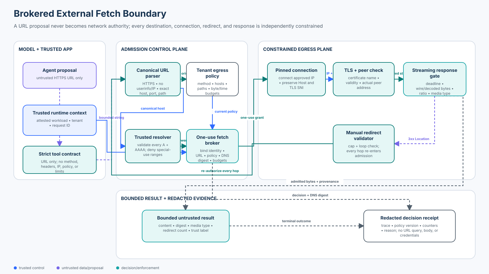

# 06 — Network Egress, SSRF, and External Resource Security

<!-- roadmap-status -->
> **Roadmap status: Published.** Includes a deterministic egress-broker lab, an OpenAI Agents SDK and HTTPX adapter, an executable notebook, a validated architecture diagram, tests, and a scored checkpoint.

**Level:** Intermediate<br>
**Time:** 4–5 hours<br>
**Prerequisites:** Python, HTTP and DNS fundamentals, TLS hostname verification, least privilege, and Course 05’s independently enforced execution boundaries

## Why this course exists

A research agent has a `fetch_external_resource` tool. A document, user, or model can propose `https://research.example.test/docs/guide`, but it can also propose a loopback address, cloud metadata service, private control plane, DNS-rebinding hostname, redirect to an internal target, or response that expands until the process runs out of memory. A fetcher with ambient network access is a confused deputy: the attacker supplies the destination while the service supplies privileged reachability, credentials, identity, and compute.

The governing invariant is:

> A URL is untrusted data, never network authority. Trusted code must authenticate the caller, canonicalize and authorize the request, validate every resolved address, bind approval to the connection, re-authorize every redirect, constrain the response, and release only bounded content with provenance.

The local lab performs no DNS or network I/O. It uses a deterministic resolver and transport so learners can prove connection, redirect, replay, timeout, and response-limit behavior without touching a real endpoint. This is an executable control model, not a production HTTP stack.

## Learning outcomes

By the end, you will be able to:

1. explain SSRF as an authority-confusion problem rather than only a URL-validation bug;
2. canonicalize an HTTPS URL before applying exact origin, port, method, and path policy;
3. deny loopback, link-local, private, metadata, special-use, mapped, and mixed DNS answers;
4. distinguish DNS approval from connection enforcement and preserve `Host`, TLS SNI, and certificate verification while connecting to a vetted address;
5. validate every redirect hop instead of trusting an initially allowed URL;
6. issue and atomically claim an identity-, tenant-, URL-, policy-, DNS-, and budget-bound one-use grant;
7. enforce total deadlines, wire and decoded byte ceilings, expansion ratios, and media types while streaming;
8. keep credentials, cookies, proxy settings, internal handles, and sensitive URL components outside the model and receipts;
9. compare application checks, egress proxies, network policy, service meshes, and cloud controls; and
10. evaluate both attack containment and valid-resource utility with explicit denominators.

## Course artifacts

| Artifact | Purpose |
|---|---|
| `lab.py` | Canonicalization, tenant policy, all-answer DNS checks, one-use grants, pinned execution, redirects, bounded streaming, receipts, and 33-case evaluation |
| `sdk_adapter.py` | Strict OpenAI Agents SDK tool and explicit HTTPX 0.28 client baseline; the demo makes zero network calls |
| `network_egress_ssrf.ipynb` | Guided baseline, attacks, defenses, failures, evaluation, and production-mapping exercises |
| `architecture.svg` | Validated trust-boundary and data-flow diagram |
| `architecture-spec.json` | Reviewable source of truth for the diagram |
| `tests/test_network_egress_ssrf_security.py` | Security invariants, attacks, concurrency, failure, and metric coverage |
| `tests/test_network_egress_ssrf_sdk.py` | SDK schema, context separation, denial, result-boundary, and HTTPX-control coverage |

## Architecture and trust boundaries



The proposal plane exposes one bounded URL string. The agent cannot select the tenant, workload, method, headers, resolver, IP, policy, redirect behavior, credential, timeout, byte ceiling, or grant.

The admission plane parses one canonical representation, applies tenant-owned policy, validates every A and AAAA answer, and issues a short-lived one-use grant. The executor rechecks current state and DNS immediately before use.

The execution plane connects to an approved address while preserving the original HTTP authority and TLS server name. It never delegates redirects to the client library. Each `Location` value returns to parsing, policy, DNS, and connection checks. The response gate measures the full operation and both compressed and expanded data.

The evidence plane releases bounded content labeled `external-untrusted` plus redacted receipts. A successful fetch proves only that the boundary admitted bytes from a permitted external origin; it does not turn those bytes into instructions, authorization, or truth.

## Precise terminology

**Server-side request forgery (SSRF)** occurs when an attacker influences a server-side request and uses the server’s network position or identity to reach unintended resources or trigger unintended effects.

**Origin** is the scheme, host, and port tuple used to scope authority. **HTTP authority** is the host and optional port carried by the request. User information in a URI is not authority and should be rejected for untrusted fetch requests.

**Canonicalization** maps accepted syntax to the single representation used for policy. It must not silently repair an ambiguous or dangerous spelling.

**DNS rebinding** changes a hostname’s answers across time so validation observes one address and connection reaches another. **DNS pinning** here means binding the vetted answer set and chosen IP to the actual connection—not indefinitely caching a hostname.

**Connection authority** is the complete binding among approved IP, original hostname, HTTP `Host`, TLS SNI, certificate name, and observed peer address. Checking only one element leaves a gap.

**Egress policy** constrains which authenticated workload may send which method to which origin/path under which budgets. It is more precise than a domain blocklist.

**Response admission** is streaming validation of status, media type, deadline, wire bytes, decoded bytes, expansion ratio, and redirect behavior before content is released.

## Threat model

### Protected assets

- localhost services, private networks, databases, orchestration APIs, and administrative planes;
- cloud instance metadata and workload credentials;
- other tenants’ services and data;
- outbound application credentials, cookies, proxy credentials, and client certificates;
- availability, memory, connection pools, bandwidth, and cost budgets;
- egress policy, DNS evidence, grants, receipts, and incident telemetry; and
- downstream agents and users who consume fetched content.

### Adversary capabilities

Assume the attacker controls URL text, capitalization, trailing dots, percent encoding, user information, paths, query values, redirect destinations, DNS records and answer order, response status, headers, chunks, compression ratio, media type, timing, and retry/concurrency behavior. They may compromise a formerly trusted public hostname or return a mix of public and unsafe addresses.

### Trust assumptions and non-goals

The authenticated workload registry, tenant policy service, resolver contract, grant integrity key, egress executor, clock, and audit sink are trusted in the lesson. Production deployments must isolate and monitor each component.

The lab does not perform recursive DNSSEC validation, certificate revocation checking, URL reputation scoring, malware scanning, data-loss prevention, browser rendering, or arbitrary content transformation. It does not claim that application checks replace a network boundary. Its documentation-range addresses and latency values are synthetic.

## 1. Treat URI parsing as a security boundary

[RFC 3986](https://www.rfc-editor.org/rfc/rfc3986) defines generic URI syntax, including user information, host syntax, percent encoding, resolution, and normalization. Multiple parsers can disagree about where the authority ends or what a path means. Security policy and the HTTP client must consume the same canonical object.

The lab accepts only:

- an absolute `https` URI;
- no user information, fragment, control characters, backslashes, or raw IP literal;
- port 443 only;
- an IDNA-normalized, lowercase hostname with no trailing dot;
- bounded path and query lengths;
- no dot segments or nested encoding ambiguity; and
- a fixed `GET` method derived by trusted code.

Rejecting raw IP literals simplifies policy but does not remove address validation: a permitted hostname may still resolve to an unsafe IP. Queries are allowed but are excluded from receipts because they often contain identifiers or secrets.

[RFC 9110](https://www.rfc-editor.org/rfc/rfc9110) defines HTTP semantics and origin/authority handling. For a research fetcher, user information is unnecessary and misleading, methods remain fixed, and redirects never inherit authorization merely because the first origin was approved.

## 2. Authorize an exact request from trusted state

An allowlist should identify the exact canonical hostname, port, method, and path prefix appropriate to the workload and tenant. Suffix checks such as `host.endswith("example.com")` are unsafe unless label boundaries and registrable-domain semantics are handled correctly. The lab uses exact host equality.

The policy also owns redirect count, total deadline, maximum DNS answers, wire and decoded body ceilings, maximum expansion ratio, and allowed response media types.

The broker derives policy and authenticated identity from registries. The model cannot widen them. Its one-use grant binds workload, key identity, tenant, canonical URL, method, policy version, DNS digest, approved addresses, budgets, issuance, and expiry. Integrity verification and an atomic state transition prevent tampering and concurrent replay.

## 3. Validate every DNS answer

The [OWASP SSRF Prevention Cheat Sheet](https://cheatsheetseries.owasp.org/cheatsheets/Server_Side_Request_Forgery_Prevention_Cheat_Sheet.html) recommends strict allowlisting, validation of resolved addresses, monitoring allowlisted domains, and disabled automatic redirects. Check every A and AAAA answer, not only the first answer the resolver returns. A mixed answer set is unsafe because client selection can vary.

The lab denies:

- IPv4 and IPv6 loopback;
- link-local and private ranges;
- unspecified, multicast, reserved, and other non-global addresses;
- explicit AWS and Google metadata ranges;
- carrier-grade NAT space;
- IPv4-mapped IPv6 when the embedded IPv4 address is unsafe;
- empty or excessive answer sets; and
- any change between grant issuance and claim, including a rotation from one public answer to another.

[RFC 6890](https://www.rfc-editor.org/rfc/rfc6890) catalogs special-purpose address registries. Python’s [`ipaddress`](https://docs.python.org/3/library/ipaddress.html) classifications have changed across interpreter releases, and carrier-grade NAT may be neither `is_private` nor `is_global`. Production policy should pin supported runtime versions and explicitly test the ranges it intends to deny.

## 4. Bind validation to the actual connection

Resolving and checking an address is not enough if the HTTP library resolves the hostname again. The executor must connect to a selected vetted IP, preserve the original hostname in HTTP `Host` and TLS SNI, validate the certificate for that hostname, and verify the connected peer is one of the approved addresses.

That sequence prevents a time-of-check/time-of-use gap while retaining normal TLS name verification. Do not solve rebinding by disabling certificate verification or replacing the hostname with the IP everywhere; both destroy essential authority checks.

The deterministic transport records `(URL, connect IP, SNI)` and exposes an observed peer address. It has no host-network fallback. A production adapter needs either a client transport that offers this binding safely or a trusted egress proxy that performs it.

## 5. Re-authorize every redirect

Automatic redirects turn one approved URL into a chain of attacker-selected requests. The executor sets automatic following to false and handles `301`, `302`, `303`, `307`, and `308` itself. Every `Location` value is treated as a new untrusted proposal and goes through canonicalization, policy, DNS, and connection enforcement.

The lesson fixes the method to safe `GET`, avoiding method-rewrite ambiguity. A system that supports mutating methods must implement RFC semantics deliberately and must never forward credentials or sensitive headers across origins. Apply a hop cap and track canonical URLs to stop loops.

## 6. Defend cloud metadata in depth

AWS documents IMDS on `169.254.169.254` and IPv6 `fd00:ec2::254`. IMDSv2 session tokens and hop limits reduce some attack paths, but AWS also recommends network-layer restriction when workloads do not need metadata. See [AWS instance metadata access considerations](https://docs.aws.amazon.com/AWSEC2/latest/UserGuide/instance-metadata-security-credentials.html).

Google documents `169.254.169.254`, `metadata.google.internal`, and IPv6 `fd20:ce::254`; its metadata service requires `Metadata-Flavor: Google`. See [Google Cloud metadata overview](https://cloud.google.com/compute/docs/metadata/overview). Required headers and tokens are valuable defense in depth, not permission for a general fetcher to reach the endpoint.

Block metadata at URL/DNS admission, network enforcement, and platform configuration. Never allow the agent to supply metadata headers.

## 7. Bound the complete response lifecycle

A response can exhaust resources before an application calls `len(body)`. Stream it and enforce:

- one total deadline plus explicit connect, read, write, and pool timeouts;
- a connection-pool ceiling;
- advertised `Content-Length` when present;
- cumulative wire bytes while receiving chunks;
- cumulative decoded bytes after decompression;
- a maximum decoded-to-wire expansion ratio;
- status and media-type policy; and
- cancellation that closes the response and returns capacity.

HTTP clients commonly decode compressed responses for the caller. Measure both wire and decoded sizes; otherwise a small compressed body can become a large allocation. Treat missing or false length headers as normal attacker behavior, not as a reason to skip streaming limits.

The lab returns content only after admission and labels it `external-untrusted`. Do not let fetched HTML, JSON, or text become system instructions, approval, identity, or policy.

## 8. Eliminate ambient credentials and proxy surprises

The fetcher does not accept caller-supplied headers. It omits authorization, cookies, proxy authorization, client certificates, and application environment variables. Cross-origin redirects therefore have nothing sensitive to forward.

The HTTPX baseline sets `follow_redirects=False`, `trust_env=False`, separate timeouts, and pool limits. HTTPX documents that redirects are not followed by default, and its [timeouts](https://www.python-httpx.org/advanced/timeouts/) and [resource limits](https://www.python-httpx.org/advanced/resource-limits/) are separately configurable. Disabling environment lookup prevents an unexpected `HTTP_PROXY`, `HTTPS_PROXY`, or certificate variable from silently changing the trust path.

These settings are necessary, not sufficient: ordinary client construction still does not prove that the IP vetted by policy is the peer actually used. The course adapter builds a request for configuration evidence but intentionally sends nothing.

## 9. SDK boundary: proposal versus authority

The repository pins `openai-agents>=0.22.2,<0.23`. `sdk_adapter.py` uses a real strict `function_tool`; its JSON schema contains only `url`. Authenticated runtime state lives in `RunContextWrapper`, which the [OpenAI Agents SDK documentation](https://openai.github.io/openai-agents-python/context/) describes as local context not sent to the model. The application—not the model—executes tool logic, consistent with OpenAI’s [function calling flow](https://developers.openai.com/api/docs/guides/function-calling).

The returned projection excludes grants, approved addresses, peer addresses, workload attestations, and key identifiers. Deny and error are terminal and return no content. The adapter demonstrates framework integration; the deterministic broker remains the security authority.

## 10. Production enforcement layers

Application validation should be backed by independent network controls:

| Layer | Contribution | Limitation to review |
|---|---|---|
| Application broker | Request-aware tenant, identity, path, redirect, and response policy | Shares application failure modes unless isolated |
| Egress proxy/gateway | Central DNS/connect binding, TLS policy, destination policy, telemetry, quotas | A permissive dynamic forward proxy becomes a confused deputy |
| Kubernetes NetworkPolicy/CNI | Default-deny pod egress and approved gateway paths | Enforcement depends on the network plugin; standard policy is not URL-aware |
| Service mesh | Workload identity, egress gateway routing, TLS and policy telemetry | Sidecar/bypass paths, DNS behavior, and gateway authority need testing |
| Cloud firewall/NAT | Network segmentation, destination constraints, flow evidence | Usually lacks HTTP path and response semantics |
| Secure web gateway | Domain/category controls, malware and DLP options | Privacy, TLS interception, identity, and fail-open behavior require governance |

[Kubernetes NetworkPolicy](https://kubernetes.io/docs/concepts/services-networking/network-policies/) can constrain pod-level ingress and egress when the selected networking implementation supports it. Route application pods only to a dedicated egress gateway and deny direct external and metadata paths.

Envoy’s [dynamic forward proxy documentation](https://www.envoyproxy.io/docs/envoy/latest/configuration/http/http_filters/dynamic_forward_proxy_filter) explicitly warns about confused-deputy risk to localhost, link-local, metadata, and private networks. Its DNS cache must be consistently shared with the cluster, TLS SNI/SAN verification must remain correct, and network/RBAC policy and circuit breakers still matter.

## Technology landscape — October 2026

| Tool or pattern | Useful role | Security review focus |
|---|---|---|
| HTTPX | Python sync/async client with explicit redirect, timeout, limit, and streaming controls | Custom transport/proxy for validated-IP binding; decoding and environment behavior |
| Requests / aiohttp | Common Python HTTP clients | Redirect defaults, DNS caching, connector hooks, proxy inheritance, timeout semantics, decompression |
| Envoy dynamic forward proxy | Centralized outbound DNS, routing, TLS, and telemetry | Confused-deputy defense, same DNS cache, private-range denial, SNI/SAN, circuit breakers |
| Service-mesh egress gateway | Workload-identity-aware central egress | Direct-path bypass, policy distribution, DNS and failure behavior |
| Kubernetes NetworkPolicy + CNI | Default-deny network reachability | Plugin support, DNS access, IP-only semantics, metadata paths |
| Cloud firewall/NAT gateway | Segmentation and flow-level enforcement | Destination coverage, IPv6 parity, fail-open routes, audit retention |
| Secure web gateway | Enterprise destination, malware, and DLP policy | TLS inspection, data residency, credentials, availability, privacy |

**Established practice:** canonical URL parsing, exact allowlists, all-address validation, disabled automatic redirects, explicit time/size limits, TLS verification, credential isolation, default-deny egress, and centralized telemetry.

**Increasingly adopted:** workload-identity-aware egress gateways, per-tool network capabilities, policy-as-code, provenance-bearing tool results, and continuous synthetic SSRF tests.

**Open or difficult:** reliable URL semantics across heterogeneous parsers; safe DNS/connect binding in high-level clients; IPv6 and special-range parity; encrypted DNS visibility; multi-cloud metadata differences; CDN and SaaS destination churn; bounded decompression across content stacks; and proving that no alternate network path bypasses the broker.

## Worked control path

For `https://research.example.test/docs/guide`:

1. the strict tool accepts only the URL string;
2. the application derives workload `research-agent`, tenant `north`, key identity, method `GET`, and request ID;
3. the canonicalizer produces one scheme/host/port/path representation;
4. tenant policy authorizes the exact host and `/docs/` prefix;
5. the resolver returns documentation-range addresses and every answer passes policy;
6. the broker binds their digest and budgets into a short-lived one-use grant;
7. the executor re-authenticates the sender, verifies current policy, re-resolves, atomically claims the grant, and selects an approved address;
8. the transport connects to that address with `research.example.test` as Host/SNI and reports the peer;
9. the response gate admits an allowed media type within deadline, byte, and expansion limits; and
10. the application returns bounded external-untrusted content and a redacted trace.

At any failed step, the path terminates as `deny` or `error`; it never falls back to an unrestricted host request.

## Evaluation contract

`evaluate_controls()` runs exactly 33 deterministic cases: 5 valid requests, 26 attacks, and 2 dependency failures. The attack set covers 12 forbidden-destination probes, 4 redirect probes, 4 resource probes, rebinding, peer/TLS mismatch, replay, and tampering.

| Metric | Expected | Meaning |
|---|---:|---|
| valid completion rate | `1.0` of 5 | all intended resources complete |
| forbidden-destination success | `0.0` of 12 | no internal/special destination returns content |
| redirect bypass success | `0.0` of 4 | no hostile redirect escapes re-authorization |
| resource enforcement | `1.0` of 4 | every resource-exhaustion probe is stopped |
| TLS/peer bypass success | `0.0` | authority mismatch returns no content |
| replay success | `0.0` | a consumed grant cannot execute again |
| dependency failure error rate | `1.0` of 2 | failures produce error with no fallback |
| trace completeness | `1.0` of 33 | every terminal result has bounded evidence |
| unsafe baseline bypass | `1.0` | the host-only baseline remains demonstrably vulnerable |
| synthetic valid p95 | `160 ms` | deterministic fixture timing, not a production benchmark |
| max admitted valid body | `10,000 bytes` | fixture result at the exact configured boundary |

Security and utility must be reported together. A boundary that blocks every request has low attack success but is not a useful research system.

## Operations and incident response

Record opaque workload and tenant references, canonical origin without sensitive query data, policy version, DNS-answer digest, selected address class, redirect count, byte counters, elapsed time, reason code, grant state, and trace ID. Keep raw bodies, credentials, full queries, and unnecessary user identifiers out of normal logs.

Alert on repeated private/metadata attempts, mixed or rapidly changing answers, redirect bursts, expansion-limit hits, unusually high denial rates, pool exhaustion, policy drift, missing receipts, and direct egress outside the gateway.

When an incident occurs:

1. revoke or disable the affected workload and egress policy;
2. block the destination and direct bypass path at the network layer;
3. preserve policy versions, DNS digests, proxy flows, traces, and grant transitions;
4. rotate any credential that may have reached the fetcher or target;
5. identify all tenants, workloads, addresses, and redirects sharing the path;
6. patch the failing layer and add the exact bypass to regression tests; and
7. restore narrowly with monitored canaries and a documented residual-risk decision.

Application security owns request invariants and regression probes. Platform/network teams own default-deny routes, gateway binding, metadata denial, and bypass detection. Service teams own destination need and path policy. SRE owns budgets, capacity, telemetry, and incident procedures. Identity/security teams own workload authentication and credentials. Data governance owns content classification, retention, and DLP.

## Production upgrade checklist

- isolate the broker/executor from model and application network authority;
- use authenticated workload identity and a transactional one-use grant store;
- select one reviewed URL parser/canonical form across policy and execution;
- use a controlled resolver and validate every IPv4/IPv6 answer;
- bind the approved IP to the actual connection while preserving Host/SNI/SAN checks;
- force every application through an egress gateway and block direct routes and metadata;
- handle redirects manually with per-hop authorization and header stripping;
- stream with total and phase timeouts, pool limits, wire/decoded ceilings, and cancellation;
- allow only required response media types and add malware/DLP handling where needed;
- remove ambient credentials, cookies, proxy variables, and client certificates;
- emit redacted, correlated receipts and monitor alternate egress paths; and
- test IPv6, rebinding, public-address rotation, proxy failure, DNS failure, TLS mismatch, compression, replay, and concurrency after relevant version changes.

## Practical lab

From the repository root:

```bash
python curriculum/roadmap/intermediate/06-network-egress-ssrf-and-external-resource-security/lab.py
python curriculum/roadmap/intermediate/06-network-egress-ssrf-and-external-resource-security/sdk_adapter.py
pytest -q tests/test_network_egress_ssrf_security.py tests/test_network_egress_ssrf_sdk.py
```

Then execute `network_egress_ssrf.ipynb` from top to bottom. No API key or network access is required.

## Exercises

1. Add a permitted hostname with one public and one private answer. Explain why rejecting the complete set is safer than selecting the public answer.
2. Add a `302` from an allowed path to another allowed host, then prove the second host receives no credentials and receives its own DNS and policy decision.
3. Change a fixture so 900 wire bytes expand to 9,001 decoded bytes. Decide whether the decoded ceiling or expansion ratio should terminate first and make the test explicit.
4. Design an egress-gateway deployment where the application cannot reach the internet or metadata directly. Document IPv4, IPv6, DNS, fail-closed, and observability paths.
5. Define a service-level objective for valid fetch completion without weakening attack-containment metrics. Name the denominator and exclusions.

## Knowledge checkpoint

A permitted hostname resolved to a public address when the broker issued a grant. Immediately before use it resolves to a different public address, and the HTTP client would normally resolve the hostname once more during connection. What should the executor do?

- A. Proceed because both addresses are globally routable.
- B. Deny the changed DNS state; require fresh authorization and bind the newly vetted IP to the connection while preserving the original Host/SNI and certificate check.
- C. Disable TLS verification and connect to the first IP.

**Answer: B.** Public classification does not prove continuity. The grant binds a DNS snapshot, and the executor must prevent a later unvetted resolution from selecting the actual peer.

## Authoritative references

- [OWASP SSRF Prevention Cheat Sheet](https://cheatsheetseries.owasp.org/cheatsheets/Server_Side_Request_Forgery_Prevention_Cheat_Sheet.html)
- [RFC 3986 — Uniform Resource Identifier: Generic Syntax](https://www.rfc-editor.org/rfc/rfc3986)
- [RFC 9110 — HTTP Semantics](https://www.rfc-editor.org/rfc/rfc9110)
- [RFC 6890 — Special-Purpose Address Registries](https://www.rfc-editor.org/rfc/rfc6890)
- [Python `ipaddress` documentation](https://docs.python.org/3/library/ipaddress.html)
- [HTTPX redirects and quick start](https://www.python-httpx.org/quickstart/#redirection-and-history)
- [HTTPX timeouts](https://www.python-httpx.org/advanced/timeouts/)
- [HTTPX resource limits](https://www.python-httpx.org/advanced/resource-limits/)
- [Kubernetes NetworkPolicy](https://kubernetes.io/docs/concepts/services-networking/network-policies/)
- [Envoy dynamic forward proxy](https://www.envoyproxy.io/docs/envoy/latest/configuration/http/http_filters/dynamic_forward_proxy_filter)
- [AWS instance metadata access considerations](https://docs.aws.amazon.com/AWSEC2/latest/UserGuide/instance-metadata-security-credentials.html)
- [Google Cloud metadata overview](https://cloud.google.com/compute/docs/metadata/overview)
- [OpenAI Agents SDK context management](https://openai.github.io/openai-agents-python/context/)
- [OpenAI function calling guide](https://developers.openai.com/api/docs/guides/function-calling)
