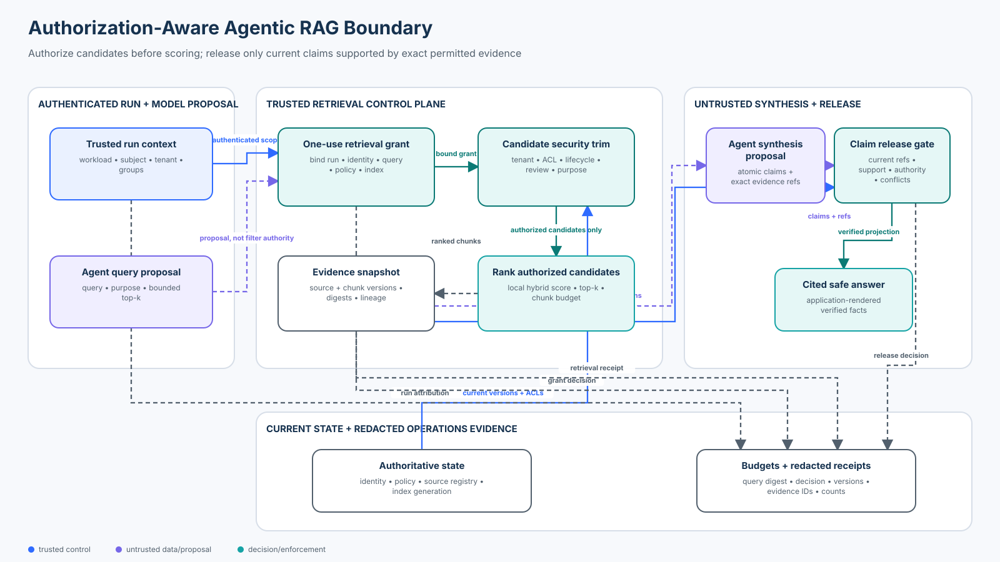

# 08 — Agentic RAG Security

<!-- roadmap-status -->
> **Roadmap status: Published.** This course includes a deterministic retrieval boundary, Pydantic and OpenTelemetry adapter, executable notebook, architecture source, adversarial evaluation, focused tests, and Learning Hub checkpoint.

Build an agentic retrieval system in which relevance is computed only over evidence the current caller may use, and no generated claim is released unless exact current evidence supports it.



## Course metadata

- **Level:** Intermediate
- **Time:** 4–5 hours
- **Prerequisites:** [F06 — Prompt Injection and Untrusted Content](../../beginner/06-prompt-injection-and-untrusted-content/README.md), [F07 — Context and Evidence Security](../../beginner/07-context-and-evidence-security/README.md), and [I07 — Tool-result and Output Poisoning](../07-tool-result-and-output-poisoning/README.md)
- **Format:** architecture chapter, deterministic Python lab, real Pydantic contracts, OpenTelemetry instrumentation, guided notebook, adversarial evaluation, and tests
- **Scenario:** a multi-tenant policy assistant performs repeated retrieval steps across governed internal knowledge
- **Last reviewed:** 2026-10-07

## Security thesis

An agent may propose a query, but it must not choose its tenant, entitlements, policy, index generation, source authority, or release criteria.

```text
authenticate run
  → validate bounded query proposal
  → issue one-use retrieval grant from current policy
  → security-trim candidates before scoring
  → rank only authorized/current chunks
  → freeze exact evidence snapshots
  → agent proposes atomic claims and citations
  → recheck current evidence, authority, support, and conflicts
  → application renders the answer or returns a typed non-success state
```

RAG does not turn text into truth. A vector score measures similarity under a particular representation; it does not establish access, provenance, authority, freshness, independence, or claim support.

## Learning outcomes

By the end, you can:

1. Draw the ingestion, index, retrieval, synthesis, release, and operations trust boundaries of an agentic RAG system.
2. Bind each iterative retrieval to authenticated identity, one run, current policy, one query digest, one index generation, limits, and expiry.
3. Apply tenant, ACL/group, classification, lifecycle, review, purpose, version, and integrity policy **before** any relevance score is computed.
4. Preserve source, chunk, version, digest, index-generation, locator, authority, and lineage provenance through model context and citations.
5. Keep retrieved prose informational even when it contains direct, indirect, or encoded instructions.
6. Reject fabricated, stale, unsupported, duplicated, lower-authority, or conflicting citations outside the model.
7. Evaluate leakage, poison admission, citation precision, unsupported release, valid-task blocking, dependency behavior, and trace coverage with explicit denominators.
8. Map the teaching controls to current vector stores, retrieval frameworks, telemetry, source-of-truth systems, and production operations.

## Artifacts

| Artifact | Purpose |
| --- | --- |
| [`lab.py`](lab.py) | Reusable deterministic control plane and 36-case evaluation |
| [`sdk_adapter.py`](sdk_adapter.py) | Strict Pydantic tool contract plus real OpenTelemetry spans |
| [`agentic_rag_security.ipynb`](agentic_rag_security.ipynb) | Guided baseline, implementation, attacks, recovery, and evaluation |
| [`architecture-spec.json`](architecture-spec.json) | Versioned coordinate and connection specification |
| [`architecture.svg`](architecture.svg) | Deterministically rendered architecture for the chapter and notebook |
| [`tests/test_agentic_rag_security.py`](../../../../tests/test_agentic_rag_security.py) | Core security, freshness, replay, conflict, budget, and failure invariants |
| [`tests/test_agentic_rag_security_sdk.py`](../../../../tests/test_agentic_rag_security_sdk.py) | Contract and telemetry integration checks |

All fixtures are synthetic. The default path makes no model or network call and needs no credential.

## Why agentic RAG needs a retrieval protocol

Classic RAG often performs one query followed by one generation. An agent can reformulate questions, retrieve repeatedly, branch, call other tools, or decide that it needs more evidence. That flexibility creates new control-plane questions:

- Who may retrieve, for which subject and tenant?
- Which query purpose and corpus are allowed?
- How many searches and chunks may one run accumulate?
- Which identity and policy version governed every retrieval?
- Did ACLs, the source, or the index change between retrieval and release?
- Does a citation name the exact chunk that the model saw?
- Are two citations independent sources or duplicated renderings of one lineage?
- What happens when equally authoritative sources disagree?

The answer cannot be “put the tenant in the prompt” or “let the agent add a metadata filter.” Natural-language and tool arguments are untrusted proposals.

## Threat model

| Boundary | Attack or failure | Consequence | Lab control |
| --- | --- | --- | --- |
| Caller → run | prompt claims another tenant or role | scope escalation | `IdentityRegistry` resolves authenticated application state |
| Agent → broker | oversized `top_k`, unapproved purpose, replayed request | capability widening and accumulation | strict `QueryProposal`, current policy, per-run budgets, idempotency |
| Source → index | unreviewed upload, forged metadata, stale chunk | poisoning or wrong access decision | canonical `SourceRegistry`, lifecycle/review policy, exact digests and versions |
| Index → ranker | global ranking before ACL filtering | text, count, timing, facet, or score leakage | security trimming before `SyntheticIndex.score` |
| Retriever → model | evidence contains instructions | indirect prompt injection | escaped quoted evidence, informational authority, no policy fields |
| Model → release | fabricated or laundered citation | unsupported claim | exact `EvidenceRef` membership and claim support checks |
| Evidence lifecycle | policy, source, or index changes mid-run | stale answer | current version and generation rechecks |
| Federation | same claim has conflicting authoritative values | silent policy corruption | explicit `review_required` state |
| Duplicate sources | mirror counted as corroboration | false confidence | stable `lineage_id` and duplicate-lineage rejection |
| Dependency | identity, policy, source, index, budget, or audit unavailable | unsafe fallback | typed error and no unscoped retrieval |

### Protected assets and non-goals

Protected assets include tenant-confidential text and even its existence; identity, entitlements, source-of-truth values, index/ACL synchronization state, decisions, and telemetry. The lab does not claim production cryptography, a production vector index, semantic entailment, model quality, or universal poison detection. Local HMACs model integrity binding. The deterministic scorer exposes ordering. Structured fixture facts make release checks exact. Replace them with managed identity, key management, a permission-aware search backend, calibrated domain validation, and human review where consequences require it.

## Mental model: six dimensions must stay separate

| Dimension | Question | Examples |
| --- | --- | --- |
| Authorization | May this principal retrieve this item for this purpose now? | tenant, ACL, group, clearance, lifecycle |
| Relevance | Does this item help answer the query? | lexical, dense, hybrid, reranking |
| Provenance | Which exact source and transformation produced it? | source/chunk IDs, version, digest, locator, lineage |
| Authority | How much weight may this source carry for this claim? | system of record, approved guidance, external source |
| Grounding | Does the cited evidence support this atomic claim? | claim-to-evidence verification |
| Instruction authority | May the content change policy or trigger effects? | always no for retrieved prose |

Authorized evidence can be irrelevant. Relevant evidence can be poisoned. Authentic evidence can be stale. A current system-of-record passage can still contain prose that is not an instruction to the application.

## 1. Bind iterative retrieval to the run

`RetrievalBroker.issue` accepts an authenticated attestation, server-owned run ID, request ID, and a narrow query proposal. It derives workload, subject, tenant, current policy, index generation, allowed purpose, maximum `top_k`, budgets, issue time, expiry, nonce, and query digest.

The `RetrievalGrant` is one-use. An idempotent retry returns the same grant without consuming another query unit; a changed payload under the same request ID is a collision. Concurrent redemption yields one success and one replay denial.

Read-only retrieval still needs budgets. Repeated searches can aggregate sensitive context, raise cost, amplify a poison source, or infer data through counts and ranking changes.

## 2. Authorize before candidate scoring

The secure sequence is:

```text
all indexed chunks
  → tenant/global scope
  → source exists and chunk tenant agrees
  → active, approved, and currently valid source
  → caller clearance and group/ACL
  → permitted retrieval purpose and source authority
  → current source version and index generation
  → text and metadata integrity
  → size bound
  → relevance scoring
```

The lab exposes `SyntheticIndex.score_calls`. Tests prove forbidden Southridge, unreviewed uploads, encoded uploads, and superseded sources are never scored—not merely removed from the final top-k.

The order matters: global ranking can expose unauthorized text to an embedding/reranking service; counts, facets, timing, and score distributions can reveal records; a forbidden candidate can displace a permitted one before post-filtering; and telemetry can become a second disclosure. The deliberately unsafe `unsafe_rank_then_filter` baseline demonstrates a cross-tenant candidate entering scoring even though a later filter hides it from displayed results.

## 3. Treat index metadata as security state

Every `IndexedChunk` carries chunk/source IDs, source version, tenant, index generation, ordinal, content and metadata digests, structured fixture claims, and optional risk labels.

The canonical `SourceRegistry` separately owns tenant, authority, lifecycle, review state, ACL groups, classification, purposes, lineage, validity window, locator, and current digest. The retriever compares the index representation with current source-of-truth state.

In production, an index is a replicated authorization view. Permission deletion, group removal, classification change, source revocation, and source update are security events with measurable propagation objectives and fail-closed behavior when freshness is unknown.

## 4. Poison containment is not keyword detection

The corpus includes an obvious upload saying to ignore policy and an encoded upload that avoids the phrase. Both are excluded because the source is an unreviewed user submission and is not allowed for `policy_answer`. The obvious item also carries a detector-style risk label; the encoded item proves the invariant does not depend on that label.

If approved evidence contains adversarial prose, the system still escapes delimiter-like markup, labels text `retrieved-evidence-not-instructions`, omits identity/policy controls from model-visible output, accepts only atomic claims and exact citations back, and never turns evidence into action authority. Detection helps triage and review; it does not grant access or trust.

## 5. Freeze evidence, then recheck current state

Each model-visible `EvidenceChunk` binds:

```text
chunk ID + source ID/version + content digest + index generation
+ locator + source authority + lineage + score + quoted text + structured facts
```

This answers two questions: what did the model see, and may the application release it now? A source update after retrieval invalidates the old citation. An index-generation or policy change invalidates the grant. Integrity of old evidence does not make it current.

## 6. Verify claims, not citation strings

The model proposes `ClaimProposal(key, value, unit, citations)`. `ClaimReleaseGate` verifies:

1. retrieval was admitted and current identity/policy still exist;
2. every citation is one exact retrieved `EvidenceRef`;
3. current source version, digest, lifecycle, and validity match;
4. the cited chunk supports the exact key/value/unit;
5. the proposal uses highest-authority current evidence;
6. equally authoritative conflicting values trigger `review_required`; and
7. duplicated lineages are not independent corroboration; and
8. claim count, citation fan-out, and duplicate claim keys stay within policy.

The application reconstructs the answer from verified facts. Raw model prose is never the released policy answer.

This fixture uses exact structured claims. General language support is harder: claim decomposition, natural-language inference, deterministic domain rules, calibrated model judges, and human review have different error modes. High-consequence release needs consequence-specific evidence thresholds and evaluation.

## 7. Pydantic and OpenTelemetry adapter

[`sdk_adapter.py`](sdk_adapter.py) wraps the primitive for an agent framework without giving the model security controls.

- `SearchToolInput` contains only `query` and bounded `top_k`.
- Pydantic strict mode rejects extra fields such as `tenant_id` and coercion such as `"3"` into an integer.
- `RAGToolRuntime` holds trusted attestation and run ID outside the tool payload.
- `SearchToolOutput` projects provenance-bearing evidence with a fixed trust label.
- a real OpenTelemetry in-memory exporter records operation, IDs, query digest, versions, counts, decision, and reason.
- spans omit raw query and evidence text by default.

The current OpenTelemetry registry defines `retrieval` as the known GenAI operation value and warns that retrieval query text may contain sensitive information. The lab records a digest instead of raw `gen_ai.retrieval.query.text`.

## 8. Technology landscape — October 2026

Products provide primitives, not a complete application security proof. Verify behavior for the exact service, API version, identity configuration, and index lifecycle.

| Option | Useful capability | Secure integration | Boundary |
| --- | --- | --- | --- |
| OpenAI Vector Stores | file-attribute filters, ranking options, bounded result counts | derive attributes from trusted runtime state and validate provenance | filters describe a request; authorization and claim release remain application concerns |
| Azure AI Search | security filters plus preview token-based ACL/RBAC and sensitivity-label enforcement | synchronize permission metadata, supply application and user identity, fail closed on ACL evaluation failure | preview/API coverage and source-specific freshness require explicit verification |
| Pinecone | namespaces and metadata filtering | derive namespace and filters from authenticated policy; use stable IDs | a model-selected namespace is not trusted scope |
| Weaviate | tenant-specific shards and tenant-bound collection operations | bind the collection client to the resolved tenant before querying | auto-tenant creation can turn typos into tenants; lifecycle operations are security-sensitive |
| LlamaIndex | metadata filters, retriever composition, source-node propagation | inject trusted filters at the vector-store boundary and retain provenance | composition does not authenticate caller-supplied metadata |
| Pydantic | strict input/output schemas | reject unknown scope fields and coercion before execution | schema validity is shape, not access or truth |
| OpenTelemetry | retrieval/GenAI spans and attributes | emit safe decisions, versions, IDs, counts, and digests | raw queries/chunks can create a telemetry disclosure |
| RAGChecker | claim-level retrieval and generation diagnostics | use offline diagnostics beside security and utility gates | model-based metrics require target-domain calibration |

### State of practice

- **Established:** permission-aware filtering, tenant partitioning, immutable source IDs, citations, source lifecycle management, offline retrieval evaluation, and least privilege.
- **Maturing:** integrated permission ingestion, token-based document enforcement, multi-step agentic retrieval, claim-level diagnostics, and standardized telemetry.
- **Research frontier:** adaptive poisoning resistance, knowledge-conflict resolution, embedding privacy, trustworthy semantic support verification, and evaluations that predict production behavior.
- **Open problem:** no vector score, prompt, detector, or single judge proves evidence is authorized, current, non-adversarial, and sufficient for a high-consequence claim.

## Worked control path

For “What is the support case retention period?”:

1. `attest:north` resolves to the Northwind workload, Alice, support group, and internal clearance.
2. policy version 8 binds index generation 11, `policy_answer`, `top_k ≤ 4`, three queries, eight chunks, and 120 seconds.
3. Southridge, unreviewed, superseded, wrong-purpose, stale-version, and integrity-invalid chunks are removed before scoring.
4. authorized Northwind evidence is ranked and frozen as an exact snapshot.
5. the model may propose `retention_period = 730 days` with the exact ref.
6. the release gate rechecks source, support, authority, and conflicts.
7. the application renders `retention_period: 730 days` with a versioned citation.
8. receipts store safe IDs, digests, versions, counts, states, and reasons—not raw evidence.

## Practical lab

Run from the repository root:

```bash
python curriculum/roadmap/intermediate/08-agentic-rag-security/lab.py
python curriculum/roadmap/intermediate/08-agentic-rag-security/sdk_adapter.py
pytest -q tests/test_agentic_rag_security.py tests/test_agentic_rag_security_sdk.py
```

Use the [guided notebook](agentic_rag_security.ipynb) to reproduce global rank-then-filter leakage, inspect a bound grant, prove forbidden candidates are never scored, release a supported claim, inject fabricated citations/source updates/replay/conflicts/outages, inspect privacy-minimized spans, and run the labelled evaluation.

## Evaluation contract

`evaluate_controls()` executes exactly 36 deterministic cases:

| Population | Cases | Expected result |
| --- | ---: | --- |
| valid policy questions | 6 | all retrieve and release correctly |
| cross-tenant attacks | 6 | forbidden chunks never scored or admitted |
| poison attacks | 6 | obvious and encoded unreviewed sources never scored or admitted |
| citation attacks | 6 | missing, forged, tampered, unsupported, duplicate, and lower-authority refs never release |
| stale-state attacks | 4 | changed policy, index, source, or time never releases stale evidence |
| control-plane attacks | 4 | widening, replay, budget excess, and authoritative conflict terminate safely |
| dependency failures | 4 | identity, policy, index, and audit failures do not fall back |

Metric definitions:

- `cross_tenant_leakage_rate = forbidden cases scored or admitted / cross-tenant attack cases`
- `poisoned_chunk_admission_rate = labelled poison cases scored or admitted / poison attack cases`
- `citation_precision = supported released citations / all released citations`; blocked attacks add no released citation to either count
- `unsupported_claim_release_rate = invalid citation/claim cases released / citation attack cases`
- `blocked_valid_query_rate = valid cases not released / valid cases`
- `dependency_fail_closed_rate = dependency cases ending deny/error without evidence / dependency cases`

Expected fixture result:

```text
valid completion                         1.00
blocked valid query                      0.00
cross-tenant leakage                     0.00
poisoned-chunk admission                 0.00
invalid/unsupported claim release        0.00
stale evidence release                   0.00
dependency fail-closed                   1.00
trace completeness                       1.00
unsafe baseline cross-tenant exposure    1.00
```

Do not generalize these fixture results to arbitrary models, corpora, embeddings, or attackers. Production evaluation needs larger labelled sets, tenant/source slices, repeated stochastic trials where models are used, confidence intervals, human review, and red-team coverage.

## Failure and recovery playbook

| Signal | Immediate state | Containment and investigation | Recovery evidence |
| --- | --- | --- | --- |
| identity/policy unavailable | `error`; no query | isolate dependency, retain safe trace | dependency restored; negative-access suite passes |
| index generation differs | `deny` | stop context construction; inspect rollout/routing | fresh grant against reconciled generation |
| ACL/source freshness unknown | exclude source or tenant | pause corpus; compare source and index | tombstones, ACLs, versions, digests reconcile |
| cross-tenant chunk scored | stop release; isolate index | inspect namespace, filters, caches | pre-score isolation regression passes |
| poison admission spike | block affected source/pipeline | inspect source identity, review state, parser, lineage | clean re-ingestion plus poison suite |
| citation failure | deny or insufficient evidence | retain refs/digests; inspect corpus/model change | claim suite and sampled review pass |
| equal-authority conflict | `review_required` | show only relevant permitted evidence | source corrected or exception approved |
| budget exhausted | deny; no fallback | inspect loop and task design | new run or approved budget change |
| audit unavailable | fail closed in this lab | restore protected telemetry | trace coverage and retention checks pass |

## Production upgrade checklist

- Derive user, workload, tenant, groups, clearance, and purpose from verified identity and current policy.
- Enforce access inside the datastore or trusted gateway before scoring, facets, counts, reranking, or external exposure.
- Bind agent queries to run, purpose, corpus, generation, policy, expiry, and cumulative budgets.
- Synchronize ACL changes, deletions, classifications, holds, versions, and tombstones with measurable objectives.
- Preserve source/chunk IDs, versions, locators, transformations, digests, authority, lineage, and retrieval time.
- Distinguish source authentication, review state, content risk, relevance, authority, and claim support.
- Recheck current evidence at release; never treat an old snapshot as current authority.
- Detect equal-authority conflicts and route to an accountable owner.
- Separate repeated renderings of one lineage from independent corroboration.
- Bound query count, top-k, accumulated context, latency, tokens, cost, parallelism, and retries.
- Record decisions without raw sensitive content by default; govern telemetry access and retention.
- Test wrong tenant, stale ACL, deletion, poison, encoded poison, corrupted metadata, citation laundering, replay, concurrency, conflict, outage, and utility.
- Assign incident owners for identity, policy, sources, ingestion, index, model behavior, release, and telemetry.

## Exercises

1. Add a classification change after grant issuance and prove the chunk is neither scored nor released.
2. Add two genuinely independent current sources and enforce a two-lineage threshold.
3. Replace the local scorer with BM25 or a local embedding retriever while preserving pre-score authorization.
4. Add a two-step run that retrieves policy and implementation guidance; prove cumulative budget enforcement.
5. Model a deletion tombstone and define the maximum safe propagation window across source, index, cache, and evidence registry.
6. Add a high-consequence claim type that always returns `review_required` with a minimized reviewer packet.
7. Compare tenant-per-namespace, shared-index filtering, and native token-based ACL enforcement.
8. Design semantic claim-support labels, annotator guidance, judge calibration, disagreement handling, and a release threshold.

## Knowledge checkpoint

An agent proposes a tenant filter, the vector store returns highly relevant chunks, and every chunk has a valid embedding. Is the evidence safe to expose to the model?

**Answer:** No. Tenant and entitlement scope must come from authenticated current state and be enforced before candidates are scored. Embedding validity and relevance do not prove authorization, provenance, lifecycle, authority, or claim support.

## Authoritative references

- Lewis et al., [Retrieval-Augmented Generation for Knowledge-Intensive NLP Tasks](https://arxiv.org/abs/2005.11401)
- NIST, [Artificial Intelligence Risk Management Framework: Generative AI Profile](https://nvlpubs.nist.gov/nistpubs/ai/NIST.AI.600-1.pdf)
- OWASP, [LLM08:2025 Vector and Embedding Weaknesses](https://genai.owasp.org/llmrisk/llm082025-vector-and-embedding-weaknesses/)
- OpenAI, [Search a vector store](https://developers.openai.com/api/reference/cli/resources/vector_stores/methods/search)
- Microsoft, [Document-level access control](https://learn.microsoft.com/en-us/azure/search/search-document-level-access-overview) and [query-time ACL/RBAC enforcement](https://learn.microsoft.com/en-us/azure/search/search-query-access-control-rbac-enforcement)
- Pinecone, [Multitenancy](https://docs.pinecone.io/guides/index-data/implement-multitenancy) and [metadata filtering](https://docs.pinecone.io/guides/search/filter-by-metadata)
- Weaviate, [Multi-tenancy operations](https://docs.weaviate.io/weaviate/manage-collections/multi-tenancy)
- LlamaIndex, [Vector-store query and metadata filters](https://docs.llamaindex.ai/en/stable/api_reference/storage/vector_store/)
- OpenTelemetry, [GenAI attribute registry](https://opentelemetry.io/docs/specs/semconv/registry/attributes/gen-ai/)
- Ru et al., [RAGChecker](https://proceedings.neurips.cc/paper_files/paper/2024/hash/27245589131d17368cccdfa990cbf16e-Abstract-Datasets_and_Benchmarks_Track.html)

Continue with [I09 — MCP Security](../09-mcp-security/README.md), where discovery, server identity, tool contracts, result admission, and protocol lifecycle add another boundary around external capabilities.
