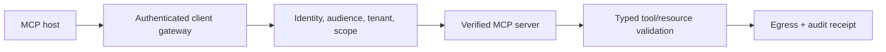

# 09 — MCP Security

<!-- roadmap-status -->
> **Roadmap status: Pilot.** Some executable evidence exists; the remaining gate is listed in the Learning Hub.

## Learning objectives

Model the MCP host, client, server, tool, resource, prompt, capability, token,
and supply-chain boundaries; authorize an invocation independently of discovery;
and record privacy-aware evidence for each decision.

## Why it matters

MCP lets an agent gain remote tools and resources. A server’s tool description
or a discovered capability is not proof of server trust, caller authority, or
safe arguments. A compromised or malicious server can poison descriptions,
results, or resources; token passthrough can turn a gateway into a confused
deputy.

## Architecture

## Attack walkthrough

Start with dynamic discovery and a bearer token forwarded to every server. An
attacker registers `mcp-unknown`, claims an `admin` tool, or asks the legitimate
server to use a token intended for a different audience. The gateway in `lab.py`
denies unknown server identity, token-audience mismatch, ungranted capability,
and unexpected fields before dispatch. Tool results remain untrusted data after
an allowed call.

## Practical lab

Run `python curriculum/roadmap/intermediate/09-mcp-security/lab.py`. The trace emits
client, server, tenant, tool, and argument hash—not a raw prompt or token. Add
a resource-read action and require a source classification. Then compare it to
the earlier [MCP gateway lab](../../../intermediate/02-mcp-gateway/02_mcp_gateway.py).

## Evaluation and production considerations

Measure unknown-server acceptance, audience-confusion success, over-scoped tool
success, schema bypass, decision trace coverage, and blocked-valid-task rate.
Production deployments need TLS, server identity verification, OAuth security
best practices, consent, rate limits, egress controls, secret isolation,
revocation, dependency inventory, and incident ownership.

## References

- [MCP Security Best Practices 2025-11-25](https://modelcontextprotocol.io/docs/2025-11-25/tutorials/security/security_best_practices)
- [MCP Authorization Specification 2025-11-25](https://modelcontextprotocol.io/specification/2025-11-25/basic/authorization)
- [OWASP MCP Security Cheat Sheet](https://cheatsheetseries.owasp.org/cheatsheets/MCP_Security_Cheat_Sheet.html)
