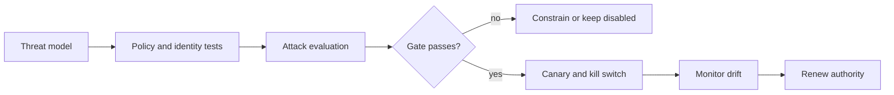

# Advanced: governance and production readiness

## Scenario: approving a customer-support agent

The team wants an agent to draft replies and close low-risk tickets. Closing a ticket is an external side effect, so the launch review requires a named owner, tenant isolation, an approval threshold, attack-evaluation results, a rollback drill, and a canary. The agent may be autonomous for drafting but not for high-impact actions.

Technical controls need accountable operating decisions: name the owner, allowed autonomy, data classes, environments, and evidence required before release. Track both a weighted evidence gate and runtime metrics such as policy-violation rate and human-intervention rate.

Run `python labs/advanced/03_production_gate.py`. Remove one evidence item, then try a non-zero violation rate: both should block or mark the launch unsafe. A release requires threat-model evidence, policy and attack tests, rollback readiness, and accountable ownership. Measure autonomy alongside policy violations, unsafe retries, and unsupported claims; compare multi-agent designs with a simpler baseline. References: [MITRE ATLAS](https://atlas.mitre.org/), [OWASP Agentic Security](https://genai.owasp.org/initiatives/agentic-security-initiative/), and [MCP Security Best Practices](https://modelcontextprotocol.io/docs/tutorials/security/security_best_practices).
