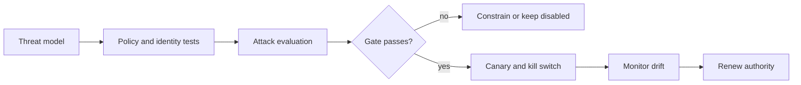

# Advanced: governance and production readiness

Technical controls need accountable operating decisions: name the owner, allowed autonomy, data classes, environments, and evidence required before release.

Run `python labs/advanced/03_production_gate.py`. A release requires threat-model evidence, policy and attack tests, rollback readiness, and accountable ownership. Measure autonomy alongside policy violations, unsafe retries, and unsupported claims; compare multi-agent designs with a simpler baseline. References: [MITRE ATLAS](https://atlas.mitre.org/), [OWASP Agentic Security](https://genai.owasp.org/initiatives/agentic-security-initiative/), and [MCP Security Best Practices](https://modelcontextprotocol.io/docs/tutorials/security/security_best_practices).
