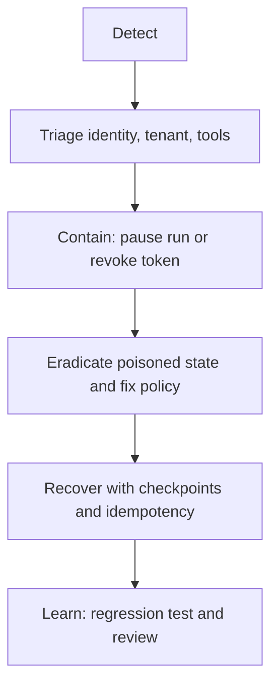

# Intermediate: incident response and recovery

Treat unsafe tool calls, data leaks, prompt-injection success, and runaway loops as incidents with an owner and evidence trail.

Run `python labs/intermediate/03_incident_recovery.py`. Short-lived credentials, kill switches, idempotency keys, and human approval protect irreversible actions. Never blindly retry an unknown payment, deletion, or permission change. References: [Google SAIF](https://cloud.google.com/use-cases/secure-ai-framework), [OWASP Agentic Security](https://genai.owasp.org/initiatives/agentic-security-initiative/), and [OpenAI human-in-the-loop](https://openai.github.io/openai-agents-python/human_in_the_loop/).
