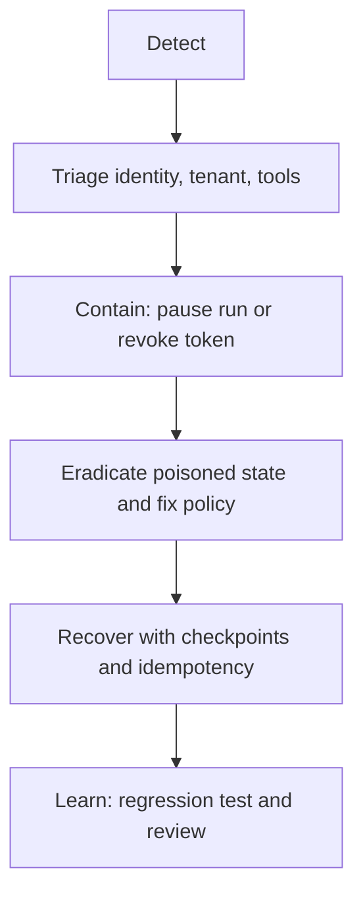

# Intermediate: incident response and recovery

## Scenario: a support ticket during an outage

A support agent has read access to tickets and a `close_ticket` connector. A poisoned ticket causes an unusual argument; the run is paused while the connector token is revoked. The operator reviews the trace, rotates the credential, approves a known checkpoint, and resumes. The lab proves that the close operation is idempotent, so a retry cannot close the same ticket twice.

Treat unsafe tool calls, data leaks, prompt-injection success, and runaway loops as incidents with an owner and evidence trail. Record correlation ID, principal, tenant, tool, arguments by redacted reference, policy decision, and containment action.

Run `python labs/intermediate/03_incident_recovery.py`. Experiment by revoking a tool before replay, changing the idempotency key, and attempting a commit while paused. Short-lived credentials, kill switches, idempotency keys, and human approval protect irreversible actions. Never blindly retry an unknown payment, deletion, or permission change. References: [Google SAIF](https://cloud.google.com/use-cases/secure-ai-framework), [OWASP Agentic Security](https://genai.owasp.org/initiatives/agentic-security-initiative/), and [OpenAI human-in-the-loop](https://openai.github.io/openai-agents-python/human_in_the_loop/).
