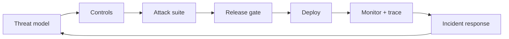

# Production security and evaluation

Production readiness is evidence, not a configuration label. Maintain a threat
model, security regression suite, redacted traces, ownership, incident response,
rollback, and a kill switch.

Evaluate both outcomes and trajectories:

- unauthorized tool-call rate;
- prompt-injection success rate;
- secret or sensitive-data exposure;
- approval bypass rate;
- cross-tenant access attempts;
- unsafe retry or duplicate-side-effect rate;
- policy decision coverage;
- detection and response time;
- cost, latency, and availability under adversarial load.

Use MITRE ATLAS to map adversary behavior to mitigations and use OWASP’s
agentic-security resources to organize risks and controls. Google SAIF adds
lifecycle governance, data controls, assurance, and red teaming. Microsoft’s
agent-security guidance emphasizes centralized visibility, auditing, posture
management, and threat detection.

References: [OWASP Agentic Security Initiative](https://genai.owasp.org/initiatives/agentic-security-initiative/), [MITRE ATLAS](https://atlas.mitre.org/), [Google SAIF](https://cloud.google.com/use-cases/secure-ai-framework), [Microsoft Agent Safety](https://learn.microsoft.com/en-us/agent-framework/agents/safety).
