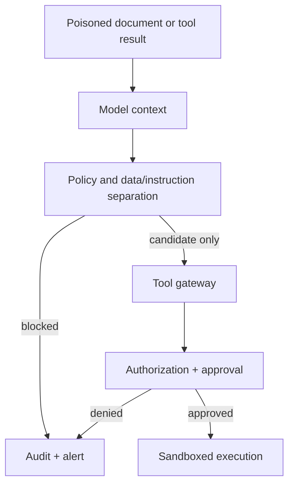

# Prompt injection, MCP, and supply-chain security

Prompt injection is an instruction-confusion attack. Direct injection targets
the user message; indirect injection arrives through a document, web page, tool
result, image, or memory. The control objective is not to make the model
perfectly distinguish instructions. It is to ensure that untrusted content
cannot authorize a sensitive action.

Use layered controls: label provenance, isolate secrets, constrain tools,
validate arguments, require approval, limit egress, and inspect the resulting
trajectory. Test both the attack and the attempted mitigation.

MCP adds client/server and tool-discovery boundaries. Validate server identity,
transport, OAuth scopes, tool schemas, data classification, consent, logging,
and revocation. Treat third-party MCP servers as supply-chain dependencies.

References: [MCP Security Best Practices](https://modelcontextprotocol.io/docs/tutorials/security/security_best_practices), [OWASP MCP Security Cheat Sheet](https://cheatsheetseries.owasp.org/cheatsheets/MCP_Security_Cheat_Sheet.html), [NSA MCP Security Design Considerations](https://www.nsa.gov/Press-Room/Press-Releases-Statements/Press-Release-View/Article/4496698/nsa-releases-security-design-considerations-for-ai-driven-automation-leveraging/), [MITRE ATLAS](https://atlas.mitre.org/).
