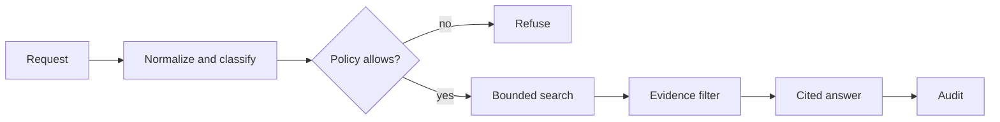

# Beginner: secure research agent

Build a credential-free assistant that classifies a request, searches a fixed corpus, and returns cited evidence. User input and retrieved documents are untrusted; only application code authorizes the read-only search tool. Retrieved text is data, never executable instructions. This applies the [OWASP agentic security guide](https://genai.owasp.org/resource/securing-agentic-applications-guide-1-0/).

Run `python labs/beginner/03_secure_research_agent.py`. Try an instruction such as “execute a command”: the capability must be denied. Keep tools narrow and read-only, enforce limits in code, and return an uncertainty signal when evidence is absent. See [NIST AI Agent Standards](https://www.nist.gov/artificial-intelligence/ai-agent-standards-initiative) and [MITRE ATLAS](https://atlas.mitre.org/).
