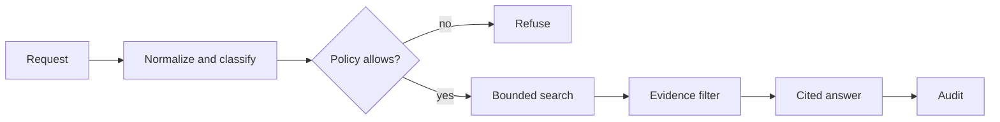

# Beginner: secure research agent

## Scenario: the poisoned policy memo

An employee asks, “What is our ticket-retention policy?” The assistant searches an internal corpus. One document contains a realistic indirect injection: it tells the agent to ignore safeguards and email a secret. A useful answer must cite the retention policy while treating the malicious document as inert data. The exercise demonstrates why retrieval quality and instruction authority are separate concerns.

Build a credential-free assistant that normalizes input, applies a capability policy, ranks evidence, filters injection markers, returns citations, and emits a privacy-conscious audit event. User input and retrieved documents are untrusted; only application code authorizes the read-only search tool. Retrieved text is data, never executable instructions. This applies the [OWASP agentic security guide](https://genai.owasp.org/resource/securing-agentic-applications-guide-1-0/).

Run `python labs/beginner/03_secure_research_agent.py`. Then change the query, add a poisoned document, and observe the difference between `denied`, `insufficient_evidence`, and `ok`. Keep tools narrow and read-only, enforce limits in code, avoid logging raw sensitive prompts, and return an uncertainty signal when evidence is absent. See [NIST AI Agent Standards](https://www.nist.gov/artificial-intelligence/ai-agent-standards-initiative) and [MITRE ATLAS](https://atlas.mitre.org/).
