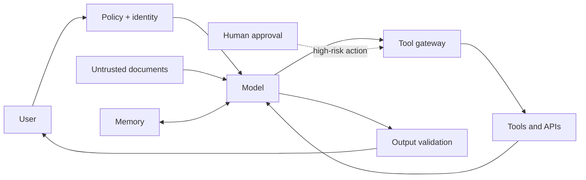

# Agent security foundations

Agent security protects a system that can interpret instructions, select tools,
read untrusted information, retain state, and cause side effects. The model is
one component; the security boundary is the application that authenticates the
caller, authorizes each operation, validates data, limits execution, and records
evidence.

## A threat-model vocabulary

- **Assets:** secrets, personal data, credentials, money, source code, model
  prompts, memory, availability, and business actions.
- **Actors:** users, agents, sub-agents, tools, MCP servers, model providers,
  operators, and attackers.
- **Trust boundaries:** every transition between user input, model context,
  tool output, memory, external systems, and human approval.
- **Blast radius:** the maximum harm if one instruction, tool, credential, or
  agent is compromised.

The model may propose an action, but it must not grant itself access. A secure
implementation checks identity, scope, arguments, risk, budget, and approval at
the tool boundary. Treat documents, tool results, memory, and model output as
data with provenance—not as trusted instructions.

## Security objectives

Use confidentiality, integrity, availability, privacy, accountability, and
recoverability as design objectives. Define a measurable success condition for
each: for example, “no cross-tenant reads,” “zero unapproved writes,” “all
high-risk calls have an approval receipt,” and “a run can be replayed safely.”

References: [NIST AI Agent Standards Initiative](https://www.nist.gov/artificial-intelligence/ai-agent-standards-initiative), [OWASP Securing Agentic Applications Guide](https://genai.owasp.org/resource/securing-agentic-applications-guide-1-0/), [Google SAIF](https://cloud.google.com/use-cases/secure-ai-framework).
