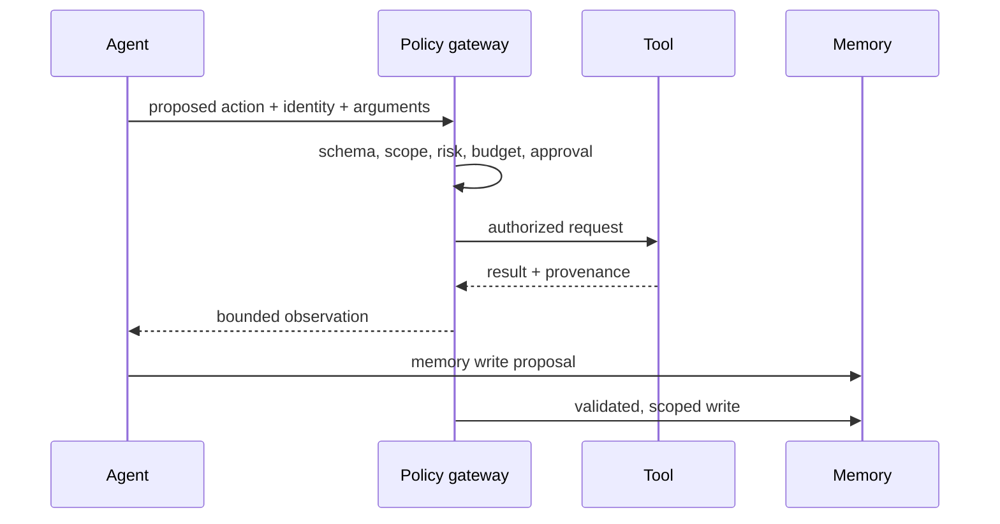

# Tools, identity, and memory security

## Tool contracts

Give every tool a narrow name, typed input/output schema, preconditions, risk
classification, timeout, quota, and error vocabulary. Separate preview from
execution. Require idempotency keys for writes. Validate the parsed arguments in
application code even when the model produced structured output.

## Identity and authorization

Decide whether a backend action runs with the user’s identity, an agent
principal, or a deliberately down-scoped service identity. Propagate tenant,
role, resource, operation, expiry, and approval context to every downstream
tool. Never let a child agent receive broader authority than its parent.

## Memory

Working state is needed to resume one run; long-term memory affects future runs.
Long-term writes need identity scope, provenance, validation, retention, review,
and deletion. A memory record is untrusted if its origin, tenant, or update path
cannot be explained.

References: [NIST identity and authorization initiative](https://www.nist.gov/artificial-intelligence/ai-agent-standards-initiative), [OpenAI Agents SDK human-in-the-loop](https://openai.github.io/openai-agents-python/human_in_the_loop/), [Google SAIF guidance](https://cloud.google.com/blog/products/identity-security/cloud-ciso-perspectives-practical-guidance-building-with-saif).

## Scenario: cross-tenant memory leak

A support agent writes a preference for tenant A, then receives a request from tenant B using the same email address. A secure memory key includes tenant, subject, purpose, classification, expiry, and provenance. Reads and writes re-check the current principal; a previous conversation is not proof of current authorization.

Extend the lab with a `save_preference` policy: only low-sensitivity values, 30-day expiry, and a matching tenant. Require explicit approval for `export_transcript`. Test a mismatched tenant, expired record, and delegated agent with a narrower scope.
